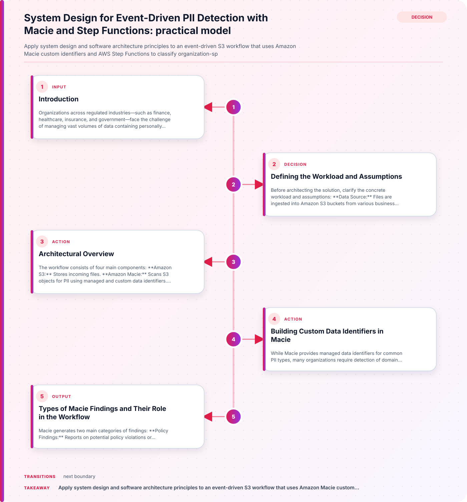

## Introduction

Organizations across regulated industries—such as finance, healthcare, insurance, and government—face the challenge of managing vast volumes of data containing personally identifiable information (PII). These data flows often originate from applications, claims processing, partner feeds, and internal workflows, landing as files in Amazon S3 buckets. Detecting and classifying PII within these objects is critical for compliance with regulations like GDPR, HIPAA, CCPA, and PCI DSS. Manual approaches do not scale, and automated detection must be adaptable to domain-specific identifiers such as policy numbers or medical record numbers.

This tutorial walks through designing an event-driven S3 workflow that leverages Amazon Macie custom data identifiers and AWS Step Functions to automate the detection and classification of organization-specific PII. We'll define the workload, examine key architectural decisions, and address practical validation and failure scenarios.

## Defining the Workload and Assumptions

Before architecting the solution, clarify the concrete workload and assumptions:



- **Data Source:** Files are ingested into Amazon S3 buckets from various business systems.
- **PII Types:** Data may contain standard PII (names, addresses, SSNs) and organization-specific identifiers (e.g., policy numbers, member IDs).
- **Detection Needs:** The solution must identify both managed and custom PII types using Macie.
- **Event-Driven:** Detection should trigger automatically upon new S3 object creation.
- **Scalability:** The workflow must handle large volumes and variable file sizes.
- **Compliance:** Detection is a step toward compliance but does not guarantee it; further controls are required.

## Architectural Overview

The workflow consists of four main components:

1. **Amazon S3:** Stores incoming files.
2. **Amazon Macie:** Scans S3 objects for PII using managed and custom data identifiers.
3. **AWS Step Functions:** Orchestrates the detection process, including retries and validation.
4. **IAM Boundaries:** Enforces least privilege access for workflow components.

The process begins when a new object lands in an S3 bucket. An event triggers a Step Functions state machine, which coordinates the Macie scan, processes findings, and validates results.

## Building Custom Data Identifiers in Macie

While Macie provides managed data identifiers for common PII types, many organizations require detection of domain-specific patterns. Custom data identifiers allow you to define criteria tailored to your business needs.

A custom data identifier in Macie consists of:

- **Regular Expression (Regex):** Defines the text pattern to match (e.g., policy number format).
- **Keywords (Optional):** Words or phrases that must be present near the matched pattern.
- **Proximity Rule (Optional):** Specifies how close keywords must be to the regex match.

For example, to detect a policy number format like `POL-123456`, you might use the following criteria:

```json
{
  "name": "PolicyNumberIdentifier",
  "regex": "POL-[0-9]{6}",
  "keywords": ["policy", "number"],
  "proximity": 10
}
```

This configuration instructs Macie to match the regex pattern and ensure that keywords like "policy" or "number" appear within 10 characters of the match. This reduces false positives and focuses detection on relevant data.

> **Practical Decision:** Invest time in refining regex and keyword criteria for each custom identifier. Overly broad patterns may yield excessive findings, while narrow criteria could miss valid PII.

## Types of Macie Findings and Their Role in the Workflow

Macie generates two main categories of findings:

- **Policy Findings:** Reports on potential policy violations or security/privacy issues with S3 buckets (e.g., public access, misconfigured permissions).
- **Sensitive Data Findings:** Detailed reports of detected sensitive data, including PII matches from managed and custom identifiers.

In this workflow, the focus is on sensitive data findings. Each finding includes metadata about the object, the type of PII detected, the identifier used, and the location within the file.

> **Scenario:** If a file contains both standard and custom PII, Macie produces separate findings for each match, allowing downstream processes to handle remediation or notification as needed.

## Step Functions Orchestration: Event-Driven Detection and Validation

AWS Step Functions provides robust orchestration for the detection workflow. The state machine is triggered by an S3 event (e.g., object creation), and coordinates the following steps:

1. **Initiate Macie Scan:** Calls Macie to analyze the new object using both managed and custom identifiers.
2. **Process Findings:** Retrieves and parses sensitive data findings.
3. **Validation:** Ensures findings meet expected criteria (e.g., match count, identifier type).
4. **Retries:** Handles transient failures (e.g., API timeouts) with controlled retry logic.
5. **Notification/Remediation:** Optionally triggers alerts or remediation workflows based on findings.

### Example Step Functions State Machine Definition

Below is a simplified AWS Step Functions definition (in Amazon States Language) for orchestrating Macie scans:

```json
{
  "Comment": "PII Detection Workflow",
  "StartAt": "ScanWithMacie",
  "States": {
    "ScanWithMacie": {
      "Type": "Task",
      "Resource": "arn:aws:states:::aws-sdk:macie2.startClassificationJob",
      "Retry": [
        {
          "ErrorEquals": ["States.TaskFailed"],
          "IntervalSeconds": 30,
          "MaxAttempts": 3,
          "BackoffRate": 2.0
        }
      ],
      "Next": "ProcessFindings"
    },
    "ProcessFindings": {
      "Type": "Task",
      "Resource": "arn:aws:states:::aws-sdk:macie2.getFindings",
      "Next": "ValidateResults"
    },
    "ValidateResults": {
      "Type": "Choice",
      "Choices": [
        {
          "Variable": "$.FindingsCount",
          "NumericGreaterThan": 0,
          "Next": "Notify"
        }
      ],
      "Default": "End"
    },
    "Notify": {
      "Type": "Task",
      "Resource": "arn:aws:states:::sns:publish",
      "End": true
    },
    "End": {
      "Type": "Pass",
      "End": true
    }
  }
}
```

> **Practical Decision:** Configure retries for Macie scan tasks to mitigate transient errors. Limit maximum attempts and use exponential backoff to avoid overwhelming Macie or S3 APIs.

## IAM Boundaries and Security Considerations

Security is paramount in PII detection workflows. IAM boundaries should enforce least privilege:

- **Macie Permissions:** Step Functions must have permission to start Macie classification jobs and retrieve findings.
- **S3 Access:** Only allow access to the specific buckets and objects required for scanning.
- **Step Functions Role:** Restrict the state machine's execution role to necessary actions (e.g., Macie, S3, SNS).

> **Validation Step:** Regularly review IAM policies to ensure no unnecessary permissions have been granted. Use AWS IAM Access Analyzer to detect overly broad access.

## Validation and Failure Modes

Automated workflows must be validated for correctness and resilience. Consider these scenarios:

### 1. **False Positives and Negatives**

- **Decision:** Periodically review Macie findings for accuracy. Adjust custom identifier criteria if false positives (irrelevant matches) or false negatives (missed PII) are observed.

### 2. **API Rate Limits and Throttling**

- **Failure Mode:** High-volume S3 ingest may trigger Macie or Step Functions API rate limits.
- **Mitigation:** Implement Step Functions retries and monitor AWS CloudWatch metrics for throttling events.

### 3. **Unexpected Data Formats**

- **Scenario:** Files with unexpected or encrypted formats may cause Macie scans to fail or produce incomplete findings.
- **Validation:** Pre-validate file formats before triggering Macie scans, and log failures for manual review.

## Comparison Recommendations: Managed vs. Custom Identifiers

- **Managed Identifiers:** Suitable for standard PII types (e.g., SSN, credit card numbers). Require minimal configuration.
- **Custom Identifiers:** Essential for organization-specific patterns. Require careful regex and keyword design.

> **Recommendation:** Use managed identifiers for baseline detection, and supplement with custom identifiers for domain-specific PII. Validate custom identifier effectiveness through periodic review of findings.

## Useful Table: Workflow Components and Responsibilities

| Component           | Responsibility                                   | Practical Consideration                  |
|---------------------|--------------------------------------------------|------------------------------------------|
| Amazon S3           | Stores incoming files                            | Configure event notifications            |
| Amazon Macie        | Scans for PII using managed/custom identifiers    | Refine custom identifier criteria         |
| Step Functions      | Orchestrates detection and validation             | Set up retries and validation logic       |
| IAM Boundaries      | Enforces least privilege access                   | Regularly review and tighten permissions  |

## Conclusion

Automating PII detection in Amazon S3 with Macie and Step Functions enables scalable, event-driven workflows tailored to both standard and organization-specific identifiers. By carefully designing custom data identifiers, orchestrating detection with Step Functions, and enforcing strict IAM boundaries, organizations can efficiently classify sensitive data and respond to findings. However, detection alone is not sufficient for compliance; ongoing validation, policy review, and remediation processes are essential. This architecture provides a foundation for scalable PII management, adaptable to evolving data and regulatory requirements.

## Related guidance

- [How Ghostcommit Prompt Injections Bypass AI Code Review Agents](/posts/ghostcommit-prompt-injection-ai-code-review-bypass/) — foundational reference.
- [SIEM vs XDR vs SOAR: What They Do and When to Use Each](/posts/siem-vs-xdr-vs-soar/) — supporting reference.

## Sources

- [Automate custom PII detection at scale with Amazon Macie and Step Functions](https://aws.amazon.com/blogs/architecture/automate-custom-pii-detection-at-scale-with-amazon-macie-and-step-functions)
- [Building custom data identifiers - Amazon Macie](https://docs.aws.amazon.com/macie/latest/user/custom-data-identifiers.html)
- [Types of Macie findings](https://docs.aws.amazon.com/macie/latest/user/findings-types.html)
