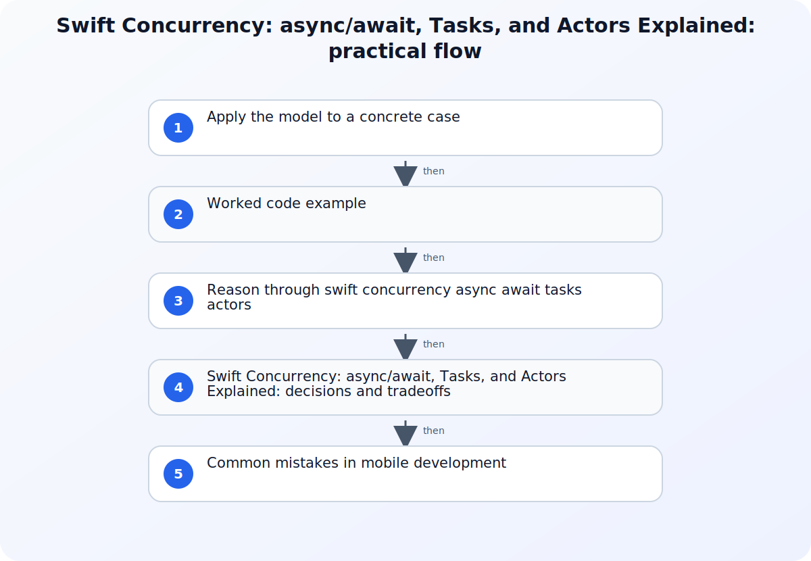

Swift concurrency provides structured ways to suspend work, create concurrent child operations, and isolate mutable state. An async function describes work that may suspend; a task gives that work an execution context; and an actor protects actor-isolated state from unsynchronized access. These mechanisms solve different problems, so understanding their boundaries matters more than adding async keywords throughout a codebase.



## A working model for Swift Concurrency: async/await, Tasks, and Actors Explained

Choose one asynchronous flow such as loading a screen, saving a document, or refreshing cached data. Mark the values that cross concurrency boundaries, the state that can mutate, the lifetime that should own the work, and the point where cancellation should stop useful processing. Note the project's Swift language mode and deployment targets because migration diagnostics and available APIs depend on that context.

## Apply the model to a concrete case

Take an image-loading feature that downloads bytes, decodes them, caches the result, and updates a view. The network and decode functions can be async and throw errors, while the screen starts a task owned by its presentation lifetime. If the screen disappears, cancellation should prevent unnecessary decoding and stop the final UI update. A cache actor can guard its mutable key-to-image storage, and UI-facing state can remain isolated to the main actor. Two independent thumbnail requests may run as child tasks under one parent that awaits both results. This layout separates suspension from parallelism, connects cancellation to ownership, and gives mutable cache and UI state explicit isolation domains.

## Worked code example

### Keep mutable cache state inside an actor

```swift
actor ImageCache {
    private var images: [URL: Data] = [:]

    func value(for url: URL) -> Data? {
        images[url]
    }

    func insert(_ data: Data, for url: URL) {
        images[url] = data
    }
}

func loadImage(from url: URL, cache: ImageCache) async throws -> Data {
    if let cached = await cache.value(for: url) {
        return cached
    }

    let (data, _) = try await URLSession.shared.data(from: url)
    try Task.checkCancellation()
    await cache.insert(data, for: url)
    return data
}
```

The actor owns the mutable dictionary, while the async loader exposes suspension and cancellation explicitly. A screen-owned task can cancel this operation when the result is no longer needed.

## Source boundaries for mobile development

### Swift 5.5 Released!

Use Swift 5.5 Released! for this boundary of the topic: Use the Swift 5.5 release material for the introduction of async/await and the structured-concurrency model.
### Announcing Swift 6

Use Announcing Swift 6 for this boundary of the topic: Use Apple's concurrency overview to connect tasks, async sequences, groups, and cancellation to application work.
### Get started with Swift concurrency

Use Get started with Swift concurrency for this boundary of the topic: Use the Swift 6 announcement for the evolution toward stronger data-race safety and migration behavior.

## Reason through swift concurrency async await tasks actors

### 1. Model suspension with async functions

Use async to express a function that may suspend while waiting for another asynchronous operation. Await marks a potential suspension point, not a promise that another thread will run or that operations execute in parallel. Keep the state assumptions around each await visible because other work can make progress before the function resumes. Return typed values and errors through normal Swift control flow so callers can compose the operation without callback nesting.
### 2. Choose task structure and cancellation deliberately

Prefer child tasks whose lifetime is tied to a parent operation when results belong to that operation. Use task groups when the number of child operations is dynamic and each result can be combined under one parent scope. Treat unstructured tasks as an explicit lifetime decision rather than a shortcut around isolation. Cancellation is cooperative: propagate it, check it where work is expensive, and make partial results or cleanup behavior part of the function contract.
### 3. Protect shared state with actor isolation

Put mutable state behind an actor when that state must be accessed from concurrent tasks. Calls that cross into actor-isolated code may require await because the actor serializes access to its protected state. Isolation does not make every surrounding object safe and it does not remove reentrancy concerns across suspension points. Keep invariants small, avoid exposing mutable internals, and decide when UI state belongs on the main actor.

## Swift Concurrency: async/await, Tasks, and Actors Explained: decisions and tradeoffs

| Situation or decision | Tradeoff or common failure mode | Validation question |
| --- | --- | --- |
| An await is assumed to create parallel execution | Suspension and concurrency are being treated as the same mechanism | Identify which task owns the work and whether multiple child operations are actually created |
| An unstructured task outlives its screen | Task lifetime is not connected to feature lifetime | Move the work under a parent task or retain and cancel the explicit handle |
| Swift 6 reports a value crossing an isolation boundary | Mutable or non-Sendable state is shared between concurrency domains | Clarify ownership, actor isolation, and whether the transferred value can be made safely Sendable |

## Common mistakes in mobile development

Adding await until compiler errors disappear does not establish a safe concurrency design. A value observed before suspension may be stale after resumption, and an actor method can be re-entered while it awaits other work. Creating Task objects everywhere can detach lifetime from the feature that needs the result, producing updates after dismissal or work that cannot be cancelled coherently. Another migration mistake is marking types Sendable without proving that their stored state and mutation rules support transfer. Treat Swift 6 diagnostics as information about an ownership boundary: identify the value, the sending and receiving isolation domains, and whether copying, immutability, actor ownership, or a narrower API represents the real intent.

## Practical implementation checklist

1. Mark every suspension point where previously observed mutable state could change before resumption.
2. Tie child task lifetime to the operation that consumes its result whenever structured concurrency fits.
3. Define cancellation behavior for network, parsing, persistence, and UI update stages.
4. Keep actor-protected invariants inside the actor instead of returning mutable state to callers.
5. Run concurrency diagnostics in the project's actual Swift language mode before planning migration work.

## Related implementation context

[What's New in Java 25 (JDK 25)](/posts/new-features-in-java-25/) and [C# vs Java: A Practical Comparison for 2025](/posts/csharp-vs-java/)

## Version and verification boundary

Swift concurrency began shipping with Swift 5.5 and Swift 6 adds stronger compile-time data-race safety; diagnostics and migration behavior must be checked against the project's selected language mode and toolchain.

## Summary

Predict Swift concurrency by naming the task lifetime, every suspension point, and the isolation owner of mutable state. Structured child tasks, cooperative cancellation, and actors are complementary tools; Swift 6 checks help verify that values cross those boundaries safely.

## Sources

- [Swift 5.5 Released!](https://swift.org/blog/swift-5.5-released)
- [Announcing Swift 6](https://swift.org/blog/announcing-swift-6)
- [Get started with Swift concurrency](https://developer.apple.com/news?id=o140tv24)
