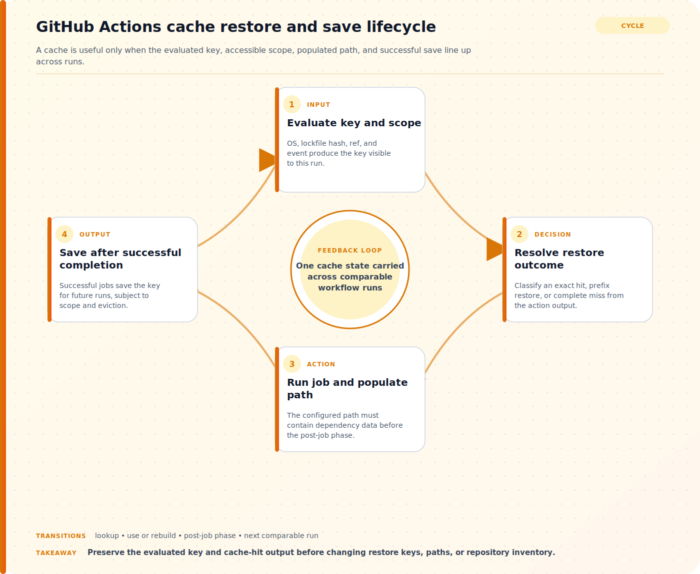

## Direct answer

A cache miss is expected when the evaluated key has no exact match, and a restored prefix is not the same as an exact hit. Repeated misses can also result from changing lockfiles, operating-system boundaries, branch and event scope, a path that is never populated, a job that does not complete successfully, eviction, or an old action configuration. Preserve the evaluated workflow context before changing keys or deleting cache entries. Start with evidence already available to the operator and use the referenced documentation to verify the behavior of the component in scope.

## Prepare a safe investigation

Record the repository, workflow and run, event, ref, runner operating system, action version, evaluated primary key, restore keys, cached paths, cache-hit output, dependency lockfile hash inputs, and whether the job completed successfully. Do not delete repository caches or weaken key specificity during the first evidence pass. Before changing policy, access, networking, or application settings, capture a small reproducible record of the failure. Include the affected identity, workload, tenant or environment, time zone, correlation identifier when available, and the action that produced the result. Mask secrets and personal data in any ticket or shared export. A narrow record is safer to review and lets another administrator test the same hypothesis without repeating a disruptive change.

## Verify the official references

### Dependency caching reference

Use Dependency caching reference to verify this specific part of the investigation: Use the dependency caching reference for exact and partial matching, restore-key order, cache-hit output, save timing, access scope, limits, and security guidance. Match the field names, permissions, and interface labels for Dependency caching reference before changing the affected service.
### Managing caches

Use Managing caches to verify this specific part of the investigation: Use Managing caches for the supported repository inventory and cache-management interfaces. Match the field names, permissions, and interface labels for Managing caches before changing the affected service.
### actions cache

Use actions cache to verify this specific part of the investigation: Use the actions/cache repository documentation for maintained inputs, outputs, examples, compatibility, and migration notes. Match the field names, permissions, and interface labels for actions cache before changing the affected service.

## Step-by-step workflow

For each step, record the timestamp, affected actor or workload, exact result, and evidence scope before moving on. This keeps the investigation reproducible without repeating the same warning after every action.

### 1. Classify exact hits, prefix restores, and misses

Capture the evaluated primary key and ordered restore keys from the same workflow run, then interpret the cache-hit output according to exact-match behavior. Confirm that the path exists and contains the intended dependency data before the post-job save phase.
### 2. Compare the repository cache inventory

Review the existing cache entries and compare their key, ref or scope, creation time, last use, and size with the failing run. Treat deletion as a maintenance action only after the evidence proves that an obsolete entry is interfering with the intended policy.
### 3. Verify the action inputs and supported behavior

Compare the workflow's action version, path, key, restore keys, lookup behavior, and optional cross-OS settings with the maintained action documentation. Avoid caching credentials, generated secrets, or a path readable by untrusted workflow contexts.


## Worked code example

### Structured evidence record

```json
{
  "topic": "troubleshoot-github-actions-cache-misses",
  "scope": "replace-with-one-bounded-user-resource-or-request",
  "observedAtUtc": "2026-01-01T00:00:00Z",
  "expected": "replace-with-the-documented-expected-result",
  "observed": "replace-with-the-actual-result",
  "correlationId": "redacted-or-not-available",
  "nextReadOnlyCheck": "replace-with-one-evidence-gathering-step"
}
```

Replace every placeholder with observed, non-secret values. This local structured-data example makes the investigation boundary reproducible without changing the affected service.

## Troubleshoot by symptom

Use the observed result to choose the next check instead of changing several controls at once. The following table is a decision aid, not a list of automatic fixes. Confirm the product-specific behavior in the cited documentation before applying a remediation.

| Symptom | Likely boundary | Next safe check |
| --- | --- | --- |
| The key changes on every run | Unstable key input, generated file, timestamp, or changing lockfile | Print the non-secret evaluated components and compare the exact key across two runs. |
| A restore key finds data but cache-hit is not true | Partial prefix match rather than an exact primary-key match | Compare the restored key with the full primary key and decide whether a new cache should be saved. |
| No cache is saved after a miss | Job failure, empty or incorrect path, scope restriction, limit, or action configuration | Verify job completion, populated paths, action output, and repository cache inventory. |

## Common mistakes to avoid

Do not treat an isolated success as proof that the underlying configuration is correct. Different users, applications, devices, networks, and token states can follow different paths. Do not remove a security control merely to make one test pass; first identify the exact condition that produced the failure and verify whether a narrower, approved adjustment exists. Avoid copying commands, policy values, or portal labels from old runbooks without checking the current official reference.

Keep the investigation read-only until the evidence identifies a change boundary. If a temporary exception is approved, define who authorized it, when it expires, how it will be monitored, and how the original state will be restored. A reversible experiment is useful; an undocumented workaround creates a second incident to diagnose later.

## Practical checklist

1. Capture run event, ref, runner OS, action version, primary key, restore keys, paths, and cache-hit output.
2. Compare the exact evaluated key and its stable inputs across two runs.
3. Confirm the cached path exists and is populated before the save phase.
4. Review existing cache entries and access scope without deleting evidence.
5. Apply one reviewed key or path change and verify both restore and save behavior on the next comparable run.

## Preserve the result and follow up

After the immediate issue is understood, record the conclusion in language that separates facts, inferences, and remaining unknowns. Attach only the necessary evidence and link the relevant official reference rather than pasting a long, unversioned screenshot. If the same pattern returns, compare the new record with the earlier timestamp, scope, and configuration state before making another change. This turns a one-off troubleshooting session into a dependable operating procedure.

For related background, see [How to Audit GitHub Actions Token Permissions](/posts/audit-github-actions-token-permissions/) and [Copilot Code Review Customization and Configurability Improvements: Practical Guide and Real-World Examples](/posts/copilot-code-review-customization-and-configurability-improvements/). These internal articles provide context, but the cited official documents remain the source of truth for the configuration or diagnostic details in this workflow.

## Version and verification notes

This article is based on the official sources listed for this topic and was checked at publication time. Cloud services, identity behavior, product labels, and administrative interfaces can change. Recheck the cited documentation before automating a command, relying on a default, or applying the same procedure to a different tenant, subscription, cluster, or operating-system release.

## Summary

Start with a small evidence record, use the documented diagnostic path for the affected service, and make one reversible change only after the evidence supports it. That approach protects availability and security while producing a clear handoff for the next operator.

## Visual Summary



## Sources

- [Dependency caching reference](https://docs.github.com/en/actions/reference/workflows-and-actions/dependency-caching)
- [Managing caches](https://docs.github.com/en/actions/how-tos/manage-workflow-runs/manage-caches)
- [actions cache](https://github.com/actions/cache)
