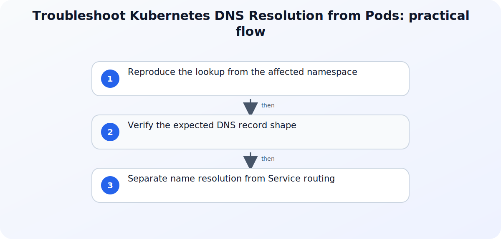

## Direct answer

A failed service-name lookup inside Kubernetes can originate in the test pod, its generated resolver configuration, the cluster DNS Service, CoreDNS Pods, the Service name or namespace, or the workload endpoints. Test those boundaries in order from a disposable pod and preserve the results before restarting DNS components or editing cluster-wide configuration. Start with evidence already available to the operator and use the referenced documentation to verify the behavior of the component in scope.

## Prepare a safe investigation

Record the cluster context, namespace, failing pod, requested DNS name, expected Service, first failure time, and whether direct IP connectivity works. Use a disposable diagnostic pod approved for the namespace, keep the first resolver and lookup output, and do not restart CoreDNS or change kubelet DNS settings during the initial evidence pass. Before changing policy, access, networking, or application settings, capture a small reproducible record of the failure. Include the affected identity, workload, tenant or environment, time zone, correlation identifier when available, and the action that produced the result. Mask secrets and personal data in any ticket or shared export. A narrow record is safer to review and lets another administrator test the same hypothesis without repeating a disruptive change.

## Verify the official references

### Debugging DNS Resolution

Use Debugging DNS Resolution to verify this specific part of the investigation: Use the DNS debugging guide for the supported diagnostic pod, resolver inspection, lookup sequence, and CoreDNS checks. Match the field names, permissions, and interface labels for Debugging DNS Resolution before changing the affected service.
### DNS for Services and Pods

Use DNS for Services and Pods to verify this specific part of the investigation: Use the DNS for Services and Pods reference to interpret Service, Pod, SRV, search-list, and DNS-policy behavior. Match the field names, permissions, and interface labels for DNS for Services and Pods before changing the affected service.
### Debug Services

Use Debug Services to verify this specific part of the investigation: Use the Service debugging guide to verify the Service definition, EndpointSlices, proxy path, and backend boundary. Match the field names, permissions, and interface labels for Debug Services before changing the affected service.

## Step-by-step workflow

For each step, record the timestamp, affected actor or workload, exact result, and evidence scope before moving on. This keeps the investigation reproducible without repeating the same warning after every action.

### 1. Reproduce the lookup from the affected namespace

Run a bounded lookup from a diagnostic pod in the same namespace and compare the short Service name with its namespace-qualified and fully qualified forms. Capture the returned resolver address and exact error so a name-scope problem is not mistaken for a DNS outage.
### 2. Verify the expected DNS record shape

Compare the Service type, namespace, name, named ports, and headless or normal configuration with the record the client expects. Confirm the pod DNS policy and search suffixes before changing an application hostname.
### 3. Separate name resolution from Service routing

Inspect the Service and its EndpointSlices after DNS returns an address. Test the Service boundary independently so an empty selector result, wrong target port, or unready backend is not reported as a resolver failure.


## Worked code example

### Structured evidence record

```json
{
  "topic": "troubleshoot-kubernetes-dns-resolution-pods",
  "scope": "replace-with-one-bounded-user-resource-or-request",
  "observedAtUtc": "2026-01-01T00:00:00Z",
  "expected": "replace-with-the-documented-expected-result",
  "observed": "replace-with-the-actual-result",
  "correlationId": "redacted-or-not-available",
  "nextReadOnlyCheck": "replace-with-one-evidence-gathering-step"
}
```

Replace every placeholder with observed, non-secret values. This local structured-data example makes the investigation boundary reproducible without changing the affected service.

## Troubleshoot by symptom

Use the observed result to choose the next check instead of changing several controls at once. The following table is a decision aid, not a list of automatic fixes. Confirm the product-specific behavior in the cited documentation before applying a remediation.

| Symptom | Likely boundary | Next safe check |
| --- | --- | --- |
| Short name fails but namespace-qualified name works | Namespace or resolver search-path mismatch | Compare the pod namespace and search entries with the requested Service namespace. |
| All lookups time out from several namespaces | Cluster DNS Service, CoreDNS workload, or network path boundary | Inspect resolver addresses, DNS Service endpoints, CoreDNS Pods, and recent logs. |
| Name resolves but the application still cannot connect | Service port, EndpointSlice, readiness, or backend problem | Debug the Service and endpoints separately from DNS. |

## Common mistakes to avoid

Do not treat an isolated success as proof that the underlying configuration is correct. Different users, applications, devices, networks, and token states can follow different paths. Do not remove a security control merely to make one test pass; first identify the exact condition that produced the failure and verify whether a narrower, approved adjustment exists. Avoid copying commands, policy values, or portal labels from old runbooks without checking the current official reference.

Keep the investigation read-only until the evidence identifies a change boundary. If a temporary exception is approved, define who authorized it, when it expires, how it will be monitored, and how the original state will be restored. A reversible experiment is useful; an undocumented workaround creates a second incident to diagnose later.

## Practical checklist

1. Capture cluster context, namespace, pod, requested name, expected Service, and failure time.
2. Reproduce short, qualified, and fully qualified lookups from a controlled pod.
3. Preserve the pod resolver configuration and cluster DNS Service address.
4. Inspect CoreDNS health and logs only after confirming the client-side evidence.
5. When resolution succeeds, verify the Service, EndpointSlices, port, and ready backends separately.

## Preserve the result and follow up

After the immediate issue is understood, record the conclusion in language that separates facts, inferences, and remaining unknowns. Attach only the necessary evidence and link the relevant official reference rather than pasting a long, unversioned screenshot. If the same pattern returns, compare the new record with the earlier timestamp, scope, and configuration state before making another change. This turns a one-off troubleshooting session into a dependable operating procedure.

For related background, see [Windows DNS Diagnostics with PowerShell: A Safe Troubleshooting Workflow](/posts/troubleshooting-windows-dns-powershell/) and [Common Kubernetes Probe Misconfigurations and Fixes](/posts/kubernetes-probe-misconfigurations-fixes/) and [Troubleshooting Kubernetes RBAC with kubectl auth can-i](/posts/troubleshooting-kubernetes-rbac-kubectl-auth-can-i/). These internal articles provide context, but the cited official documents remain the source of truth for the configuration or diagnostic details in this workflow.

## Version and verification notes

This article is based on the official sources listed for this topic and was checked at publication time. Cloud services, identity behavior, product labels, and administrative interfaces can change. Recheck the cited documentation before automating a command, relying on a default, or applying the same procedure to a different tenant, subscription, cluster, or operating-system release.

## Summary

Start with a small evidence record, use the documented diagnostic path for the affected service, and make one reversible change only after the evidence supports it. That approach protects availability and security while producing a clear handoff for the next operator.

## Visual Summary



## Sources

- [Debugging DNS Resolution](https://kubernetes.io/docs/tasks/administer-cluster/dns-debugging-resolution)
- [DNS for Services and Pods](https://kubernetes.io/docs/concepts/services-networking/dns-pod-service)
- [Debug Services](https://kubernetes.io/docs/tasks/debug/debug-application/debug-service)
