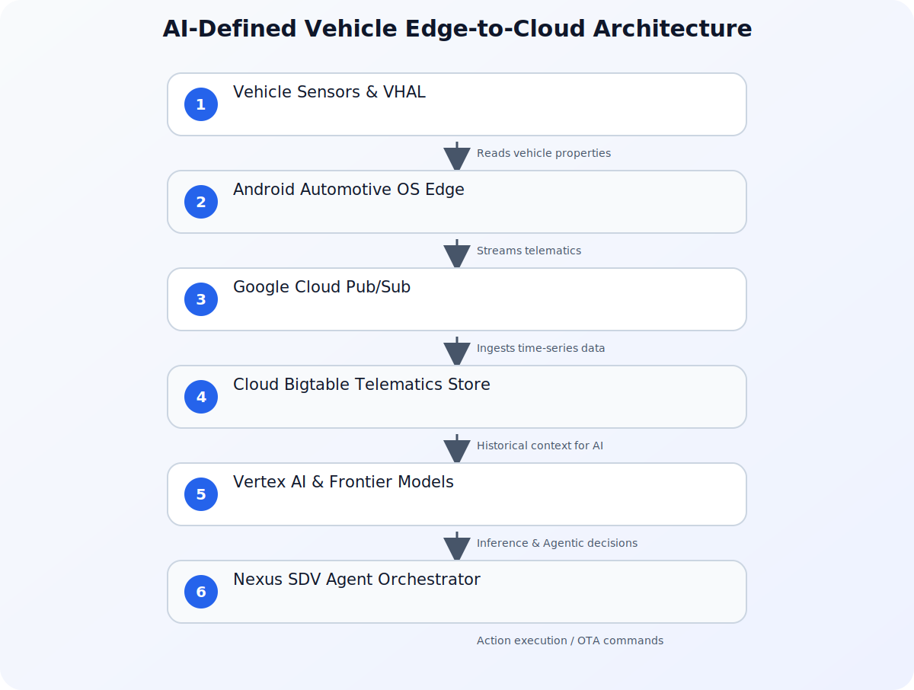

## The Evolution from Software-Defined to AI-Defined Vehicles

The automotive industry is undergoing a structural shift. For decades, vehicles were defined primarily by their mechanical engineering—horsepower, suspension, and chassis rigidity. The rise of Software-Defined Vehicles (SDVs) shifted the focus to centralized computing architectures, where over-the-air (OTA) updates and consolidated Electronic Control Units (ECUs) decoupled hardware from software. 

Today, we are entering the next paradigm: the **AI-Defined Vehicle**. In this era, the vehicle is no longer just a passive execution environment for software; it is an active, intelligent node within a broader, cloud-connected ecosystem. By combining edge computing on the road with powerful cloud-based AI, vehicles can transition from reactive systems (such as triggering an alert when tire pressure is low) to agentic systems (such as predicting tire wear based on driving patterns, scheduling a service appointment, and optimizing the route to the service center).

To build these next-generation automotive solutions, developers must bridge the gap between two powerful environments: **Android Automotive OS (AAOS)** at the vehicle edge and **Google Cloud** at the backend. This integration enables real-time telematics ingestion, high-performance data storage, and the orchestration of frontier AI models to deliver truly agentic mobility.

## Architecture of an AI-Defined Vehicle System

An AI-defined vehicle architecture requires a seamless, bidirectional data flow between the vehicle's local hardware and the cloud. The edge layer must capture high-frequency sensor data, process safety-critical tasks locally, and stream telemetry upward. The cloud layer must ingest this massive stream of data, store it with minimal latency, and run large-scale AI models to generate actionable insights that are sent back to the vehicle.

This end-to-end flow is illustrated in the architecture diagram below:



This architecture relies on a clear separation of concerns:
1. **The Edge (AAOS)**: Interacts directly with the vehicle's CAN bus or Ethernet backbone via the Vehicle Hardware Abstraction Layer (VHAL). It runs local applications, manages the In-Vehicle Infotainment (IVI) system, and packages telemetry data.
2. **The Ingestion Layer (Google Cloud Pub/Sub)**: Handles millions of concurrent connections from a fleet of vehicles, ensuring reliable, asynchronous message delivery.
3. **The Telematics Store (Cloud Bigtable)**: A highly scalable, low-latency NoSQL database designed to store massive time-series datasets generated by vehicle sensors.
4. **The Intelligence Layer (Vertex AI & Frontier Models)**: Orchestrates machine learning pipelines and hosts frontier models (such as Claude or Gemini) to perform complex reasoning, contextual analysis, and agentic decision-making.
5. **The Orchestrator (Nexus SDV)**: A ready-to-use framework developed by Valtech Mobility that integrates these components, enabling OEMs to deploy agentic workflows rapidly.

## The Edge Layer: Android Automotive OS (AAOS)

Unlike Android Auto, which merely projects a user's smartphone screen onto the dashboard, Android Automotive OS (AAOS) is a full operating system that runs directly on the vehicle's hardware. It is responsible for driving the digital cockpit, managing user profiles, and interfacing with vehicle systems.

### The Vehicle Hardware Abstraction Layer (VHAL)

The core of AAOS's integration with the physical vehicle is the **Vehicle Hardware Abstraction Layer (VHAL)**. The VHAL defines a standard interface for the Android system to read and write vehicle properties. These properties are represented by unique IDs and include metrics such as speed, battery level, gear selection, cabin temperature, and diagnostic trouble codes (DTCs).

Because the VHAL abstracts the underlying hardware bus (whether it is CAN, LIN, or Automotive Ethernet), developers can write applications that run across different vehicle models and OEMs without rewriting the low-level integration code.

### Accessing Vehicle Properties in Kotlin

To capture telematics data on the edge, developers use the `CarPropertyManager`. Below is a practical example of how to register a listener to monitor vehicle speed and EV battery level in an AAOS service:

```kotlin
import android.car.Car
import android.car.hardware.CarPropertyValue
import android.car.hardware.property.CarPropertyManager
import android.content.Context
import android.util.Log

class VehicleTelemetryMonitor(context: Context) {

    private var car: Car? = null
    private var carPropertyManager: CarPropertyManager? = null

    init {
        // Initialize the Car API
        car = Car.createCar(context) {
            if (it.isConnected) {
                carPropertyManager = car?.getAreaType(Car.PROPERTY_SERVICE) as? CarPropertyManager
                registerTelemetryListeners()
            }
        }
    }

    private fun registerTelemetryListeners() {
        carPropertyManager?.let {
            // Register for Vehicle Speed (Property ID: 291504647 / PERF_VEHICLE_SPEED)
            it.registerCallback(
                speedCallback,
                CarPropertyManager.SENSOR_TYPE_SPEED,
                CarPropertyManager.SENSOR_RATE_NORMAL
            )

            // Register for EV Battery Level (Property ID: 291504902 / EV_BATTERY_LEVEL)
            it.registerCallback(
                batteryCallback,
                CarPropertyManager.SENSOR_TYPE_EV_BATTERY_LEVEL,
                CarPropertyManager.SENSOR_RATE_ONCHANGE
            )
        }
    }

    private val speedCallback = object : CarPropertyManager.CarPropertyEventCallback {
        override fun onChangeEvent(value: CarPropertyValue<*>) {
            val speed = value.value as Float
            Log.d("Telemetry", "Current Speed: $speed m/s")
            sendToCloudIngestion("speed", speed)
        }

        override fun onErrorEvent(propId: Int, zone: Int) {
            Log.e("Telemetry", "Error reading speed property: $propId")
        }
    }

    private val batteryCallback = object : CarPropertyManager.CarPropertyEventCallback {
        override fun onChangeEvent(value: CarPropertyValue<*>) {
            val batteryPercent = value.value as Float
            Log.d("Telemetry", "Battery Level: $batteryPercent%")
            sendToCloudIngestion("battery_level", batteryPercent)
        }

        override fun onErrorEvent(propId: Int, zone: Int) {
            Log.e("Telemetry", "Error reading battery property: $propId")
        }
    }

    private fun sendToCloudIngestion(metric: String, value: Any) {
        // In production, this method packages the metric into a payload 
        // and queues it for transmission via MQTT or HTTPS to Google Cloud Pub/Sub
    }

    fun cleanup() {
        carPropertyManager?.unregisterCallback(speedCallback)
        carPropertyManager?.unregisterCallback(batteryCallback)
        car?.disconnect()
    }
}
```

## The Cloud Layer: Google Cloud and Bigtable

Once telematics data leaves the vehicle, the cloud infrastructure must process it at scale. A single connected vehicle can generate gigabytes of data per day. For an OEM managing a fleet of one million vehicles, this translates to petabytes of time-series data that must be ingested, indexed, and made available for real-time analysis.

### Why Cloud Bigtable?

**Cloud Bigtable** is Google Cloud's fully managed, high-performance NoSQL database. It is uniquely suited for automotive telematics for several reasons:
* **High Throughput**: Bigtable scales horizontally to handle millions of writes per second, making it ideal for continuous sensor streams.
* **Low Latency**: Sub-millisecond read and write latencies ensure that real-time safety or routing decisions are not delayed by database bottlenecks.
* **Time-Series Optimization**: Bigtable's wide-column layout allows developers to design schemas where data is naturally ordered by vehicle identifier and timestamp, enabling highly efficient range scans.

### Designing the Schema for Telematics

In Cloud Bigtable, schema design is critical because there are no secondary indexes. All queries must be performed using the row key. For automotive telematics, a recommended row key design is:

`vehicle_id#metric_type#timestamp_reversed`

Using a reversed timestamp (`Long.MAX_VALUE - timestamp`) ensures that the most recent data points are stored first in the table, allowing the system to fetch the latest vehicle status with minimal scanning.

Below is a Python example demonstrating how to ingest telematics data into Cloud Bigtable:

```python
import time
from google.cloud import bigtable
from google.cloud.bigtable import column_family

def write_telemetry_to_bigtable(project_id, instance_id, table_id, vehicle_id, metric, value):
    # Initialize the Bigtable client
    client = bigtable.Client(project=project_id, admin=True)
    instance = client.instance(instance_id)
    table = instance.table(table_id)

    # Generate the row key: vehicle_id#metric#reversed_timestamp
    current_time_ms = int(time.time() * 1000)
    reversed_timestamp = 9223372036854775807 - current_time_ms
    row_key = f"{vehicle_id}#{metric}#{reversed_timestamp}".encode('utf-8')

    # Define the column family and qualifier
    column_family_id = "metrics"
    column_id = b"value"

    # Create a new row mutation
    row = table.direct_row(row_key)
    
    # Write the value (cast to string for storage, or use binary serialization)
    row.set_cell(
        column_family_id,
        column_id,
        str(value).encode('utf-8'),
        timestamp=current_time_ms
    )

    # Execute the write
    row.commit()
    print(f"Successfully wrote {metric}={value} for vehicle {vehicle_id} to Bigtable.")
```

## Implementing Agentic Mobility with Nexus SDV

With the edge (AAOS) and cloud data store (Bigtable) in place, the next step is to introduce **agentic mobility**. This is where Valtech's **Nexus SDV** platform comes into play. Nexus SDV acts as an orchestrator, bridging the gap between the raw telematics data stored in Bigtable and the cognitive capabilities of frontier AI models hosted on Google Cloud.

### What is Agentic Mobility?

Traditional connected car features are strictly rule-based. For example, if the vehicle's diagnostic system detects a fault code (e.g., `P0300` - Random/Multiple Cylinder Misfire Detected), it lights up the Malfunction Indicator Lamp (MIL) on the dashboard and sends an email to the driver. 

In an agentic mobility model, the system goes much further:
1. **Contextual Analysis**: The vehicle's agent detects the fault code and queries Cloud Bigtable to analyze historical driving data, ambient temperature, and battery health.
2. **Reasoning**: The agent uses a frontier model (such as Claude or Gemini on Google Cloud) to evaluate the severity of the fault. It determines that while the vehicle is safe to drive for another 50 miles, the spark plugs need immediate replacement.
3. **Proactive Planning**: The agent checks the driver's calendar (via enterprise integrations), finds a free slot tomorrow afternoon, locates the nearest authorized service center with the correct parts in stock, and calculates the optimal route.
4. **Interaction**: The agent presents a natural-language recommendation to the driver via the AAOS in-cabin assistant: *"I've detected a minor engine misfire. I have scheduled a 30-minute appointment at Westside Motors for tomorrow at 2:00 PM, which fits your schedule. Would you like me to update your route?"*

This level of integration requires high-performance, enterprise-grade AI platforms that can process long-context requests reliably and securely.

## Architectural Comparison: Traditional SDV vs. AI-Defined Vehicle

To highlight the shift in capabilities, the table below compares traditional Software-Defined Vehicles with modern AI-Defined (Agentic) Vehicles:

| Feature | Traditional Software-Defined Vehicle (SDV) | AI-Defined Vehicle (Agentic SDV) |
| :--- | :--- | :--- |
| **Data Processing** | Local rule evaluation with batch cloud uploads. | Continuous edge-to-cloud streaming with real-time ingestion. |
| **Storage Architecture** | Relational databases or basic object storage. | Time-series optimized NoSQL (e.g., Cloud Bigtable) for high-frequency telematics. |
| **Decision Making** | Hardcoded logic and deterministic algorithms. | Cognitive reasoning using frontier LLMs and agentic workflows. |
| **User Interaction** | Static menus, rigid voice commands, and basic alerts. | Context-aware, natural-language conversational agents. |
| **Maintenance Model** | Reactive (alert when a part fails). | Proactive (predict wear, check inventory, and schedule service). |
| **Integration Scope** | Siloed vehicle systems. | Deep integration with user calendars, smart home systems, and OEM supply chains. |

## Security, Compliance, and the AI Supply Chain

Building connected, AI-defined vehicles introduces unique security and compliance challenges. Because vehicles are safety-critical systems, developers must ensure that the integration of cloud-based AI does not compromise the vehicle's operational integrity.

### Identity and Access Management (IAM)

Every vehicle in a fleet must be treated as a distinct, authenticated identity. When streaming telematics to Google Cloud or invoking AI models, the vehicle must authenticate using secure, cryptographic credentials (such as TPM-backed client certificates). As the automotive ecosystem becomes increasingly reliant on cloud-based AI models, [identity security](/posts/why-identity-security-matters-more-ai-era/) becomes a foundational pillar. Ensuring that only authorized vehicles can write to Bigtable or trigger agentic workflows is critical to preventing malicious actors from injecting spoofed telemetry data.

### Securing the AI Supply Chain

When deploying AI models to production—whether they are running on GKE (Google Kubernetes Engine) or managed via Vertex AI—organizations must maintain visibility over their software and model artifacts. To secure the containerized AI microservices running in the cloud, tools like [k8s-aibom](/posts/securing-the-ai-supply-chain-on-gke-introducing-k8s-aibom-for-automated-ai-boms-pr/) can automate the generation of AI Bills of Materials (AI BOMs). This ensures that all model weights, runtimes, and dependencies are audited and free from vulnerabilities before they interact with the vehicle fleet.

Furthermore, automotive software must comply with strict international standards, such as **ISO 26262** (Functional Safety) and **ISO/SAE 21434** (Road Vehicles - Cybersecurity Engineering). This requires clear boundaries between the safety-critical domain of the vehicle (such as braking and steering) and the infotainment/AI domain (AAOS and cloud services). The VHAL acts as a secure gateway, ensuring that cloud-initiated commands cannot interfere with safety-critical operations unless explicitly permitted by the vehicle's primary safety controllers.

## Conclusion

The convergence of Android Automotive OS, Cloud Bigtable, and frontier AI models on Google Cloud is redefining the relationship between drivers and their vehicles. By leveraging AAOS at the edge to capture rich vehicle properties and Google Cloud at the backend to store and reason over this data, developers can build agentic mobility solutions that anticipate user needs, optimize fleet operations, and improve safety.

As you begin building your own automotive solutions, focus on establishing a robust, low-latency data pipeline, designing a scalable time-series schema in Bigtable, and maintaining a rigorous security posture across both physical and digital assets. The future of mobility is no longer just software-defined—it is AI-defined.

## Sources

- [Building the AI-defined vehicle with Android, Google Cloud, and Nexus SDV](https://cloud.google.com/blog/products/databases/nexus-sdv-uses-bigtable-android-automotive-for-agentic-vehicles/)
- [Claude at scale on Google Cloud: Frontier AI, built for enterprise production](https://cloud.google.com/blog/products/ai-machine-learning/claude-at-scale-on-google-cloud-frontier-ai-built-for-enterprise-production/)
- [Evolving how LLMs are measured for Android: the next era of Android Bench](https://android-developers.googleblog.com/2026/07/android-bench-llm-measurement.html)
