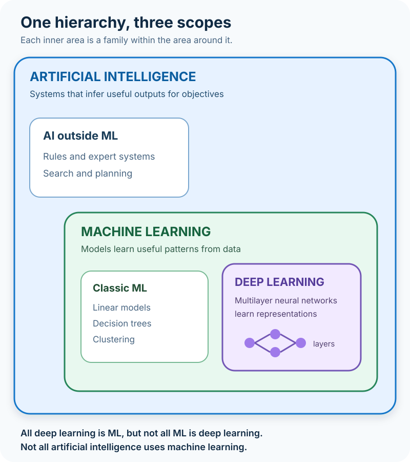

A product team agrees that its support inbox needs "AI."

One engineer proposes a set of rules that routes billing questions to finance. Another wants to train a classifier on thousands of old tickets. A third suggests using a large neural network that can read each message and draft a response.

All three ideas might contribute to an AI system. Only two involve machine learning. The final one uses deep learning.

That distinction sounds academic until the team has to estimate cost, collect data, explain a decision, or debug a bad result. Calling every approach "AI" hides the engineering choice that matters most: **where does the system's behavior come from?**

The shortest useful answer is this: **artificial intelligence is the broad field, machine learning is one way to build AI, and deep learning is a family of machine-learning techniques based on multilayer neural networks.**



## Three terms, three levels of scope

The terms fit inside one another, but they describe different things.

**Artificial intelligence (AI)** is the widest category. The OECD defines an AI system as a machine-based system that infers how to produce outputs such as predictions, content, recommendations, or decisions for explicit or implicit objectives. NIST uses similarly broad language around machine-based systems producing predictions, recommendations, or decisions.

The important word is not *human-like*. It is *system*. AI can include a model, rules, search, data pipelines, application code, monitoring, and a user interface. It is the complete mechanism that turns inputs into consequential outputs.

**Machine learning (ML)** is a set of techniques within AI. Instead of programmers spelling out every decision rule, an ML training process derives a model from data. Google describes ML in practical terms as training software to make predictions or generate content using data. NIST's glossary emphasizes systems that adapt and learn from data to improve accuracy.

**Deep learning (DL)** is a family within machine learning. It uses neural networks arranged in multiple computational layers. Those layers learn useful internal representations from examples, allowing the model to capture complicated, nonlinear relationships.

So the usual relationship is:

```text
Artificial intelligence
`-- Machine learning
    `-- Deep learning
```

This hierarchy clears up two common errors. Not every AI system learns from data, and not every machine-learning model is a deep neural network.

## AI is bigger than learning from data

Imagine the support team begins with a simple routing system:

- If the account is locked, send the ticket to identity support.
- If the message contains an invoice number, send it to billing.
- If the customer reports a security incident, assign the urgent queue.

The system accepts input, applies knowledge, and makes a routing decision. It may reasonably be part of an AI solution even though no model was trained. Its behavior comes from rules written by people.

AI has long included approaches such as search, planning, optimization, expert systems, and symbolic reasoning. The OECD's explanation of its AI definition explicitly includes both machine-learning and knowledge-based approaches. That matters because current conversation often treats AI and ML as synonyms.

Rules are not primitive merely because they are not learned. For a small, stable problem with clear policy, explicit rules can be cheaper to build, easier to audit, and safer to change than a statistical model. A tax deadline, an access-control policy, or a legally required escalation may belong in code even when ML handles the surrounding ambiguity.

The real question is not, "Can we use machine learning?" It is, "Would learning a pattern from examples solve this problem better than specifying the behavior directly?"

## Machine learning moves rules into a model

The inbox grows. Customers describe the same issue in hundreds of ways, and the rule list becomes fragile. Now the team has 50,000 historical tickets with reliable category labels.

That is a plausible machine-learning problem.

During training, an algorithm adjusts model parameters so that inputs map to useful outputs. The team might convert each ticket into features, train a logistic-regression or tree-based classifier, and evaluate it on tickets that were not used for training. The resulting model does not contain a hand-written rule for every phrase. It contains mathematical relationships learned from the examples.

This changes the engineering work rather than eliminating it. Someone still has to define the target, collect representative data, correct bad labels, select useful signals, choose evaluation metrics, test failure cases, and monitor changes after deployment.

ML is especially useful when all of the following are true:

- The desired output can be measured or labeled.
- Relevant patterns exist in available data.
- Those patterns are too numerous or subtle to express as maintainable rules.
- A probabilistic answer is acceptable.
- The organization can evaluate and monitor the model over time.

If the labels are inconsistent or the future differs sharply from the training data, the model can learn the wrong lesson with great confidence. Data is not a substitute for a clear problem definition.

## Deep learning learns layered representations

Classic ML often depends on people choosing how to represent the input. For ticket text, an engineer might count important terms, track message length, or construct other features before training a classifier.

Deep learning can learn much of that representation along with the prediction task. A neural network transforms an input through successive layers of weighted operations and nonlinear activation functions. Early layers may capture simple signals; later layers combine them into more task-specific representations.

Google's neural-network guide describes these models as architectures that learn nonlinear patterns and useful feature interactions during training. NIST's terminology describes deep learning as machine learning built from complex, tunable computational circuits organized into many layers.

For the support inbox, a deep language model could use word order and context instead of relying mainly on manually selected text features. Related architectures make modern speech recognition, image understanding, language models, and many generative systems possible.

But "deep" is not a quality badge. It describes architecture, not correctness.

A deep model usually brings more parameters, more computation, more operational complexity, and harder-to-explain internal behavior. It may need substantially more data or benefit from a pretrained model. When a small tabular dataset and a tree-based model solve the problem, adding a deep network can turn a straightforward system into an expensive science project.

## The same problem can have three different solutions

The support example shows why these terms should guide a design conversation rather than become marketing labels.

| Approach | Where behavior comes from | Sensible fit for ticket routing | Main tradeoff |
| --- | --- | --- | --- |
| Rule-based AI | Policies and logic written by people | A few stable categories with explicit escalation rules | Transparent, but rules become brittle as language varies |
| Machine learning | Patterns learned from labeled ticket data | Many repeatable categories with good historical examples | Flexible, but depends on data quality and monitoring |
| Deep learning | Layered representations learned by a neural network | Nuanced language, large-scale text, or generation | Powerful for complex inputs, but more resource-intensive and opaque |

A production system can combine all three. A learned model can classify the ticket, explicit policy can force security incidents into a protected workflow, and conventional software can apply permissions and record the decision.

This hybrid is often the responsible design. Statistical models handle ambiguity; deterministic code enforces boundaries that must not be negotiable.

## Training and inference are not the same thing

Another source of confusion is the word *learning*. Most deployed ML applications do not continuously rewrite themselves after every request.

**Training** is the process that uses data and an objective to adjust model parameters. **Inference** is what happens when the trained model receives a new input and produces a prediction or other output.

The ticket classifier might be trained weekly in a controlled pipeline, then serve predictions all day without changing its parameters. Some systems do adapt after deployment, but that is a deliberate architectural choice with extra validation and monitoring requirements.

This distinction also explains why an AI system is more than its model. The deployed service needs input validation, access control, versioning, fallback behavior, observability, and a way to handle uncertain results. The [software architecture around a model](/posts/software-architecture-beginners-guide/) often determines whether a promising experiment becomes a dependable product.

## Where do generative AI and large language models fit?

Generative AI describes the kind of output a system creates: text, images, audio, video, code, or other content. It is not a fourth rung underneath deep learning.

Most modern generative AI products rely heavily on deep-learning models, but the product remains an AI system containing much more than the model. A language-model assistant may include retrieval, policy checks, external tools, application state, and deterministic business logic. The model generates or reasons over content; the surrounding system decides what data and actions are available.

That means an LLM-based assistant can accurately be called AI, machine learning, and deep learning at the same time. Each label answers a different question:

- **AI:** What broad kind of system is this?
- **ML:** Was important behavior learned from data?
- **DL:** Is the learned model a deep neural network?
- **Generative AI:** Does it create new content as a primary output?

If the application connects a model to live tools or data, the integration design becomes another separate concern. The [Model Context Protocol guide](/posts/model-context-protocol-explained-llms-real-world-data/) explores one approach, while the [on-device, cloud, and hybrid inference comparison](/posts/android-intelligent-apps-cloud-hybrid-on-device-inference/) covers where a model can run.

## Common misconceptions worth dropping

The first is that AI must imitate a human mind. Practical definitions focus on how a machine-based system infers outputs for objectives, not whether it thinks or feels like a person.

The second is that a model "learns" exactly as a human learns. Training is an optimization process over data and an objective. The human metaphor can be convenient, but it should not hide the mechanics.

The third is that deep learning automatically beats classic ML. Architecture should follow the data, task, constraints, and evidence. A simpler model may train faster, cost less, require fewer examples, and be easier to explain.

The fourth is that more data guarantees a better system. Biased, stale, duplicated, or incorrectly labeled examples can produce a larger collection of the same mistake. Evaluation data must represent the conditions that matter after deployment.

Finally, a high benchmark score does not finish the product. Real systems need latency and cost limits, security controls, failure handling, human escalation, and monitoring for changing behavior.

## How to choose the least complicated approach that works

Start with the decision the system must support, not with the term you want to put on a roadmap.

If the behavior can be expressed as a small set of stable rules, begin there. If the rules collapse under variation and you have representative examples with measurable outcomes, evaluate classic ML. If the input is complex and unstructured, the relationships are strongly nonlinear, or a pretrained neural model provides a clear advantage, test deep learning.

Then compare candidates on the qualities the product actually needs: error costs, explainability, latency, privacy, data volume, update frequency, operating cost, and team expertise. A controlled experiment should earn each additional layer of complexity.

The hierarchy is easy to remember:

**AI is the goal and system space. Machine learning learns behavior from data. Deep learning does that with multilayer neural networks.**

Knowing the labels will not choose an architecture for you. It will do something more useful: make the real tradeoff visible before the team commits to the most complicated answer in the room.

## Continue learning

- [What Is Software Architecture? A Beginner's Guide](/posts/software-architecture-beginners-guide/)
- [Architecting Android AI Features: On-Device, Cloud, and Hybrid Inference](/posts/android-intelligent-apps-cloud-hybrid-on-device-inference/)
- [Model Context Protocol (MCP) Explained](/posts/model-context-protocol-explained-llms-real-world-data/)
- [Postgres with pgvector vs. Specialized Vector Databases](/posts/postgres-pgvector-vs-specialized-vector-databases/)

## Sources

- [NIST: The Language of Trustworthy AI—An In-Depth Glossary of Terms](https://www.nist.gov/publications/language-trustworthy-ai-depth-glossary-terms)
- [NIST CSRC Glossary: Artificial Intelligence](https://csrc.nist.gov/glossary/term/artificial_intelligence)
- [NIST CSRC Glossary: Machine Learning](https://csrc.nist.gov/glossary/term/machine_learning)
- [OECD.AI: What Is AI? Defining an AI System](https://oecd.ai/en/wonk/definition)
- [Google for Developers: What Is Machine Learning?](https://developers.google.com/machine-learning/intro-to-ml/what-is-ml)
- [Google for Developers: Neural Networks](https://developers.google.com/machine-learning/crash-course/neural-networks)
- [NIST SP 1500-29: Artificial Intelligence in the Fire Service](https://www.nist.gov/publications/artificial-intelligence-fire-service-considerations-implementing-artificial)
