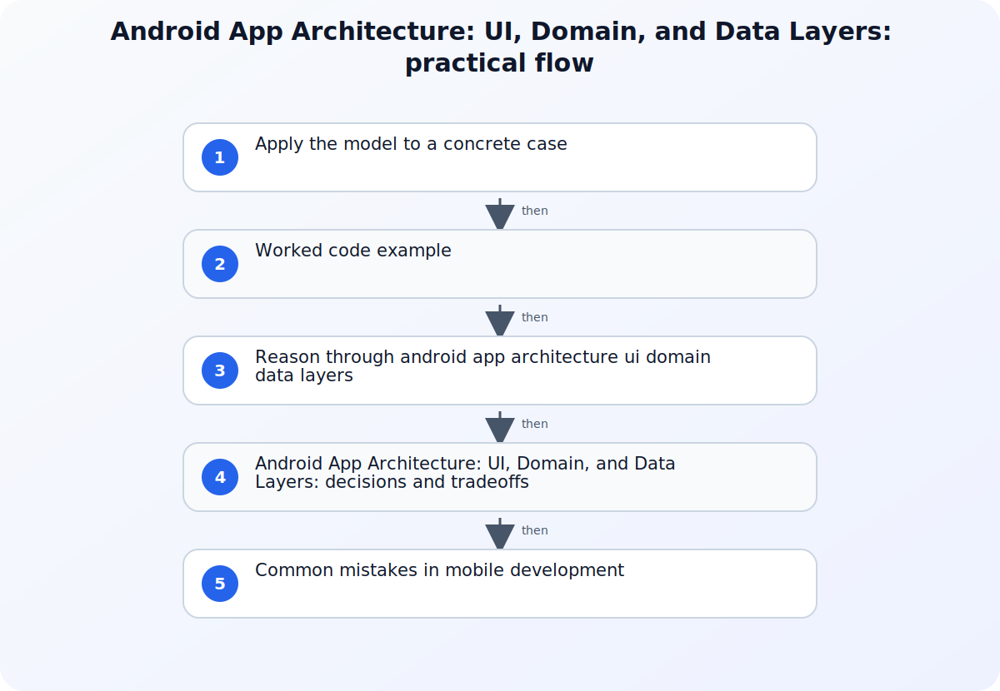

A maintainable Android app does not need the maximum number of layers; it needs clear ownership and predictable data flow. The UI layer presents application data and turns user actions into events, the data layer owns business data and access rules, and an optional domain layer holds reusable or complex business operations. The important design test is whether each responsibility has one understandable home and whether state moves through the system in a way that can be observed and tested.



## A working model for Android App Architecture: UI, Domain, and Data Layers

Start from one real feature and draw its read path and write path. Name the screen state, the events the user can produce, the repository contract, the local or remote data sources, and any business operation shared by more than one screen. Also record lifecycle, offline, error, and concurrency requirements. This feature slice is a better architecture input than a package diagram because it exposes where ownership and transformations actually occur.

## Apply the model to a concrete case

Consider an offline-capable task screen. The screen renders a TaskListUiState containing items, a loading flag, and a user-facing error. A TaskListViewModel accepts refresh and completion events, then calls a task repository. The repository exposes a stream from the local database as the readable source of truth and synchronizes remote changes into that database. A completion event writes locally first and queues synchronization according to the product's conflict policy. If sorting rules are reused by the list, widget, and search feature, a focused SortTasks use case can hold that rule. This example makes the direction of dependencies visible: UI code knows a repository contract, the repository knows its concrete data sources, and database or HTTP models are transformed before becoming UI state.

## Worked code example

### Expose repository data as immutable UI state

```kotlin
data class TaskListUiState(
    val items: List<Task> = emptyList(),
    val isLoading: Boolean = false,
    val errorMessage: String? = null,
)

class TaskListViewModel(
    repository: TaskRepository,
) : ViewModel() {
    val state = repository.observeTasks()
        .map { tasks -> TaskListUiState(items = tasks) }
        .stateIn(
            scope = viewModelScope,
            started = SharingStarted.WhileSubscribed(5_000),
            initialValue = TaskListUiState(isLoading = true),
        )
}
```

The UI observes one immutable state object while the repository remains the data boundary. Loading and error transitions can be added to the same state model and tested with controlled repository emissions.

## Source boundaries for mobile development

### Guide to app architecture

Use Guide to app architecture for this boundary of the topic: Use the architecture guide for separation of concerns, UI state, state holders, and unidirectional data flow.
### Android architecture recommendations

Use Android architecture recommendations for this boundary of the topic: Use the Android data-layer reference for repository responsibilities, data sources, and source-of-truth decisions.
### Android data layer

Use Android data layer for this boundary of the topic: Use the recommendations page to evaluate optional domain-layer use cases, dependency direction, coroutines, and testability.

## Reason through android app architecture ui domain data layers

### 1. Give the UI layer one observable state model

Represent what the screen can render as explicit UI state and keep transient platform callbacks from becoming hidden sources of business state. A state holder such as a ViewModel can receive events, invoke the required use case or repository operation, and expose state for the UI to observe. The UI should render from that state rather than reconstructing application rules across composables, fragments, or activities. This boundary makes configuration changes, recomposition, loading, and error paths visible in tests.
### 2. Make repositories the public boundary of the data layer

A repository should expose the data and operations needed by the rest of the app while coordinating its data sources. Callers should not need to know whether a value came from a network request, database, cache, or device API. Define which source is authoritative, how updates are synchronized, and how errors are represented. That keeps storage and transport decisions from leaking into UI code and gives tests a stable contract to replace with a controlled implementation.
### 3. Add a domain layer only when it earns its boundary

Move an operation into a use case when it contains reusable business logic, combines multiple repositories, or would otherwise make a state holder difficult to understand. Do not create pass-through use cases merely to satisfy a diagram; an extra abstraction has a navigation and maintenance cost. Give each use case a focused input and output, keep platform types outside when practical, and test the business rule without an Android component. The result should reduce coupling, not just relocate a method.

## Android App Architecture: UI, Domain, and Data Layers: decisions and tradeoffs

| Situation or decision | Tradeoff or common failure mode | Validation question |
| --- | --- | --- |
| A screen reads a database or HTTP client directly | UI code now owns transport, caching, and presentation concerns | Define the repository operation and decide which data source is authoritative |
| The same rule is copied into several ViewModels | Reusable business logic has no domain boundary | Extract one focused use case and test it independently of Android UI types |
| Every repository call is wrapped by a one-line use case | The domain layer adds ceremony without reducing coupling | Keep the direct repository dependency until orchestration or reuse justifies another layer |

## Common mistakes in mobile development

A frequent Android architecture mistake is naming packages ui, domain, and data while allowing dependencies to cross those boundaries freely. The labels do not help if a composable calls Retrofit, a repository returns a mutable database entity, or a use case imports an Activity. Another mistake is representing navigation messages or one-time work as permanently replayed state without defining consumption behavior. Teams also over-abstract small applications by adding interfaces and use cases that have only one pass-through method. Review the feature's data flow and tests: each abstraction should isolate a volatile dependency, express a real rule, or make state ownership clearer. If removing a layer leaves the same coupling and behavior, that layer was probably ceremony.

## Practical implementation checklist

1. Trace one feature from user event to persisted or remote data and back to rendered UI state.
2. Confirm the UI cannot bypass the repository to reach a concrete data source.
3. Write down the source of truth and the behavior during stale data, network failure, and retry.
4. Test state-holder transitions with controlled repository results, including loading and error cases.
5. Keep a domain use case only when it represents reusable logic or meaningful orchestration.

## Related implementation context

[Spring Boot Layered Architecture: Controller, Service, and Repository](/posts/spring-boot-layered-architecture/) and [@Component vs @Bean in Spring: When to Use Each](/posts/component-vs-bean/)

## Version and verification boundary

The article follows the current Android Developers architecture guide, recommendations, and data-layer guidance checked at publication time; library APIs and recommended integrations can evolve.

## Summary

Use Android layers to make ownership and data flow reviewable: render explicit UI state, expose data through repositories, and introduce domain use cases only for meaningful reusable logic. Validate the design on a real feature, including offline and error paths, before expanding the pattern across the app.

## Sources

- [Guide to app architecture](https://developer.android.com/topic/architecture)
- [Android architecture recommendations](https://developer.android.com/topic/architecture/recommendations)
- [Android data layer](https://developer.android.com/topic/architecture/data-layer)
