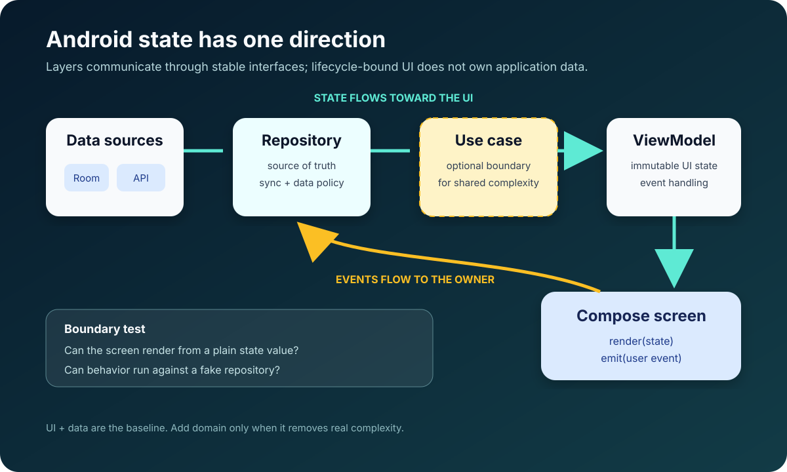

An Android architecture is useful when it answers three ordinary questions without a team meeting:

1. **Where does this state come from?**
2. **Who is allowed to change it?**
3. **How can I test the behavior without starting an emulator?**

The practical answer is usually a UI layer backed by a data layer, with a domain layer only where reusable or complex business rules justify it. The point is not to collect `Repository`, `UseCase`, and `ViewModel` classes. The point is to make state ownership and dependency direction obvious.



## The architecture in one picture

| Layer | Owns | Should not own |
| --- | --- | --- |
| UI | Rendering, screen state, user events, presentation logic | Network clients, SQL queries, cross-screen business rules |
| Domain *(optional)* | Reusable or complex operations expressed as use cases | Android UI types or data-source details |
| Data | Application data, repositories, synchronization policy, business rules close to data | Compose state or navigation |
| Data source | One external mechanism: API, Room, file, sensor, or DataStore | Decisions spanning multiple sources |

Android's official guidance recommends at least a UI and data layer. The domain layer is optional. That detail matters: a three-layer diagram is not a command to create a use case for every repository function.

## Follow one feature from screen to storage

Consider a task list that works offline:

- Room is the source of truth for visible tasks.
- A repository exposes a stream from Room and refreshes it from the network.
- A `ViewModel` converts repository data into immutable screen state.
- Compose renders that state and sends user events back to the `ViewModel`.

This creates unidirectional data flow:

```text
Room/API -> TaskRepository -> TasksViewModel -> TasksScreen
                 ^                  |
                 |------ events ----|
```

The arrows are more important than the package names. UI state moves toward the screen; events move toward the owner that can apply them.

### Model the UI as a complete state

Avoid several unrelated booleans such as `isLoading`, `hasError`, and `isEmpty` that can form impossible combinations. A sealed model makes the valid states explicit:

```kotlin
sealed interface TasksUiState {
    data object Loading : TasksUiState
    data class Ready(
        val tasks: List<TaskUiModel>,
        val isRefreshing: Boolean
    ) : TasksUiState
    data class Error(val message: String) : TasksUiState
}
```

For screens that must retain old data during refresh, use one data class with explicit fields instead. The right shape is the one that prevents contradictory states while representing the experience you actually want.

## A complete Kotlin example

The repository is the public boundary of the data layer. Callers do not need to know whether data came from Room, HTTP, or both.

```kotlin
data class Task(val id: Long, val title: String, val completed: Boolean)

interface TaskRepository {
    fun observeTasks(): Flow<List<Task>>
    suspend fun refresh()
    suspend fun setCompleted(id: Long, completed: Boolean)
}

class OfflineFirstTaskRepository(
    private val api: TaskApi,
    private val dao: TaskDao,
    private val io: CoroutineDispatcher
) : TaskRepository {

    override fun observeTasks(): Flow<List<Task>> =
        dao.observeAll().map { rows -> rows.map(TaskEntity::asExternalModel) }

    override suspend fun refresh() = withContext(io) {
        val remoteTasks = api.getTasks()
        dao.replaceAll(remoteTasks.map(NetworkTask::asEntity))
    }

    override suspend fun setCompleted(id: Long, completed: Boolean) =
        withContext(io) {
            dao.setCompleted(id, completed)
            // Queue or attempt remote synchronization according to product policy.
        }
}
```

Notice two deliberate choices:

- The repository, not the `ViewModel`, decides how local and remote sources interact.
- The type performing blocking work makes itself safe to call from the main thread.

The `ViewModel` owns screen-level presentation state and accepts UI events:

```kotlin
class TasksViewModel(
    private val repository: TaskRepository
) : ViewModel() {

    val uiState: StateFlow<TasksUiState> =
        repository.observeTasks()
            .map<List<Task>, TasksUiState> { tasks ->
                TasksUiState.Ready(
                    tasks = tasks.map { it.toUiModel() },
                    isRefreshing = false
                )
            }
            .catch { emit(TasksUiState.Error("Could not load tasks")) }
            .stateIn(
                scope = viewModelScope,
                started = SharingStarted.WhileSubscribed(5_000),
                initialValue = TasksUiState.Loading
            )

    fun onTaskChecked(id: Long, checked: Boolean) {
        viewModelScope.launch {
            repository.setCompleted(id, checked)
        }
    }

    fun refresh() {
        viewModelScope.launch {
            runCatching { repository.refresh() }
                .onFailure { /* expose a user-visible transient error */ }
        }
    }
}
```

Compose remains intentionally boring:

```kotlin
@Composable
fun TasksRoute(
    viewModel: TasksViewModel = hiltViewModel()
) {
    val state by viewModel.uiState.collectAsStateWithLifecycle()

    TasksScreen(
        state = state,
        onTaskChecked = viewModel::onTaskChecked,
        onRefresh = viewModel::refresh
    )
}
```

`TasksScreen` can now be previewed and tested with plain values and callbacks. It does not reach into a repository or launch its own network request.

## When a domain layer earns its place

Add a use case when the operation:

- is shared by multiple `ViewModel`s;
- coordinates multiple repositories;
- contains a meaningful rule that deserves an independent name and tests; or
- would otherwise make a `ViewModel` difficult to read.

For example:

```kotlin
class CompleteTaskAndAwardPoints(
    private val tasks: TaskRepository,
    private val rewards: RewardsRepository
) {
    suspend operator fun invoke(taskId: Long) {
        tasks.setCompleted(taskId, true)
        rewards.awardForCompletedTask(taskId)
    }
}
```

Do not add a class that only forwards `repository.getTasks()` and call that architecture. Indirection has a reading and maintenance cost.

## Choose the source of truth explicitly

The single source of truth is the component allowed to authoritatively mutate a particular data type. In an offline-first task app, it is often the local database:

1. UI observes Room.
2. Refresh fetches the API.
3. The repository writes the response to Room.
4. Room emits the new state to the UI.

Writing the API response directly into UI state creates two competing truths. The screen can then disagree with local storage after process recreation or while offline.

Not every value belongs in a database. A search query may live in a `ViewModel`; an authentication token may live in secure storage; a short-lived animation flag may live in Compose. Define ownership per data type, not once for the entire application.

## Test the boundaries, not the framework

Each layer should have a focused test:

```kotlin
@Test
fun completed_task_is_forwarded_to_repository() = runTest {
    val repository = FakeTaskRepository()
    val viewModel = TasksViewModel(repository)

    viewModel.onTaskChecked(id = 42, checked = true)
    advanceUntilIdle()

    assertEquals(42 to true, repository.lastCompletion)
}
```

Use:

- pure unit tests for use cases and mapping functions;
- fake repositories for `ViewModel` tests;
- fake data sources or an in-memory database for repository tests;
- Compose UI tests for rendering and interaction contracts.

An interface is valuable when it creates a meaningful boundary or alternate implementation. Creating an interface for every class by habit can make navigation harder without improving tests.

## Failure patterns worth catching in review

### The ViewModel becomes a second data layer

If it parses DTOs, chooses retry policy, runs SQL, and merges remote and local records, move those responsibilities behind a repository.

### Composables perform business operations

A composable can be recomposed many times. It should describe UI, not initiate an uncontrolled request from its function body. Use event callbacks and lifecycle-aware effects deliberately.

### Mutable state leaks across layers

Expose immutable models or read-only flows. Keep `MutableStateFlow`, mutable collections, and database entities private to their owner.

### A domain layer exists only for symmetry

Delete pass-through use cases. Add the layer later when behavior becomes reusable or complex; architecture can evolve.

### Android types spread everywhere

Keeping most domain and data logic free of `Activity`, `Fragment`, `Context`, and UI widgets makes it faster to test and harder to misuse lifecycle-bound objects.

## A review checklist

- Can a new contributor draw the state and event directions?
- Does each data type have one named source of truth?
- Does the UI render immutable state and emit events?
- Do repositories hide data-source and synchronization details?
- Is the domain layer present only where it reduces complexity or duplication?
- Are long-running operations main-safe and cancellable?
- Can the core behavior be tested without an emulator?
- Does process recreation recover persistent state correctly?
- Are failures, loading, empty data, and refresh represented deliberately?

Architecture succeeds when a feature can change without unrelated layers knowing how it changed. Start with UI and data, make ownership explicit, and let real complexity—not a diagram—decide whether you need more.

## Sources

- [Guide to app architecture — Android Developers](https://developer.android.com/topic/architecture)
- [Recommendations for Android architecture — Android Developers](https://developer.android.com/topic/architecture/recommendations)
- [UI layer — Android Developers](https://developer.android.com/topic/architecture/ui-layer)
- [Data layer — Android Developers](https://developer.android.com/topic/architecture/data-layer)
