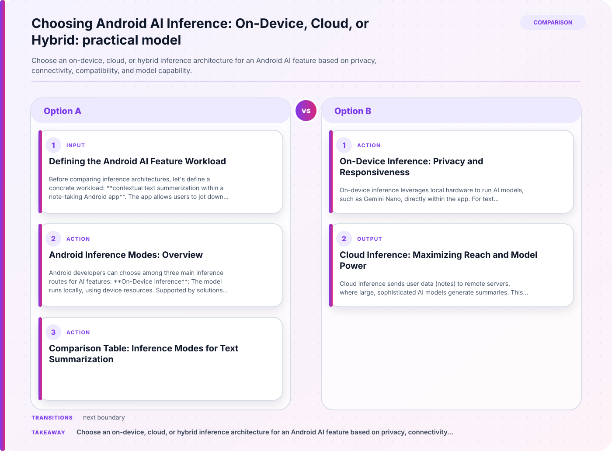

## Defining the Android AI Feature Workload

Before comparing inference architectures, let's define a concrete workload: **contextual text summarization within a note-taking Android app**. The app allows users to jot down lengthy notes and, with the tap of a button, generates concise summaries using a generative AI model. This feature must:



- Run reliably across a wide range of Android devices (from entry-level to flagship).
- Respect user privacy, especially for sensitive notes.
- Provide a responsive experience, even when offline.
- Adapt to evolving model capabilities (e.g., larger, more accurate models).

We assume the app targets Android 10+ and aims to reach as many users as possible, including those with limited connectivity or older hardware.

## Android Inference Modes: Overview

Android developers can choose among three main inference routes for AI features:

1. **On-Device Inference**: The model runs locally, using device resources. Supported by solutions like Gemini Nano via ML Kit’s Prompt API.
2. **Cloud Inference**: The model executes on remote servers, returning results to the app.
3. **Hybrid Inference**: The app dynamically selects between on-device and cloud inference, optimizing for performance, availability, and device compatibility.

Each mode has distinct implications for privacy, connectivity, device compatibility, and model capability.

## Comparison Table: Inference Modes for Text Summarization

| Criteria                | On-Device Inference           | Cloud Inference                | Hybrid Inference               |
|-------------------------|-------------------------------|-------------------------------|-------------------------------|
| Privacy                 | High (data stays local)       | Lower (data sent to server)   | High/Medium (depends on route) |
| Connectivity            | Offline capable               | Requires network              | Adapts to connectivity         |
| Device Compatibility    | Limited by hardware/OS        | Broad (any device)            | Maximizes reach                |
| Model Capability        | Constrained by device         | Access to large models        | Flexible, fallback to cloud    |
| Failure Modes           | Model unavailable or slow     | Network errors, latency       | Fallback logic, graceful degrade|
| User Experience         | Fast, private, but limited    | Rich, but may lag or fail     | Seamless, adaptive             |

## On-Device Inference: Privacy and Responsiveness

On-device inference leverages local hardware to run AI models, such as Gemini Nano, directly within the app. For text summarization, this means users’ notes never leave their device, maximizing privacy. This route is ideal for sensitive workloads and users concerned about data sharing.

**Advantages:**
- **Privacy:** Data stays local, never transmitted externally.
- **Offline Support:** Summarization works without internet.
- **Low Latency:** Immediate response, unaffected by network.

**Limitations:**
- **Device Compatibility:** Not all devices support advanced on-device models. For example, Gemini Nano requires specific hardware and OS versions (Build intelligent Android apps: On-device inference).
- **Model Capability:** Model size and complexity are restricted by device resources; summaries may be less accurate or nuanced compared to cloud models.

**Failure Modes:**
- On older devices, the model may not be available, or inference may be slow. The app should detect capability and gracefully degrade (e.g., disable feature or offer basic summarization).

**Validation Step:**
- Use Android’s ML Kit Prompt API to check for Gemini Nano availability before enabling summarization. If unavailable, notify users or offer alternatives.

**Example: Checking Gemini Nano Availability**

```kotlin
val isGeminiNanoAvailable = MLKitPromptApi.isModelAvailable("gemini_nano")
if (isGeminiNanoAvailable) {
    // Proceed with on-device summarization
} else {
    // Fallback: disable feature or offer cloud summarization
}
```

## Cloud Inference: Maximizing Reach and Model Power

Cloud inference sends user data (notes) to remote servers, where large, sophisticated AI models generate summaries. This approach ensures:

- **Device Compatibility:** Any Android device, regardless of hardware, can access the feature.
- **Model Capability:** Developers can use state-of-the-art models, unconstrained by device limits (Find the right AI/ML solution for your app).

**Advantages:**
- **Universal Reach:** No device-side restrictions; works on entry-level phones.
- **Rich Model Features:** Access to larger, more accurate summarization models.

**Limitations:**
- **Privacy:** User notes are transmitted to the cloud. Developers must communicate this and implement strong security.
- **Connectivity:** Feature is unavailable or degraded when offline or during network issues.
- **Latency:** Response times depend on network and server load.

**Failure Modes:**
- Network errors, server downtime, or latency may impact user experience. The app should handle these gracefully (e.g., retry, inform user, or cache results).

**Validation Step:**
- Implement robust error handling for network requests. Clearly indicate when summarization is unavailable due to connectivity.

## Hybrid Inference: Adaptive and Seamless Experience

Hybrid inference combines both approaches, dynamically selecting the best route based on device capability and connectivity. For our text summarization workload, this means:

- If Gemini Nano is available, summarize notes on-device for privacy and speed.
- If not, or if the device is offline, seamlessly fallback to cloud inference, maximizing reach (Hybrid inference).

**Advantages:**
- **Maximized Reach:** Ensures the feature is available to more users, regardless of device or connectivity.
- **Optimized Experience:** Balances privacy, performance, and model capability.
- **Graceful Degradation:** When on-device models are unavailable, the app automatically uses the cloud, and vice versa.

**Limitations:**
- **Complexity:** Requires careful orchestration and user communication about privacy and fallback behavior.
- **Privacy Variability:** Depending on the route, user data may be sent to the cloud.

**Failure Modes:**
- If both routes are unavailable (e.g., device lacks model and is offline), feature is disabled. The app should inform users and offer alternatives.

**Validation Step:**
- Implement logic to detect device capability and connectivity, and switch inference routes accordingly. Provide clear UI feedback about which route is active.

## Practical Scenarios and Decisions

### Scenario 1: Privacy-Critical Users
For users who demand privacy (e.g., medical notes), prioritize on-device inference. If unavailable, disable the feature rather than fallback to cloud. Communicate this clearly in the UI.

### Scenario 2: Universal Access
If maximizing feature availability is the goal, use hybrid inference. This ensures users on older devices or with intermittent connectivity still receive summaries, albeit with variable privacy and performance.

### Scenario 3: Advanced Summarization
To offer richer, more accurate summaries, cloud inference is preferable. However, inform users about privacy implications and provide opt-out options.

## Validating Your Architecture

1. **Device Capability Detection:** Use APIs to check for on-device model availability before enabling features.
2. **Connectivity Handling:** Monitor network status and switch routes as needed.
3. **User Communication:** Clearly indicate which inference mode is active, especially when privacy or performance changes.

## Summary: Choosing the Right Inference Route

For contextual text summarization in Android apps, the optimal inference architecture depends on your priorities:

- **Privacy and Offline Support:** On-device inference is best, but limited by compatibility.
- **Universal Reach and Model Power:** Cloud inference ensures broad access and richer features, at the cost of privacy and connectivity.
- **Adaptive Experience:** Hybrid inference offers seamless, maximized reach, balancing privacy and performance, but requires careful implementation.

By defining your workload and user needs, and validating device and network conditions, you can architect Android AI features that deliver reliable, responsive, and user-centric experiences.

## Related guidance

- [Android App Architecture: UI, Domain, and Data Layers](/posts/android-app-architecture-ui-domain-data-layers/) — foundational reference.
- [Claude at scale on Google Cloud: Frontier AI, built for enterprise production: Practical Cloud Architecture Guide](/posts/claude-at-scale-on-google-cloud-frontier-ai-built-for-enterprise-production-practi/) — supporting reference.

## Sources

- [Find the right AI/ML solution for your app](https://developer.android.com/ai/overview)
- [Hybrid inference](https://developer.android.com/ai/hybrid)
- [Build intelligent Android apps: On-device inference](https://developer.android.com/blog/posts/build-intelligent-android-apps-on-device-inference)
