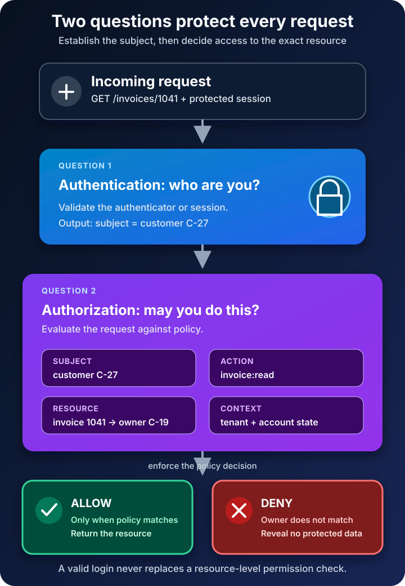

A customer signs in to an invoice portal, opens invoice `1042`, and sees exactly what they expect.

Then they change the address to `/invoices/1041`.

The page loads another customer's invoice.

Nothing was wrong with the login. The password may have been correct, multi-factor authentication may have succeeded, and the session may have been valid. The failure happened afterward: the application proved who was making the request but never checked whether that person was allowed to read that particular record.

That small gap explains the difference between two terms that are often spoken in one breath. **Authentication verifies the identity behind a request. Authorization decides what that identity is permitted to do.** Authentication asks, “Who are you?” Authorization asks, “May you do this, to this resource, under these conditions?”

The distinction is simple. Building a system that preserves it on every request is where the real security work begins.



## Authentication establishes who is making the request

In a digital service, authentication is the process of gaining confidence that a claimant controls one or more authenticators bound to an account. A password, passkey, security key, or one-time code can participate in that proof.

The wording matters. Authentication usually proves control of an account or digital identity within a service. It does not automatically prove a person's civil or real-world identity. NIST separates **identity proofing**—establishing evidence about who a person really is—from **authentication**, which establishes that today's claimant controls authenticators associated with a previously enrolled account.

A successful authentication process gives the application a dependable subject identifier, such as an internal user ID. It may also provide attributes such as a tenant ID or group membership. The application then maintains continuity across later requests with a protected session cookie or token.

That session is evidence that authentication already occurred; it is not an eternal permission slip. Sessions expire, accounts are disabled, risk changes, and sensitive actions may require reauthentication. NIST's current [Digital Identity Guidelines](https://pages.nist.gov/800-63-4/sp800-63b/introduction/) treat authentication strength, authenticator management, and session management as related but distinct concerns.

Multi-factor authentication makes account takeover harder, but it does not decide whether the account may delete a project, approve a refund, or read another user's invoice. Stronger proof of the wrong person's privileges still leaves the privileges wrong.

## Authorization decides whether this action is allowed

Authorization evaluates a request against policy. The decision usually depends on four pieces of information:

- **Subject:** the user, service, device, or workload making the request
- **Action:** read, create, update, delete, approve, export, or another operation
- **Resource:** the exact invoice, file, API route, project, or record being targeted
- **Context:** ownership, tenant, time, network, device state, transaction value, or other relevant conditions

NIST defines access control as the decision to permit or deny a subject access to system objects. Its [guide to attribute-based access control](https://csrc.nist.gov/pubs/sp/800/162/upd2/final) describes authorization as evaluating attributes of the subject, object, requested operation, and sometimes the environment against policy.

Return to the invoice portal. Authentication can establish that the subject is customer `C-27`. Authorization must still compare `C-27` with the owner of invoice `1041`. If the identifiers do not match and no explicit support or administrative policy applies, the answer is deny.

This check belongs on the trusted server side. Hiding a button in the browser may improve the interface, but a user can still alter a URL or send an API request directly. The service that owns the resource must enforce the decision.

## Authentication and authorization compared

The two controls cooperate, but they produce different answers and fail in different ways.

| Question | Authentication | Authorization |
| --- | --- | --- |
| Core purpose | Establish which subject is behind the request | Decide whether that subject may perform the requested action |
| Typical inputs | Password, passkey, security key, certificate, one-time code | Subject, action, resource, policy, and context |
| Typical output | An authenticated subject and session | Allow or deny, sometimes with limits |
| Usually happens | At sign-in, reauthentication, or credential verification | On every protected request |
| Common failure | Account takeover, weak recovery, stolen session | Excess privilege, cross-account access, missing object check |
| Strengthened by | Phishing-resistant authenticators, MFA, secure sessions | Least privilege, deny by default, centralized policy, permission tests |

Which comes first? For a protected resource, authentication normally establishes the subject before authorization can evaluate that subject's access. But authorization is not merely “step two” during login. It must be repeated whenever a protected action is requested.

Public access is also an authorization decision. A documentation page may allow an anonymous subject to read it while denying edits. The lack of a signed-in user does not mean the system lacks policy.

## One request should produce one explicit decision

Imagine an API endpoint that returns a project:

```text
GET /projects/731
```

A safe request path can be expressed as conceptual pseudocode:

```text
subject = authenticate(request.session)
project = projects.find("731")

decision = authorize(
  subject = subject,
  action = "project:read",
  resource = project,
  context = request.context
)

if decision is not ALLOW:
  deny request

return project
```

The important line is not the syntax. It is that authorization receives the actual resource, not only a route name or a broad claim such as `role = member`.

A member may be allowed to read projects in their own organization but not every project in the database. A support agent may need temporary read access but no export permission. A finance approver may approve ordinary purchases while high-value transfers require a second approver. Authorization becomes useful when it expresses the boundary the business actually needs.

[OWASP's Authorization Cheat Sheet](https://cheatsheetseries.owasp.org/cheatsheets/Authorization_Cheat_Sheet.html) recommends least privilege, deny by default, and permission validation on every request. These are not separate slogans. Together they form a reliable default: grant only justified access, treat unmatched cases as denied, and do not trust an earlier screen or request to have made today's decision.

## Roles are useful, but they are not the whole policy

Most applications begin with role-based access control, or RBAC. Users receive roles such as `viewer`, `editor`, or `administrator`, and roles collect permissions. RBAC is understandable and works well when job functions are stable.

It becomes awkward when access depends on details beyond a role. Three common models help describe the choices:

- **RBAC** bases decisions mainly on roles. An editor can update articles.
- **ABAC** evaluates attributes. An employee can read a document when their department matches the document's department and the device meets policy.
- **ReBAC** evaluates relationships. A user can edit a folder because they own it or because an owner shared it with them.

Real systems often combine them. A request might require the `support-agent` role, a relationship to the customer's case, and a device that satisfies a security condition.

Do not force every rule into a global administrator flag. Broad roles are easy to add and painful to contain. Model actions precisely, keep tenant or ownership boundaries explicit, and review access as responsibilities change. That is how the [principle of least privilege](/posts/audit-github-actions-token-permissions/) becomes executable policy rather than a poster on the wall.

## OAuth does not make the words interchangeable

Protocol names create another source of confusion.

OAuth 2.0 is an authorization framework. [RFC 6749](https://www.rfc-editor.org/rfc/rfc6749) defines a way for a client to obtain limited access to an HTTP service, either on behalf of a resource owner or on its own behalf. An access token can represent delegated authority, but the resource server still has to validate the token and enforce whether its scope and other claims are sufficient for the requested resource.

OAuth alone is not a general-purpose login protocol. [OpenID Connect](https://openid.net/specs/openid-connect-core-1_0.html) adds an identity layer on top of OAuth 2.0 so a client can verify an end user's identity based on authentication performed by an authorization server.

Even then, receiving a valid ID token or access token does not answer every application-level permission question. A token may identify the subject and carry useful claims, while the application still needs to check ownership, tenancy, current account state, and the requested operation. Tokens transport evidence and authority; they do not eliminate policy.

## The mistakes that survive a successful login

The most dangerous authorization bugs often look harmless in a normal user journey.

**Checking only the interface.** The application hides the Delete button but accepts a crafted `DELETE` request. Client-side controls should reflect policy, never enforce it alone.

**Checking the role but not the object.** The route permits any `customer` role to read invoices without verifying which customer owns the requested invoice. This is the original `/invoices/1041` failure.

**Making the decision once.** Permissions are copied into a long-lived session and never reconsidered after the account is disabled or the user's role changes. Cache policy data only with a deliberate invalidation and expiry strategy.

**Allowing unmatched requests.** A new endpoint has no explicit rule and quietly becomes accessible. Deny by default turns missing policy into a safe failure.

**Scattering checks throughout business code.** Small differences accumulate until one handler forgets a condition. Central policy and enforcement points make rules easier to review, test, and observe, even when resource-specific facts still come from domain code.

**Testing only allowed paths.** Every important rule needs negative tests: another tenant, another owner, a downgraded role, a disabled account, a direct API call, and an identifier the user can guess. Authorization tests should prove that forbidden paths stay forbidden.

## Design the boundary before choosing the library

Start by naming the protected resources and actions. “Manage billing” is vague; `invoice:read`, `invoice:refund`, and `payment-method:update` expose different risks.

Then identify who should be able to perform each action and under which conditions. Record ownership and tenant boundaries explicitly. Decide which cases require recent or stronger authentication. Put enforcement close to the resource, default to deny, and log denied high-risk operations without leaking sensitive details.

Finally, test the matrix from both directions. Confirm that intended work succeeds, then deliberately cross every boundary. Change record IDs, call endpoints without the user interface, remove claims, switch tenants, expire sessions, and revoke roles. Authorization is correct only when both the allow and deny behavior match the policy.

Authentication and authorization are not competing security features. They are consecutive questions with different evidence. Authentication gives a request a trustworthy subject. Authorization constrains that subject to justified actions. A secure login without reliable authorization simply gives an attacker—or an ordinary curious user—a well-identified path to data they should never reach.

## Continue learning

- [MFA vs Passwordless vs Passkeys](/posts/mfa-vs-passwordless-vs-passkeys/)
- [Zero Trust Explained With Real-World Examples](/posts/zero-trust-explained-real-world-examples/)
- [The CIA Triad Explained](/posts/cia-triad-explained/)
- [Microsoft Entra ID: Users, Groups, Apps, Roles, and Conditional Access](/posts/microsoft-entra-id-explained-users-groups-apps-roles-conditional-access/)

## Sources

- [NIST SP 800-63-4: Digital Identity Guidelines](https://pages.nist.gov/800-63-4/)
- [NIST SP 800-63B-4: Authentication and Authenticator Management](https://pages.nist.gov/800-63-4/sp800-63b/introduction/)
- [NIST SP 800-162: Guide to Attribute Based Access Control](https://csrc.nist.gov/pubs/sp/800/162/upd2/final)
- [OWASP Authentication Cheat Sheet](https://cheatsheetseries.owasp.org/cheatsheets/Authentication_Cheat_Sheet.html)
- [OWASP Authorization Cheat Sheet](https://cheatsheetseries.owasp.org/cheatsheets/Authorization_Cheat_Sheet.html)
- [IETF RFC 6749: The OAuth 2.0 Authorization Framework](https://www.rfc-editor.org/rfc/rfc6749)
- [OpenID Connect Core 1.0](https://openid.net/specs/openid-connect-core-1_0.html)
