




There is a point in learning infrastructure where following isolated tutorials stops being enough.

You can know how to install Debian. You can know what a VLAN is. You can know the syntax of an nftables rule or how to add a host to Zabbix. But none of those things, by themselves, teach you what happens when several layers are connected and one small mistake in the lower layer makes an application at the top behave strangely.

That was the reason I built **InfraLab**.

I wanted a lab that felt less like a collection of exercises and more like a small environment I would actually have to operate: a hypervisor, a management network, an internal trunk, two isolated VLANs, a Linux router, application servers, a separate monitoring server, explicit firewall policy, monitoring, failure simulation, backups, scheduled health checks, and a final reboot test to prove that the whole thing survived without relying on commands I had typed manually hours earlier.

The final result looks clean. Getting there was not.

Along the way I attached a container to the wrong bridge, cloned an IP address, mistook a clock problem for a repository problem, configured a web service that was installed but not actually listening, tested HTTPS against an HTTP listener, used the wrong next hop on Windows, left a daemon running with stale configuration, and wrote one nftables comparison that quietly turned my intended firewall policy upside down.

Those mistakes are the most useful part of the project, so I am keeping them in this write-up.


**Source code and sanitized configuration:** [https://github.com/erentechlabs/infralab-homelab](https://github.com/erentechlabs/infralab-homelab)

The repository contains example configuration only. Passwords, private keys, tokens, cookies, and other secrets are intentionally excluded.


---

## What I ended up building

Before getting into the build, here is the stack at a glance.

| Layer | Technology / design |
|---|---|
| Physical host | Windows workstation |
| Outer hypervisor | VMware Workstation |
| Nested hypervisor | Proxmox VE 9.2 (`pve01`) |
| Router | Debian 13 VM (`lab-router`) |
| Segmentation | 802.1Q VLAN 20 / VLAN 30 |
| Firewall / NAT | nftables |
| Application nodes | Debian 13 LXC (`app01`, `app02`) |
| Monitoring | Zabbix 7.4 + Agent 2 |
| Database | PostgreSQL 17 |
| Web frontend | Nginx + PHP-FPM |
| Operations | Bash + systemd services/timers |


I wanted one environment where virtualization, Layer 2 segmentation, Layer 3 routing, firewall policy, monitoring, automation, and troubleshooting all depended on each other. The point was not to make the biggest homelab possible; it was to make a small one that behaved like a real system.



The lab runs in two virtualization layers. My Windows workstation runs VMware Workstation, and VMware hosts a Proxmox VE node. Proxmox then hosts the actual lab router and containers.


flowchart TB
    PC["Windows workstation"]
    VMW["VMware Workstation"]
    PVE["Proxmox VE 9.2<br/>pve01 · 192.168.74.128/24"]
    NAT["VMware NAT<br/>192.168.74.0/24<br/>GW 192.168.74.2"]
    R["VM 100 · lab-router<br/>Debian 13<br/>ens18: 192.168.74.130/24"]
    TRUNK["ens19 · 802.1Q trunk"]
    V20["VLAN 20 · Servers<br/>10.20.0.0/24"]
    V30["VLAN 30 · Monitoring<br/>10.30.0.0/24"]
    A1["CT 101 · app01<br/>10.20.0.11"]
    A2["CT 102 · app02<br/>10.20.0.12"]
    Z["CT 103 · zabbix01<br/>10.30.0.10<br/>Zabbix + PostgreSQL + Nginx"]

    PC --> VMW --> PVE
    NAT --- PVE
    NAT --- R
    PVE --> R
    R --> TRUNK
    TRUNK --> V20
    TRUNK --> V30
    V20 --> A1
    V20 --> A2
    V30 --> Z


The important addresses are intentionally simple:

| Component | Role | Address |
|---|---|---:|
| `pve01` | Proxmox management | `192.168.74.128/24` |
| VMware NAT gateway | Outer gateway | `192.168.74.2` |
| `lab-router` / `ens18` | WAN / management-side interface | `192.168.74.130/24` |
| `lab-router` / `ens19.20` | VLAN 20 gateway | `10.20.0.1/24` |
| `lab-router` / `ens19.30` | VLAN 30 gateway | `10.30.0.1/24` |
| `app01` | Application host | `10.20.0.11/24` |
| `app02` | Application host | `10.20.0.12/24` |
| `zabbix01` | Monitoring host | `10.30.0.10/24` |


*The environment eventually became small enough to understand at a glance, but large enough to expose real networking and operations mistakes.*

### Virtualization hierarchy

The topology above mixes virtualization and routing. Seen purely as a hierarchy, the environment is simpler:


flowchart LR
    H["Windows host"] --> W["VMware Workstation"]
    W --> P["Proxmox VE · pve01"]
    P --> R["VM 100<br/>lab-router"]
    P --> A1["CT 101<br/>app01"]
    P --> A2["CT 102<br/>app02"]
    P --> Z["CT 103<br/>zabbix01"]



---

## How this write-up is organized

Rather than hiding the mistakes inside a clean tutorial, I kept the build in the order it actually became understandable:

1. build the nested virtualization foundation;
2. separate management and internal switching;
3. turn Debian into the router;
4. deploy the application and monitoring containers;
5. make monitoring fail and recover on purpose;
6. harden forwarding with nftables;
7. automate routine checks and backups;
8. reboot the router and prove the state is persistent.

That structure matters because most of the interesting problems crossed layers.

## 1. Starting one layer earlier: VMware and nested Proxmox

My first draft of this article started with VLANs. That was technically part of the lab, but it skipped the foundation that made everything else possible.

The actual first step was building a **Proxmox host inside VMware Workstation**.

Nested virtualization adds a little complexity, but it also made the project practical. I could use one physical machine while still getting a proper Proxmox management plane, virtual bridges, a full VM for routing, and multiple LXC containers behind it.

### Sizing the outer Proxmox VM

I gave the Proxmox VM:

```text
Memory:       8 GiB
CPU:          1 processor × 4 cores = 4 vCPU
Disk:         100 GiB SCSI
Networking:   VMware NAT
Nested virt:  VT-x/EPT or AMD-V/RVI exposed to the guest
```



Eight gigabytes was not a magic requirement. It was simply enough for this lab while leaving room on the Windows host.

The CPU setting mattered more than it first appeared. I enabled VMware's option to expose hardware virtualization to the guest. Without that, Proxmox could still boot, but KVM-backed nested guests would not behave the way I needed.

The virtual disk was set to 100 GiB. VMware stored it as split files and did not pre-allocate the full capacity.

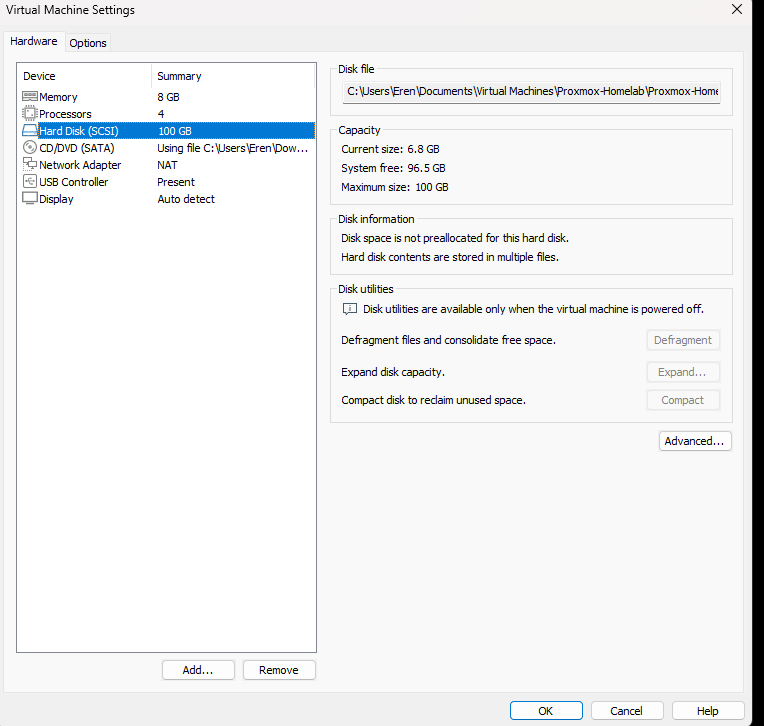

I kept the VMware NIC in **NAT mode**. That gave me a convenient outer network for Proxmox management and for the WAN side of my Debian router:

```text
Outer network:       192.168.74.0/24
VMware NAT gateway:  192.168.74.2
```

That distinction—outer network versus internal lab networks—became important later when I accidentally treated the Proxmox management IP as if it were the router for the VLANs.

### Installing Proxmox VE

I downloaded the Proxmox VE 9.2 installer ISO and attached it to the VMware VM.


The VM booted into the installer as expected.


I configured the administrative credentials and then reached the management-network page. This screen is worth keeping because it captures the outer network clearly:

```text
IP address: 192.168.74.128/24
Gateway:    192.168.74.2
DNS:        192.168.74.2
```

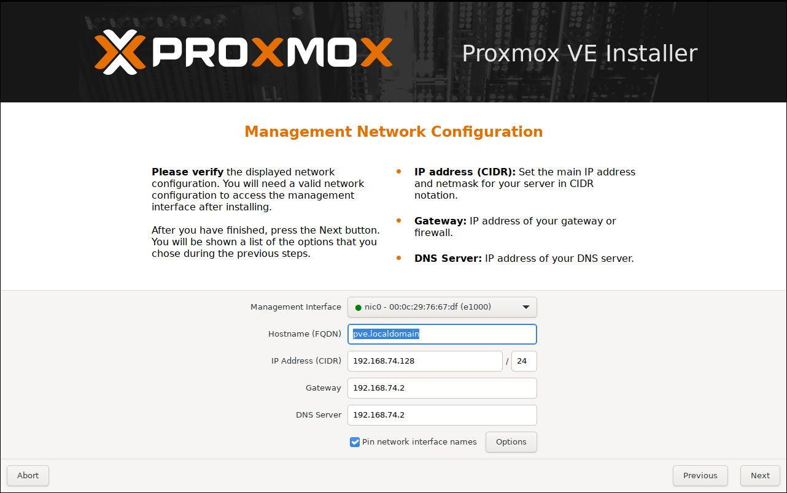

The installer screenshot still shows the temporary/default hostname field. The installed node I used throughout the lab is `pve01`.

After the install completed, the console gave me the URL I would use from the Windows host:

```text
https://192.168.74.128:8006/
```

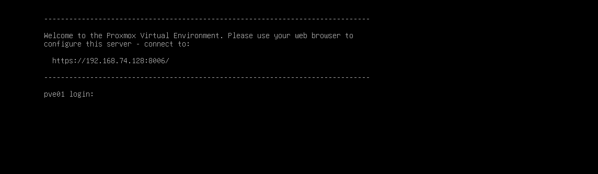

The first web login was the first moment the nested setup started to feel like a real hypervisor rather than “a VM that happens to contain Proxmox.”


### The expected subscription warning—and why I still changed the repositories

A fresh non-subscribed Proxmox installation displays the familiar “No valid subscription” message.


The dialog itself was not an error. The more important part was making sure the configured APT sources matched a non-production homelab.

I disabled the enterprise-only sources and enabled the `pve-no-subscription` path together with the normal Debian repositories.

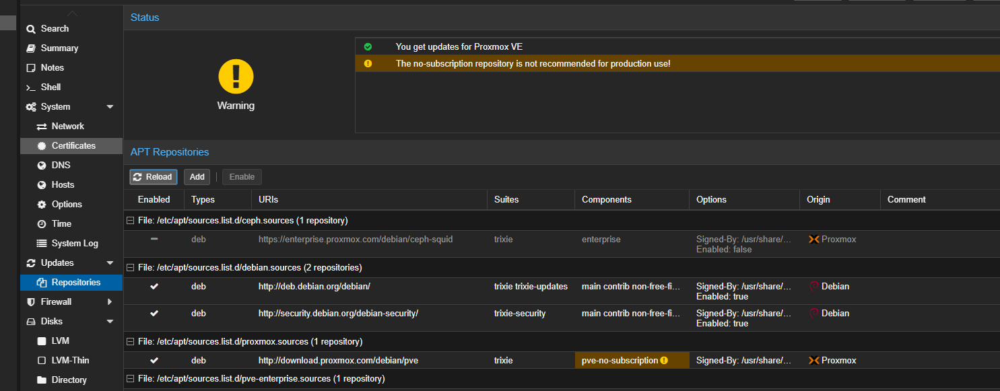

The UI correctly warns that the no-subscription repository is not recommended for production. That is exactly the point: this is a lab, not a production cluster.

After refreshing package metadata, I verified that package management worked normally.


### Verifying nested virtualization instead of assuming it worked

Checking a box in VMware was not enough for me. I wanted proof inside the Proxmox guest.

I verified that KVM was available and that the relevant virtualization modules were loaded.

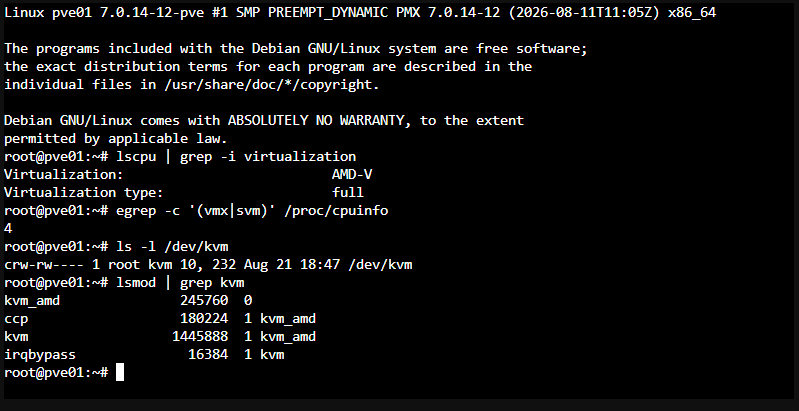

That gave me a useful rule for the rest of the project: **do not treat configuration as proof; test the resulting state.**

I kept coming back to that idea later with VLANs, Zabbix, firewalling, systemd timers, and the final reboot.

---

## 2. Designing the virtual network before creating the servers

Proxmox initially had its normal management bridge, `vmbr0`, connected to the VMware-facing NIC.


I did not want the application and monitoring containers sitting directly on that same management network. So I added a second bridge, `vmbr1`.

`vmbr1` is different from `vmbr0` in two important ways:

1. it has no physical/VMware uplink;
2. it is VLAN-aware.

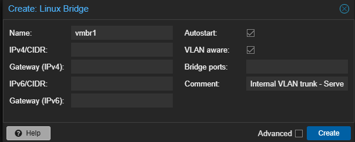

That left me with a clean division of responsibilities:

```text
vmbr0
└── Outer / management side
    ├── Proxmox management
    └── lab-router WAN interface

vmbr1
└── Internal VLAN-aware switch
    ├── lab-router trunk
    ├── app01      — VLAN 20
    ├── app02      — VLAN 20
    └── zabbix01   — VLAN 30
```

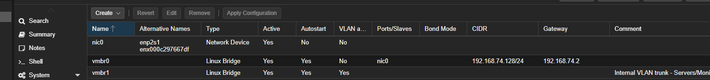

This is the point where the architecture stopped being “a few VMs on a host” and became a segmented network.

Proxmox would provide Layer 2 switching. Debian would do Layer 3 routing and firewalling.

### How packets move through the lab


flowchart LR
    WAN["VMware NAT<br/>192.168.74.0/24"] --> E18["ens18<br/>WAN side"]
    E18 --> R["lab-router<br/>routing + nftables + NAT"]
    R --> E19["ens19<br/>VLAN trunk"]
    E19 --> V20["ens19.20<br/>10.20.0.1/24"]
    E19 --> V30["ens19.30<br/>10.30.0.1/24"]
    V20 --> A1["app01<br/>10.20.0.11"]
    V20 --> A2["app02<br/>10.20.0.12"]
    V30 --> Z["zabbix01<br/>10.30.0.10"]



Proxmox owns the Layer 2 switching. `lab-router` owns Layer 3. That separation made it much easier to reason about where a failure belonged: bridge/VLAN attachment problems stayed on the Proxmox side, while routes, NAT, and firewall policy stayed inside Debian.



---

## 3. Building the router before the endpoints

I wanted the network to exist before I started putting services into it, so the first guest I built was `lab-router`.

I used Debian 13.6 netinst and uploaded the ISO to Proxmox local storage.


### VM 100: `lab-router`

The router is intentionally small:

```text
VM ID:       100
Name:        lab-router
CPU:         1 vCPU
Memory:      1024 MiB
Disk:        8 GiB
Disk bus:    SCSI / VirtIO SCSI single
QEMU Agent:  enabled
NIC 1:       VirtIO on vmbr0
NIC 2:       VirtIO on vmbr1
```


The creation summary gives the clearest single record of the VM:

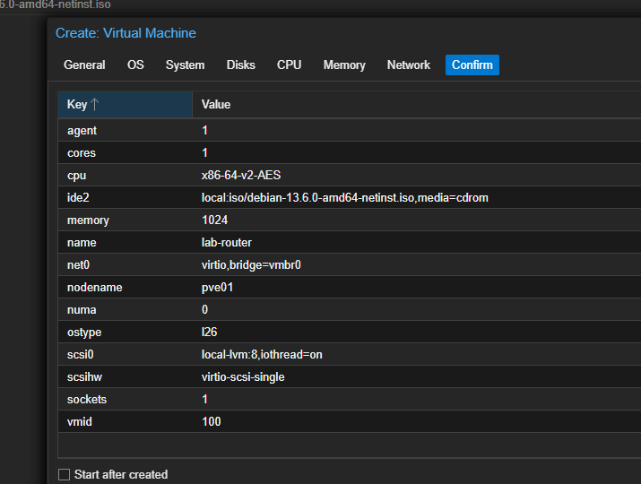

The first NIC is the outer/WAN side on `vmbr0`. I added a second NIC on `vmbr1` for the internal trunk.

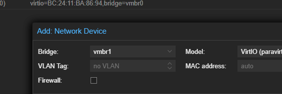

One detail matters here: **I did not assign a VLAN tag to the router's `vmbr1` NIC in Proxmox.**

The router needs to see more than one VLAN. It receives the trunk and creates the tagged subinterfaces inside Debian.

### A deliberately minimal Debian installation

I installed Debian without a desktop environment. For a router VM, a GUI would only add packages and memory use I did not need.


I selected an English locale, used the first network interface during installation, set the hostname to `lab-router`, used guided partitioning, and installed only the SSH server and standard system utilities.


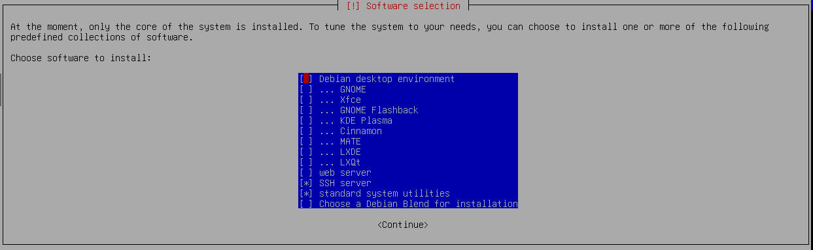

After GRUB was installed and the system rebooted, the base router was ready.


### First boot: an ordinary Debian host, not yet a router

On the first login, `ens18` had received `192.168.74.130/24` via DHCP from the VMware NAT side and the default route pointed to `192.168.74.2`.

`ens19` existed, but it did not yet have the VLAN interfaces that would make the internal network useful.

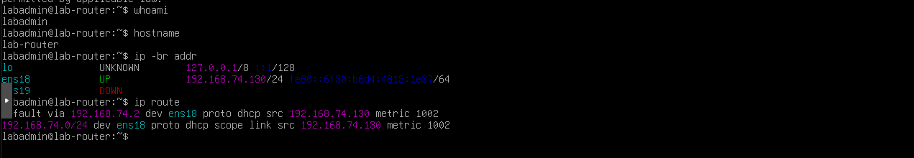

The intended roles were:

```text
ens18 → vmbr0 → VMware NAT / outer network
ens19 → vmbr1 → internal 802.1Q trunk
```

### Turning `ens19` into a router-on-a-stick trunk

I configured two subinterfaces on `ens19`:

```text
ens19.20 → 10.20.0.1/24   # Servers
ens19.30 → 10.30.0.1/24   # Monitoring
```

The relevant `/etc/network/interfaces` configuration became:

```text
auto lo
iface lo inet loopback

allow-hotplug ens18
iface ens18 inet dhcp

auto ens19
iface ens19 inet manual

auto ens19.20
iface ens19.20 inet static
    address 10.20.0.1/24
    vlan-raw-device ens19

auto ens19.30
iface ens19.30 inet static
    address 10.30.0.1/24
    vlan-raw-device ens19
```

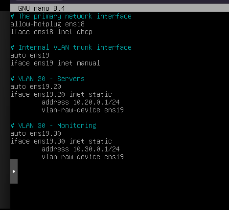

After applying the network configuration, both VLAN interfaces appeared with the expected addresses.

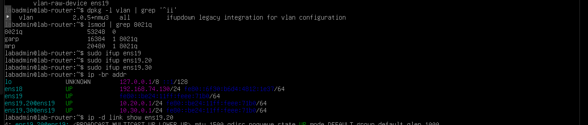

### Enabling IPv4 forwarding

Having two subnets on the same Debian machine still does not automatically make Debian forward packets between them.

I persisted:

```text
net.ipv4.ip_forward=1
```

in:

```text
/etc/sysctl.d/99-infralab-router.conf
```

and verified the resulting routes.

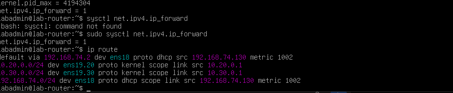

At this point the Layer 3 design existed:

```text
                     ens18
                       │
              192.168.74.130/24
                       │
                 lab-router
                  /         \
           ens19.20         ens19.30
               │               │
          10.20.0.1        10.30.0.1
               │               │
          VLAN 20          VLAN 30
```

### Initial NAT

The two internal networks also needed internet access through `ens18`, so I added source NAT with nftables.

The NAT part of the final configuration is:

```nft
table ip nat {
    chain postrouting {
        type nat hook postrouting priority srcnat; policy accept;

        oifname "ens18" ip saddr 10.20.0.0/24 ip daddr != 192.168.74.0/24 masquerade
        oifname "ens18" ip saddr 10.30.0.0/24 ip daddr != 192.168.74.0/24 masquerade
    }
}
```

The `!= 192.168.74.0/24` is deliberate **here**. Internet-bound traffic should be masqueraded; management-network traffic should not be hidden behind the router's outer address.

That detail is worth remembering because later I used a very similar-looking `!=` expression in the **filter** chain, where it meant something completely different and broke DNS.

---

## 4. Adding actual workloads: app01, app02, and zabbix01

With routing in place, I could finally create the endpoints.

### `app01`: the known-good baseline

`app01` is an unprivileged Debian 13 LXC container on VLAN 20.

```text
CT ID:       101
Hostname:    app01
CPU:         1 core
Memory:      512 MiB
Swap:        512 MiB
Root disk:   4 GiB
Bridge:      vmbr1
VLAN tag:    20
IPv4:        10.20.0.11/24
Gateway:     10.20.0.1
DNS:         1.1.1.1
```

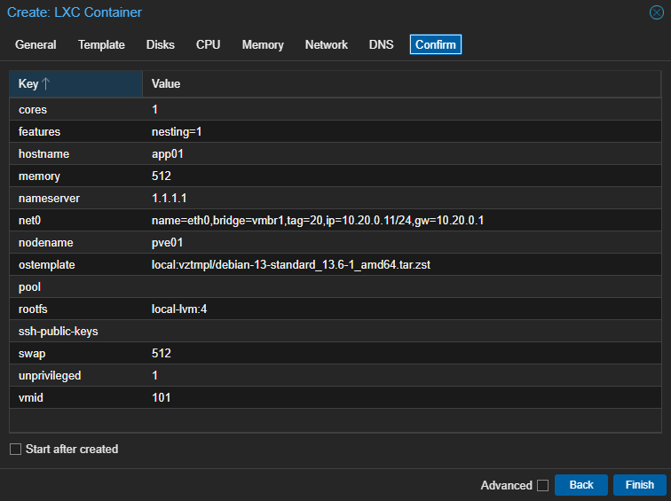

On an endpoint like this, Proxmox acts like an access port: the guest itself does not need to create `eth0.20`. The Proxmox NIC is attached to `vmbr1` with VLAN tag 20.


Before installing monitoring, I checked the basics:

```bash
ip -br addr
ip route
ping -c 3 10.20.0.1
ping -c 3 deb.debian.org
```

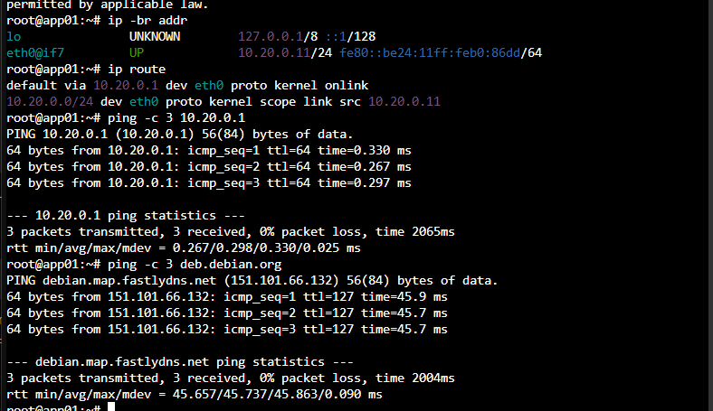

This mattered later. Once I knew VLAN 20, routing, internet access, and DNS worked without Zabbix, I had a baseline to compare against when monitoring issues appeared.

### Cloning `app01` into `app02`—and cloning its IP by accident

For the second application host, I cloned CT 101 rather than rebuilding it.

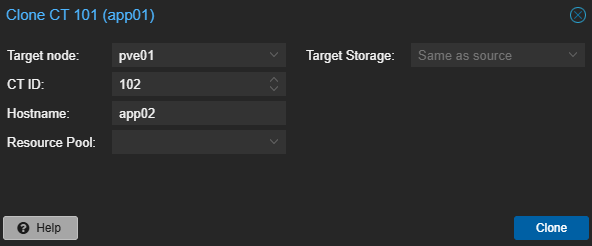

That saved time and immediately demonstrated one of the risks of cloning infrastructure: **you clone identity as well as software.**

The new container initially inherited `10.20.0.11/24`, the address already used by `app01`.

I corrected `app02` to:

```text
CT ID:       102
Hostname:    app02
Bridge:      vmbr1
VLAN tag:    20
IPv4:        10.20.0.12/24
Gateway:     10.20.0.1
```

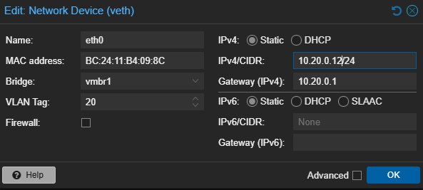

Then I tested connectivity again.

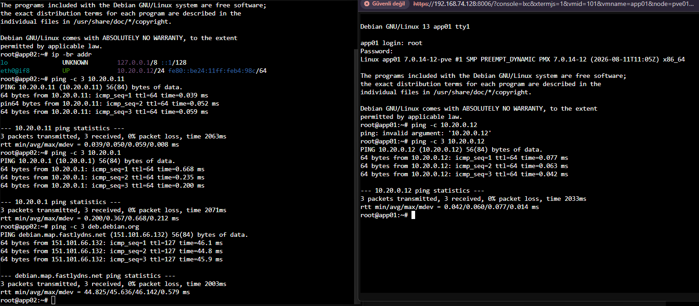

There is even a small malformed `ping` command in the captured console before the corrected test. I kept it. A build diary is more useful when it looks like an actual build rather than a perfect sequence reconstructed afterward.

### `zabbix01`: the mistake that proved the bridge design mattered

The monitoring container needed more resources because it would run PostgreSQL, Zabbix server, Nginx, and PHP-FPM:

```text
CT ID:       103
Hostname:    zabbix01
CPU:         2 cores
Memory:      2048 MiB
Swap:        512 MiB
Root disk:   8 GiB
IPv4:        10.30.0.10/24
Gateway:     10.30.0.1
VLAN tag:    30
```

The **first** time I created it, I made an easy-to-miss mistake: I put the NIC on `vmbr0` while also setting VLAN tag 30.


The network page makes the error obvious in hindsight:


The symptom was equally clear:

```text
Destination Host Unreachable
```

Even `10.30.0.1`, the directly connected VLAN gateway, was unreachable.

That was a useful clue. If a host cannot reach its **own subnet gateway**, there is no reason to start debugging DNS, PostgreSQL, Nginx, or the internet. The failure is lower in the stack.

I moved the container NIC to the VLAN-aware internal bridge, `vmbr1`, kept VLAN tag 30, and retested:

```bash
ping -c 3 10.30.0.1
ping -c 3 1.1.1.1
ping -c 3 deb.debian.org
ping -c 3 10.20.0.11
```


All four tests passed.

That single mistake made the purpose of `vmbr0` and `vmbr1` much clearer than any diagram could have.

---

## 5. Turning VLAN 30 into a monitoring network

With `zabbix01` correctly connected, I moved on to the monitoring stack.

The final stack is:

```text
zabbix01
├── PostgreSQL 17
├── Zabbix Server 7.4
├── Zabbix frontend
├── Nginx
├── PHP-FPM
└── Zabbix Agent 2
```

The application hosts run Zabbix Agent 2 as well.

### Monitoring flow


flowchart LR
    PC["Management workstation"] -->|"HTTP :8080"| UI["Nginx + Zabbix frontend<br/>zabbix01"]
    UI --> DB["PostgreSQL 17"]
    ZS["Zabbix Server 7.4<br/>zabbix01"] -->|"TCP :10050"| A1["app01 · Agent 2"]
    ZS -->|"TCP :10050"| A2["app02 · Agent 2"]
    A1 -->|"active checks · :10051"| ZS
    A2 -->|"active checks · :10051"| ZS



### PostgreSQL first

I installed PostgreSQL 17 and checked the service before layering Zabbix on top of it.

```bash
systemctl enable --now postgresql
systemctl is-active postgresql
psql --version
```

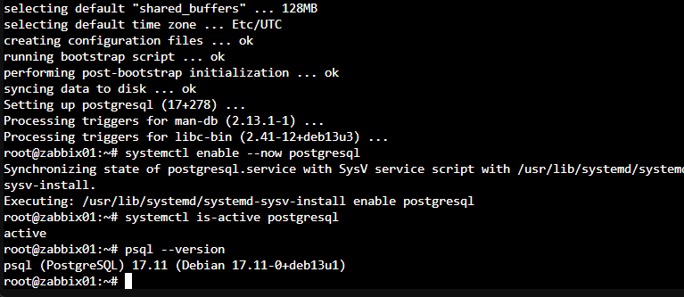

After creating the `zabbix` role and database, I imported the Zabbix schema. A table-count query returned **207 tables**, giving me a concrete check that the schema import had actually populated the database.

That is a pattern I try to keep in infrastructure work: after a command that *should* create something, query the resulting state instead of trusting the absence of an error.

### The repository error that was really a clock error

At one point APT started rejecting repository metadata with messages similar to:

```text
Not live until ...
```

My first instinct was to think about repositories or signatures. The real problem was time.

Chrony was active and could see NTP sources, but the system clock was roughly **5,491 seconds behind**.

The fix was simply:

```bash
chronyc makestep
```

After that, Chrony reported a near-zero offset and normal leap status, and package operations worked again.

This is one of those failures that changes how you read errors. A repository-validation problem can actually be a time-synchronization problem. TLS, package metadata, logs, authentication systems, and monitoring all depend on clocks being sane.

### Installing the Zabbix frontend

I added the Zabbix 7.4 repository and installed the server, frontend, Agent 2, and web dependencies.

The browser reached the Zabbix installer successfully:


The prerequisite page exposed another small dependency issue: the web stack needed the correct PHP PostgreSQL module and an available `en_US` locale.

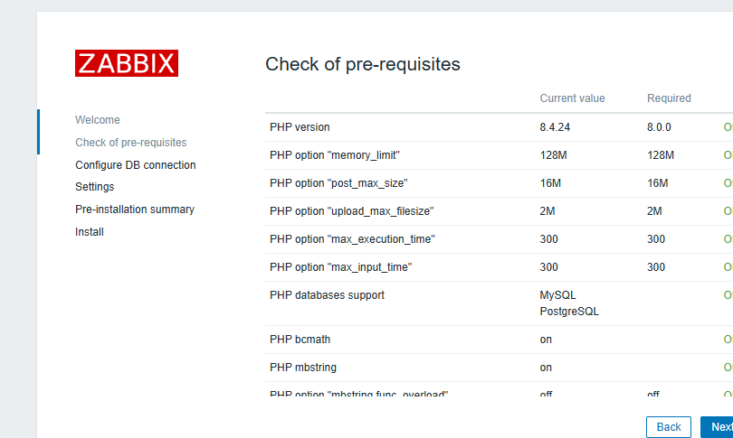

I installed `php8.4-pgsql`, generated `en_US.UTF-8`, and restarted PHP-FPM and Nginx.

The locale fix was effectively:

```bash
apt install locales
localedef -i en_US -f UTF-8 en_US.UTF-8
update-locale LANG=en_US.UTF-8
systemctl restart php8.4-fpm
systemctl restart nginx
```

After that, the prerequisite check passed.

### Nginx was installed, but nothing was listening on 8080

Another useful distinction appeared here: a package can be installed and its service can even be running, while the endpoint you expect still does not exist.

These checks showed that TCP/8080 was not listening:

```bash
ss -ltnp | grep 8080
curl -I http://127.0.0.1:8080/
```

The packaged Zabbix Nginx server block still had the relevant `listen`/`server_name` configuration commented.

After enabling the listener, I checked the config and restarted the services:

```bash
nginx -t
systemctl restart php8.4-fpm
systemctl restart nginx
ss -ltnp | grep 8080
```

Now Nginx was listening on `0.0.0.0:8080`.

Then I immediately created a second problem for myself by testing:

```bash
curl -I https://127.0.0.1:8080/
```

and getting an OpenSSL `wrong version number` style error.

Nothing was wrong with Nginx. Port 8080 was plain HTTP, not HTTPS.

The correct URL was:

```text
http://10.30.0.10:8080
```

That was a good reminder that “the port is open” and “I am speaking the right protocol to that port” are separate questions.

### Reaching VLAN 30 from Windows

The Windows workstation sits on the outer `192.168.74.0/24` network. It therefore needed a route to `10.30.0.0/24`.

My first route used the wrong next hop:

```text
route -p add 10.30.0.0 mask 255.255.255.0 192.168.74.128
```

`192.168.74.128` is Proxmox management. It is **not** the router for the internal VLANs.

The correct next hop is `lab-router`:

```text
route -p add 10.30.0.0 mask 255.255.255.0 192.168.74.130
```

Once that route existed, the browser on Windows could reach the Zabbix frontend through the Debian router.

That mistake was small, but it captured the whole layered architecture in one line: VMware hosts Proxmox, but Proxmox itself is not the Layer 3 gateway I built for the lab.

### Walking through the Zabbix installer

The database connection was configured for PostgreSQL on localhost:

```text
Database type: PostgreSQL
Host:          127.0.0.1
Port:          5432
Database:      zabbix
User:          zabbix
Password:      [not published]
```

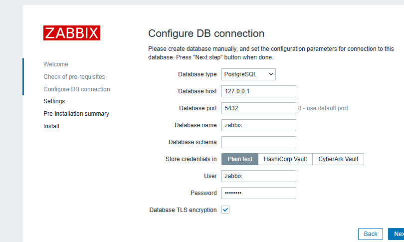

For the frontend I used the server name **InfraLab Zabbix** and the Europe/Istanbul timezone.


I reviewed the pre-installation summary and finished the setup.


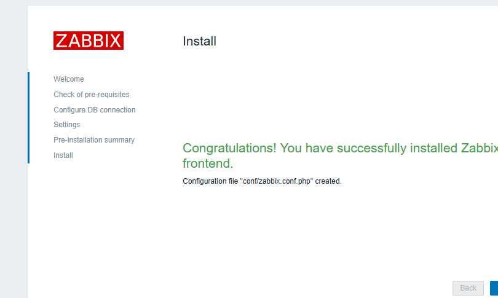

The login page was now available from the management workstation.


### A successful frontend did not mean the Zabbix server was healthy

This was one of the more important application-layer failures in the lab.

The frontend loaded correctly, but the dashboard reported:

```text
Zabbix server is running: No
```


The server log explained why:

```text
connection to database 'zabbix' failed
fe_sendauth: no password supplied
database is down: reconnecting in 10 seconds
```

The database and schema were fine. The frontend had its own DB configuration. The **Zabbix server daemon** still needed its password in `/etc/zabbix/zabbix_server.conf`.

The relevant sanitized configuration is:

```ini
DBHost=127.0.0.1
DBName=zabbix
DBUser=zabbix
DBPassword=<redacted>
DBPort=5432
```



After restarting `zabbix-server`, the dashboard changed to:

```text
Zabbix server is running: Yes
```


This was a good example of a layered service appearing “half healthy.” The web UI could talk to the database while the actual monitoring daemon could not.


A healthy frontend is not evidence that the backend daemon is healthy. In layered systems, validate each long-running component independently: listener, process, database connection, and application-level status.



### Agent 2 on app01 and app02

I installed Zabbix Agent 2 on both application containers.

For `app01`:

```ini
Server=10.30.0.10
ServerActive=10.30.0.10
Hostname=app01
```

For `app02`, the same server values are used with:

```ini
Hostname=app02
```

Agent 2 listens on TCP/10050. Zabbix server uses TCP/10051 for the server-side path.

#### When the file was correct but the process was not

At first, Zabbix showed:

```text
Connection reset by peer
```

The Agent 2 log was much more precise:

```text
connection from "10.30.0.10" rejected, allowed hosts: "127.0.0.1"
```

The configuration file had already been edited, but the process was still running with the old allowlist.

The fix was not another configuration edit. It was:

```bash
systemctl restart zabbix-agent2
```

From `zabbix01`, I then tested the agent directly:

```bash
zabbix_get -s 10.20.0.11 -p 10050 -k agent.ping
```

and got:

```text
1
```

I had first tried `zabbix_get` from the wrong source host, which failed because `Server=` is an allowlist. Repeating the test from `zabbix01` mattered because the **source address is part of the test**.

After adding the hosts to the `Linux servers` group and linking the `Linux by Zabbix agent` template, data began to populate.

There were also two small Zabbix UI gotchas during this stage:

- I briefly treated **Template group** as though it were the template-name search field.
- In Latest Data, I typed `app01` into the **Host group** selector instead of the host selector.

Neither was a networking failure, but both were part of the real build history and are worth keeping separate from service or connectivity problems.


### Deliberately breaking app02

A green `ZBX` icon proves that data is flowing. It does not prove that alerting works.

So I stopped the agent on `app02`:

```bash
systemctl stop zabbix-agent2
```

The interface availability turned red immediately. The trigger itself waited for its configured condition and then raised:

```text
Linux: Zabbix agent is not available (for 3m)
```


I restarted the service afterward and watched the host recover.

That was the moment the monitoring setup became more than a dashboard screenshot. I had proven the failure path and the recovery path.

---

## 6. Hardening the router: default-drop without losing the services I needed

Up to this point, the router had been built mainly to make connectivity work. The next step was to make the allowed paths explicit.


flowchart LR
    V20["VLAN 20<br/>app01 / app02"]
    V30["VLAN 30<br/>zabbix01"]
    MGMT["Management<br/>192.168.74.0/24"]
    NET["Internet"]
    Z["Zabbix<br/>10.30.0.10"]

    V20 -->|"✅ internet"| NET
    V30 -->|"✅ internet"| NET
    Z -->|"✅ TCP 10050"| V20
    V20 -->|"✅ TCP 10051"| Z
    MGMT -->|"✅ TCP 8080"| Z
    V20 -. "❌ blocked" .-> MGMT
    V30 -. "❌ blocked" .-> MGMT


The final forwarding policy I wanted was:

```text
Established / related                      ALLOW
ICMP                                       ALLOW
VLAN 20 -> Zabbix server TCP/10051         ALLOW
Zabbix server -> VLAN 20 TCP/10050         ALLOW
VLAN 20 -> management network              DROP
VLAN 30 -> management network              DROP
VLAN 20 -> internet via ens18              ALLOW
VLAN 30 -> internet via ens18              ALLOW
Management -> Zabbix web TCP/8080           ALLOW
Everything else in forward chain           DROP
```

The filter section of the final `/etc/nftables.conf` is:

```nft
table inet filter {
    chain input {
        type filter hook input priority 0;
        policy accept;
    }

    chain forward {
        type filter hook forward priority 0;
        policy drop;

        ct state established,related accept
        ip protocol icmp accept

        ip saddr 10.20.0.0/24 ip daddr 10.30.0.10 tcp dport 10051 accept
        ip saddr 10.30.0.10 ip daddr 10.20.0.0/24 tcp dport 10050 accept

        ip saddr 10.20.0.0/24 ip daddr 192.168.74.0/24 drop
        ip saddr 10.30.0.0/24 ip daddr 192.168.74.0/24 drop

        ip saddr 10.20.0.0/24 oifname "ens18" accept
        ip saddr 10.30.0.0/24 oifname "ens18" accept

        ip saddr 192.168.74.0/24 ip daddr 10.30.0.10 tcp dport 8080 accept
    }

    chain output {
        type filter hook output priority 0;
        policy accept;
    }
}
```

Before applying changes, I used nftables' syntax check:

```bash
nft -c -f /etc/nftables.conf
```

Then:

```bash
nft -f /etc/nftables.conf
systemctl restart nftables
```


The firewall was syntactically valid and ICMP still worked, yet DNS failed. That combination made this the best example in the project of why packet-level evidence matters more than assumptions.


### The one-character idea that broke DNS

The most instructive networking bug in the project came from a rule that looked almost right.

I temporarily wrote something equivalent to:

```nft
ip saddr 10.20.0.0/24 ip daddr != 192.168.74.0/24 oifname "ens18" drop
```

My intention was “block access to the management network.”

What the rule actually says is:

> drop packets whose destination is **not** the management network.

That is nearly the exact opposite.

The resulting symptoms were confusing because this still worked:

```bash
ping -c 3 1.1.1.1
```

but this did not:

```bash
getent hosts deb.debian.org
```

ICMP had an explicit allow rule before the bad rule, so ping succeeded. DNS traffic did not have that escape route.


flowchart LR
    A["app01<br/>10.20.0.11"] -->|"DNS query · UDP 53"| IN["ens19.20"]
    IN --> F["nftables forward chain"]
    F -->|"bad != rule<br/>DROP"| X["✕"]
    F -. "ICMP matched earlier allow" .-> WAN["ens18 / Internet"]



I checked the resolver configuration. It looked fine. Then I stopped guessing and captured traffic on the router:

```bash
tcpdump -ni any 'port 53'
```


The capture showed DNS requests arriving from `10.20.0.11` on `ens19.20`. That proved `app01` was generating the query and sending it to the router. The failure was in forwarding.


```nft
ip saddr 10.20.0.0/24 ip daddr != 192.168.74.0/24 oifname "ens18" drop
```

Read literally, this drops traffic whose destination is **not** the management network.


I replaced the inverted comparison with the explicit rules I actually meant:

```nft
ip saddr 10.20.0.0/24 ip daddr 192.168.74.0/24 drop
ip saddr 10.30.0.0/24 ip daddr 192.168.74.0/24 drop

ip saddr 10.20.0.0/24 oifname "ens18" accept
ip saddr 10.30.0.0/24 oifname "ens18" accept
```

Then:

```bash
getent hosts deb.debian.org
ping -4 -c 3 deb.debian.org
```

worked again.

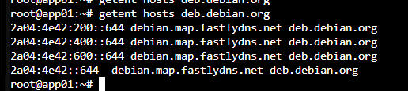

The lesson was not simply “be careful with `!=`.” It was more general: when a firewall change breaks an application, find the boundary where packets stop. `tcpdump` was much more useful than another round of speculative edits.

### Proving isolation with a test that should fail

Positive tests are easy to remember: can the host reach the internet? Can Zabbix poll the agent?

A security rule also needs a **negative test**.

From `app01`, I tried to reach the Proxmox management UI:

```bash
curl -k --connect-timeout 5 --max-time 7 \
  https://192.168.74.128:8006 -o /dev/null

echo $?
```

The result was:

```text
curl: (28) Connection timed out after 7003 milliseconds
28
```

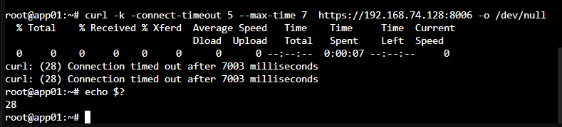


A timeout was the expected result. The application VLAN retained internet and monitoring access but could not initiate a connection to the Proxmox management plane.


In this case, a timeout was success.

`app01` could still use DNS, reach the internet, and participate in Zabbix monitoring. It could not initiate a connection to the management plane.

---

## 7. Adding a small operations layer with systemd

I did not want the project to end at “networking works and Zabbix is green.” A small infrastructure environment also needs repeatable routine operations.

I created:

```text
/opt/infralab/scripts/
├── health-check.sh
├── config-backup.sh
└── update-check.sh

/var/log/infralab/
├── health-check.log
└── update-check.log

/var/backups/infralab/
└── <timestamped config archives>
```

and paired the scripts with systemd oneshot services and timers.

### Daily health check — 03:00

The health script records the basics I would want when quickly reviewing the router:



```bash
#!/bin/bash

LOG="/var/log/infralab/health-check.log"

{
    echo "========================================"
    echo "InfraLab Health Check - $(date)"
    echo "========================================"

    echo
    echo "[HOST]"
    hostname

    echo
    echo "[UPTIME]"
    uptime

    echo
    echo "[DISK]"
    df -h /

    echo
    echo "[MEMORY]"
    free -h

    echo
    echo "[NETWORK]"
    ip -br addr

    echo
    echo "[ROUTES]"
    ip route

    echo
    echo "[NFTABLES]"
    systemctl is-active nftables

    echo
} >> "$LOG"
```



The service is intentionally simple:

```ini
[Unit]
Description=InfraLab Health Check

[Service]
Type=oneshot
ExecStart=/opt/infralab/scripts/health-check.sh
```

and the timer is persistent:

```ini
[Unit]
Description=Run InfraLab Health Check Daily

[Timer]
OnCalendar=*-*-* 03:00:00
Persistent=true
Unit=infralab-health.service

[Install]
WantedBy=timers.target
```

`Persistent=true` matters because if the router is off at 03:00, systemd can run the missed task after the machine returns.

### Configuration backup — 03:15

The backup script packages the important router configuration, creates a SHA-256 checksum, and removes matching archives older than seven days.



```bash
#!/bin/bash
set -euo pipefail

BACKUP_DIR="/var/backups/infralab"
HOST="$(hostname)"
STAMP="$(date +%Y%m%d-%H%M%S)"

ARCHIVE="${BACKUP_DIR}/${HOST}-config-${STAMP}.tar.gz"

mkdir -p "$BACKUP_DIR"

FILES=(
    "/etc/nftables.conf"
    "/etc/network/interfaces"
    "/etc/sysctl.d/99-infralab-router.conf"
    "/etc/systemd/system/infralab-health.service"
    "/etc/systemd/system/infralab-health.timer"
    "/opt/infralab/scripts/health-check.sh"
)

EXISTING_FILES=()

for file in "${FILES[@]}"; do
    if [ -e "$file" ]; then
        EXISTING_FILES+=("$file")
    fi
done

tar -czf "$ARCHIVE" "${EXISTING_FILES[@]}"
sha256sum "$ARCHIVE" > "${ARCHIVE}.sha256"

find "$BACKUP_DIR" -type f \
    \( -name "${HOST}-config-*.tar.gz" -o -name "${HOST}-config-*.tar.gz.sha256" \) \
    -mtime +7 -delete

echo "Backup created: $ARCHIVE"
```



I made a small typo while typing the timestamp format the first time. It produced filenames shaped like:

```text
lab-router-config-2026+m23-...
```

The corrected line is:

```bash
STAMP="$(date +%Y%m%d-%H%M%S)"
```

After that, filenames looked like:

```text
lab-router-config-20260823-231041.tar.gz
```

The timer runs at 03:15:

```ini
[Timer]
OnCalendar=*-*-* 03:15:00
Persistent=true
Unit=infralab-backup.service
```

I did not stop at “the service exited successfully.” I listed the archive, checked its checksum file, and inspected its contents.

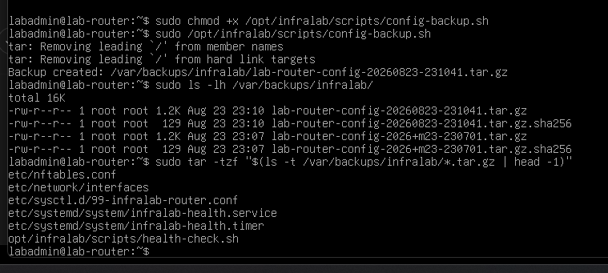

### Update check — 03:30

The third task does not automatically upgrade the router. It only refreshes package metadata and logs what is upgradable.



```bash
#!/bin/bash
set -euo pipefail

LOG="/var/log/infralab/update-check.log"

{
    echo "========================================"
    echo "InfraLab Update Check - $(date)"
    echo "========================================"

    apt update -qq

    echo
    echo "[UPGRADABLE PACKAGES]"
    apt list --upgradable 2>/dev/null

    echo
} >> "$LOG" 2>&1
```



The timer runs at 03:30:

```ini
[Timer]
OnCalendar=*-*-* 03:30:00
Persistent=true
Unit=infralab-update-check.service
```

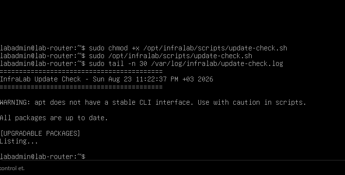

The `apt does not have a stable CLI interface` warning is not a service failure here. The task still completed and produced the expected log.

### A noisy systemd warning that turned out not to matter

While running `daemon-reload` and enabling units, the nested VM occasionally printed:

```text
systemd-ssh-generator: Failed to query local AF_VSOCK CID:
Cannot assign requested address
```

It looked suspicious because it appeared next to the systemd work I was doing. But the evidence did not support treating it as the root cause of anything:

- the services loaded;
- the timers enabled;
- the timers were active;
- the next-run times were visible;
- all three survived the later reboot.

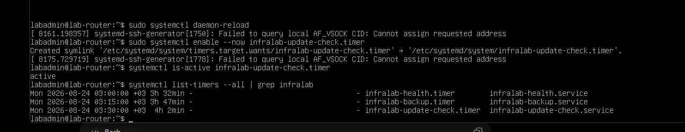

This was another useful debugging habit: not every warning printed near an operation is related to that operation.

---

## 8. The test that mattered most: reboot the router

By this point I had a lab that worked.

That is not the same as having a lab that is configured correctly.

A working Linux router can be held together by transient interface state, manually loaded rules, or a command that was never persisted. So the final test was intentionally boring and destructive: reboot `lab-router` and see what comes back without help.

After reboot:

```bash
ip -br addr
```

showed:

```text
ens18       UP   192.168.74.130/24
ens19       UP
ens19.20    UP   10.20.0.1/24
ens19.30    UP   10.30.0.1/24
```

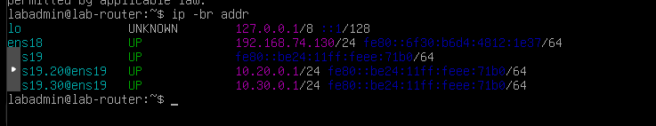

The route table came back as expected, and then I checked the services and timers:

```bash
systemctl is-active nftables
systemctl is-active infralab-health.timer
systemctl is-active infralab-backup.timer
systemctl is-active infralab-update-check.timer
```

All returned `active`.

I checked internet reachability by address:

```bash
ping -c 3 1.1.1.1
```

and DNS plus internet reachability by name:

```bash
ping -4 -c 3 deb.debian.org
```

Both succeeded with 0% packet loss.

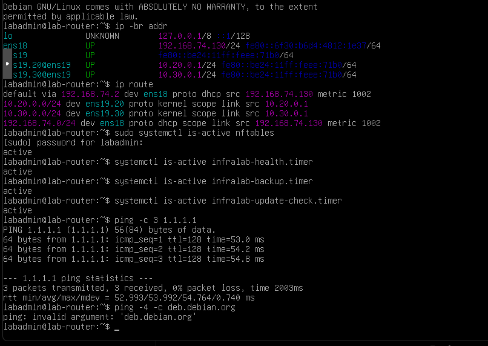

From `zabbix01`, I also rechecked both agents directly:

```bash
zabbix_get -s 10.20.0.11 -p 10050 -k agent.ping
zabbix_get -s 10.20.0.12 -p 10050 -k agent.ping
```

Both returned:

```text
1
```

Finally, I went back to the Zabbix host page.

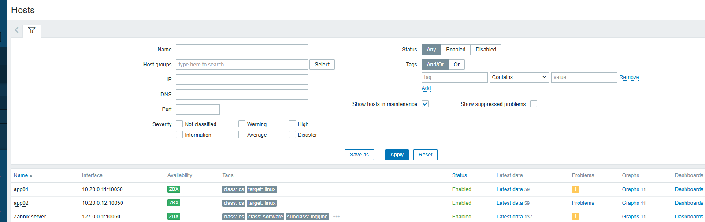

`app01`, `app02`, and the Zabbix server were all green.

The remaining warnings—`Number of installed packages has been changed`—were inventory/change notifications caused by recent package installation, not outages.

### Final validation matrix

| Validation | Result |
|---|:---:|
| `lab-router` survives reboot | ✅ |
| VLAN 20 and VLAN 30 interfaces return | ✅ |
| IPv4 forwarding remains enabled | ✅ |
| nftables policy returns | ✅ |
| Internet access works | ✅ |
| DNS resolution works | ✅ |
| `app01` Agent 2 reachable | ✅ |
| `app02` Agent 2 reachable | ✅ |
| Zabbix failure detection tested | ✅ |
| Zabbix recovery tested | ✅ |
| Proxmox management isolation works | ✅ |
| Health timer survives reboot | ✅ |
| Backup timer survives reboot | ✅ |
| Update-check timer survives reboot | ✅ |


The lab was not “done” when the dashboard first turned green. I considered it done only after the router rebooted, the network reconstructed itself, firewall policy returned, both agents answered, DNS still worked, and all scheduled operations remained active.


At that point I considered the technical build complete.

---

## What this lab actually taught me

The list of technologies is easy to put in a README:

```text
VMware Workstation
Proxmox VE
Debian
LXC
802.1Q VLANs
Linux routing
nftables
NAT
Zabbix
PostgreSQL
Nginx
PHP-FPM
systemd
Bash
```

But the useful lessons were not product names.

They were patterns.

### Debug from the closest broken boundary

When `zabbix01` could not reach `10.30.0.1`, the problem was not Zabbix. It was the virtual network attachment.

When DNS failed but packets arrived on `ens19.20`, the resolver was not the next thing to edit. The forwarding policy was.

When a frontend worked but the monitoring daemon did not, “the web page opens” was not a sufficient health check for the service.

### Configuration files are not runtime state

The Agent 2 file was correct while the running process still had the old allowlist.

The fix was a restart, not another edit.

### Source matters

A `zabbix_get` test from a host that is not in `Server=` is not equivalent to the same test from the monitoring server.

### A successful ping proves less than it feels like it proves

ICMP worked while DNS forwarding was broken because the firewall explicitly allowed ICMP earlier in the chain.

### Negative tests are part of security validation

The management-isolation test succeeded by timing out.

A firewall policy is not proven only because allowed traffic works; denied traffic also has to fail in the expected way.

### Persistence is part of the configuration

The final reboot was not ceremonial. It proved that VLAN interfaces, routes, forwarding, nftables, DNS, internet access, monitoring paths, and systemd timers were actually persistent.

---

## Repository layout

I keep the public repository sanitized and separate reusable configuration from the narrative article.

```text
infralab-homelab/
├── README.md
├── AGENTS.md
├── CODEX_CONTEXT.md
├── configs/
│   ├── interfaces.example
│   ├── nftables.conf.example
│   ├── 99-infralab-router.conf
│   ├── zabbix_agent2_app01.conf.example
│   └── zabbix_agent2_app02.conf.example
├── scripts/
│   ├── health-check.sh
│   ├── config-backup.sh
│   └── update-check.sh
├── systemd/
│   ├── infralab-health.service
│   ├── infralab-health.timer
│   ├── infralab-backup.service
│   ├── infralab-backup.timer
│   ├── infralab-update-check.service
│   └── infralab-update-check.timer
└── docs/
    ├── troubleshooting.md
    └── screenshots/
```

I keep the RFC1918 addresses in the documentation because they are part of the architecture, but I do **not** publish:

- PostgreSQL passwords;
- Proxmox/root credentials;
- SSH private keys;
- API tokens;
- session cookies;
- browser authentication material;
- unrelated personal data visible in screenshots.

---

## Closing thoughts

I started InfraLab because I wanted a project that would force me to connect networking, Linux administration, monitoring, and automation instead of practicing them in isolation.

The final architecture is not enormous. That is part of why it worked well as a learning environment. I could still reason about every interface and every route, but there were enough layers for mistakes to propagate in interesting ways:

```text
Windows
  ↓
VMware
  ↓
Proxmox
  ↓
Linux bridges
  ↓
Debian router
  ↓
802.1Q VLANs
  ↓
LXC hosts
  ↓
PostgreSQL / Zabbix / agents
  ↓
systemd automation
```

The best part of the project was not seeing three green `ZBX` indicators at the end.

It was reaching a point where, when something turned red, I had a better idea of **which layer to inspect first, what evidence to collect, and how to prove the fix instead of merely hoping it worked**.

That is the part I wanted to preserve in this write-up.
