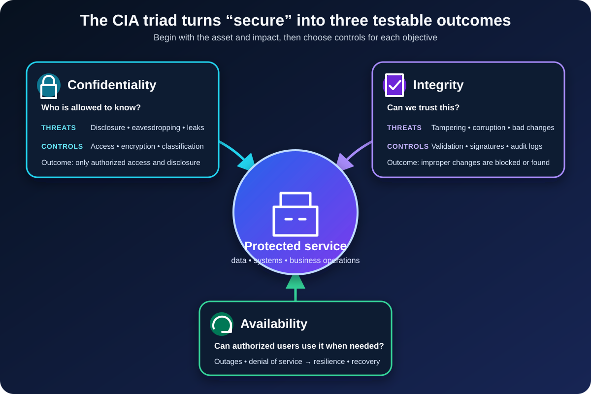

The customer database is encrypted. Access requires a password and a second factor. The security team can point to both controls and say, correctly, that sensitive records are harder to steal.

Then someone changes the bank account number on a supplier payment. On another morning, the application is unavailable when the finance team needs to stop that payment.

Nothing in the word *encrypted* answers either problem.

That gap is why information security needs more than one goal. The **CIA triad** divides the job into three outcomes: confidentiality, integrity, and availability. A secure system must keep information away from unauthorized people, protect it from unauthorized change or destruction, and make it usable by authorized people when they need it.

The model is simple enough to memorize in a minute. Using it well requires a more important habit: asking which kind of loss would hurt this particular system, and how badly.

## What is the CIA triad?

The CIA triad is a model for understanding the three foundational objectives of information security:

- **Confidentiality:** prevent unauthorized access to or disclosure of information.
- **Integrity:** prevent unauthorized modification or destruction, and make improper changes detectable.
- **Availability:** ensure authorized users can access and use information and systems when required.

These are outcomes, not products. Encryption can support confidentiality, but buying an encryption product does not prove that every sensitive export, backup, log, and administrator path is protected. Redundant servers can support availability, but redundancy without tested recovery may merely duplicate the same failure.

[NIST SP 800-12 Rev. 1](https://csrc.nist.gov/pubs/sp/800/12/r1/final) presents these principles as a foundation for understanding a system's security needs. The model gives teams a shared vocabulary before they jump to tools.

The initials can be confusing because CIA also names a government agency. In security architecture, risk analysis, and certification material, *CIA* usually means this triad.

## Confidentiality asks, “Who is allowed to know?”

Confidentiality is lost when information reaches a person, process, or device that is not authorized to receive it.

The obvious example is an attacker stealing customer records. Less dramatic failures count too: a public storage bucket, salary data attached to the wrong email, production secrets written to logs, or an employee retaining access after changing roles.

Useful confidentiality controls include:

- Identity verification and access control
- Least-privilege permissions
- Encryption in transit and at rest
- Data classification and handling rules
- Secrets management, masking, and safe disposal
- Physical controls for devices and records

Encryption is important, but it is not a substitute for access control. If an application legitimately decrypts a database for any signed-in user, strong cryptography will not repair the overly broad permission. The system must protect both the data and the paths that can reveal it.

Confidentiality also differs from privacy. Confidentiality asks whether disclosure is authorized. Privacy asks broader questions about why personal data is collected, how it is used, how long it is retained, and what choices or rights people have. A company can keep personal data confidential while still collecting more than it needs.

## Integrity asks, “Can we trust this?”

Integrity means information and systems have not been modified or destroyed without authorization. It covers malicious tampering, but it also matters when a software bug, failed import, or human mistake changes data unexpectedly.

Return to the supplier payment. If an attacker replaces the destination account number, the values remain secret. The system may remain online. Yet the transaction is unsafe because the instruction can no longer be trusted.

Integrity controls often include:

- Authorization for create, update, and delete operations
- Cryptographic hashes, message authentication codes, and digital signatures where appropriate
- Input validation and database constraints
- Version control, change approval, and separation of duties
- Tamper-evident audit logs
- Backups, reconciliation, and known-good restoration

Context matters. A plain cryptographic hash can reveal accidental file corruption when compared with a trusted value. By itself, it does not prove who produced the file: an attacker able to replace the file may replace the published hash too. Authenticity, protected keys, signatures, or a separately trusted channel may be needed.

[IETF RFC 3552](https://www.rfc-editor.org/rfc/rfc3552.html) makes a related distinction for communications: data integrity is useful only when the receiver can also establish the intended source. “Unchanged” and “from the right sender” are connected claims, but they are not identical.

## Availability asks, “Can authorized users use it now?”

Availability is the property people notice immediately. A perfectly secret, unaltered record is not useful during an emergency if nobody authorized can retrieve it.

Availability can be damaged by a denial-of-service attack, ransomware, expired certificates, resource exhaustion, a bad deployment, a power failure, or an accidental deletion. Cybersecurity shares this territory with reliability, capacity planning, disaster recovery, and operational discipline.

Controls that support availability include:

- Redundant components without a shared single point of failure
- Capacity limits, rate limiting, and denial-of-service protection
- Monitoring, alerting, and rehearsed incident response
- Tested backups and restoration procedures
- Failover, graceful degradation, and disaster recovery plans
- Patch, configuration, certificate, and dependency lifecycle management

“We have backups” is not an availability claim. A backup helps only if it contains the required data, remains protected from the incident, can be restored within the business's time limit, and has actually been tested.

CISA's [Introduction to Information Security](https://www.cisa.gov/sites/default/files/publications/infosecuritybasics.pdf) uses practical consequences to separate the goals: unauthorized reading is a confidentiality loss, unexpected modification is an integrity loss, and erased or inaccessible information is an availability loss.

## One incident can strike all three

The triad separates questions; real incidents rarely respect those boundaries.

Suppose ransomware reaches a payroll system. It may copy employee records before encryption, causing a confidentiality breach. It may alter or encrypt payroll data, damaging integrity. It may stop payroll processing, destroying availability. The same event creates three kinds of impact and may require three kinds of evidence and recovery.

The reverse is also true: one control can support several goals. Strong access control can prevent unauthorized reading and unauthorized changes. A protected, tested backup can restore availability and recover known-good data. Logging can help detect integrity violations and speed operational recovery.

The following table keeps the distinctions clear without pretending that controls live in separate boxes.

| Security objective | Typical loss | Useful evidence | Example controls |
| --- | --- | --- | --- |
| Confidentiality | Unauthorized disclosure | Access records, data-flow inventory, permission review | Least privilege, encryption, classification |
| Integrity | Unauthorized or improper change | Signed artifacts, audit history, reconciliation results | Validation, signatures, change control, backups |
| Availability | Authorized use is blocked or degraded | Uptime and latency measures, recovery-test results | Redundancy, monitoring, rate limits, tested recovery |

## The balance depends on the asset

The CIA triad is not a command to maximize every property at any cost.

A public documentation site has little need to hide its published pages, but the integrity of installation commands matters and readers expect the site to be available. A medical record has high confidentiality and integrity needs; availability can become critical during treatment. A public status page needs broad availability and trustworthy updates, while confidentiality applies mainly to its administration and unpublished incident details.

[FIPS 199](https://csrc.nist.gov/pubs/fips/199/final) turns this idea into an impact-based categorization method for U.S. federal information systems. It considers the potential impact of losing confidentiality, integrity, or availability, and uses the highest impact among the three objectives to determine the system's overall security category. The exact federal method will not fit every organization, but the reasoning is widely useful: classify the consequence before choosing the control.

Start with an asset and a business process, not a generic checklist:

1. What information or service are we protecting?
2. Who is authorized to see it, change it, and use it?
3. What could cause disclosure, untrusted change, or interruption?
4. What would each loss do to people, operations, obligations, and reputation?
5. Which preventive, detective, and recovery controls reduce that risk?
6. What evidence will show that those controls work?

This sequence prevents a common mistake: applying expensive controls because they sound mature while leaving the system's highest-impact failure untreated.

## Common CIA triad mistakes

The first mistake is treating security as confidentiality alone. Teams harden login and encrypt data, then neglect destructive permissions, change detection, capacity, and recovery.

The second is confusing integrity with availability. A database replica may keep reads online after a server fails, but it can also replicate a bad update. Availability improved; integrity did not. Point-in-time recovery or reconciliation addresses a different problem.

The third is mapping one tool permanently to one letter. Backups are often labeled an availability control, but protected historical copies can also recover data after an integrity failure. Controls should be evaluated by the outcome they produce in a specific design.

The fourth is ignoring people and process. A technically sound system can still fail when nobody owns an alert, approves access reviews, tests recovery, or knows how to communicate during an incident.

Finally, the triad is foundational, not exhaustive. Authentication, authorization, authenticity, accountability, privacy, safety, and non-repudiation may introduce additional requirements. The triad is a strong opening lens, not the last page of a security design.

## The concise takeaway

The CIA triad asks three plain questions of every important asset:

- Can unauthorized parties learn it?
- Can unauthorized or improper changes make it untrustworthy?
- Can authorized users obtain and use it when needed?

Good security does not choose one answer and call the system protected. It identifies the consequences of each kind of loss, selects controls that fit the risk, and gathers evidence that those controls work together.

A lock protects only one part of the problem. A trustworthy system must also preserve what is true and remain useful when it matters.

## Continue learning

- [Zero Trust Explained With Real-World Examples](/posts/zero-trust-explained-real-world-examples/)
- [MFA vs Passwordless vs Passkeys: What Is the Difference?](/posts/mfa-vs-passwordless-vs-passkeys/)
- [The Heartbleed Vulnerability: A Deep Dive into the Buffer Over-Read Flaw](/posts/heartbleed-vulnerability-analysis/)
- [What Is Software Architecture? A Beginner's Guide](/posts/software-architecture-beginners-guide/)

## Sources

- [NIST SP 800-12 Rev. 1: An Introduction to Information Security](https://csrc.nist.gov/pubs/sp/800/12/r1/final)
- [NIST FIPS 199: Standards for Security Categorization of Federal Information and Information Systems](https://csrc.nist.gov/pubs/fips/199/final)
- [NIST SP 800-53 Rev. 5: Security and Privacy Controls for Information Systems and Organizations](https://csrc.nist.gov/pubs/sp/800/53/r5/upd1/final)
- [CISA: Introduction to Information Security](https://www.cisa.gov/sites/default/files/publications/infosecuritybasics.pdf)
- [IETF RFC 3552: Guidelines for Writing RFC Text on Security Considerations](https://www.rfc-editor.org/rfc/rfc3552.html)
