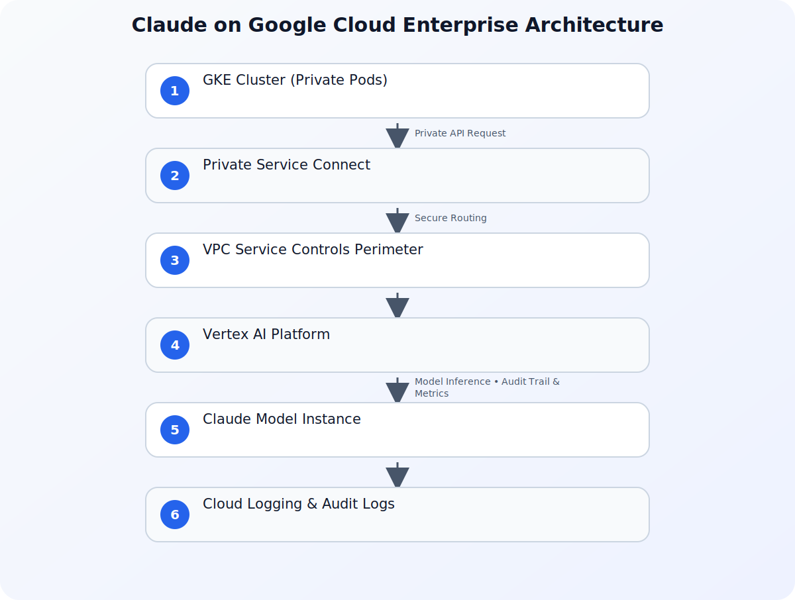

Running frontier artificial intelligence models in production is one of the most demanding engineering challenges of the modern enterprise. It requires managing complex accelerator hardware, maintaining low latency across global regions, keeping regulated data strictly within geographic boundaries, and serving long-context requests reliably under heavy load. Anthropic's Claude models represent the frontier of reasoning, but deploying them at scale requires an infrastructure foundation that meets strict enterprise standards.

The integration of Claude on Google Cloud addresses this exact challenge. By hosting Claude within Google Cloud's enterprise platform, organizations can treat frontier AI models as native cloud resources. Calling Claude becomes operationally identical to calling any other Google Cloud service—leveraging the same Identity and Access Management (IAM) frameworks, Virtual Private Cloud (VPC) Service Controls, and unified observability tools. This guide explores the practical architecture, security configurations, and implementation strategies for deploying Claude at scale on Google Cloud.

## The Architectural Shift: Operational Identity

Historically, integrating third-party frontier models required developers to manage external API keys, configure custom proxy servers, and establish bespoke security boundaries. This fragmented approach introduced significant operational overhead and security risks. If an API key was leaked, rotating it required updating secrets across multiple microservices, risking downtime.

With Claude on Google Cloud, this paradigm shifts to one of "operational identity." The model is fully integrated into Vertex AI, Google Cloud's managed machine learning platform. This integration provides several critical architectural advantages:

*   **Unified Identity and Access Management (IAM):** Access to Claude is governed by standard Google Cloud IAM policies. You can grant fine-grained permissions to specific Service Accounts, eliminating the need to manage, rotate, or secure static API keys. Authentication is handled transparently via OAuth 2.0 tokens generated by the Google Cloud SDK.
*   **VPC Service Controls (VPC-SC):** You can place your Claude API endpoints inside a secure VPC Service Controls perimeter. This mitigates data exfiltration risks by ensuring that data cannot leave your designated network boundary, even when communicating with managed AI services. Any attempt to send data to an unauthorized external endpoint is blocked at the network layer.
*   **Unified Observability:** Every request and response can be monitored using Cloud Logging and Cloud Monitoring. This allows platform teams to track latency, token consumption, and error rates using the same dashboards they use for their databases and microservices. You can set up real-time alerts for anomalous spike patterns or sudden increases in HTTP 429 (Too Many Requests) errors.

## Reference Architecture for Enterprise Deployment

To deploy Claude securely at scale, enterprise architects must design a robust network and security perimeter. The following diagram illustrates a typical enterprise architecture for invoking Claude on Google Cloud within a secure VPC, utilizing Private Service Connect (PSC) to keep all traffic off the public internet.



In this architecture:

1.  **Client Application:** Runs within a private Google Kubernetes Engine (GKE) cluster or Compute Engine instance. The application uses Workload Identity to map its Kubernetes Service Account (KSA) to a Google Service Account (GSA) with the necessary IAM permissions.
2.  **VPC Service Controls Perimeter:** Encloses the client application and the Vertex AI API. Any attempt to access the API from outside the perimeter or to exfiltrate data to unauthorized external endpoints is blocked.
3.  **Private Service Connect (PSC):** Allows the client application to communicate with the Vertex AI endpoint privately, using internal IP addresses. Traffic never traverses the public internet, reducing latency and exposure to external threats.
4.  **Vertex AI Platform:** Manages the routing, load balancing, and scaling of requests to the underlying Claude model instances.
5.  **Cloud Audit Logs:** Automatically records all API interactions for compliance and auditing purposes, ensuring that security teams have a complete trail of model usage.

## Practical Implementation: Invoking Claude via Vertex AI

To demonstrate the simplicity of this integration, let us look at a practical implementation using the official Google Cloud Python SDK. This example demonstrates how to initialize the Vertex AI client, authenticate using a local service account, and send a structured prompt to Claude with robust error handling and retry logic.

```python
import os
import time
from google.cloud import aiplatform
from google.api_core.exceptions import GoogleAPICallError, RetryError
from vertexai.generative_models import GenerativeModel, SafetySetting, HarmCategory, HarmBlockThreshold

# Initialize the Vertex AI SDK with your project and region
PROJECT_ID = os.getenv("GCP_PROJECT_ID", "my-enterprise-project")
LOCATION = os.getenv("GCP_REGION", "us-central1")

aiplatform.init(project=PROJECT_ID, location=LOCATION)

def generate_enterprise_response(prompt: str, max_retries: int = 3) -> str:
    """
    Sends a prompt to the Claude model hosted on Vertex AI.
    Authenticates implicitly using the environment's Google Service Account.
    Includes exponential backoff for handling transient errors.
    """
    # Load the Claude model instance from the Vertex AI registry
    # In production, pin to a specific stable version
    model = GenerativeModel("claude-3-5-sonnet@20240620")

    # Configure safety settings to align with enterprise compliance guidelines
    safety_settings = [
        SafetySetting(
            category=HarmCategory.HARM_CATEGORY_HATE_SPEECH,
            threshold=HarmBlockThreshold.BLOCK_LOW_AND_ABOVE,
        ),
        SafetySetting(
            category=HarmCategory.HARM_CATEGORY_HARASSMENT,
            threshold=HarmBlockThreshold.BLOCK_LOW_AND_ABOVE,
        ),
    ]

    # Configure generation parameters
    generation_config = {
        "temperature": 0.2,
        "max_output_tokens": 4096,
        "top_p": 0.95,
    }

    delay = 1.0
    for attempt in range(max_retries):
        try:
            response = model.generate_content(
                prompt,
                generation_config=generation_config,
                safety_settings=safety_settings
            )
            return response.text
        except (GoogleAPICallError, RetryError) as e:
            if attempt == max_retries - 1:
                print(f"Final attempt failed. Error: {str(e)}")
                raise e
            print(f"Transient error encountered: {str(e)}. Retrying in {delay} seconds...")
            time.sleep(delay)
            delay *= 2  # Exponential backoff
        except Exception as e:
            print(f"Non-retryable error: {str(e)}")
            raise e

if __name__ == "__main__":
    sample_prompt = "Analyze this financial transaction log for potential compliance anomalies."
    try:
        result = generate_enterprise_response(sample_prompt)
        print("Model Response:", result)
    except Exception as err:
        print(f"Application failed to process request: {err}")
```

### Configuring Workload Identity on GKE

To run this code securely on Google Kubernetes Engine (GKE) without downloading static service account keys, you should use Workload Identity. This binds a Kubernetes Service Account (KSA) to a Google Service Account (GSA) so that your application pods automatically inherit the correct IAM permissions.

Below is the declarative Kubernetes configuration to set up this binding:

```yaml
apiVersion: v1
kind: ServiceAccount
metadata: 
  name: claude-runner-sa
  namespace: ai-workloads
  annotations:
    iam.gke.io/gcp-service-account: claude-runner-gsa@my-enterprise-project.iam.gserviceaccount.com
---
apiVersion: apps/v1
kind: Deployment
metadata:
  name: claude-client-app
  namespace: ai-workloads
  labels:
    app: claude-client
spec:
  replicas: 3
  selector:
    matchLabels:
      app: claude-client
  template:
    metadata:
      labels:
        app: claude-client
    spec:
      serviceAccountName: claude-runner-sa
      containers:
      - name: app-container
        image: gcr.io/my-enterprise-project/claude-client:v1.0.0
        env:
        - name: GCP_PROJECT_ID
          value: "my-enterprise-project"
        - name: GCP_REGION
          value: "us-central1"
```

By deploying your application with this configuration, GKE injects temporary, auto-rotating credentials into the container. The Vertex AI Python SDK automatically detects these credentials, eliminating the risk of credential theft.

## Enterprise Security, Compliance, and Data Residency

For highly regulated industries—such as financial services, healthcare, and the public sector—security is not a feature; it is a hard prerequisite. When running Claude on Google Cloud, several key security mechanisms are enforced:

### Data Residency and Sovereignty
Enterprises must often guarantee that their data does not cross geopolitical borders. With Claude on Vertex AI, you can select the specific Google Cloud region (e.g., `europe-west3` for Frankfurt, `us-central1` for Iowa) where your data is processed. Google guarantees that your prompts and generated responses remain within that designated region, satisfying strict compliance frameworks like GDPR and local financial regulations.

### Preventing Data Leakage
A common concern with public AI APIs is that customer data might be used to train future iterations of the model. Google Cloud's enterprise agreement ensures that your data, prompts, and outputs are **never** used to train Anthropic's models or Google's foundation models. Your data remains entirely yours, isolated within your tenant boundary.

### Securing the Broader AI Supply Chain
While securing the API endpoint is critical, enterprises must also secure the entire software supply chain surrounding their AI applications. For organizations running AI workloads on Kubernetes, tools like `k8s-aibom` can be deployed to automatically catalog AI runtimes and generate Machine Learning Bills of Materials (ML-BOMs). To learn more about securing these environments, see our guide on [Securing the AI Supply Chain on GKE: Introducing k8s-aibom for Automated AI BOMs](/posts/securing-the-ai-supply-chain-on-gke-introducing-k8s-aibom-for-automated-ai-boms-pr/).

## Comparing Integration Patterns

To help architectural teams make informed decisions, the following table compares direct API integration with native Google Cloud Vertex AI deployment for Claude.

| Architectural Dimension | Direct API Integration (SaaS) | Google Cloud Vertex AI Deployment |
| :--- | :--- | :--- |
| **Authentication** | Static API Keys / Bearer Tokens | Native Google Cloud IAM & Service Accounts |
| **Network Security** | Public Internet / Custom Proxies | VPC Service Controls & Private Service Connect |
| **Data Residency** | Subject to SaaS provider locations | Guaranteed in-region processing (Selected GCP Region) |
| **Billing & Commitments** | Separate SaaS billing | Unified Google Cloud Billing (counts toward committed spend) |
| **Observability** | Custom logging wrappers | Native integration with Cloud Logging & Monitoring |
| **Compliance Certifications** | Dependent on SaaS provider | Inherits Google Cloud's extensive compliance posture |
| **SLA Guarantees** | Standard SaaS SLA | Enterprise-grade Google Cloud Service Level Agreements |

By leveraging Vertex AI, organizations can consolidate their billing, security audits, and infrastructure management under a single administrative umbrella. This reduces operational friction and accelerates the time-to-market for enterprise AI applications.

## Scaling to Agentic Workflows and Edge Environments

As enterprises move beyond simple chat interfaces, they are building complex, agentic workflows where Claude acts as a central reasoning engine. These agents interact with databases, execute code, and orchestrate multi-step business processes. In these scenarios, the model's ability to handle long contexts and perform complex tool-calling is critical.

For instance, in the automotive and manufacturing sectors, agentic systems are being deployed to manage connected fleets and software-defined vehicles. These architectures rely on low-latency connections between edge devices and cloud-based reasoning models. To explore how Google Cloud supports these advanced, edge-to-cloud AI ecosystems, read our detailed analysis on [Building AI-Defined Vehicles: Integrating Android and Google Cloud for Next-Gen Automotive Solutions](/posts/ai-defined-vehicles-android-google-cloud/).

Furthermore, Google's leadership in this space is well-documented. The company was named a Leader in the 2026 IDC MarketScape for Worldwide Foundation Model Software, reflecting its commitment to delivering secure, production-grade systems that developers can deploy at scale. This recognition highlights the strength of combining frontier models like Claude with Google's robust enterprise infrastructure.

## Best Practices for Production Deployments

When moving Claude workloads from pilot to production on Google Cloud, adhere to the following engineering best practices:

### 1. Implement Rate Limiting and Quota Management
Vertex AI enforces quotas on requests per minute (RPM) and tokens per minute (TPM). Monitor these metrics closely and implement exponential backoff retry logic in your application code, as demonstrated in the Python example above. If your application requires higher throughput, submit a quota increase request via the Google Cloud Console well in advance of your launch date.

### 2. Leverage Context Caching
For long-context requests (such as analyzing large codebases, legal documents, or extensive transaction histories), use context caching features where available. Context caching allows you to store frequently used system instructions or reference documents in memory, significantly reducing latency and lowering token costs for subsequent requests.

### 3. Enforce Least Privilege
Assign dedicated Service Accounts to your applications with the minimum necessary IAM roles. For example, grant the `roles/aiplatform.user` role to the service account running your application, and restrict its access to only the specific projects and resources it needs to function. Avoid using broad owner or editor roles in production environments.

### 4. Enable Detailed Auditing and Monitoring
Configure Cloud Audit Logs to capture data-access events. This provides a complete audit trail of who accessed the model, when, and what parameters were used, which is essential for compliance reviews. Additionally, build custom Cloud Monitoring dashboards to track key performance indicators (KPIs) such as model latency, token utilization, and error rates.

## Conclusion

Deploying frontier AI at scale requires more than just a powerful model; it requires an infrastructure that is secure, compliant, and operationally mature. By bringing Anthropic's Claude to Google Cloud, enterprises no longer have to choose between cutting-edge reasoning capabilities and rigorous operational standards. Through native IAM integration, VPC Service Controls, and regional data residency, technical teams can focus on building innovative, AI-driven features while relying on Google Cloud's proven infrastructure to handle the heavy lifting of enterprise production.

## Sources

- [Claude at scale on Google Cloud: Frontier AI, built for enterprise production](https://cloud.google.com/blog/products/ai-machine-learning/claude-at-scale-on-google-cloud-frontier-ai-built-for-enterprise-production/)
- [Google named a Leader in the 2026 IDC MarketScape for Worldwide Foundation Model Software](https://cloud.google.com/blog/products/ai-machine-learning/google-named-a-leader-in-idc-marketscape/)
- [Securing the AI supply chain on GKE: Introducing k8s-aibom for automated AI BOMs](https://cloud.google.com/blog/products/identity-security/introducing-k8s-aibom-on-gke-for-automated-ai-bills-of-materials/)
- [Building the AI-defined vehicle with Android, Google Cloud, and Nexus SDV](https://cloud.google.com/blog/products/databases/nexus-sdv-uses-bigtable-android-automotive-for-agentic-vehicles/)
