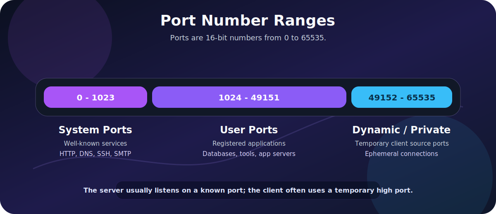
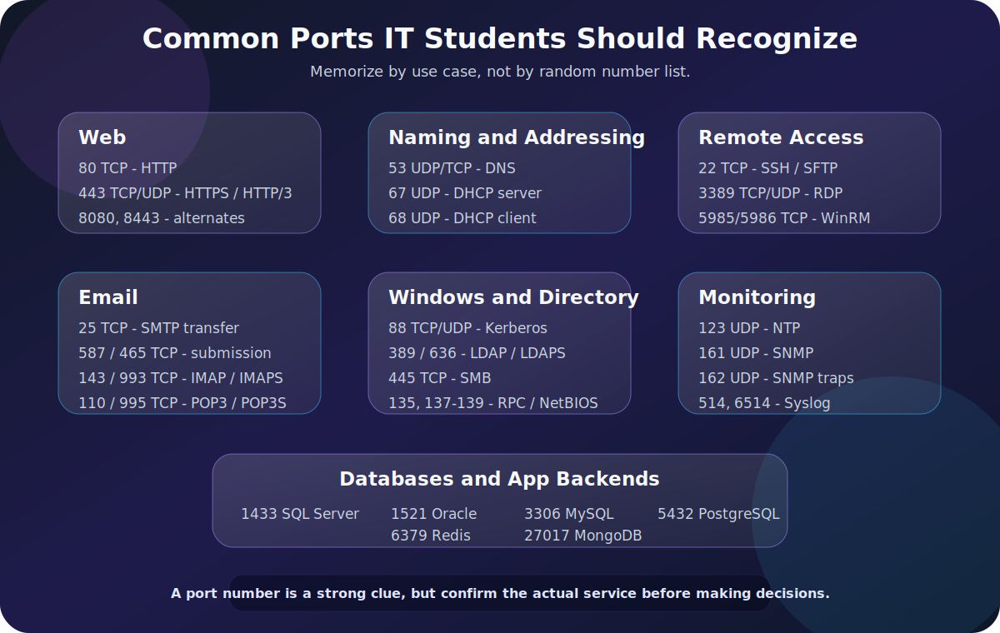

Network ports are one of the first things that make networking feel real.

IP addresses tell you **which device** traffic is going to. Ports tell you **which service or application** should receive that traffic on the device.

If you see this:

`192.168.1.10:443`

You are looking at:

- Host: 192.168.1.10
- Port: 443
- Likely service: HTTPS

That small number after the colon gives you a strong clue about what is happening on the network.

This guide is a practical port-number reference for IT students, junior system administrators, help desk technicians, networking beginners, and anyone preparing for IT fundamentals or networking exams.

If you are building the foundation, read [Network Communication Basics](/posts/network-communication-basics/), [Internet Protocol (IP) Explained](/posts/internet-protocol-ip-basics/), [TCP vs UDP Explained With Examples](/posts/tcp-vs-udp-explained-with-examples/), and [DNS Explained](/posts/dns-explained-how-your-browser-finds-a-website/) too. Ports sit on top of those concepts.



> **Reading path:** Start with the mental model, follow the worked request or packet examples, and finish with the troubleshooting or memory guide.

---

## What Is a Port?

A **port** is a 16-bit number used by transport protocols such as TCP and UDP to identify an application or service on a host.

The port number is not enough by itself. A network conversation is identified by a combination of values:

A network conversation is identified by five values: **source IP**, **source port**, **destination IP**, **destination port**, and the **transport protocol**.

Example:

- Client: 192.168.1.25:51432
- Server: 93.184.216.34:443
- Protocol: TCP

In that example:

- `51432` is the client's temporary source port.
- `443` is the server's destination port.
- TCP carries the connection.
- The destination port suggests HTTPS.

The server listens on a known port. The client usually uses a temporary high-numbered source port.

---

## Port Numbers Are Clues, Not Proof

This is one of the most important lessons in the whole post:

`Port number != guaranteed application`

Port `443` usually means HTTPS, but an administrator can run something else on 443. Malware can use common ports to blend in. Developers can run web apps on `8080`. A database can be moved from its default port to a custom one.

So port numbers are extremely useful clues, but they are not final proof.

You should combine port information with:


The key items here are Process information on the host, Service banners, Firewall rules, Packet inspection, Application logs, TLS certificate details, and Endpoint or server configuration.

IANA, the official registry authority for service names and port numbers, makes the same general point: assigned ports help identify services, but traffic on a registered port is not automatically good traffic and does not necessarily correspond to the registered service.

---

## TCP vs. UDP Port Numbers

TCP and UDP both use port numbers, but they behave differently.

| Feature | TCP | UDP |
|---|---|---|
| Connection setup | Yes | No |
| Reliability | Built in | Not built in |
| Ordering | Built in | Not built in |
| Common use | Web, SSH, email, file sharing | DNS, DHCP, NTP, voice/video, gaming |
| Firewall behavior | Easier to track state | More context-dependent |

The same port number can exist for both TCP and UDP.

For example:

- 53/tcp
- 53/udp

Both are DNS-related, but they are different transport sockets.

That is why you should write ports with the protocol when clarity matters:

When clarity matters, write the transport with the port: `TCP/443`, `UDP/53`, `TCP/22`, or `UDP/123`.

---

## Port Ranges

Port numbers range from `0` to `65535`.

| Range | Name | Typical Meaning |
|---:|---|---|
| `0-1023` | System ports, also called well-known ports | Core services such as HTTP, DNS, SSH, SMTP |
| `1024-49151` | User ports, also called registered ports | Vendor apps, databases, management tools |
| `49152-65535` | Dynamic/private ports | Temporary client-side ephemeral ports |

The ranges matter because they tell you what kind of port you are probably looking at.

If a server is listening on `22`, that is likely a well-known service port.

If a client connects from `52418`, that is probably a temporary source port.

---

## The Core Ports to Memorize First

If you are new, start here.



| Port | Protocol | Service | Why It Matters |
|---:|---|---|---|
| `20` | TCP | FTP data | Used by active FTP data transfer |
| `21` | TCP | FTP control | Legacy file transfer control channel |
| `22` | TCP | SSH / SFTP | Secure remote shell and file transfer |
| `23` | TCP | Telnet | Insecure remote shell, mostly legacy |
| `25` | TCP | SMTP | Mail server to mail server delivery |
| `53` | UDP/TCP | DNS | Name resolution |
| `67` | UDP | DHCP server | Assigns IP configuration |
| `68` | UDP | DHCP client | Receives DHCP replies |
| `80` | TCP | HTTP | Unencrypted web traffic |
| `110` | TCP | POP3 | Legacy email retrieval |
| `123` | UDP | NTP | Time synchronization |
| `143` | TCP | IMAP | Email retrieval and mailbox sync |
| `161` | UDP | SNMP | Network monitoring queries |
| `162` | UDP | SNMP traps | Network monitoring alerts |
| `389` | TCP/UDP | LDAP | Directory access |
| `443` | TCP/UDP | HTTPS / HTTP/3 | Secure web traffic |
| `445` | TCP | SMB | Windows file sharing |
| `587` | TCP | SMTP submission | Client mail submission |
| `636` | TCP | LDAPS | LDAP over TLS |
| `993` | TCP | IMAPS | IMAP over TLS |
| `995` | TCP | POP3S | POP3 over TLS |
| `3389` | TCP/UDP | RDP | Windows Remote Desktop |

You do not need to memorize every port on the internet. You do need to recognize the ones that appear constantly in troubleshooting, firewall rules, packet captures, and exam questions.

---

## Web Ports

Web traffic is where most students first see ports in action.

| Port | Protocol | Service | Notes |
|---:|---|---|---|
| `80` | TCP | HTTP | Unencrypted web traffic |
| `443` | TCP | HTTPS | Encrypted web traffic over TLS |
| `443` | UDP | HTTP/3 / QUIC | Modern encrypted web transport |
| `8080` | TCP | HTTP alternate | Common for development, proxies, admin apps |
| `8443` | TCP | HTTPS alternate | Common for admin portals or app servers |

When you type:

`https://example.com`

The browser assumes:

`TCP/443`

Unless the URL specifies another port:

`https://example.com:8443`

For plain HTTP:

`http://example.com`

The browser assumes:

`TCP/80`

Modern browsers may also use HTTP/3, which runs over QUIC on UDP/443. That is why UDP/443 in logs is not automatically suspicious. It may be normal modern web traffic.

---

## DNS and Addressing Ports

These ports help devices find names, addresses, and network configuration.

| Port | Protocol | Service | What It Does |
|---:|---|---|---|
| `53` | UDP | DNS | Common DNS queries |
| `53` | TCP | DNS | Large responses, zone transfers, reliability cases |
| `67` | UDP | DHCP server | Receives client discovery and request messages |
| `68` | UDP | DHCP client | Receives server offers and acknowledgments |
| `853` | TCP | DNS over TLS | Encrypted DNS transport |

DNS usually starts with UDP because most DNS lookups are small and quick.

DHCP uses UDP because a new client may not have a working IP address yet. It needs broadcast-style local network discovery before it can fully participate on the network.

If a user says:

> **Troubleshooting symptom:** “I am connected to Wi-Fi, but websites do not open.”

Think about:

- Did DHCP assign an IP address?
- Is the default gateway correct?
- Are DNS servers configured?
- Can the client resolve names?
- Can the client reach the resolved IP?

Ports `53`, `67`, and `68` often appear early in that troubleshooting path.

---

## Remote Access and Administration Ports

Remote access ports are important because they are powerful.

| Port | Protocol | Service | Notes |
|---:|---|---|---|
| `22` | TCP | SSH | Secure shell, Linux administration, network devices |
| `23` | TCP | Telnet | Insecure, avoid on modern networks |
| `3389` | TCP/UDP | RDP | Windows Remote Desktop |
| `5900` | TCP | VNC | Remote graphical access |
| `5985` | TCP | WinRM HTTP | Windows Remote Management |
| `5986` | TCP | WinRM HTTPS | Encrypted Windows Remote Management |

From an IT operations perspective:

- SSH should use strong keys or strong authentication.
- Telnet should usually be disabled.
- RDP should not be exposed directly to the internet.
- WinRM should be carefully scoped and monitored.

Remote access ports are not bad by themselves. They are risky when exposed too broadly or protected poorly.

---

## Email Ports

Email has more ports than many beginners expect because sending and receiving mail are separate functions.

| Port | Protocol | Service | Typical Use |
|---:|---|---|---|
| `25` | TCP | SMTP | Mail server to mail server transfer |
| `465` | TCP | SMTPS / submissions | SMTP submission over implicit TLS |
| `587` | TCP | SMTP submission | Client sends mail to mail server |
| `110` | TCP | POP3 | Retrieve mail from server |
| `995` | TCP | POP3S | POP3 over TLS |
| `143` | TCP | IMAP | Sync mailbox with server |
| `993` | TCP | IMAPS | IMAP over TLS |

The practical distinction:

The practical distinction is simple: **SMTP sends mail**, while **IMAP and POP3 retrieve mail**.

For most modern clients, IMAP over TLS on `993` is more common than POP3.

For sending mail from a client application, `587` is the standard port to expect in many configurations.

Port `25` is still important, but it is more about mail server to mail server delivery than a normal user submitting mail from a laptop.

---

## File Transfer Ports

File transfer protocols vary a lot in security and behavior.

| Port | Protocol | Service | Notes |
|---:|---|---|---|
| `20` | TCP | FTP data | Active FTP data channel |
| `21` | TCP | FTP control | FTP command channel |
| `22` | TCP | SFTP | File transfer over SSH |
| `69` | UDP | TFTP | Simple file transfer, no authentication |
| `445` | TCP | SMB | Windows file sharing |

FTP is old and awkward with firewalls because it uses separate control and data channels.

SFTP is not "FTP with encryption." It is a different protocol that runs over SSH.

TFTP is simple and commonly seen in device bootstrapping, firmware workflows, PXE environments, and network equipment scenarios. It should not be treated as secure.

SMB is central to Windows file sharing:

A Windows UNC path such as `\\server\share` normally points to an SMB file share, commonly reached over TCP/445.

That usually means TCP/445 somewhere in the background.

---

## Windows and Directory Service Ports

Windows environments have several important ports.

| Port | Protocol | Service | What It Is Used For |
|---:|---|---|---|
| `88` | TCP/UDP | Kerberos | Authentication in Active Directory environments |
| `135` | TCP/UDP | RPC endpoint mapper | Locating RPC services |
| `137` | UDP | NetBIOS name service | Legacy Windows name service |
| `138` | UDP | NetBIOS datagram | Legacy browsing/datagram service |
| `139` | TCP | NetBIOS session | Legacy file and printer sharing |
| `389` | TCP/UDP | LDAP | Directory queries |
| `445` | TCP | SMB | File sharing and domain-related traffic |
| `464` | TCP/UDP | Kerberos password change | Password change operations |
| `636` | TCP | LDAPS | LDAP over TLS |
| `3268` | TCP | Global Catalog | AD forest-wide searches |
| `3269` | TCP | Global Catalog over TLS | Encrypted global catalog |

If you work around Active Directory, these ports appear constantly.

For a domain-joined Windows machine, "network login" is not one single thing. It can involve DNS, Kerberos, LDAP, SMB, RPC, and time synchronization.

That is why Active Directory troubleshooting often starts with:


The key items here are DNS resolution, Time sync, Domain controller reachability, Kerberos, LDAP, and SMB.

---

## Monitoring and Logging Ports

Monitoring tools need ways to query devices and receive events.

| Port | Protocol | Service | Common Use |
|---:|---|---|---|
| `123` | UDP | NTP | Time synchronization |
| `161` | UDP | SNMP | Device monitoring queries |
| `162` | UDP | SNMP traps | Device sends alerts |
| `514` | UDP/TCP | Syslog | Log forwarding |
| `6514` | TCP | Syslog over TLS | Encrypted log forwarding |

Time synchronization deserves special attention.

If clocks are wrong, many systems become painful:


The key items here are Kerberos authentication can fail, Logs are harder to correlate, Certificates can appear not yet valid or expired, and Incident timelines become unreliable.

NTP on UDP/123 is boring until it breaks.

SNMP is common for network devices, printers, UPS systems, servers, and monitoring platforms. Older SNMP versions should be treated carefully because community strings are not strong authentication.

---

## Database Ports

Database ports are useful for developers, administrators, and security reviews.

| Port | Protocol | Service | Notes |
|---:|---|---|---|
| `1433` | TCP | Microsoft SQL Server | Default database listener |
| `1434` | UDP | SQL Server Browser | Instance discovery |
| `1521` | TCP | Oracle Database | Common listener port |
| `3306` | TCP | MySQL / MariaDB | Default MySQL-compatible database port |
| `5432` | TCP | PostgreSQL | Default PostgreSQL port |
| `6379` | TCP | Redis | In-memory data store |
| `27017` | TCP | MongoDB | Document database |

Database ports should usually be tightly restricted.

A public website may need to expose TCP/443 to the internet. A production database usually should not expose TCP/5432, TCP/3306, or TCP/1433 to the internet directly.

Better patterns include:


The key items here are Private networks, Firewall allowlists, VPN or private access, Managed database private endpoints, Strong authentication, and TLS for database connections.

---

## Identity and Access Ports

Authentication and authorization systems have their own common ports.

| Port | Protocol | Service | Common Use |
|---:|---|---|---|
| `88` | TCP/UDP | Kerberos | Active Directory authentication |
| `389` | TCP/UDP | LDAP | Directory access |
| `636` | TCP | LDAPS | LDAP over TLS |
| `1812` | UDP | RADIUS authentication | Network access authentication |
| `1813` | UDP | RADIUS accounting | Network access accounting |

RADIUS is common in:


The key items here are Wi-Fi authentication, VPN authentication, Network access control, and 802.1X environments.

LDAP and Kerberos are common in enterprise identity environments, especially Active Directory.

Cloud identity systems such as Microsoft Entra ID are usually accessed through HTTPS on TCP/443 from the client side, but hybrid identity environments may still rely on these traditional infrastructure ports internally.

---

## Common Port Groups by Scenario

Sometimes it is easier to remember ports by workflow rather than by number.

### Loading a Website

| Service | Transport and port |
| --- | --- |
| DNS | UDP/TCP 53 |
| HTTP | TCP 80 |
| HTTPS | TCP 443 |
| HTTP/3 | UDP 443 |

### Getting an IP Address

| Role | Port |
| --- | --- |
| DHCP server | UDP 67 |
| DHCP client | UDP 68 |

### Remote Admin

| Service | Transport and port |
| --- | --- |
| SSH | TCP 22 |
| RDP | TCP/UDP 3389 |
| WinRM | TCP 5985 or 5986 |

### Sending and Reading Email

| Mail function | Transport and port |
| --- | --- |
| Server-to-server SMTP | TCP 25 |
| SMTP submission | TCP 587 or 465 |
| Secure IMAP | TCP 993 |
| Secure POP3 | TCP 995 |

### Windows File Sharing

| Service | Transport and port |
| --- | --- |
| SMB | TCP 445 |
| Legacy NetBIOS | UDP 137, UDP 138, and TCP 139 |

### Monitoring

| Service | Transport and port |
| --- | --- |
| NTP | UDP 123 |
| SNMP | UDP 161 |
| SNMP traps | UDP 162 |
| Syslog | UDP/TCP 514 |

---

## How Ports Appear in Real Troubleshooting

Ports show up in real support tickets all the time.

### Example 1: Website Does Not Load

Start with layers:

1. Can the user resolve the name?
2. Can the user reach the IP?
3. Can the user connect to TCP/443?
4. Does TLS succeed?
5. Does HTTP return a valid response?

Useful commands:

```powershell
Resolve-DnsName example.com
Test-NetConnection example.com -Port 443
```

On Linux/macOS:

```bash
dig example.com
nc -vz example.com 443
```

### Example 2: RDP Does Not Work

Ask:

- Is the target online?
- Is Remote Desktop enabled?
- Is TCP/3389 reachable?
- Is a firewall blocking it?
- Is a VPN required?
- Is Network Level Authentication involved?
- Are user permissions correct?

Command:

```powershell
Test-NetConnection server01 -Port 3389
```

### Example 3: DNS Works on Mobile Data but Not Office Wi-Fi

That points toward the local network path.

Check:


The key items here are DHCP DNS server assignment, Local resolver health, Firewall rules for UDP/TCP 53, VPN or proxy settings, and DNS over HTTPS settings in the browser.

### Example 4: Email Client Cannot Send Mail

Check:

- Is the client using `587` or `465`?
- Is authentication configured?
- Is TLS enabled?
- Is the ISP blocking outbound `25`?
- Is the mail provider expecting modern authentication?

The port is only part of the answer, but it tells you where to start.

---

## Commands Every Student Should Practice

### Windows PowerShell

Test whether a TCP port is reachable:

```powershell
Test-NetConnection example.com -Port 443
```

Check DNS:

```powershell
Resolve-DnsName example.com
```

Show listening TCP ports:

```powershell
Get-NetTCPConnection -State Listen
```

Show process information:

```powershell
Get-Process -Id (Get-NetTCPConnection -LocalPort 443 -State Listen).OwningProcess
```

### Windows netstat

```powershell
netstat -ano
```

Useful columns:


The key items here are Local address, Foreign address, State, and PID.

The PID can be matched to a process in Task Manager or PowerShell.

### Linux ss

```bash
ss -tulpen
```

Common flags:

| Flag | Meaning |
|---|---|
| `-t` | TCP |
| `-u` | UDP |
| `-l` | Listening sockets |
| `-p` | Process information |
| `-n` | Numeric output |

### netcat

```bash
nc -vz example.com 443
```

This is useful for quickly checking whether a TCP port is reachable.

### curl

```bash
curl -I https://example.com
```

This checks the HTTP layer, not just the port.

That distinction matters:

A port can be open while the application behind it is unhealthy, misconfigured, or unable to complete its protocol handshake.

---

## Reading Firewall Rules

Firewall rules usually need five things:

A firewall rule usually describes five fields: its **source**, **destination**, **protocol**, **port**, and the resulting **action**.

Example:

| Source | Destination | Protocol | Port | Action |
|---|---|---|---:|---|
| Office LAN | Web server | TCP | `443` | Allow |
| Internet | Database server | TCP | `5432` | Deny |
| Monitoring server | Switches | UDP | `161` | Allow |
| VPN users | Admin server | TCP | `3389` | Allow |

A port list helps you understand what a firewall rule is probably trying to do.

But always ask:

- Does the source really need this access?
- Does the destination need to expose this service?
- Is the protocol correct?
- Is the port encrypted or plain text?
- Is there a safer management path?

---

## Plain Text vs. Encrypted Ports

Many protocols have older plain-text ports and newer encrypted variants.

| Plain / Legacy | Encrypted / Safer Variant |
|---|---|
| HTTP `80` | HTTPS `443` |
| Telnet `23` | SSH `22` |
| LDAP `389` | LDAPS `636` |
| POP3 `110` | POP3S `995` |
| IMAP `143` | IMAPS `993` |
| Syslog `514` | Syslog over TLS `6514` |

This does not mean every connection on the encrypted port is automatically safe, but it is a better default.

If you are designing or reviewing a network, be suspicious of plain-text management protocols.

---

## Ports That Should Make You Pause

Some ports are not always bad, but they deserve extra attention when exposed broadly.

| Port | Service | Why to Pause |
|---:|---|---|
| `21` | FTP | Credentials and data may be exposed if not protected |
| `23` | Telnet | Plain-text remote login |
| `135` | RPC | Often internal-only Windows service exposure |
| `139` | NetBIOS session | Legacy Windows exposure |
| `445` | SMB | File sharing should be tightly scoped |
| `1433` | SQL Server | Databases should not usually be public |
| `3306` | MySQL | Databases should not usually be public |
| `3389` | RDP | Remote desktop should be protected behind secure access |
| `5432` | PostgreSQL | Databases should not usually be public |
| `6379` | Redis | Often dangerous if exposed without proper controls |

The lesson is not "block everything." The lesson is:

- Expose only what needs to be exposed.
- Restrict who can reach it.
- Monitor what happens.

---

## A Practical Memory Method

Do not try to memorize 100 ports in one night.

Group them by job:

| Job | Ports |
|---|---|
| Web | `80`, `443`, `8080`, `8443` |
| Naming and addressing | `53`, `67`, `68` |
| Remote access | `22`, `3389`, `5985`, `5986` |
| Email | `25`, `465`, `587`, `110`, `143`, `993`, `995` |
| Windows and directory | `88`, `135`, `137-139`, `389`, `445`, `636` |
| Monitoring | `123`, `161`, `162`, `514`, `6514` |
| Databases | `1433`, `1521`, `3306`, `5432`, `6379`, `27017` |

Then practice recognizing them in context:

1. Why would a client talk to UDP/53 before TCP/443?
2. Why would a Windows file server need TCP/445?
3. Why is UDP/123 important for authentication?
4. Why is TCP/3389 risky on the public internet?
5. Why would a database port be blocked by default?

Questions like these turn memorization into understanding.

---

## Quick Reference Table

| Port | Protocol | Service | Category |
|---:|---|---|---|
| `20` | TCP | FTP data | File transfer |
| `21` | TCP | FTP control | File transfer |
| `22` | TCP | SSH / SFTP | Remote access |
| `23` | TCP | Telnet | Legacy remote access |
| `25` | TCP | SMTP | Email |
| `53` | UDP/TCP | DNS | Naming |
| `67` | UDP | DHCP server | Addressing |
| `68` | UDP | DHCP client | Addressing |
| `69` | UDP | TFTP | File transfer |
| `80` | TCP | HTTP | Web |
| `88` | TCP/UDP | Kerberos | Identity |
| `110` | TCP | POP3 | Email |
| `123` | UDP | NTP | Time |
| `135` | TCP/UDP | RPC endpoint mapper | Windows |
| `137-139` | UDP/TCP | NetBIOS | Windows legacy |
| `143` | TCP | IMAP | Email |
| `161` | UDP | SNMP | Monitoring |
| `162` | UDP | SNMP traps | Monitoring |
| `389` | TCP/UDP | LDAP | Directory |
| `443` | TCP/UDP | HTTPS / HTTP/3 | Web |
| `445` | TCP | SMB | Windows file sharing |
| `465` | TCP | SMTPS / submissions | Email |
| `514` | UDP/TCP | Syslog | Logging |
| `587` | TCP | SMTP submission | Email |
| `636` | TCP | LDAPS | Directory |
| `853` | TCP | DNS over TLS | Naming |
| `993` | TCP | IMAPS | Email |
| `995` | TCP | POP3S | Email |
| `1433` | TCP | Microsoft SQL Server | Database |
| `1434` | UDP | SQL Server Browser | Database |
| `1521` | TCP | Oracle Database | Database |
| `1812` | UDP | RADIUS authentication | Identity |
| `1813` | UDP | RADIUS accounting | Identity |
| `3306` | TCP | MySQL / MariaDB | Database |
| `3389` | TCP/UDP | RDP | Remote access |
| `5432` | TCP | PostgreSQL | Database |
| `5900` | TCP | VNC | Remote access |
| `5985` | TCP | WinRM HTTP | Windows management |
| `5986` | TCP | WinRM HTTPS | Windows management |
| `6379` | TCP | Redis | Database/cache |
| `8080` | TCP | HTTP alternate | Web/app server |
| `8443` | TCP | HTTPS alternate | Web/app server |
| `27017` | TCP | MongoDB | Database |

---

## Further Reading

Official references:

- [IANA Service Name and Transport Protocol Port Number Registry](https://www.iana.org/assignments/service-names-port-numbers)
- [RFC 6335: IANA Procedures for the Management of the Service Name and Transport Protocol Port Number Registry](https://datatracker.ietf.org/doc/html/rfc6335)

---

## Final Thoughts

Ports are small numbers with a lot of meaning.

They help you read firewall rules, understand packet captures, troubleshoot applications, recognize risky exposure, and explain how services are reached across a network.

The key is to remember the role of ports without overtrusting them:

A useful memory aid is: **IP address = which host**, **port number = which service**, and **protocol = how the communication behaves**.

Once you understand that, the port list stops being trivia. It becomes a practical map of how real networks work.
