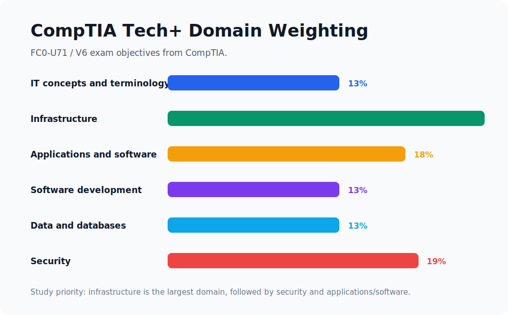
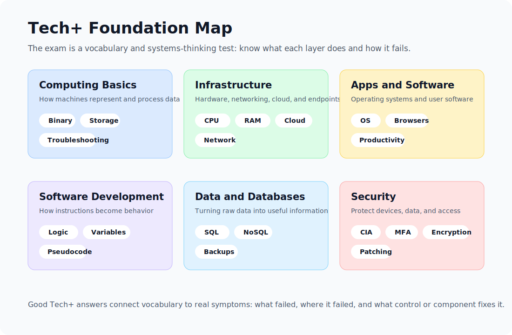
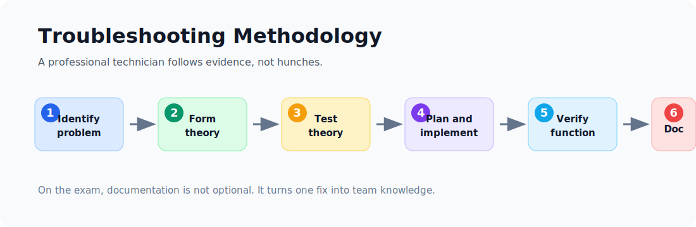

Whether you are transitioning into a tech career, aiming for a Help Desk role, or setting the groundwork for advanced cybersecurity certifications, the **CompTIA Tech+** (formerly IT Fundamentals+) certification is the perfect launching pad. It provides the universal vocabulary needed to navigate the ever-evolving landscape of Information Technology.

In this extensive guide, we will break down all six domains of the CompTIA Tech+ exam. Written from the perspective of a seasoned IT professional, this cheatsheet is packed with deep-dive explanations, real-world examples, and industry insights to ensure you don't just pass the exam - you truly understand the technology.

> **Exam details:** FC0-U71 / V6 - maximum of 70 multiple-choice questions - 60 minutes - passing score 650 on a 900-point scale - no prior experience required.

| Domain | Weight | What To Prioritize |
|---|---:|---|
| IT concepts and terminology | 13% | Computing basics, notation systems, units of measure, troubleshooting |
| Infrastructure | 24% | Devices, internal components, storage, peripherals, cloud, networking, wireless |
| Applications and software | 18% | Operating systems, software types, browser features, AI tools |
| Software development concepts | 13% | Language categories, data types, variables, logic, pseudocode, OOP |
| Data and database fundamentals | 13% | Data value, relational databases, non-relational databases, backup concepts |
| Security | 19% | CIA triad, device security, passwords, MFA, encryption, business continuity |

> **Reading path:** Use the domain map as a study plan, read the explanations in order, and return to the reference tables when you revise.

---

## Domain 1.0: IT Concepts and Terminology (13%)

Before you can build or defend a network, you must understand the foundational language of computing. 

### 1.1 The Basics of Computing
At its core, every computing device-from a smart thermostat to a supercomputer-operates on a four-stage data lifecycle:
1.  **Input:** The system receives data. This could be a keystroke on a keyboard, a voice command given to Alexa, or a sensor detecting room temperature.
2.  **Processing:** The brain of the computer (the CPU) takes the input and performs calculations or logic operations. It converts your keystroke into binary code that the machine understands.
3.  **Output:** The result of the processing is presented in a human-readable or usable format. The letter you typed appears on your monitor, or the smart speaker replies to your query.
4.  **Storage:** Data is saved for future use. When you hit "Save" on a document, the information is written to a hard drive or solid-state drive (SSD).

### 1.2 Notational Systems
Computers do not speak English; they speak numbers. Understanding how data is represented is crucial:
*   **Binary (Base-2):** The fundamental language of computing, consisting entirely of `0`s and `1`s. Every image, video, and text document is ultimately broken down into binary data.
*   **Hexadecimal (Base-16):** Uses numbers `0-9` and letters `A-F`. It is primarily used to make long strings of binary more human-readable. You will frequently encounter Hex in MAC addresses (e.g., `00:1A:2B:3C:4D:5E`) and IPv6 addresses.
*   **Decimal (Base-10):** The standard numbering system we use in everyday life. Used in IPv4 addresses (e.g., `192.168.1.1`).

### 1.3 Common Units of Measure
Knowing how to measure IT resources prevents bottlenecks and ensures system efficiency.
*   **Storage Capacity (Bytes):** A single letter is 1 Byte. Storage is measured in Kilobytes (KB), Megabytes (MB), Gigabytes (GB), and Terabytes (TB). 
*   **Throughput/Speed (Bits per second - bps):** Network speed is measured in bits, not bytes. An internet connection might be 1 Gigabit per second (Gbps) or 100 Megabits per second (Mbps). Notice the lowercase 'b' for bits and uppercase 'B' for Bytes.
*   **Processing Frequency (Hertz - Hz):** Measures how many cycles a processor can execute per second. A 3.5 GHz CPU can process 3.5 billion cycles every second.

### 1.4 The Troubleshooting Methodology
A professional IT technician doesn't guess; they follow a structured methodology to resolve issues efficiently:
1.  **Identify the problem:** Gather information from the user, identify symptoms, and duplicate the problem if possible.
2.  **Establish a theory of probable cause:** Start with the obvious. Is it plugged in? Is the network cable loose?
3.  **Test the theory:** If you suspect the cable is bad, swap it out. If the theory is proven incorrect, establish a new one.
4.  **Establish a plan of action:** Once the root cause is identified, plan how to resolve it safely without causing data loss.
5.  **Verify full system functionality:** Fix the issue and test the system. Implement preventive measures so it doesn't happen again.
6.  **Document findings:** Write down the symptoms, the cause, and the solution. Documentation is the lifeline of an efficient IT department.

> [!TIP]
> **Always start at Layer 1.** Physical issues (unplugged power cables, severed ethernet cables) account for a surprisingly high percentage of IT support tickets. Never assume the hardware is properly connected.

---

## Domain 2.0: Infrastructure (24%)

Infrastructure is the backbone of IT. It encompasses the hardware you can touch, the networks that connect them, and the cloud services that scale them.

### 2.1 Computing Devices and Their Purposes
*   **Traditional PCs & Laptops:** General-purpose computing for productivity and content creation.
*   **Mobile Devices (Tablets/Smartphones):** ARM-based processors optimized for battery life and portability.
*   **IoT (Internet of Things):** Smart appliances, security cameras, and industrial sensors. IoT devices prioritize connectivity and specialized functions over general processing power.

### 2.2 Internal Computing Components
*   **Motherboard:** The central nervous system. It connects all components and allows them to communicate via data pathways called "buses."
*   **CPU (Central Processing Unit):** The brain. It executes software instructions.
*   **RAM (Random Access Memory):** The volatile, short-term workspace. It stores data currently in use. When the computer turns off, RAM is wiped clean.
*   **GPU (Graphics Processing Unit):** Originally designed for rendering images, GPUs are now heavily used for parallel processing tasks like AI training and cryptocurrency mining.
*   **PSU (Power Supply Unit):** Converts AC power from your wall outlet into the DC power required by internal components.

### 2.3 Storage Types
*   **HDD (Hard Disk Drive):** Uses spinning magnetic platters. They are inexpensive and offer massive storage capacities but are slow and fragile.
*   **SSD (Solid State Drive):** Uses NAND flash memory with zero moving parts. They are incredibly fast, durable, and energy-efficient.
*   **NVMe (Non-Volatile Memory Express):** A protocol specifically designed for SSDs that connects directly to the motherboard's PCIe bus, offering blistering speeds that dwarf traditional SATA SSDs.

### 2.4 & 2.5 Peripheral Devices and Interfaces
Peripherals expand a computer's capabilities. They connect via standardized interfaces:
*   **USB-C:** The modern king of interfaces. It is reversible and can simultaneously transmit data, deliver power (up to 240W), and stream 4K video.
*   **HDMI & DisplayPort:** The industry standards for transmitting high-definition audio and video to monitors.
*   **Bluetooth:** Used for short-range wireless peripherals like headsets and mice.

### 2.6 Virtualization and Cloud Technologies
*   **Virtualization:** The use of software (a Hypervisor) to abstract physical hardware, allowing you to run multiple independent Virtual Machines (VMs) on a single physical server. It maximizes hardware utilization.
*   **Cloud Computing:** Renting computing resources over the internet.
    *   *IaaS (Infrastructure as a Service):* Renting raw servers and storage (e.g., AWS EC2).
    *   *PaaS (Platform as a Service):* A pre-configured environment for developers to build apps without managing the OS (e.g., Heroku).
    *   *SaaS (Software as a Service):* Fully hosted applications accessible via a browser (e.g., Google Workspace, Salesforce).

### 2.7 - 2.9 Networking Concepts and Wireless
*   **IP Addressing:** Every device on a network needs a unique identifier. IPv4 addresses are standard (`192.168.1.50`), while IPv6 was introduced to solve the shortage of addresses using hexadecimal format.
*   **DNS (Domain Name System):** Translates human-readable domain names (like `google.com`) into machine-readable IP addresses.
*   **Wireless Networks (Wi-Fi):**
    *   **2.4 GHz Band:** Penetrates walls well, offers greater range, but is slower and susceptible to interference from microwaves and Bluetooth devices.
    *   **5 GHz Band:** Offers significantly faster speeds and less interference but has a shorter range and struggles to penetrate solid objects.
    *   **Security:** Always use **WPA3** (or at least WPA2) to encrypt your wireless traffic. Never use WEP, as it can be cracked in minutes.

---

## Domain 3.0: Applications and Software (18%)

Hardware is merely dead metal and silicon without software to tell it what to do.

### 3.1 Software Types
*   **Productivity:** Word processors, spreadsheet applications (Excel), and presentation software.
*   **Collaboration:** Tools designed for teamwork, such as Microsoft Teams, Slack, and Zoom.
*   **Business/Enterprise:** CRM (Customer Relationship Management) software like Salesforce, or ERP (Enterprise Resource Planning) software like SAP.

### 3.2 Operating Systems (OS)
The OS acts as the mediator between the hardware and the user. It handles file management, memory allocation, and provides a User Interface (GUI or CLI).
*   **Windows:** Dominates the corporate desktop environment.
*   **macOS:** UNIX-based OS known for its tight integration with Apple hardware and popularity among creatives.
*   **Linux:** Open-source, incredibly stable, and the undisputed king of web servers, cloud infrastructure, and IoT devices.

### 3.3 Software Licensing
*   **Open Source:** The source code is publicly available. Anyone can view, modify, and distribute it (e.g., Linux, Mozilla Firefox).
*   **Proprietary / Commercial:** The source code is hidden, and you must purchase a license to use the compiled software (e.g., Microsoft Office).
*   **Subscription:** You pay a recurring fee (monthly/annually) for access. If you stop paying, the software stops working (e.g., Adobe Creative Cloud).

### 3.4 Web Browser Features
*   **Cookies:** Small text files saved by websites to remember your preferences or keep you logged in.
*   **Cache:** Browsers temporarily store website assets (images, scripts) locally. When you revisit the site, it loads much faster because it pulls from the local cache rather than redownloading everything.
*   **Private/Incognito Browsing:** 
    > [!WARNING]
    > Incognito mode **does not make you anonymous**. It only prevents your browser from saving local history, cookies, and form data. Your ISP, employer, and the websites you visit can still track your activity.

### 3.5 Uses of Artificial Intelligence (AI)
AI is no longer science fiction; it is woven into modern IT.
*   **Machine Learning (ML):** Algorithms that analyze data, identify patterns, and make decisions with minimal human intervention (e.g., email spam filters).
*   **Generative AI & NLP:** Large Language Models (LLMs) like ChatGPT can generate code, draft emails, and translate languages with near-human fluency.

---

## Domain 4.0: Software Development Concepts (13%)

You don't need to be a senior software engineer to pass Tech+, but you must understand how code dictates system behavior.

### 4.1 Programming Language Categories
*   **Compiled Languages:** Code is translated into machine language all at once by a compiler before execution. These programs run very fast (e.g., C, C++, Go).
*   **Interpreted Languages:** Code is read and executed line-by-line by an interpreter at runtime. They are highly flexible and great for scripting (e.g., Python, JavaScript).
*   **Query Languages:** Used specifically to interact with databases to retrieve or manipulate data (e.g., SQL).

### 4.2 Fundamental Data Types
When coding, you must tell the computer what type of data it is handling:
*   **String:** A sequence of characters, like `"Hello, World!"` or `"Password123"`.
*   **Integer:** A whole number, like `42` or `-10`.
*   **Float:** A decimal number, like `3.14159`.
*   **Boolean:** Represents a logical state; it can only be `True` or `False`.

### 4.3 & 4.4 Programming Logic and Concepts
*   **Variables:** Think of them as labeled containers. If you declare `score = 100`, the variable `score` holds the integer 100.
*   **Branching (If/Else):** Allows the program to make decisions. *If* the user enters the correct password, grant access; *Else*, show an error message.
*   **Looping:** Executes a block of code repeatedly. A `While` loop runs *while* a certain condition remains true. A `For` loop runs a specific number of times.
*   **Object-Oriented Programming (OOP):** A paradigm that organizes software design around data, or "objects," rather than functions and logic. It utilizes "Classes" (blueprints) and "Objects" (instances of the blueprint).

---

## Domain 5.0: Data and Database Fundamentals (13%)

Data is often described as the "new oil." Extracting, storing, and securing it is a massive sector of the IT industry.

### 5.1 The Value of Data and Information
*   **Data:** Raw, unprocessed facts. For example, the number `35`.
*   **Information:** Data that has been processed to have context and meaning. For example, "It is `35` degrees Celsius outside."
Organizations rely on databases to turn raw data into actionable information for business intelligence.

### 5.2 & 5.3 Database Concepts and Structures
Why use a database instead of a spreadsheet? Databases handle millions of records effortlessly, allow hundreds of users to access data simultaneously (concurrency), and enforce strict data integrity rules.
*   **Relational Databases (RDBMS):** Data is organized into highly structured tables consisting of rows and columns. Tables are linked by relationships. You interact with them using SQL (e.g., PostgreSQL, Microsoft SQL Server).
*   **Non-Relational Databases (NoSQL):** Designed for flexibility and scalability. They can store unstructured data in formats like JSON documents or key-value pairs, making them ideal for massive, fast-changing datasets (e.g., MongoDB, Redis).

### 5.4 Data Backup Concepts
Hardware will inevitably fail, and cyberattacks will happen. Backups are your ultimate failsafe.
*   **Full Backup:** Copies absolutely everything. It takes the longest to run and uses the most storage space, but it is the fastest to restore.
*   **Incremental Backup:** Copies only the data that has changed since the *last backup* (of any type). Fast to run, but restoring requires the last Full Backup plus every subsequent Incremental Backup in order.
*   **Differential Backup:** Copies all data that has changed since the *last Full Backup*. Faster to restore than Incremental, as it only requires the Full Backup and the latest Differential Backup.

> [!IMPORTANT]
> **The 3-2-1 Rule of Backups:** Maintain **3** copies of your data, stored on **2** different types of media, with at least **1** copy kept securely off-site (like in the cloud).

---

## Domain 6.0: Security (19%)

Security is not a department; it is a mindset that must be woven into every layer of IT.

### 6.1 The CIA Triad
The foundation of all cybersecurity frameworks relies on three core principles:
1.  **Confidentiality:** Ensuring data is accessible only to authorized individuals. We achieve this primarily through **Encryption**.
2.  **Integrity:** Ensuring data remains accurate and unaltered during storage or transit. If an attacker modifies a bank transfer amount, integrity is lost. We achieve this through **Hashing**.
3.  **Availability:** Ensuring systems and data are accessible to authorized users when needed. We achieve this through hardware redundancy, backups, and DDoS protection.

### 6.2 Security Best Practices
*   **Principle of Least Privilege (PoLP):** Users should only be given the absolute minimum access rights necessary to perform their job functions. An intern doesn't need domain administrator rights.
*   **Patch Management:** Software vulnerabilities are constantly discovered. Regularly applying security updates (patches) to OS and applications is critical.
*   **Endpoint Protection:** Utilizing Next-Generation Antivirus (NGAV) and Host-Based Firewalls to block malicious software.

### 6.3 Password and Authentication Practices
Passwords are the weakest link in security.
*   Avoid predictable passwords. Use passphrases (e.g., `PurpleMonkeyDishwasher42!`).
*   **Never reuse passwords.** If one site is breached, attackers will test those credentials across other platforms (Credential Stuffing).
*   **Multi-Factor Authentication (MFA):** This is non-negotiable. Even if an attacker steals your password, they cannot access your account without the second factor (like an authenticator app code or a hardware security key).

### 6.4 Encryption Use Cases
Encryption uses complex mathematical algorithms to scramble data so it cannot be read without the decryption key.
*   **Data at Rest:** Securing data stored on a physical drive. If a laptop is stolen, full-disk encryption like Windows BitLocker or macOS FileVault ensures the thief cannot extract the files.
*   **Data in Transit:** Securing data as it travels across a network. We use protocols like TLS (Transport Layer Security) to encrypt web traffic, ensuring that the connection to your bank is safe (indicated by the `HTTPS` lock icon).

### 6.5 Business Continuity
When disaster strikes-be it a ransomware attack, a hurricane, or a massive hardware failure-the business must survive.
*   **Disaster Recovery (DR):** The technical process of restoring IT infrastructure.
*   **RTO (Recovery Time Objective):** How quickly must the system be brought back online? (e.g., The system must be up within 4 hours).
*   **RPO (Recovery Point Objective):** How much data loss can the business tolerate? (e.g., If backups happen nightly, the RPO is 24 hours of data loss).
*   **Fault Tolerance:** Building systems with redundant components (like dual power supplies or RAID storage arrays) so that if one piece fails, the system continues to run seamlessly.

---

## Conclusion

The CompTIA Tech+ certification is an extraordinary milestone. It demystifies the black boxes of technology, revealing how hardware, software, networking, and security interplay to drive the modern world. By internalizing these foundational concepts, you are not merely memorizing terms to pass an exam - you are building a robust technical vocabulary that will serve as the bedrock for a successful, lifelong career in Information Technology.

Keep exploring, keep building, and stay curious. The world of IT is vast, and you have just taken the perfect first step.

---

## Sources

- [CompTIA Tech+ certification page](https://www.comptia.org/en-us/certifications/tech/)
