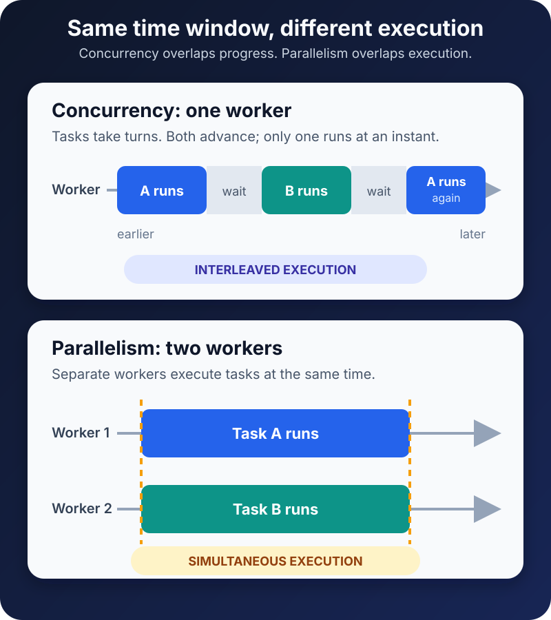

A service feels slow, so the team gives it more workers.

The request queue becomes shorter, but CPU usage stays almost unchanged. Someone adds even more workers. Now memory consumption rises, logs arrive in a confusing order, and the slowest requests are slower than before.

The mistake was not using too few workers. It was treating two different ideas as if they promised the same result.

**Concurrency is about allowing multiple tasks to make progress during the same period. Parallelism is about executing multiple tasks at the same instant.**

That distinction sounds small. In practice, it tells you whether an application needs better scheduling, more CPU cores, less blocking, safer coordination, or simply fewer competing tasks.

## The short answer

A concurrent program can begin one task, pause it while it waits, work on another task, and return to the first later. The tasks overlap in time, even if one CPU core executes only one of them at any instant.

A parallel program performs work simultaneously. Two CPU cores might each resize a different image at the same moment, or a GPU might apply the same operation to many data elements together.

The [official Go explanation](https://go.dev/blog/waza-talk) captures the difference neatly: concurrency is a way to compose independently executing work, while parallelism is simultaneous execution. Concurrency is primarily about **structure and coordination**. Parallelism is primarily about **simultaneous capacity**.

The upper timeline is concurrent but not parallel. Task A and Task B both advance, yet only one is running at any instant. The lower timeline is parallel because two workers execute at the same time. A real system can use either model, or both together.

## Concurrency is useful when work spends time waiting

Imagine an API that must call a database and an inventory service before responding.

If the application handles one request from start to finish before accepting the next, the CPU may sit idle while the first request waits for the network. The computer is capable of useful work, but the program has not given it anything else to do.

Concurrency changes the structure. When request A waits for the database, the runtime can advance request B. When B waits for inventory, request C can run. One worker may keep many operations in flight because waiting operations do not need the CPU continuously.

This is the basic advantage of an event loop. [Python's `asyncio` documentation](https://docs.python.org/3/library/asyncio-dev.html), for example, explains that one task runs in the event-loop thread until it reaches an `await`; the task then suspends and the loop can run another task. The tasks are concurrent, but their Python code is not executing simultaneously in that one thread.

The same pattern appears in web servers, user interfaces, network clients, and job coordinators. Their challenge is often not “How can I calculate faster?” It is “How can the application remain useful while operations wait?”

Concurrency can improve responsiveness and throughput without adding a second CPU core. It does not make the waiting resource faster. It keeps that wait from needlessly freezing unrelated work.

## Parallelism is useful when work consumes the CPU

Now replace the database calls with four large images that must be decoded and resized.

There may be little waiting. Each resize keeps a processor busy doing calculations. Interleaving all four jobs on one core can make progress appear fair, but it does not create more computing capacity. The jobs still share the same core.

Parallel execution can help when the work can be split into sufficiently independent pieces and the machine has resources to execute them simultaneously. Four cores could process four images at once. A fork/join pool could divide a large calculation into partitions. A GPU could run many suitable operations together.

Hardware sets a ceiling, however. [Microsoft documents](https://learn.microsoft.com/en-us/windows/win32/procthread/about-processes-and-threads) that on a multiprocessor Windows system, the scheduler can simultaneously execute as many threads as available processors permit. Creating 100 runnable CPU-bound threads on four logical processors does not create 100-way parallelism. Most of those threads must wait for processor time.

Nor is more parallelism automatically faster. Work must be divided, scheduled, coordinated, and combined. Threads may contend for locks or memory bandwidth. Data may move between caches. If the coordination costs more than the useful calculation, additional workers can reduce performance. The [Go FAQ](https://go.dev/doc/faq#Why_no_multiCPU) explicitly warns that programs dominated by synchronization or communication can slow down when more CPUs are involved.

## One comparison that prevents most confusion

| Question | Concurrency | Parallelism |
| --- | --- | --- |
| Core idea | Multiple tasks are in progress during overlapping time | Multiple tasks execute at the same instant |
| Main goal | Responsiveness, coordination, and efficient use of waiting time | Shorter completion time or higher CPU-bound throughput |
| Requires multiple CPU cores? | No | Yes, for CPU instructions to run simultaneously |
| Common mechanisms | Event loops, async tasks, coroutines, threads, queues | Multiple cores, worker threads or processes, SIMD, GPUs |
| Typical fit | Network calls, user interfaces, servers, orchestration | Rendering, encoding, simulation, numerical processing |
| Main hazards | Races, deadlocks, starvation, overload, cancellation bugs | All concurrency hazards plus contention and parallel overhead |

The mechanisms overlap because threads and processes can support either idea. Two threads time-sliced on one core provide concurrency without CPU parallelism. The same two threads scheduled on separate cores may execute in parallel. A program's structure and its runtime execution are related, but they are not identical.

## Async does not mean parallel

The `async` keyword is frequently described as “running in the background.” That phrase hides the important question: **where does the code run when it resumes?**

In a single-threaded event loop, asynchronous tasks cooperate by yielding at suspension points. While one task waits for a socket, another can run. But a long CPU-bound callback that never yields can monopolize the thread and delay every other task.

This is why adding `async` around an expensive calculation usually does not make the calculation parallel. The work may need to be sent to a thread pool, process pool, separate service, or accelerator. The right choice depends on the runtime. Python, Java, JavaScript, Go, and Swift do not map language-level tasks to operating-system threads in exactly the same way.

Keep three layers separate in your mental model:

1. **Tasks describe the work.** Fetch a profile, resize an image, or calculate a report.
2. **Schedulers decide when work runs.** An event loop, executor, runtime, or operating system makes this decision.
3. **Hardware determines what can run simultaneously.** CPU cores and other execution units provide parallel capacity.

An API can expose thousands of lightweight tasks while a runtime schedules them over a much smaller number of threads. [Oracle's Java SE 26 guide](https://docs.oracle.com/en/java/javase/26/core/java-core-libraries-developer-guide.pdf) makes this separation visible: Java executors define execution policies, while virtual threads are intended for high-throughput concurrent applications and fork/join pools are designed to use multiple processors for suitable work.

## Concurrency can exist without threads

Threads are schedulable execution paths inside a process, but they are not the definition of concurrency.

A single-threaded event loop can manage many concurrent network operations. Multiple processes can exchange messages and coordinate a pipeline. A database can interleave transactions. A distributed system can have independent services making progress on different machines.

Threads matter because they are one common way to execute work, share memory, and potentially use several cores. They also introduce shared-state risks. If two threads update the same mutable value without correct synchronization, the result can depend on timing.

That problem belongs to concurrency even when execution is not parallel. A task can be suspended halfway through a logical operation, another task can change shared state, and the first can resume with an assumption that is no longer true. Cooperative scheduling reduces some forms of preemption; it does not remove the need to reason about interleaving.

For the memory and failure boundaries behind this choice, see [Process vs Thread: What Is the Difference?](/posts/process-vs-thread-explained/).

## Start with the bottleneck, not the mechanism

Suppose a report endpoint is missing its latency target. “Make it concurrent” is not yet a solution.

First, separate waiting from computing.

If traces show independent database and network calls happening one after another, safely overlapping them may reduce idle time. If the service already has many requests in flight but the database connection pool is saturated, more concurrency will only produce a longer queue. The limit may need to remain bounded while the query or capacity problem is fixed.

If profiles show one core fully occupied by a divisible calculation, parallel execution may help. Measure with realistic inputs and worker counts. If several cores are already busy and throughput does not improve, look for contention, memory pressure, serialization, or a sequential phase.

The useful metrics are concrete:

- **Latency:** How long does one operation take, including queueing and waiting?
- **Throughput:** How much useful work completes per unit of time?
- **Utilization:** Which resource is busy—CPU, storage, network, connection pool, or downstream service?
- **Contention:** How much time is lost waiting for locks, shared resources, or worker capacity?
- **Queue depth:** Is the system absorbing a brief burst or accumulating work it cannot finish?

Without those measurements, increasing a worker count is guesswork disguised as scaling.

## Common mistakes

The first mistake is assuming concurrent means unordered. Concurrency makes several execution orders *possible*, but a correct design can still enforce ordering where it matters through queues, locks, transactions, or explicit dependencies.

The second is launching unbounded work. Ten thousand tasks may be lightweight individually and still overwhelm memory, a database pool, or an external API together. Concurrency limits and backpressure are correctness features, not just performance tuning.

The third is sharing mutable state casually. Parallel execution can expose races more frequently, but an interleaved concurrent system can already contain them. Prefer immutable data, clear ownership, message passing, or the smallest synchronization boundary that preserves the required invariant.

The fourth is measuring only CPU usage. An I/O-heavy service can deliver excellent throughput at modest CPU utilization. A CPU-heavy program can report full utilization while spending much of its time contending rather than completing useful work.

The fifth is forgetting cancellation and failure. If one part of a concurrent operation fails, decide whether sibling tasks should continue, be cancelled, or return a partial result. Modern structured-concurrency APIs try to make those lifetimes explicit, but the application still owns the policy.

## A practical decision checklist

Before adding async tasks, threads, processes, or workers, ask:

- Is the workload mostly waiting, computing, or blocked on contention?
- Which pieces are genuinely independent, and which require an order?
- What limits in-flight work so bursts do not become overload?
- Does the runtime permit this work to execute on multiple cores?
- What state is shared, who owns it, and how is it protected?
- How do timeout, cancellation, error propagation, and shutdown behave?
- Which latency, throughput, and resource measurements will prove improvement?

Concurrency and parallelism are not competing technologies. A well-designed server often uses both: concurrent tasks keep many requests moving while bounded parallel workers handle expensive computation.

The concise takeaway is this: **use concurrency to organize independent work and avoid wasting time while it waits; use parallelism when simultaneous execution can accelerate work that truly consumes compute.** Start with the bottleneck, make ownership explicit, and let measurements decide how much overlap the system can safely use.

## Continue learning

- [Process vs Thread: What Is the Difference?](/posts/process-vs-thread-explained/)
- [JavaScript Event Loop: Tasks, Microtasks, and Rendering](/posts/javascript-event-loop-tasks-microtasks-rendering/)
- [Swift Concurrency: async/await, Tasks, and Actors Explained](/posts/swift-concurrency-async-await-tasks-actors/)
- [What Is Software Architecture? A Beginner's Guide](/posts/software-architecture-beginners-guide/)

## Sources

- [The Go Blog: Concurrency Is Not Parallelism](https://go.dev/blog/waza-talk)
- [Go FAQ: Why Doesn't My Program Run Faster with More CPUs?](https://go.dev/doc/faq#Why_no_multiCPU)
- [Python 3.14 documentation: Developing with asyncio](https://docs.python.org/3/library/asyncio-dev.html)
- [Microsoft Learn: About Processes and Threads](https://learn.microsoft.com/en-us/windows/win32/procthread/about-processes-and-threads)
- [Oracle: Java SE 26 Core Libraries Developer Guide](https://docs.oracle.com/en/java/javase/26/core/java-core-libraries-developer-guide.pdf)
