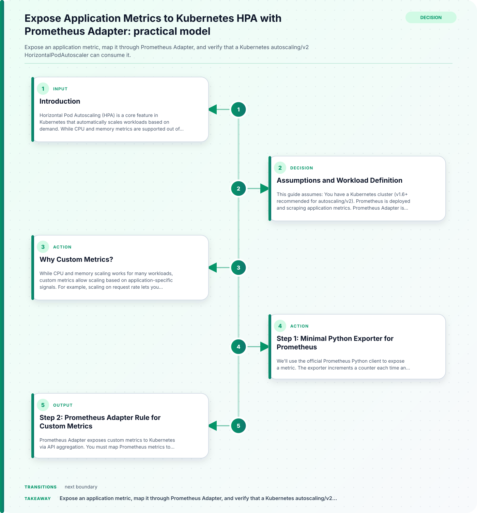

## Introduction

Horizontal Pod Autoscaling (HPA) is a core feature in Kubernetes that automatically scales workloads based on demand. While CPU and memory metrics are supported out of the box, many applications require autoscaling based on custom metrics, such as queue depth, request rate, or business-specific signals. This tutorial walks through exposing a custom metric from a Python application, mapping it through Prometheus Adapter, and validating its consumption by a Kubernetes autoscaling/v2 HPA. We'll also cover RBAC, API aggregation, expected results, and diagnostic steps for disappearing metrics.

## Assumptions and Workload Definition

This guide assumes:



- You have a Kubernetes cluster (v1.6+ recommended for autoscaling/v2).
- Prometheus is deployed and scraping application metrics.
- Prometheus Adapter is installed and configured for custom.metrics.k8s.io API aggregation.
- You have permissions to create RBAC roles, deployments, and HPAs.

The concrete workload is a Python web service exposing a custom metric (`my_app_requests_total`) via Prometheus client. The goal is to scale the deployment based on this metric, as scraped and mapped through Prometheus Adapter.

## Why Custom Metrics?

While CPU and memory scaling works for many workloads, custom metrics allow scaling based on application-specific signals. For example, scaling on request rate lets you respond to spikes in user activity, while queue depth can prevent backlog. Custom metrics are essential for workloads where resource usage is not directly correlated with demand.

## Step 1: Minimal Python Exporter for Prometheus

We'll use the official Prometheus Python client to expose a metric. The exporter increments a counter each time an endpoint is hit.

```python
# my_app.py
from prometheus_client import Counter, start_http_server
from flask import Flask

app = Flask(__name__)
REQUESTS = Counter('my_app_requests_total', 'Total requests to my_app')

@app.route('/')
def index():
    REQUESTS.inc()
    return 'Hello, World!'

if __name__ == '__main__':
    start_http_server(8000)  # Prometheus metrics endpoint
    app.run(host='0.0.0.0', port=5000)
```

- Deploy this app in Kubernetes, exposing port 8000 for Prometheus scraping.
- Add a ServiceMonitor or scrape config in Prometheus to collect `my_app_requests_total`.

## Step 2: Prometheus Adapter Rule for Custom Metrics

Prometheus Adapter exposes custom metrics to Kubernetes via API aggregation. You must map Prometheus metrics to Kubernetes objects using rules.

Example snippet for Prometheus Adapter config (YAML):

```yaml
rules:
  custom:
    - seriesQuery: 'my_app_requests_total{namespace="$namespace",pod="$pod"}'
      resources:
        overrides:
          pod:
            resource: pod
      name:
        matches: 'my_app_requests_total'
        as: 'requests_per_pod'
      metricsQuery: 'sum(my_app_requests_total{namespace="$namespace",pod="$pod"}) by (pod)'
```

- This rule maps the Prometheus metric `my_app_requests_total` to the Kubernetes custom metric `requests_per_pod`.
- The adapter will expose this metric under the custom.metrics.k8s.io API.

## Step 3: RBAC for Metrics Access

Kubernetes uses RBAC to control access to custom metrics APIs. The HPA controller must be able to read custom metrics.

Example RBAC manifest:

```yaml
apiVersion: rbac.authorization.k8s.io/v1
kind: ClusterRole
metadata:
  name: custom-metrics-reader
rules:
- apiGroups: ["custom.metrics.k8s.io"]
  resources: ["pods"]
  verbs: ["get", "list", "watch"]
---
apiVersion: rbac.authorization.k8s.io/v1
kind: ClusterRoleBinding
metadata:
  name: hpa-custom-metrics-binding
roleRef:
  apiGroup: rbac.authorization.k8s.io
  kind: ClusterRole
  name: custom-metrics-reader
subjects:
- kind: ServiceAccount
  name: hpa-controller
  namespace: kube-system
```

- Adjust the ServiceAccount as needed for your cluster.
- Without correct RBAC, HPA cannot read custom metrics.

## Step 4: Autoscaling/v2 HPA Manifest

The autoscaling/v2 API allows HPAs to scale based on custom metrics. Example manifest:

```yaml
apiVersion: autoscaling/v2
kind: HorizontalPodAutoscaler
metadata:
  name: my-app-hpa
spec:
  scaleTargetRef:
    apiVersion: apps/v1
    kind: Deployment
    name: my-app
  minReplicas: 2
  maxReplicas: 10
  metrics:
  - type: Pods
    pods:
      metric:
        name: requests_per_pod
      target:
        type: AverageValue
        averageValue: "100"
```

- This HPA scales `my-app` deployment based on the average value of `requests_per_pod`.
- The metric name must match the adapter rule.

## Step 5: Validating Custom Metric Discovery

After deploying the exporter, Prometheus Adapter, and HPA, validate metric discovery:

```bash
kubectl get --raw "/apis/custom.metrics.k8s.io/v1beta1/" | jq
```

- This command lists available custom metrics.
- You should see `requests_per_pod` listed.

To check metric values for pods:

```bash
kubectl get --raw "/apis/custom.metrics.k8s.io/v1beta1/namespaces/default/pods/*/requests_per_pod"
```

- Replace `default` with your namespace.
- The output shows metric values per pod.

## Practical Decisions and Scenarios

### 1. Metric Granularity and Mapping

- Decide whether to map metrics per pod, per deployment, or cluster-wide.
- Per-pod metrics allow fine-grained scaling, but require correct labeling and Prometheus scraping.

### 2. RBAC and Security

- Ensure only the HPA controller and trusted users can access custom metrics.
- Overly broad RBAC can expose sensitive application metrics.

### 3. API Aggregation and Adapter Configuration

- Prometheus Adapter must be correctly configured for API aggregation.
- Misconfigured rules or missing series queries can prevent metrics from appearing.

## Expected Results

- HPA should scale pods up or down based on the custom metric.
- `kubectl describe hpa my-app-hpa` shows metric values and scaling events.
- Custom metrics appear in the API and are updated as Prometheus scrapes them.

## Diagnostics: Disappearing Metrics

If custom metrics disappear from the API or HPA stops scaling:

| Symptom                        | Possible Cause                     | Diagnostic Command           | Resolution                      |
|--------------------------------|------------------------------------|------------------------------|----------------------------------|
| Metric missing from API        | Prometheus Adapter rule error      | kubectl logs prometheus-adapter | Fix rule, reload adapter         |
| Metric value is zero           | Prometheus scrape config missing   | kubectl logs prometheus      | Update scrape config, redeploy   |
| HPA not scaling                | RBAC misconfiguration              | kubectl describe hpa         | Correct RBAC, check HPA events   |
| Metric appears/disappears      | Prometheus relabeling issue        | kubectl get pods             | Check pod labels, relabel config |

- Always check Prometheus Adapter logs for rule parsing errors.
- Verify Prometheus scrape targets and metric values.
- Confirm RBAC roles are bound to the correct service accounts.

## Comparison Recommendations

- For workloads with predictable CPU/memory usage, built-in metrics may suffice.
- For event-driven or business-logic scaling, custom metrics via Prometheus Adapter provide flexibility.
- Choose metric granularity based on scaling needs: per pod for fine control, per deployment for aggregate scaling.

## Conclusion

Exposing custom application metrics to Kubernetes HPA via Prometheus Adapter enables powerful, application-aware autoscaling. By following this guide, you can:

- Instrument your application with Prometheus metrics.
- Map those metrics to Kubernetes objects using Prometheus Adapter rules.
- Secure access with RBAC.
- Validate metric discovery and HPA consumption.
- Diagnose and resolve common issues.

This approach is supported by official Kubernetes and Prometheus Adapter documentation, ensuring compatibility and reliability for production workloads.

## Related guidance

- [Operating AI/ML Workloads on Kubernetes: A Headlamp Plugin for Kubeflow](/posts/operating-ai-ml-workloads-kubernetes/) — foundational reference.
- [Common Kubernetes Probe Misconfigurations and Fixes](/posts/kubernetes-probe-misconfigurations-fixes/) — supporting reference.

## Implementation review boundary

Before applying Expose Application Metrics to Kubernetes HPA with Prometheus Adapter, record the implementation boundary used by the procedure: product and API version, environment, required role or permission, starting configuration, expected output, validation query, and rollback point. Run the example against an isolated resource or test workload whose scope is explicit. Preserve the non-secret command output and timestamp so a reviewer can distinguish the documented path from a local configuration difference.

Treat completion as an evidence check for developer it tools, not merely as a command returning zero. Match the observed resource, field, or response to the expected result described in the article. If the result differs, stop at the stated rollback boundary and identify which assumption changed before retrying. Record the source-document date and any environment limitation so the procedure can be reassessed when a service, dependency, or interface evolves.

## Sources

- [Horizontal Pod Autoscaling | Kubernetes](https://kubernetes.io/docs/concepts/workloads/autoscaling/horizontal-pod-autoscale)
- [GitHub - kubernetes-sigs/prometheus-adapter: An implementation of the custom.metrics.k8s.io API using Prometheus · GitHub](https://github.com/kubernetes-sigs/prometheus-adapter)
- [GitHub - prometheus/client_python: Prometheus instrumentation library for Python applications · GitHub](https://github.com/prometheus/client_python)
