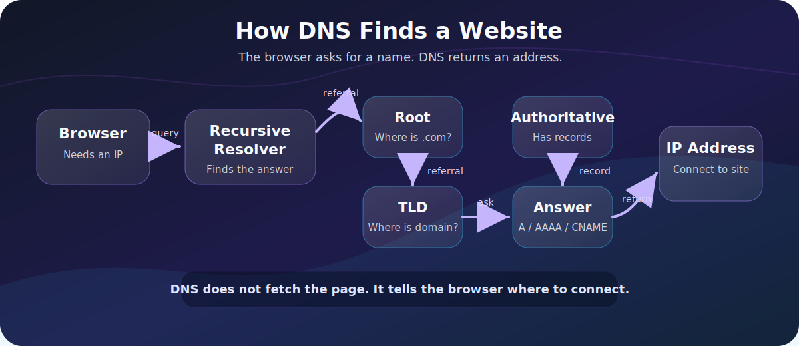
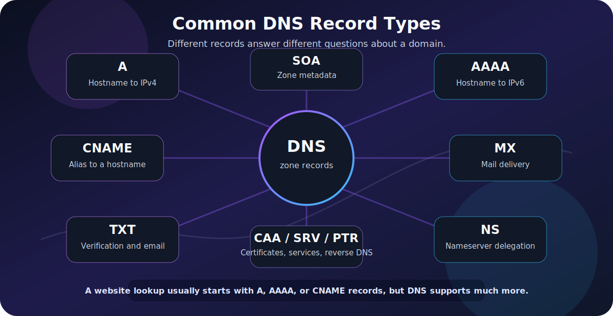

When you type `compilemymind.com` into a browser, your computer does not magically know where that website lives. The browser needs an IP address before it can connect to a server.

That is what **DNS** does.

**DNS**, short for **Domain Name System**, is the internet's naming system. It translates human-friendly names like `www.example.com` into machine-usable addresses like `93.184.216.34` or an IPv6 address such as `2606:2800:220:1:248:1893:25c8:1946`.

The simplest version:

1. You type a domain name.
2. DNS finds the IP address.
3. Your browser connects to that IP address.
4. The website loads.

But the real process is more interesting. DNS involves caches, recursive resolvers, root servers, TLD servers, authoritative nameservers, record types, time-to-live values, and sometimes privacy or security layers such as DNS over HTTPS and DNSSEC.

This guide explains the full journey in practical terms.

If you want the lower-level networking foundation first, read [Network Communication Basics](/posts/network-communication-basics/), [Internet Protocol (IP) Explained](/posts/internet-protocol-ip-basics/), and [TCP vs UDP Explained With Examples](/posts/tcp-vs-udp-explained-with-examples/).



> **Reading path:** Start with the mental model, follow the worked request or packet examples, and finish with the troubleshooting or memory guide.

---

## DNS in One Sentence

DNS is a distributed database that maps names to records.

The most familiar mapping is:

| Name | Record Type | Result |
|---|---:|---|
| `example.com` | `A` | IPv4 address |
| `example.com` | `AAAA` | IPv6 address |
| `www.example.com` | `CNAME` | Another hostname |
| `example.com` | `MX` | Mail server |

The important point: **DNS does not download the website. DNS only helps your computer find where to connect.**

After DNS returns an IP address, the browser still needs to open a network connection, negotiate encryption, send an HTTP request, and receive the website response.

---

## Why DNS Exists

Computers route traffic using IP addresses. Humans prefer names.

Imagine if you had to remember websites like this:

- 142.250.184.206
- 151.101.1.140
- 104.18.32.47

That would be miserable, and it would also be fragile. Websites move between hosting providers, use CDNs, add IPv6, change load balancers, and route users to different regions.

DNS solves that by separating the name from the location.

DNS separates the stable name a person remembers, such as `compilemymind.com`, from the one or more IP addresses the network uses.

That separation lets site owners change infrastructure without forcing every visitor to learn a new address.

---

## The Main DNS Players

DNS resolution is easier to understand when you know the roles.

| Component | What It Does | Example |
|---|---|---|
| Browser | Starts the lookup when it needs a hostname | Chrome, Firefox, Edge |
| Operating system resolver | Handles DNS requests for applications | Windows DNS Client, systemd-resolved |
| Recursive resolver | Performs the lookup on your behalf | ISP DNS, Cloudflare `1.1.1.1`, Google `8.8.8.8` |
| Root nameserver | Points resolvers toward the correct top-level domain | Root zone for `.com`, `.org`, `.net` |
| TLD nameserver | Knows where domains under that TLD are delegated | `.com` nameservers |
| Authoritative nameserver | Holds the actual DNS records for the domain | Nameservers for `example.com` |

The browser usually does not talk directly to root or authoritative nameservers. It asks a **recursive resolver**, and that resolver does the work.

---

## Step-by-Step: What Happens When You Visit a Website

Let's say you type:

`https://www.example.com/`

The browser needs the IP address for `www.example.com`.

### Step 1: The Browser Checks Its Own Cache

Browsers keep DNS answers for a short time.

If you recently visited the same site, the browser may already know the answer:

`www.example.com -> 93.184.216.34`

If the answer is still valid, the browser can skip a network DNS request.

### Step 2: The Operating System Checks Its DNS Cache

If the browser cache does not have the answer, the browser asks the operating system.

The OS may also have cached DNS results from earlier requests by the browser or other applications.

On Windows, you can view the DNS cache with:

```powershell
ipconfig /displaydns
```

And clear it with:

```powershell
ipconfig /flushdns
```

### Step 3: The Request Goes to a Recursive Resolver

If the answer is not cached locally, the OS sends the query to a configured DNS resolver.

That resolver might be:

- Your home router.
- Your ISP's DNS resolver.
- A public resolver such as Cloudflare, Google, Quad9, or OpenDNS.
- A corporate DNS resolver on a company network.
- A resolver configured by a VPN.

The resolver receives a question like:

What is the A record for www.example.com?

If it has the answer cached, it returns it immediately. If not, it starts the recursive lookup process.

### Step 4: The Resolver Asks the Root Nameservers

The resolver starts at the top of the DNS hierarchy: the root.

The root nameservers do not usually know the IP address of `www.example.com`. Instead, they know where to find information about top-level domains such as `.com`, `.org`, `.net`, and country-code TLDs like `.tr` or `.de`.

The resolver asks:

Where do I find information about .com?

The root nameserver answers with a referral to the `.com` TLD nameservers.

> [!NOTE]
> There are 13 logical root server identities, named A through M, but they are distributed across many physical locations using anycast. That means the internet does not rely on only 13 physical machines.

### Step 5: The Resolver Asks the TLD Nameservers

Next, the recursive resolver asks a `.com` TLD nameserver:

Where do I find information about example.com?

The `.com` TLD server does not usually return the website IP either. It returns the authoritative nameservers for `example.com`.

### Step 6: The Resolver Asks the Authoritative Nameserver

Now the resolver asks the authoritative nameserver:

What is the A record for www.example.com?

The authoritative nameserver responds with the actual DNS answer, such as:

`www.example.com.  3600  IN  A  93.184.216.34`

That answer includes a **TTL**, or **time to live**, which tells resolvers how long they may cache the response.

### Step 7: The Resolver Returns the Answer to Your Computer

The recursive resolver sends the answer back to your OS, and the OS gives it to the browser.

Now the browser has an IP address.

### Step 8: The Browser Connects to the Website

DNS is done. The browser can now connect to the server.

For an HTTPS website, the simplified flow looks like this:

| Stage | What it accomplishes |
| --- | --- |
| DNS lookup | Find an IP address |
| TCP or QUIC connection | Reach the server |
| TLS handshake | Establish encryption |
| HTTP request | Ask for the website response |

DNS answers the question:

Where is this website?

HTTP answers the question:

What content should the website send back?

---

## Recursive vs. Iterative DNS Queries

DNS explanations often use the words **recursive** and **iterative**. They are related, but different.

| Query Type | Who Does the Work? | What Happens |
|---|---|---|
| Recursive query | Recursive resolver | Client asks for the final answer; resolver finds it |
| Iterative query | Resolver follows referrals | DNS servers point the resolver to the next place to ask |

From your computer's perspective, DNS is usually recursive:

`Computer -> Resolver: Please find the answer for me.`

From the resolver's perspective, the process is iterative:

1. The computer asks the recursive resolver to find the answer.
2. The resolver asks a root server where to find the `.com` TLD.
3. The resolver asks the `.com` TLD where `example.com` is delegated.
4. The resolver asks the authoritative nameserver for `www.example.com`.

That division is why DNS can be both convenient for clients and scalable for the internet.

---

## DNS Record Types You Should Know

DNS is not only about website IP addresses. A DNS zone can contain many record types.



| Record | Purpose | Example Use |
|---|---|---|
| `A` | Maps a hostname to an IPv4 address | `example.com -> 93.184.216.34` |
| `AAAA` | Maps a hostname to an IPv6 address | `example.com -> 2606:...` |
| `CNAME` | Creates an alias to another hostname | `www -> example.com` |
| `MX` | Defines mail servers for a domain | Email delivery |
| `TXT` | Stores text values | SPF, DKIM, DMARC, domain verification |
| `NS` | Delegates a zone to nameservers | Which servers are authoritative |
| `SOA` | Stores zone metadata | Serial number, refresh intervals |
| `CAA` | Controls which certificate authorities may issue TLS certificates | Certificate security |
| `SRV` | Locates services by protocol and port | SIP, LDAP, Kerberos |
| `PTR` | Reverse DNS lookup from IP to name | Logging, mail reputation |

For a basic website, the records you see most often are `A`, `AAAA`, and `CNAME`.

For email, you will usually see `MX` and several `TXT` records for sender authentication.

---

## Example: A Website With a CNAME

Many websites use aliases.

For example:

A CNAME chain can look like this: `www.example.com` is an alias for `example.com`, and `example.com` returns an A record such as `93.184.216.34`.

The browser asks for `www.example.com`.

DNS says:

In other words, the alias is resolved first and the target hostname supplies the final address: `www.example.com` → `example.com` → `93.184.216.34`.

The final connection still goes to an IP address, but DNS may follow one or more aliases first.

Common use cases for `CNAME` records:

- Pointing `www` to the root domain.
- Pointing a custom domain to a SaaS platform.
- Pointing static assets to a CDN hostname.
- Separating user-facing names from infrastructure names.

---

## What Is TTL?

**TTL** means **time to live**. It controls how long a DNS answer can be cached.

Example:

`www.example.com.  300  IN  A  93.184.216.34`

The `300` means the answer may be cached for 300 seconds, or 5 minutes.

TTL is a tradeoff:

| TTL Value | Advantage | Disadvantage |
|---|---|---|
| Low TTL | Changes propagate faster | More DNS queries |
| High TTL | Fewer DNS queries and faster repeated visits | Changes take longer to appear |

If you are about to migrate a website to a new server, lowering the TTL ahead of time can make the cutover smoother.

If your DNS rarely changes, a higher TTL can reduce lookup overhead.

---

## DNS Caching: Why Changes Are Not Instant

DNS is heavily cached. That is good for performance, but it can be confusing when you make changes.

Common cache layers:

A DNS answer may already exist in the browser cache, the operating system cache, the router, a recursive resolver, or a CDN/provider layer. Each cache can remove a network lookup until its TTL expires.

When you update a DNS record, not everyone sees the change at the same time. Some users may still receive the old answer until the old TTL expires.

This is why people say "DNS propagation," even though the change is not literally pushed to every server on the internet. Most of the waiting is cached data expiring.

> [!TIP]
> If you are changing production DNS, check the current TTL before the migration. Lower it in advance, wait for old caches to expire, make the change, then raise the TTL again after the migration is stable.

---

## DNS and CDNs

Modern websites often use CDNs, or content delivery networks.

Instead of returning one fixed server address for everyone, DNS may help route users toward nearby or healthy infrastructure.

A CDN-backed site may use records like:

A CDN-backed record can point `www.example.com` to `example.cdn-provider.net`; the CDN then returns an address for a nearby or healthy edge server.

The CDN can then return different IP addresses depending on:


The key items here are User location, Network conditions, Server health, Traffic load, and IPv4 vs. IPv6 availability.

This is one reason two people in different countries may resolve the same domain to different IP addresses.

---

## DNS Uses UDP and TCP

The classic beginner rule is:

**DNS uses UDP port 53.**

That is mostly true for ordinary lookups, because UDP is fast and simple. A small DNS query and response can fit nicely into a single request and response.

But the complete answer is:

`DNS commonly uses UDP/53, but it can also use TCP/53.`

DNS may use TCP when:


DNS may use TCP when a response is too large for UDP, when zone transfers happen between DNS servers, when reliability is required, or when a security or privacy design calls for it.

Modern encrypted DNS options also exist:

| Technology | Common Port | What It Does |
|---|---:|---|
| Traditional DNS | 53 | Plain DNS over UDP or TCP |
| DNS over TLS | 853 | Encrypts DNS in a TLS tunnel |
| DNS over HTTPS | 443 | Sends DNS queries over HTTPS |

DNS over HTTPS and DNS over TLS improve privacy against local network observers, but they do not make a malicious domain safe. They protect the lookup transport, not the website itself.

---

## DNS Security Basics

DNS is critical infrastructure, so attackers love to abuse it.

Common DNS-related risks:

| Risk | What It Means | Example |
|---|---|---|
| DNS spoofing | A fake answer points users to the wrong IP | User visits a phishing server |
| Cache poisoning | A resolver caches a malicious answer | Many clients receive the wrong result |
| Domain hijacking | Attacker gains control of a domain account or registrar settings | Nameservers are changed |
| Typosquatting | Similar-looking domain names trick users | `examp1e.com` instead of `example.com` |
| DNS tunneling | DNS queries carry hidden command or data traffic | Malware bypasses simple filters |

### What DNSSEC Does

**DNSSEC** adds cryptographic validation to DNS data. It helps resolvers verify that DNS answers are authentic and have not been tampered with.

DNSSEC helps with integrity and authenticity.

DNSSEC does not encrypt DNS queries. A validated DNSSEC response can still be visible unless combined with encrypted transport such as DoT or DoH.

### Practical DNS Safety Habits

For normal users and IT teams:

- Use a reputable DNS resolver.
- Protect domain registrar accounts with MFA.
- Keep DNS provider access limited.
- Monitor important records such as `A`, `MX`, `NS`, and `TXT`.
- Use DNSSEC where appropriate.
- Be careful with abandoned subdomains and old CNAME records.

DNS is often treated as boring plumbing. In reality, a bad DNS change can take an entire service offline.

---

## Troubleshooting DNS

When a website does not load, DNS is one of the first things to check.

### Windows: Resolve-DnsName

PowerShell has a useful DNS command:

```powershell
Resolve-DnsName www.example.com
```

Query a specific record type:

```powershell
Resolve-DnsName example.com -Type MX
Resolve-DnsName example.com -Type TXT
Resolve-DnsName example.com -Type NS
```

Query a specific resolver:

```powershell
Resolve-DnsName www.example.com -Server 1.1.1.1
```

### Cross-Platform: nslookup

`nslookup` is widely available:

```powershell
nslookup www.example.com
nslookup -type=mx example.com
nslookup www.example.com 8.8.8.8
```

### Linux/macOS: dig

`dig` gives detailed DNS output:

```bash
dig www.example.com
dig example.com MX
dig example.com NS
dig +trace www.example.com
```

The `+trace` option is especially useful because it shows the path from root to TLD to authoritative nameserver.

### Browser Test

If one browser cannot load a site but another can, the problem might be browser cache, DNS-over-HTTPS settings, extensions, or proxy configuration.

If no application can resolve names, check:


The key items here are Local network connectivity, DNS server configuration, VPN state, Firewall rules, and Router or ISP DNS issues.

---

## Common DNS Failure Patterns

| Symptom | Possible Cause | What to Check |
|---|---|---|
| Domain does not resolve | Missing or wrong record | `A`, `AAAA`, or `CNAME` records |
| Only some users see the new site | DNS cache still has old answer | TTL and resolver cache |
| Email stopped working | Broken `MX` or `TXT` records | Mail provider DNS settings |
| Root domain works but `www` does not | Missing `www` record | `CNAME` or `A` for `www` |
| `www` works but root domain does not | Missing apex record | `A`, `AAAA`, or provider-specific alias |
| Works on mobile data but not Wi-Fi | Local resolver or router issue | Try a different DNS server |
| HTTPS certificate mismatch | DNS points to wrong host | Check destination IP and TLS certificate |

DNS problems can look like browser problems, server problems, or internet problems. The trick is to test each layer separately.

---

## A Practical Mental Model

When a website loads, think of the process like this:

| Layer | Question |
| --- | --- |
| Name | What website did the user request? |
| DNS | What IP address does the name resolve to? |
| Routing | Can packets reach that IP address? |
| Transport | Can TCP, UDP, or QUIC connect? |
| TLS | Can the browser establish a trusted encrypted session? |
| HTTP | Does the server return the expected content? |

DNS is only step 2, but if step 2 fails, everything after it fails too.

That is why DNS is foundational. It is not flashy, but it is one of the first systems your browser depends on every time you open a website.

---

## Quick Reference

| Concept | Short Explanation |
|---|---|
| DNS | System that maps domain names to records |
| Resolver | Server that finds DNS answers for clients |
| Root server | Top of the DNS hierarchy |
| TLD server | Handles top-level domains like `.com` |
| Authoritative server | Stores the actual zone records |
| `A` record | Hostname to IPv4 address |
| `AAAA` record | Hostname to IPv6 address |
| `CNAME` record | Alias to another hostname |
| `MX` record | Mail server for a domain |
| `TXT` record | Text data, often for verification or email security |
| TTL | How long a DNS response can be cached |
| DNSSEC | Adds validation to DNS responses |
| DoH / DoT | Encrypt DNS transport |

---

## Final Thoughts

DNS is the internet's address book, but that phrase undersells it. DNS is also a distributed, cached, hierarchical control plane for how names become reachable services.

When you understand DNS, website loading feels less mysterious. You can see the chain:

The complete mental model is: domain name → DNS answer → IP address → network connection → encrypted session → HTTP response.

That chain is useful for troubleshooting, system administration, cloud work, web development, and everyday IT support.

If you can explain how a browser finds a website, you already understand one of the most important pieces of the internet.
