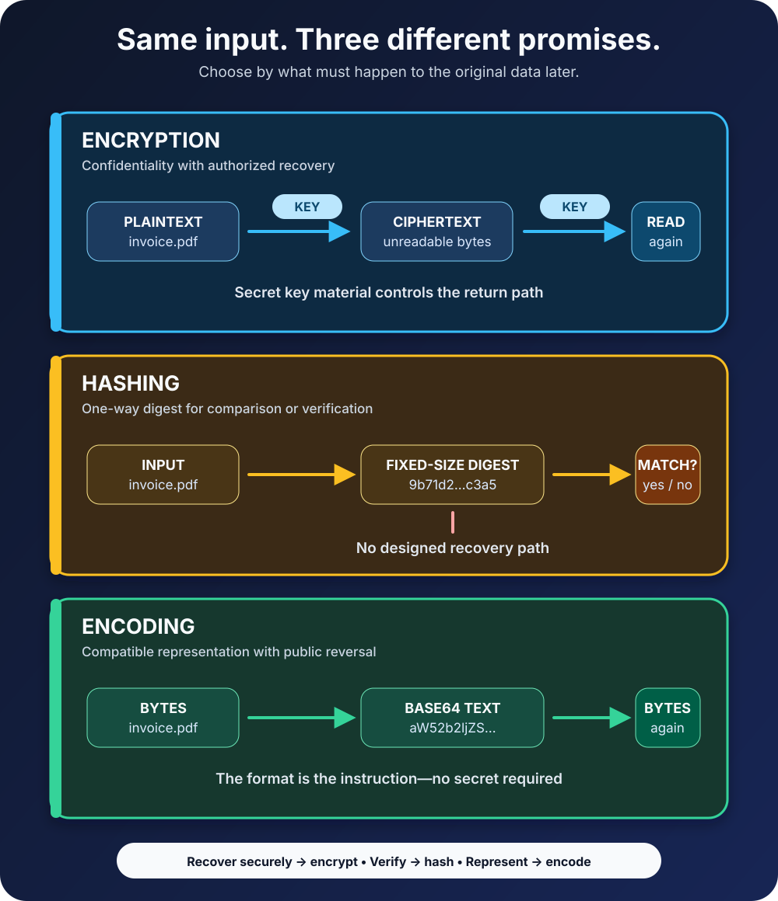

A developer opens a support ticket and finds an API credential that looks like this:

```text
c2VjcmV0LWtleS0xMjM=
```

It looks scrambled, so someone calls it encrypted. A few seconds later, another person decodes it as Base64 and reads `secret-key-123`.

Nothing was cracked. There was no key to steal and no cryptographic weakness to exploit. The data was merely written in a different alphabet.

That small vocabulary mistake points to a much larger engineering problem. Encryption, hashing, and encoding can all turn readable input into output that looks meaningless, but appearance is where the similarity ends. They make different promises, solve different problems, and fail in different ways.

The fastest way to choose correctly is to ask one question: **what must happen to the original data later?**

- If an authorized system must recover it, use encryption.
- If a system must compare or verify it without recovering it, use hashing or a purpose-built construction based on hashing.
- If another system merely needs a compatible representation, use encoding.

The visual below follows the same input through those three contracts.



## The difference in one table

| Transformation | Primary purpose | Can the original return? | Secret required? | Typical examples |
| --- | --- | --- | --- | --- |
| Encryption | Keep data confidential while allowing authorized recovery | Yes, through decryption | Yes: a key or private-key capability | Database fields, files, backups, network traffic |
| Hashing | Create a fixed-size digest for comparison or verification | No designed recovery operation | No for an ordinary hash | File integrity, content fingerprints, digital-signature workflows |
| Encoding | Represent data in a format another system can store or transport | Yes, through decoding | No | Base64 attachments, hexadecimal bytes, text character encodings |

The table is useful, but it hides an important detail: these tools are often layers in the same system. Ciphertext may be Base64-encoded for transport. A protocol may hash data as part of a signature. A password-storage function may use hashing internally. One transformation does not become another just because their outputs travel together.

## Encryption protects data that must be read again

Encryption takes plaintext, an algorithm, and key material, then produces ciphertext. Decryption uses the appropriate key to recover the plaintext. The security goal is confidentiality: a person who obtains only the ciphertext should not be able to learn the protected content within the intended threat model.

The [NIST Advanced Encryption Standard](https://csrc.nist.gov/pubs/fips/197/final) specifies AES with 128-bit blocks and 128-, 192-, or 256-bit keys. Those numbers describe the standardized cipher, but naming AES alone does not finish an application design. The mode, nonce handling, key generation, storage, access, rotation, and error behavior all matter.

Modern applications usually need **authenticated encryption**, which protects confidentiality and detects unauthorized modification. [NIST SP 800-38D](https://csrc.nist.gov/pubs/sp/800/38/d/final), for example, specifies GCM as an authenticated-encryption mode. This matters because unreadable ciphertext is not automatically tamper-resistant ciphertext.

Suppose a billing service stores a customer's tax identifier. The service must show that identifier to an authorized employee later, so a one-way hash cannot satisfy the requirement. Encryption can. The harder questions then become architectural:

- Which service may request decryption?
- Where does the key live?
- Can database administrators also reach the key?
- How will old records be handled after key rotation?
- Will access to plaintext be logged and reviewed?

Encryption moves the security problem; it does not erase it. If ciphertext and its unrestricted key sit in the same exposed configuration file, the system has built a locked box and taped the key to its lid.

## Hashing answers “is this the same?”

A cryptographic hash function accepts input of varying length and produces a fixed-length digest. The same bytes processed by the same algorithm produce the same digest. A tiny input change should produce a substantially different result, and secure algorithms are designed to make it computationally infeasible to recover a matching input or deliberately find collisions for the security property in use.

There is no `decrypt` operation for a hash. That does not mean recovery is mathematically impossible in every practical situation. An attacker can guess candidate inputs, hash each guess, and compare the results. Low-entropy values such as common passwords, yes/no answers, phone numbers, and predictable identifiers can therefore be discovered even when the hash function itself is behaving correctly.

NIST's [Secure Hash Standard](https://csrc.nist.gov/pubs/fips/180-4/upd1/final) defines the SHA-2 family and describes message digests as a way to detect whether messages have changed. NIST also notes that SHA-1 is deprecated, so new designs should not treat every algorithm with “SHA” in its name as interchangeable.

File verification is a straightforward use. A publisher calculates a digest for a download, and a recipient calculates the digest of the received bytes. Matching values provide evidence that the bytes are identical to the value represented by the expected digest.

But the origin of that expected digest matters. If an attacker can replace both the download and the hash displayed beside it, an ordinary hash detects nothing. Authenticity needs a trusted channel, a keyed message authentication code, or a digital signature, depending on the problem.

## Password hashing is deliberately harder

Password storage is the place where the phrase “just hash it” causes the most damage.

A general-purpose digest such as SHA-256 is designed to be fast. That is useful for processing files and harmful when an attacker is guessing millions of stolen password hashes. Passwords need a dedicated password-hashing function with a configurable work factor and a unique salt for each password.

The [OWASP Password Storage Cheat Sheet](https://cheatsheetseries.owasp.org/cheatsheets/Password_Storage_Cheat_Sheet.html) currently recommends Argon2id for new applications, with scrypt as a fallback and PBKDF2 for relevant compliance needs. Its parameters are operational settings that should be reviewed over time, not numbers to copy permanently from an old article.

During login, the application does not recover the saved password. It runs the submitted password through the same password-hashing scheme using the stored salt and parameters, then safely compares the result. A password reset creates a new credential; a “forgot password” feature should never email the old one back.

Encryption is appropriate for data that must be revealed later. Passwords normally need verification, not revelation. That single requirement explains the design choice better than the vague claim that hashing is simply “more secure.”

## Encoding makes bytes fit the journey

Encoding changes representation according to a public rule. Decoding reverses that rule. There is no secret, no access boundary, and no intended resistance to recovery.

[RFC 4648](https://www.rfc-editor.org/rfc/rfc4648.html) defines the common Base16, Base32, and Base64 encodings. Base64 represents arbitrary bytes with a restricted set of printable characters, which is useful when binary data must travel through a text-oriented field. The RFC explicitly warns that Base64 provides no computational confidentiality.

That is why Base64 appears in email, data formats, certificates, and tokens without being a security feature by itself. Anyone who knows the format can decode it.

Encoding can still have security-sensitive implementation rules. A decoder must handle invalid characters and padding consistently. Different Base64 alphabets exist, including a URL- and filename-safe form. Treating every visually similar string as the same variant can create parsing bugs or inconsistent comparisons.

Character encoding solves another representation problem. UTF-8 maps text characters to bytes so systems can store and exchange them. Encrypting UTF-8 bytes does not replace UTF-8; it adds confidentiality after the text has been represented as bytes.

## A small experiment makes the boundary obvious

This Python example uses only the standard library. It is intentionally limited to Base64 and SHA-256; production encryption should use a maintained cryptographic library and an appropriate authenticated-encryption construction rather than a hand-written cipher.

```python
import base64
import hashlib

message = b"order=1842&total=49.00"

encoded = base64.b64encode(message)
digest = hashlib.sha256(message).hexdigest()

print(encoded.decode("ascii"))
print(base64.b64decode(encoded))
print(digest)
```

The output is:

```text
b3JkZXI9MTg0MiZ0b3RhbD00OS4wMA==
b'order=1842&total=49.00'
f4585e1a73181eaf674223b857b19b91cdaf971b8be10ac3e4d85216b21d50dd
```

The encoded value returns immediately to the original bytes. The digest has no inverse operation. If you change `49.00` to `49.01`, both outputs change, but they still have different jobs: Base64 carries the bytes, while the digest fingerprints them.

## Real systems often use all three

Imagine an application sending a private JSON document through a text-only message field.

First, it serializes the object into UTF-8 bytes. Next, it encrypts those bytes with authenticated encryption. Then it Base64-encodes the nonce, ciphertext, and authentication tag so the binary values fit safely in the text field. A signature or keyed authentication mechanism may protect a larger protocol envelope.

On receipt, the application reverses the compatible layers: Base64 decoding restores the encrypted bytes, authenticated decryption verifies and recovers the plaintext, and UTF-8 decoding plus JSON parsing restores the document.

Calling the whole string “encrypted” may be convenient in conversation, but implementation decisions must name each layer. Otherwise a developer may decode when they need to decrypt, hash data that must be recovered, or assume an encoded secret is protected.

## Common mistakes and the better question

**“Can we Base64 the API key before committing it?”** Base64 does not hide the key. The better question is where secrets should be stored and how workloads receive them without placing them in source control.

**“Can we hash customer email addresses and still display them?”** A hash is not designed for recovery, and predictable emails may be guessable. Ask whether the application needs retrieval, matching, pseudonymization, or deletion; those are different designs.

**“Can we store `SHA-256(password)`?”** A fast, unsalted digest is not a password-storage scheme. Use the password-hashing support in a reputable framework or library and retain its algorithm, salt, and work parameters with the result.

**“If it is encrypted, is it safe?”** Not by that fact alone. Ask who can reach the keys, whether modification is detected, where plaintext appears, and what logs, backups, caches, and error messages reveal.

**“The downloaded hash matches, so is the file authentic?”** Only if the expected hash arrived through a trusted path. Ask what prevents an attacker from replacing both values.

## A decision rule worth remembering

Ignore how mysterious the output looks. Start with the promise the system must make:

- **Recover it securely:** encryption, with sound key management and integrity protection.
- **Compare or verify it:** hashing, a password-hashing function, a MAC, or a signature chosen for the actual threat.
- **Represent or transport it:** encoding, with the exact format agreed by both sides.

Encryption controls who can read data. Hashing lets systems reason about sameness without a normal recovery path. Encoding lets bytes survive a journey between formats. Once those contracts are clear, the names stop being trivia and become practical design tools.

## Continue learning

- [The CIA Triad Explained](/posts/cia-triad-explained/)
- [Authentication vs Authorization](/posts/authentication-vs-authorization/)
- [MFA vs Passwordless vs Passkeys](/posts/mfa-vs-passwordless-vs-passkeys/)
- [How DNS Finds a Website and Where TLS Fits](/posts/dns-explained-how-your-browser-finds-a-website/)

## Sources

- [NIST FIPS 197: Advanced Encryption Standard](https://csrc.nist.gov/pubs/fips/197/final)
- [NIST FIPS 180-4: Secure Hash Standard](https://csrc.nist.gov/pubs/fips/180-4/upd1/final)
- [NIST SP 800-38D: Galois/Counter Mode and GMAC](https://csrc.nist.gov/pubs/sp/800/38/d/final)
- [RFC 4648: Base16, Base32, and Base64 Data Encodings](https://www.rfc-editor.org/rfc/rfc4648.html)
- [OWASP Password Storage Cheat Sheet](https://cheatsheetseries.owasp.org/cheatsheets/Password_Storage_Cheat_Sheet.html)
