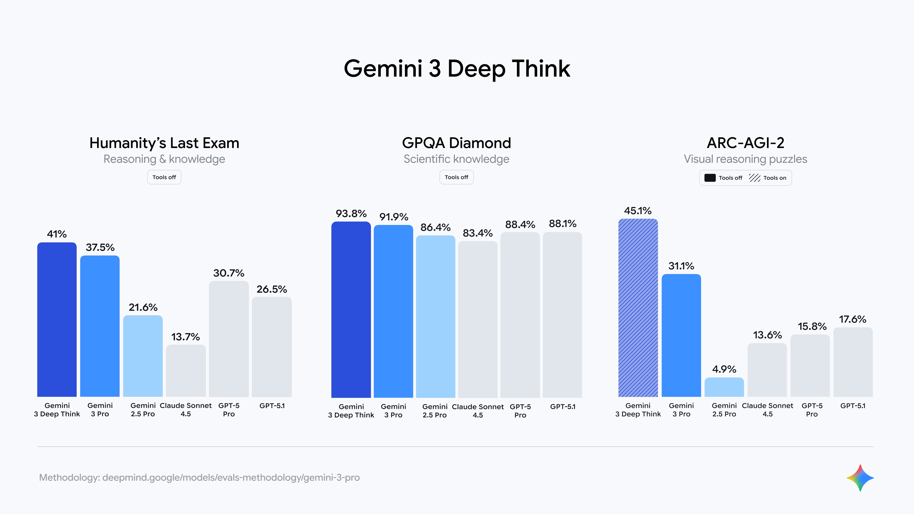
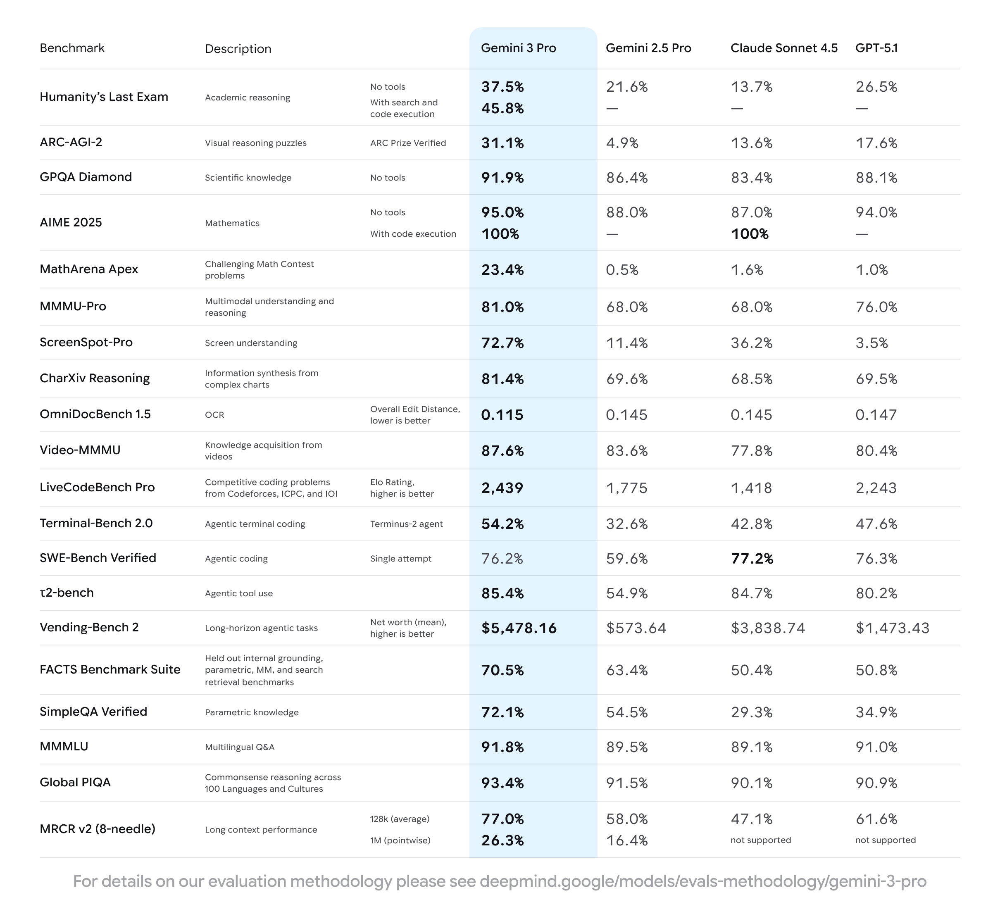
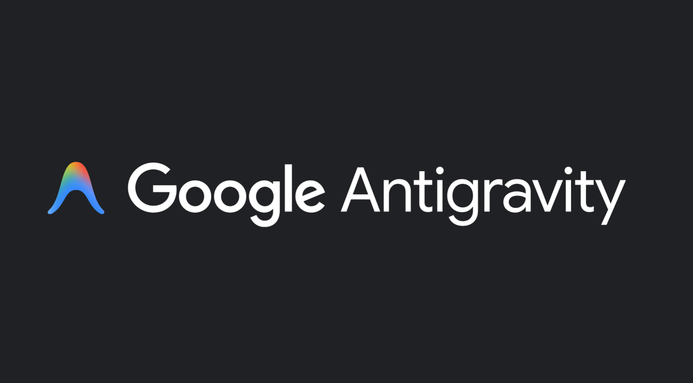

The AI arms race is accelerating, and Google is stepping up with Gemini 3 — a new multimodal model designed to reason, code, and generate interactive outputs at a new level. In this post I summarize what Google announced, how the new capabilities differ from previous releases, and what developers and everyday users should expect from Gemini 3, Gemini 3 Pro, Gemini Agent, Gemini 3 Deep Think, and Antigravity.

---

## TL;DR

| Feature | Summary |
|---------|---------|
| **Gemini 3** | Latest multimodal model with improved reasoning and stronger code execution |
| **Gemini 3 Pro / Deep Think** | Targets complex reasoning; Deep Think evaluates multiple hypotheses in parallel |
| **Antigravity** | Multi-pane agent developer environment for autonomous coding workflows |
| **Integration** | Rolling out across Google Search, Gemini App, and Vertex AI |

---

## What's New — Highlights

Gemini 3 and its related services bring a few meaningful changes beyond raw model size or latency:

- **Multimodal reasoning at scale:** The model simultaneously handles text, images, and other media types with better reasoning — analysis and multi-step answers that combine different formats.
- **Deep Think mode:** A variant called Gemini 3 Deep Think evaluates multiple hypotheses in parallel and chooses the best path — an approach designed for complex scientific and long-horizon planning. Deep Think will be available first to Google AI Ultra subscribers.
- **Gemini Agent:** Agent features are now part of Gemini's public offering. Agents can perform multi-step tasks from inbox triage to travel booking, pairing with the app UI to perform workflows that feel more like a small task executor than a simple chat model.
- **Antigravity:** A developer platform for agent-driven code workflows. Antigravity offers multiple panes (editor, terminal, browser) where agents can write, run tests, and validate code — enabling more autonomous end-to-end developer workflows.

---

## Benchmarks & Performance

Google shared benchmark scores that show Gemini 3 and its flavors outperform many previous public models in reasoning and tool-assisted tasks.

| Benchmark | Model | Score | Notes |
|-----------|-------|-------|-------|
| **Humanity's Last Exam** (reasoning) | Gemini 3 Pro | 37.5 | No tools |
| **Humanity's Last Exam** (reasoning) | Gemini 3 Deep Think | ~41% | No tools |
| **GPQA Diamond** (scientific knowledge) | Gemini 3 Pro | ~91.9% | No tools |
| **ARC-AGI-2** (visual reasoning) | Gemini 3 Deep Think | 45.1% | With tools, verified ARC Prize runs |

*Gemini 3 Deep Think: highlighted comparisons on reasoning, scientific knowledge and visual reasoning tests.*

*Detailed benchmark table with scores across several evaluation suites.*

Those public figures show two things: Google optimized for multi-step reasoning and also measured the model in agent/tool settings — not just static questions.

> Note: Benchmarks are useful reference points but don't capture every practical use-case. They show promising direction rather than final guarantees.

---

## Antigravity — What It Is and Why It Matters for Developers

Antigravity is Google's new environment for building agent-powered developer tools. It aims to do more than generate code; it coordinates agent actions across the IDE, terminal, and browser so agents can:

- Scaffold a new app, run tests, and iterate on failures.
- Open tabs, install packages, and orchestrate a multi-step delivery pipeline.
- Validate results by executing test harnesses programmatically.

Antigravity can be thought of as an agent-first IDE (similar to Warp + agent extensions or Cursor-style workflows) that integrates Gemini's code model and browser automation to assist during development. Early previews already show the platform supports allied models (Sonnet 4.5, GPT-OSS), and works on Windows, macOS, and Linux.

---

## Deep Think: Parallel Reasoning at Scale

What the Deep Think variant does differently is fairly straightforward: it runs parallel hypotheses internally, evaluating the best path before returning results. Google positions it for tasks that are research-heavy, multi-step, or expensive if done incorrectly.

| Use Case | Why Deep Think Helps |
|----------|----------------------|
| Scientific audits | Structured hypothesis testing with data |
| Code reviews | Multi-phase verification and iteration |
| Long-horizon planning | Evaluates multiple paths before committing |

Access is limited initially to high-tier subscribers due to safety, compute, and monitoring needs.

---

## How Gemini 3 Fits Into Google's Product Map

| Product | Role |
|---------|------|
| **Search / AI Mode** | Interactive answers — tables, charts, visual layouts — routing complex queries to Gemini 3 Pro |
| **Gemini App** | Gemini 3 Pro as the flagship; users see more complex reasoning in day-to-day prompts |
| **Vertex AI / APIs** | Developers integrate via Google APIs to build specialized models and agent-driven enterprise services |

---

## Practical Considerations and Competition

- Google introduced Gemini 3 shortly after OpenAI's GPT-5.1 and within months of Anthropic's Sonnet updates. Competition is intensifying around capabilities (reasoning, agenting, tooling) rather than raw size alone.
- Ethical and safety checks will slow down aggressive rollouts — Deep Think's staged release is an example. Large models with extended privileges will need more monitoring.
- **Subscription & pricing:** Advanced features like Deep Think are exclusive to higher-tier subscribers (e.g., Google AI Ultra). For teams, Vertex AI integration lets enterprises manage model access and governance.

---

## Who Should Care?

| Audience | How Gemini 3 Helps |
|----------|--------------------|
| **Developers** | Antigravity and Gemini Agent automate repetitive coding and test execution |
| **Researchers** | Deep Think's parallel-evaluation approach suits structured hypothesis testing |
| **Business users / searchers** | Richer, interactive answers in Search or the Gemini app for complex queries |

---

## Final Thoughts

Gemini 3 represents a deliberate pivot from "large language model" demos to a genuinely integrated, multimodal reasoning platform with the tooling and interfaces developers need. The combination of higher reasoning ability, agent features, and Antigravity's developer environment indicates Google's strategy: move from foundational models to application-first agent tooling across their product suite.

Expect incremental rollouts, careful monitoring, and competitive pressure from OpenAI and Anthropic — but the arrival of Gemini 3 is an important moment in the evolution of large-model applications.
