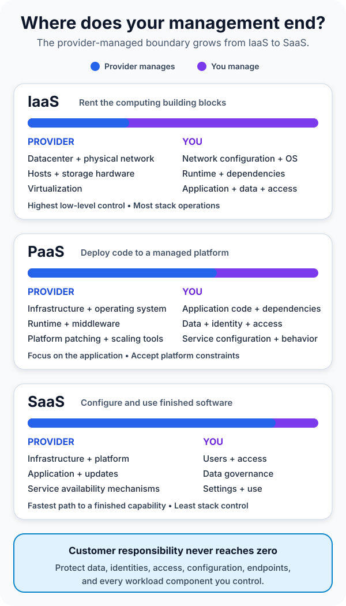

Your team needs to put a small customer portal online. The application is ready, the deadline is close, and somebody asks a question that sounds simpler than it is:

“Should we use IaaS, PaaS, or SaaS?”

All three arrive over a network. All three move work to a provider. Yet they do not sell the same thing. One gives you infrastructure to operate, one gives you a platform for your code, and one gives you finished software to configure and use.

The shortest useful answer is this: **IaaS, PaaS, and SaaS describe where your management responsibility ends and the cloud provider's begins.** IaaS offers the most control and the most operational work. PaaS manages more of the application platform. SaaS delivers a complete application and leaves you with the least control over its underlying stack.

That boundary—not the acronym—is what matters.

## Start with what you are actually buying

The [NIST definition of cloud computing](https://csrc.nist.gov/pubs/sp/800/145/final) identifies infrastructure, platform, and software as the three cloud service models. The categories are based on the capability the consumer receives:

- **Infrastructure as a Service (IaaS)** provides fundamental computing resources such as processing, storage, and networking. You can deploy operating systems and applications on top of them.
- **Platform as a Service (PaaS)** provides an environment where you deploy applications using languages, libraries, services, and tools supported by the provider.
- **Software as a Service (SaaS)** provides a complete application running on the provider's cloud infrastructure, usually accessed through a browser, client, or API.

In plain language, IaaS gives you building blocks, PaaS gives your code a managed place to run, and SaaS gives users a working product.

The picture below makes the shifting boundary visible. Moving toward SaaS transfers more of the technical stack to the provider, but your responsibility never falls to zero.

## IaaS vs PaaS vs SaaS at a glance

| Model | What you receive | You mainly manage | Strong fit when |
| --- | --- | --- | --- |
| IaaS | Virtual compute, storage, and networking | OS, patches, runtime, applications, data, and network configuration | You need OS-level control, custom networking, or support for an existing workload |
| PaaS | A managed application or data platform | Application code, data, identities, service configuration, and workload behavior | You want to ship custom software without operating servers or runtime infrastructure |
| SaaS | A ready-to-use application | Users, access, data governance, settings, integrations, and usage | A finished product already solves the business problem well enough |

This table is a starting point, not a substitute for a service's contract. Providers package capabilities differently, and a single solution may combine several models. Always inspect the exact service documentation, security controls, backup behavior, availability design, and exit options.

## Follow one customer portal through all three models

Suppose a distributor wants customers to sign in, view orders, and submit support requests.

With **IaaS**, the team rents virtual machines, disks, and virtual networks. It chooses an operating system, installs a web server and runtime, deploys the application, configures firewall rules, patches the OS, monitors capacity, and designs recovery. The provider runs the physical datacenter, hosts, and virtualization layer; the team operates most of what sits above them.

This is useful when the portal depends on a specific OS feature, a legacy component, a custom network appliance, or software that cannot run on a managed platform. The tradeoff is direct: every layer you control becomes a layer you must secure, observe, patch, and recover.

With **PaaS**, the team deploys the portal's code to a managed web application platform. The provider operates the hosts, OS, runtime infrastructure, and much of the scaling machinery. The team still owns the application's behavior, data model, access rules, configuration, dependencies, and failure handling.

PaaS removes server work, not engineering work. A memory leak is still your problem. An unsafe dependency is still your problem. A poor database query is still your problem. What changes is that your team can spend less time maintaining operating systems and more time improving the application.

With **SaaS**, the company may decide not to build the portal at all. It subscribes to an existing customer-service product, configures its branding and workflows, imports users and data, and connects it to order systems through supported integrations.

That can be the fastest path to the business outcome. It also means the provider decides much of the application's feature set, release schedule, and underlying architecture. Your customization is limited to what the product exposes.

The important question is therefore not “Which acronym is best?” It is “Which parts of this problem create unique value, and which parts should we pay someone else to operate?”

## More control also means more duty

IaaS is often described as flexible, PaaS as productive, and SaaS as convenient. Those labels are directionally useful, but they hide the bill attached to each choice.

**Control:** IaaS can give a team OS access, detailed network configuration, and freedom to install unusual software. PaaS replaces some of that control with provider conventions. SaaS exposes product settings and APIs rather than the stack below the application.

**Operational effort:** An IaaS consumer normally handles OS patching, runtime upgrades, capacity decisions, and more monitoring. A PaaS consumer delegates much of that platform work but must understand scaling settings, quotas, supported versions, and service behavior. A SaaS consumer avoids running the product yet still administers accounts, permissions, integrations, retention, and configuration.

**Portability:** A conventional application on virtual machines may be easier to reproduce elsewhere, but its surrounding network and automation can still be provider-specific. PaaS can couple an application to a supported runtime, deployment model, or managed service. SaaS portability depends heavily on export formats, APIs, identity integration, and contract terms. Portability is an architectural property to design and test, not something an acronym guarantees.

**Cost:** IaaS may show a low resource price while requiring significant engineering time. PaaS may cost more per unit of compute but remove platform labor. SaaS turns much of the system into subscription and administration costs. Compare the total cost of ownership—including people, support, security, downtime, migration, and exit—not only the monthly service price.

## Shared responsibility is the part people forget

Cloud service models change who performs a task; they do not make risk disappear.

Microsoft's current [shared responsibility guidance](https://learn.microsoft.com/en-us/azure/security/fundamentals/shared-responsibility) illustrates the pattern clearly. The provider manages physical datacenters, networks, hosts, and virtualization across cloud models. In PaaS and SaaS, it also manages more of the operating system and platform. The customer, however, retains important responsibilities for data, identities, accounts, access, configuration, and the client devices that connect to the service.

Consider a SaaS file-sharing product. The vendor can secure and patch the application, but it cannot decide which employee should see a confidential folder. It cannot know that a departing contractor still has access unless your organization removes it. It cannot correct a public sharing link that your administrator intentionally enabled.

The same logic applies to PaaS and IaaS. The provider secures the layers it operates. You secure what you deploy, configure, connect, and permit.

Ask these questions before adopting any service:

- Who patches each layer, and how can we verify it?
- Who backs up the data, what can be restored, and how long does recovery take?
- Which identity, access, encryption, logging, and network controls are ours to configure?
- What availability does the provider commit to, and what resilience must our architecture add?
- How do we export data and replace the service if requirements change?

If the answers are vague, the service model label will not rescue the design.

## How to choose the right service model

Begin with the business capability. If a well-supported SaaS product satisfies it without harmful constraints, building and operating a custom replacement may create cost without meaningful advantage.

Choose PaaS when the application itself is valuable but server and runtime operations are not. A team building a custom API, internal workflow, or web application can often benefit from managed deployment, scaling, certificates, and runtime maintenance—provided the platform's constraints fit the workload.

Choose IaaS when the workload genuinely needs infrastructure-level control. Common reasons include legacy software, strict OS requirements, specialized network topology, custom agents, or a migration that cannot yet be redesigned for a managed platform.

Team capability matters as much as technical fit. IaaS is a poor bargain if nobody owns patching and incident response. PaaS is risky if the team ignores platform limits and recovery behavior. SaaS is unsafe if procurement happens without identity, data-governance, integration, and exit planning.

And you do not have to choose one model for the entire system. A realistic company might run a legacy order engine on IaaS, deploy a new customer API on PaaS, and use SaaS for support and collaboration. Modern cloud architecture is usually a portfolio of boundaries.

## Common mistakes to avoid

The first mistake is treating the models as a ladder where SaaS is automatically more advanced than PaaS, and PaaS more advanced than IaaS. They solve different problems. A finished SaaS product cannot replace a custom platform requirement, and a virtual machine may be exactly right for software that needs full OS control.

The second is assuming “managed” means “fully handled.” Managed services remove specific responsibilities described by the provider. They do not remove application design, secure configuration, data protection, access review, observability, or recovery planning.

The third is classifying a product by its marketing name. [NIST SP 500-322](https://www.nist.gov/publications/evaluation-cloud-computing-services-based-nist-sp-800-145) recommends evaluating the computing capability actually offered when categorizing a cloud service. Read what consumers can deploy, control, and configure.

The fourth is choosing only by launch speed. The fastest first deployment can become difficult later if the team never evaluates limits, data export, integration contracts, skills, compliance, or the cost of leaving.

## The takeaway

IaaS gives you cloud infrastructure and asks you to operate the software stack above it. PaaS gives your application a managed platform and asks you to own the code, data, configuration, and workload behavior. SaaS gives you a finished application and asks you to govern how people, data, settings, and integrations use it.

As you move from IaaS to SaaS, provider responsibility grows and low-level control shrinks. Customer accountability remains.

Choose the boundary that lets your team control what makes the system valuable—and deliberately delegate the rest.

## Continue learning

- [What Is Cloud Computing? A Beginner's Guide](/posts/what-is-cloud-computing/)
- [What Is Software Architecture? A Beginner's Guide](/posts/software-architecture-beginners-guide/)
- [AZ-900 Cheatsheet: The Complete Azure Fundamentals Study Guide](/posts/az-900-cheatsheet/)
- [MS-900 Microsoft 365 Fundamentals Study Guide](/posts/ms-900-microsoft-365-fundamentals-study-guide/)

## Sources

- [NIST SP 800-145: The NIST Definition of Cloud Computing](https://csrc.nist.gov/pubs/sp/800/145/final)
- [NIST SP 500-322: Evaluation of Cloud Computing Services Based on NIST SP 800-145](https://www.nist.gov/publications/evaluation-cloud-computing-services-based-nist-sp-800-145)
- [Microsoft Azure: Shared Responsibility in the Cloud](https://learn.microsoft.com/en-us/azure/security/fundamentals/shared-responsibility)
- [AWS: Types of Cloud Computing](https://aws.amazon.com/types-of-cloud-computing/)
