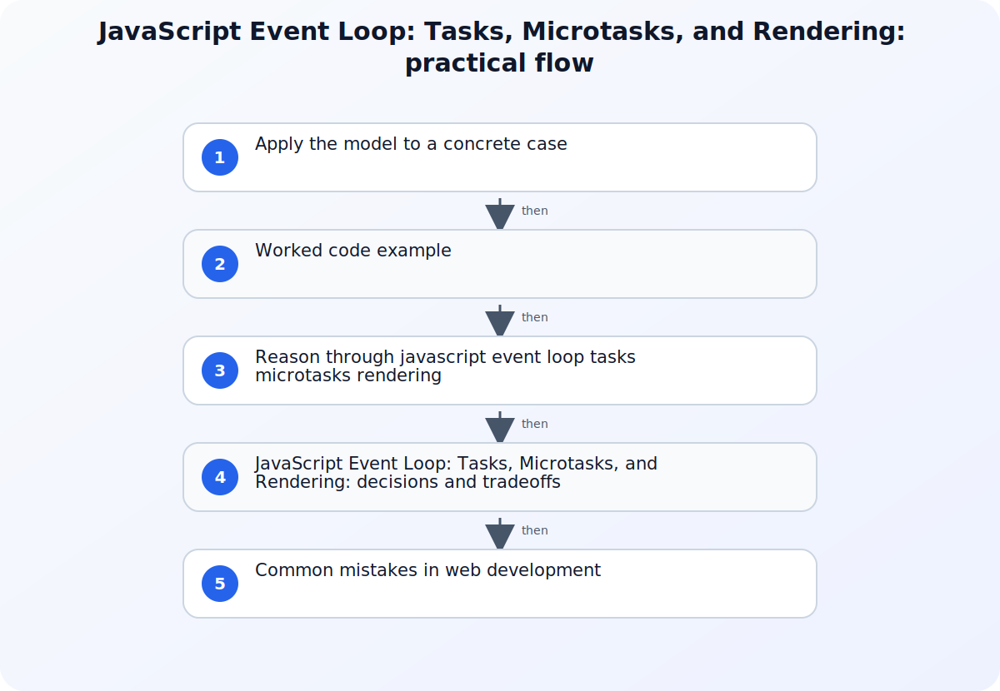

JavaScript execution order is predictable when three layers are kept separate: synchronous execution on the current stack, work queued by the host environment, and the checkpoints where queued callbacks become eligible to run. Browser event loops distinguish tasks from microtasks and coordinate rendering opportunities, while Node.js organizes host callbacks into event-loop phases with additional queue behavior. The language and each host runtime therefore contribute different parts of the result.



## A working model for JavaScript Event Loop: Tasks, Microtasks, and Rendering

Reduce an ordering question to a small example and label every operation as synchronous code, a task or phase callback, or a microtask. Record whether the example runs in a browser, Node.js, a worker, or a test runner because host APIs and scheduling rules differ. Predict the output before executing it, then run the exact runtime and version rather than inferring browser behavior from Node.js or the reverse.

## Apply the model to a concrete case

Imagine browser code that logs A, registers a zero-delay timer to log B, schedules a resolved-promise reaction to log C, and then logs D. The current script task runs to completion, so A and D appear first. At the following microtask checkpoint, the promise reaction logs C. Only after that checkpoint can the timer task log B, subject to timer eligibility and other queued work. If the promise reaction queues another microtask, that new microtask can run in the same drain before the timer. Moving the example to Node.js requires a new model because timers, poll, check, process.nextTick, and promise reactions interact under Node's documented event-loop behavior rather than browser rendering steps.

## Worked code example

### Predict task and microtask output

```javascript
console.log("A: current task");

setTimeout(() => {
  console.log("D: timer task");
}, 0);

Promise.resolve().then(() => {
  console.log("C: promise microtask");
});

console.log("B: current task");
```

In a browser, the current task prints A and B before the promise microtask prints C; the timer task becomes eligible afterward and prints D. Node.js examples must be reasoned about using Node's phase and queue rules instead of browser rendering checkpoints.

## Source boundaries for web development

### MDN JavaScript execution model

Use MDN JavaScript execution model for this boundary of the topic: Use MDN's execution model for agents, jobs, stacks, queues, and run-to-completion behavior.
### HTML event loops

Use HTML event loops for this boundary of the topic: Use the HTML event-loop specification for task queues, microtask checkpoints, and rendering update steps.
### Node.js event loop

Use Node.js event loop for this boundary of the topic: Use the Node.js event-loop guide for phases, timers, poll, setImmediate, and nextTick distinctions.

## Reason through javascript event loop tasks microtasks rendering

### 1. Finish the current job before dequeuing callbacks

A running JavaScript job executes to completion before another queued callback begins on the same agent. Function calls add execution contexts to the stack and returns remove them. APIs such as timers, I/O, or DOM events are provided by the host; calling them registers work but does not interrupt the current stack with their callback. This explains why synchronous output appears before a zero-delay timer and why a long computation can delay user-visible work.
### 2. Place microtask checkpoints in the browser model

After a task finishes and the stack is empty, the browser performs a microtask checkpoint before selecting another task; promise reactions and queueMicrotask callbacks use the microtask queue. New microtasks queued while draining can run in that same checkpoint, so an unbounded chain can postpone tasks and rendering. Rendering is an opportunity controlled by the browser event loop, not an action after every callback. Keep DOM updates, observer callbacks, and frame timing in that host context.
### 3. Reason about Node.js by phase and version context

Node.js processes groups of callbacks in event-loop phases such as timers, poll, and check, while process.nextTick and promise microtasks have their own scheduling behavior around callbacks. A timer threshold says when a callback may become eligible, not the exact wall-clock instant it must run. I/O readiness, callback duration, and runtime changes can affect observed order. When order is part of correctness, test the supported Node.js versions and avoid depending on incidental timing between unrelated sources.

## JavaScript Event Loop: Tasks, Microtasks, and Rendering: decisions and tradeoffs

| Situation or decision | Tradeoff or common failure mode | Validation question |
| --- | --- | --- |
| A zero-delay timer runs after synchronous logging | The timer callback cannot run until the current job completes | Separate registration time from the later task or timers-phase callback |
| A promise reaction runs before a queued timer | The runtime drains relevant microtasks before selecting the next task | Mark the end of the current callback and identify the host's microtask checkpoint |
| Browser and Node.js output differs | The example depends on host-specific queues, phases, or APIs | Model each host separately and verify the exact supported runtime versions |

## Common mistakes in web development

The phrase single-threaded is often stretched into the false claim that nothing happens concurrently around JavaScript; hosts can perform I/O and enqueue callbacks while one job runs. A zero timer is also mistaken for immediate execution even though it only establishes an eligibility threshold. Treating every callback queue as one FIFO list hides the distinction between browser tasks and microtasks or between Node.js phases and its additional queues. Recursive microtasks can starve task and rendering opportunities, so replacing a loop with promise chaining does not automatically make work cooperative. Always name the host, queue class, current callback boundary, and supported runtime version before asserting an order.

## Practical implementation checklist

1. Label synchronous statements, host API registration, tasks or phase callbacks, and microtasks separately.
2. Apply run-to-completion before reasoning about any queued callback.
3. Check microtasks at the host-defined checkpoint and watch for recursively queued microtasks.
4. Do not treat a timer delay as an exact execution deadline.
5. Test ordering assumptions in each browser or Node.js version the application supports.

## Related implementation context

[Understanding HTTP Status Codes: What They Mean and How to Use Them](/posts/http-status-codes/) and [DNS Explained: How Your Browser Finds a Website](/posts/dns-explained-how-your-browser-finds-a-website/)

## Version and verification boundary

ECMAScript jobs interact with host scheduling rules; the HTML Standard and current Node.js guide were checked at publication time, and runtime-specific ordering should be verified on supported browser and Node.js versions.

## Summary

Predict event-loop output by finishing synchronous work, applying the host's microtask checkpoint, and only then selecting eligible task or phase callbacks. Keep browser rendering rules separate from Node.js phases, and test any correctness-sensitive ordering on supported runtimes.

## Sources

- [MDN JavaScript execution model](https://developer.mozilla.org/en-US/docs/Web/JavaScript/Reference/Execution_model)
- [HTML event loops](https://html.spec.whatwg.org/multipage/webappapis.html)
- [Node.js event loop](https://nodejs.org/learn/asynchronous-work/event-loop-timers-and-nexttick)
