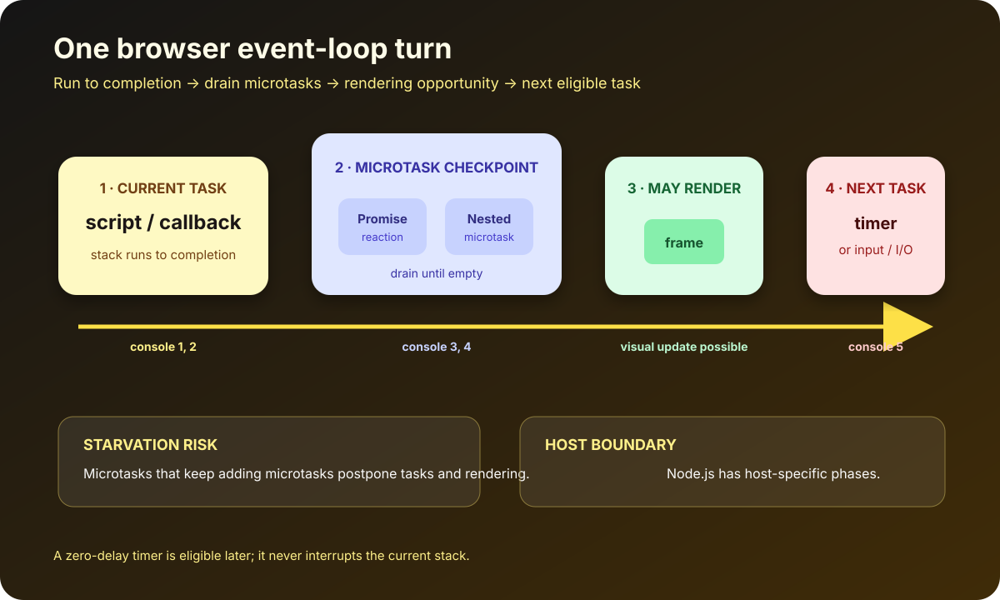

JavaScript timing becomes much easier when you stop imagining one callback queue. In a browser, the useful model is:

1. Run the current JavaScript job to completion.
2. At the event loop's checkpoint, drain microtasks.
3. The browser may update rendering.
4. Select another eligible task and repeat.

Node.js also runs JavaScript to completion, but its host loop has phases and Node-specific queues. A browser prediction should not be copied blindly into a Node.js program.



## The four moving parts

### Call stack

The current function and everything it calls execute before another queued callback starts on the same JavaScript agent. This is **run-to-completion**. A timer becoming eligible does not interrupt a running function.

### Tasks

The browser queues work from sources such as the initial script, timers, user interaction, and network events. Specifications define task sources and ordering constraints; “the task queue” is a useful simplification, not a complete description of every queue.

### Microtasks

Promise reactions and callbacks passed to `queueMicrotask()` are microtasks. After the current task's JavaScript stack is empty, the browser performs a microtask checkpoint. It keeps processing until the microtask queue is empty—even when a microtask adds more microtasks.

### Rendering opportunities

Rendering is coordinated by the browser. It is not guaranteed after every task, and it cannot happen while long-running JavaScript occupies the main thread. `requestAnimationFrame()` schedules work for a rendering update, not for the microtask queue.

## Predict the output before running it

```javascript
console.log("1: script");

setTimeout(() => console.log("5: timer"), 0);

queueMicrotask(() => {
  console.log("3: microtask");
  queueMicrotask(() => console.log("4: nested microtask"));
});

console.log("2: script end");
```

The browser output is:

```text
1: script
2: script end
3: microtask
4: nested microtask
5: timer
```

Why:

- The script is the current task, so both synchronous logs run first.
- The microtask checkpoint drains the first microtask and the nested one it adds.
- A zero-millisecond timer means “eligible after the timer threshold,” not “run immediately.”

This reasoning is stronger than memorizing “promises beat timers.” It identifies the current task boundary and the checkpoint.

## DOM changes and rendering

This example separates mutation, observation, and paint:

```javascript
const box = document.querySelector(".box");

box.textContent = "updated";

queueMicrotask(() => {
  console.log("DOM text:", box.textContent);
});

requestAnimationFrame(() => {
  console.log("next rendering update");
});
```

The DOM object changes synchronously, so the microtask reads `"updated"`. That does **not** prove the pixels were already painted. The animation-frame callback participates in a rendering update, but exact painting still belongs to the browser's rendering pipeline.

Use:

- `queueMicrotask()` to normalize a small piece of follow-up logic at the current checkpoint;
- `requestAnimationFrame()` for visual work synchronized with a rendering update;
- a task or scheduler/yielding mechanism when work must give rendering and input a chance to proceed;
- a Web Worker for substantial CPU work that should leave the main thread.

## Microtask starvation

Microtasks added during a checkpoint are processed before the browser moves on. An unbounded chain can block timers, input, and rendering:

```javascript
function starveThePage() {
  queueMicrotask(starveThePage);
}

starveThePage();
```

This code does not grow the synchronous call stack, but it can still freeze the page. “Asynchronous” does not automatically mean “cooperative.”

A simple chunking strategy yields through tasks:

```javascript
async function processInChunks(items, chunkSize = 500) {
  for (let start = 0; start < items.length; start += chunkSize) {
    const chunk = items.slice(start, start + chunkSize);
    chunk.forEach(processItem);

    // Yield. Pick a scheduling API appropriate to supported browsers.
    await new Promise(resolve => setTimeout(resolve, 0));
  }
}
```

The timer delay is not a deadline, and chunk size should be measured on representative devices.

## `async`/`await` uses the same machinery

An `async` function runs synchronously until it reaches an `await` whose value requires suspension. Its continuation is scheduled through promise-job behavior:

```javascript
async function demo() {
  console.log("A");
  await null;
  console.log("C");
}

demo();
console.log("B");
```

Output:

```text
A
B
C
```

`await` does not move the rest of the function to another thread. It splits the function at a suspension point so other work can run before its continuation.

## Browser and Node.js: share concepts, not schedules

Node.js organizes callbacks into phases such as timers, poll, and check. `setImmediate()` is Node-specific, and `process.nextTick()` uses a queue with behavior distinct from ordinary promise microtasks. Node has also changed timer processing details across libuv/runtime versions.

Use this rule:

| Code uses | Reason with |
| --- | --- |
| DOM, `requestAnimationFrame`, browser timers | WHATWG browser event loop |
| Node I/O, `setImmediate`, `process.nextTick` | Supported Node.js version |
| Only promises and synchronous code | ECMAScript jobs plus the actual host |
| Test-runner fake timers | That runner's documented scheduler |

Do not rely on incidental order between unrelated I/O operations. If correctness requires an order, express it with `await`, a queue, a stream, or another explicit dependency.

## A debugging method that scales

When output surprises you:

1. Name the host: browser window, worker, Node.js, or test runner.
2. Mark the current synchronous job.
3. Label every scheduled callback as a task/phase callback, microtask, or rendering callback.
4. Trace what each callback queues while running.
5. Place microtask checkpoints at host-defined boundaries.
6. Test on the runtime versions you support.
7. Use the browser Performance panel or Node.js diagnostics for timing; console output can perturb observations.

## Common misconceptions

- **“JavaScript is single-threaded, so nothing else happens.”** The host can perform I/O and prepare callbacks while one agent runs JavaScript.
- **“`setTimeout(fn, 0)` runs next.”** It establishes a minimum eligibility threshold; queued work and runtime rules still decide when it runs.
- **“Promises make CPU work non-blocking.”** Promise callbacks still execute JavaScript on their agent.
- **“The browser paints after every callback.”** Rendering occurs at browser-selected opportunities.
- **“Node and Chrome have the same loop.”** They share JavaScript language semantics, not identical host scheduling.

The event loop is not magic. Finish the current job, drain the appropriate microtasks, account for a possible rendering update, and then move to the next eligible task—using the rules of the host actually running the code.

## Sources

- [Event loops — WHATWG HTML Living Standard](https://html.spec.whatwg.org/multipage/webappapis.html#event-loops)
- [In-depth microtask guide — MDN Web Docs](https://developer.mozilla.org/en-US/docs/Web/API/HTML_DOM_API/Microtask_guide/In_depth)
- [Using microtasks in JavaScript — MDN Web Docs](https://developer.mozilla.org/en-US/docs/Web/API/HTML_DOM_API/Microtask_guide)
- [The Node.js event loop — Node.js documentation](https://nodejs.org/en/learn/asynchronous-work/event-loop-timers-and-nexttick)
