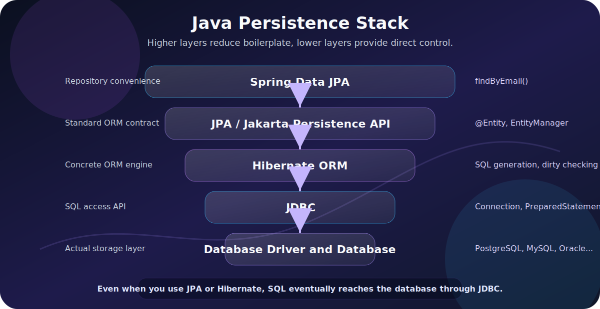
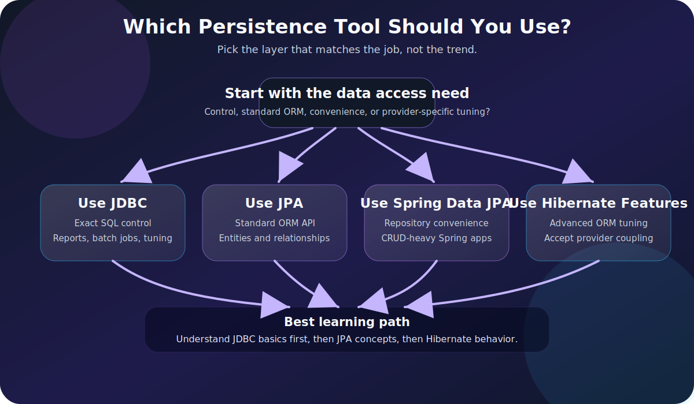

Java gives you several ways to talk to a relational database. Three names appear constantly:

- JDBC
- JPA
- Hibernate

They are related, but they are not the same thing.

The short version:

| Technology | What It Is | Main Idea |
|---|---|---|
| **JDBC** | Low-level Java database API | You write SQL and handle rows directly |
| **JPA** | Persistence specification | Standard ORM API and mapping rules |
| **Hibernate** | ORM framework and JPA implementation | A concrete tool that implements JPA and adds extra features |

If you remember only one thing, remember this:

The relationship is easiest to remember this way: JDBC is the foundation, JPA is the standard abstraction, and Hibernate is a popular implementation of that abstraction.

This guide explains the difference in practical terms, especially for Spring Boot developers.



> **Reading path:** Begin with the concept, use the code or comparison example to make it concrete, and finish with the design trade-off or practical rule.

---

## The Problem They All Solve

Most business applications need to store and retrieve data:

Typical persistence operations include creating a user, finding an order by ID, updating a payment status, deleting an expired session, and searching products.

Relational databases store data in tables:

```sql
users
-----
id
name
email
created_at
```

Java applications work with objects:

```java
public class User {
    private Long id;
    private String name;
    private String email;
    private Instant createdAt;
}
```

The core challenge is translating between:

All three technologies help translate between Java objects and SQL rows, but they expose different amounts of that translation to the developer.

JDBC, JPA, and Hibernate all help with that translation, but at different levels of abstraction.

---

## What Is JDBC?

**JDBC** stands for **Java Database Connectivity**.

It is the standard Java API for connecting to databases, sending SQL statements, receiving results, and handling database errors. JDBC is low-level compared with JPA and Hibernate.

With JDBC, you work directly with:


The key items here are Connections, SQL strings, Prepared statements, Result sets, Transactions, SQL exceptions, and Database-specific behavior.

Example:

```java
public User findUserById(long id) throws SQLException {
    String sql = "select id, name, email from users where id = ?";

    try (Connection connection = dataSource.getConnection();
         PreparedStatement statement = connection.prepareStatement(sql)) {

        statement.setLong(1, id);

        try (ResultSet resultSet = statement.executeQuery()) {
            if (!resultSet.next()) {
                return null;
            }

            User user = new User();
            user.setId(resultSet.getLong("id"));
            user.setName(resultSet.getString("name"));
            user.setEmail(resultSet.getString("email"));
            return user;
        }
    }
}
```

This is explicit. Nothing is hidden.

You can see:


The relevant details include the SQL query, the database connection, parameter binding, result-set mapping, and cleanup logic.

That control is useful, but it becomes repetitive in large applications.

---

## What JDBC Is Good At

JDBC is excellent when you want direct control.

| JDBC Strength | Why It Matters |
|---|---|
| Full SQL control | You write exactly the SQL you want |
| Predictable behavior | No ORM magic or hidden lazy loading |
| Database-specific features | Easier to use vendor-specific SQL |
| Performance tuning | You can optimize exact queries |
| Simple mental model | SQL in, rows out |

JDBC is often a good fit for:


The key items here are Reporting queries, Batch jobs, Stored procedure calls, Performance-critical paths, SQL-heavy applications, Legacy systems, and Cases where object graphs are not useful.

The tradeoff is boilerplate.

You write more code for routine operations that an ORM can often automate.

---

## What Is JPA?

**JPA** originally stood for **Java Persistence API**. In the modern Jakarta EE world, the current name is **Jakarta Persistence**. Developers still commonly say "JPA."

JPA is a **specification**, not a standalone product.

That means JPA defines:


The key items here are How entities are mapped, How persistence contexts work, How relationships are modeled, How queries can be written with JPQL and Criteria, How an `EntityManager` behaves, and How transactions interact with persistence.

But JPA does not do the work by itself. You need an implementation.

Common JPA implementations include:

- Hibernate ORM.
- EclipseLink.
- OpenJPA.

In most Spring Boot applications, the JPA implementation is Hibernate.

---

## What JPA Code Looks Like

With JPA, you map a Java class to a database table.

```java
@Entity
@Table(name = "users")
public class User {

    @Id
    @GeneratedValue(strategy = GenerationType.IDENTITY)
    private Long id;

    @Column(nullable = false)
    private String name;

    @Column(nullable = false, unique = true)
    private String email;

    // getters and setters
}
```

Then you can use `EntityManager`:

```java
@Repository
public class UserJpaRepository {

    @PersistenceContext
    private EntityManager entityManager;

    public User findById(Long id) {
        return entityManager.find(User.class, id);
    }

    public void save(User user) {
        entityManager.persist(user);
    }
}
```

Or, in Spring Data JPA, you often write an interface:

```java
public interface UserRepository extends JpaRepository<User, Long> {
    Optional<User> findByEmail(String email);
}
```

Spring Data JPA builds the repository implementation for you, and Hibernate usually performs the persistence work underneath.

---

## What JPA Is Good At

JPA is useful when your application has a rich domain model and many normal CRUD operations.

| JPA Strength | Why It Matters |
|---|---|
| Object mapping | Tables become entity classes |
| Less boilerplate | No manual row mapping for every query |
| Standard API | Code can target the JPA specification |
| Relationship mapping | Model `OneToMany`, `ManyToOne`, `ManyToMany` |
| Persistence context | Tracks entity changes automatically |
| JPQL | Query using entity names and fields |

JPA is often a good fit for:


The key items here are Business applications, CRUD-heavy systems, Spring Boot APIs, Domain models with relationships, Applications where portability matters, and Teams that want a standard Java persistence API.

But JPA is not magic. You still need to understand SQL, transactions, indexes, joins, and query performance.

---

## What Is Hibernate?

**Hibernate ORM** is a Java object-relational mapping framework.

It is also the most common JPA implementation in Spring Boot applications.

That sentence matters:

Hibernate can be used through the JPA API, or through its own native APIs when an application deliberately needs provider-specific behavior.

So Hibernate is both:

- A JPA provider.
- A full ORM framework with features beyond JPA.

When you use Spring Boot with `spring-boot-starter-data-jpa`, you are usually using:

In a typical Spring application, Spring Data JPA sits above the JPA API; Hibernate implements that API, JDBC carries the calls to the driver, and the driver communicates with the database.

That stack explains a lot of confusion.

You may write a Spring Data repository, think you are "using JPA," but the SQL is generated by Hibernate and executed through JDBC.

---

## What Hibernate Adds

Hibernate implements JPA, but it also has features of its own.

Examples include:


The key items here are Hibernate-specific annotations, HQL features, Advanced fetching options, Batch fetching, Caching features, Filters, Custom types, Natural IDs, More detailed dirty checking behavior, and Database dialect support.

Example Hibernate-specific annotation:

```java
@CreationTimestamp
private Instant createdAt;

@UpdateTimestamp
private Instant updatedAt;
```

These are convenient, but they are not portable JPA annotations.

If you move from Hibernate to another JPA provider, Hibernate-specific features may need to be rewritten.

---

## Relationship Between JDBC, JPA, and Hibernate

The relationship is layered.

The runtime path is application code → JPA or Hibernate API → Hibernate ORM → JDBC → database driver → database.

JDBC is still involved even when you use Hibernate.

Hibernate does not teleport data into the database. It eventually sends SQL through JDBC using a database driver.

That is why JDBC knowledge is still valuable for JPA/Hibernate developers. When performance problems happen, you often need to inspect generated SQL, connection pools, transaction boundaries, and database execution plans.

---

## JPA vs Hibernate vs JDBC Comparison

| Question | JDBC | JPA | Hibernate |
|---|---|---|---|
| What is it? | Java database access API | Persistence specification | ORM framework and JPA implementation |
| Level | Low-level | Higher-level standard | Higher-level implementation |
| Do you write SQL? | Usually yes | Sometimes JPQL/Criteria, sometimes SQL | HQL/JPQL/Criteria/SQL |
| Maps rows to objects? | Manually | Yes, by specification | Yes, in practice |
| Tracks entity changes? | No | Yes | Yes |
| Handles relationships? | Manually | Yes | Yes |
| Portable abstraction? | SQL is database-dependent | More portable | Portable through JPA, less so with Hibernate-specific features |
| Runtime provider needed? | JDBC driver | JPA provider required | Hibernate itself |
| Best for | Control and SQL-heavy work | Standard ORM usage | Practical ORM features in real apps |

---

## Same Query Three Ways

Imagine we want to find a user by email.

### JDBC

```java
String sql = "select id, name, email from users where email = ?";

try (Connection connection = dataSource.getConnection();
     PreparedStatement statement = connection.prepareStatement(sql)) {

    statement.setString(1, email);

    try (ResultSet rs = statement.executeQuery()) {
        if (!rs.next()) {
            return Optional.empty();
        }

        User user = new User();
        user.setId(rs.getLong("id"));
        user.setName(rs.getString("name"));
        user.setEmail(rs.getString("email"));
        return Optional.of(user);
    }
}
```

### JPA

```java
TypedQuery<User> query = entityManager.createQuery(
    "select u from User u where u.email = :email",
    User.class
);

query.setParameter("email", email);

return query.getResultStream().findFirst();
```

### Spring Data JPA with Hibernate Underneath

```java
public interface UserRepository extends JpaRepository<User, Long> {
    Optional<User> findByEmail(String email);
}
```

The last version is tiny, but it is not free. Spring Data parses the method name, JPA defines the abstraction, Hibernate generates SQL, and JDBC executes it.

The abstraction saves code, but the stack still exists.

---

## When to Use JDBC

Use JDBC when you want direct SQL control and the object mapping is simple or secondary.

Good use cases:


The key items here are Complex reporting queries, Bulk updates, Data migration jobs, Stored procedures, Database-specific SQL, Performance-sensitive read paths, and Applications that already think in SQL.

JDBC is also useful when an ORM would make the code harder, not easier.

Example:

```sql
select
    date_trunc('month', created_at) as month,
    count(*) as total_orders,
    sum(total_amount) as revenue
from orders
where created_at >= ?
group by date_trunc('month', created_at)
order by month;
```

Trying to force this into an entity relationship model may be awkward. A JDBC query or a native query might be clearer.

---

## When to Use JPA

Use JPA when you want a standard ORM API and your application works naturally with entities.

Good use cases:


The key items here are Business applications with domain entities, CRUD APIs, Systems with common entity relationships, Applications that benefit from automatic dirty checking, Projects where provider portability matters, and Spring Boot applications using repositories.

Example:

```java
@Transactional
public void changeEmail(Long userId, String newEmail) {
    User user = userRepository.findById(userId)
        .orElseThrow(() -> new EntityNotFoundException("User not found"));

    user.changeEmail(newEmail);
}
```

In a JPA persistence context, the entity is managed. If the transaction commits, the change can be detected and flushed without explicitly calling an update statement.

That is powerful, but it also means you need to understand entity state.

---

## When to Use Hibernate Features Directly

Use Hibernate-specific features when they solve a real problem and you accept the coupling.

Good use cases:

- You are already committed to Hibernate.
- Hibernate has a feature JPA does not standardize.
- You need advanced fetching or batching behavior.
- You need a Hibernate-specific type or annotation.
- Performance tuning depends on Hibernate internals.

Example:

```java
@BatchSize(size = 50)
@OneToMany(mappedBy = "customer")
private List<Order> orders = new ArrayList<>();
```

This may help optimize loading collections, but it is Hibernate-specific.

That is not automatically bad. It is a tradeoff.

The practical rule:

A sensible default is to use standard JPA and reach for Hibernate-specific features deliberately when the benefit justifies the coupling.

---

## Where Spring Data JPA Fits

Spring Data JPA is another layer that often enters the conversation.

It is not the same thing as JPA.

Spring Data JPA is a Spring project that makes repository creation easier on top of JPA.

The simplified stack is Spring Data JPA → JPA → Hibernate → JDBC → database.

When you write:

```java
public interface OrderRepository extends JpaRepository<Order, Long> {
    List<Order> findByStatus(OrderStatus status);
}
```

Spring Data JPA helps create the repository implementation.

Hibernate still handles ORM behavior.

JDBC still executes SQL.

The database still decides how the query performs.

---

## Important Concepts Beginners Miss

### Entity State

JPA entities can be in different states:

| State | Meaning |
|---|---|
| New / transient | Java object exists but is not managed |
| Managed | Entity is tracked by the persistence context |
| Detached | Entity was managed but is no longer attached |
| Removed | Entity is scheduled for deletion |

This matters because managed entities can be automatically synchronized with the database.

Detached objects are just ordinary Java objects until merged or reloaded.

### Persistence Context

The persistence context is like a unit-of-work cache for entities.

Within it, JPA tracks:

- Which entities are loaded.
- Which entities are changed.
- Which inserts, updates, and deletes need to happen.

This is why two reads for the same entity in one transaction may return the same Java object instance.

### Dirty Checking

Dirty checking means the ORM detects changes to managed entities.

Example:

```java
User user = entityManager.find(User.class, id);
user.setName("New Name");
```

You did not call `update`.

If the entity is managed and the transaction commits, Hibernate can detect the change and issue SQL.

### Lazy Loading

Lazy loading means related data is not fetched until it is accessed.

Example:

```java
Order order = orderRepository.findById(id).orElseThrow();
Customer customer = order.getCustomer();
```

That second line may trigger another SQL query.

Lazy loading is useful, but it can cause:


The key items here are N+1 query problems, Unexpected database access, Exceptions outside a transaction, and Serialization problems in REST APIs.

You cannot use JPA well without understanding lazy loading.

---

## Common Mistakes

### Mistake 1: Thinking JPA and Hibernate Are the Same Thing

JPA is the specification.

Hibernate is an implementation.

In many Spring Boot projects, they appear together so often that people use the names interchangeably. That works casually, but it becomes confusing when debugging provider-specific behavior.

### Mistake 2: Forgetting That SQL Still Exists

ORM does not remove SQL. It generates SQL.

You should still know:

- Joins.
- Indexes.
- Query plans.
- Transactions.
- Locking.
- Constraints.
- Isolation levels.

If an ORM-generated query is slow, the database does not care that the Java code looked elegant.

### Mistake 3: Exposing Entities Directly from REST Controllers

This is a common beginner mistake:

```java
@GetMapping("/{id}")
public User getUser(@PathVariable Long id) {
    return userRepository.findById(id).orElseThrow();
}
```

Problems:

- You may expose fields you did not intend to expose.
- Lazy relationships may trigger unexpected queries.
- Bidirectional relationships may cause serialization loops.
- API response shape becomes tied to database schema.

Prefer DTOs for API responses.

### Mistake 4: Ignoring Transactions

JPA behavior depends heavily on transactions.

Without a transaction, you may see:


The key items here are Lazy loading failures, Changes not persisted, Detached entity issues, and Inconsistent reads.

In Spring applications, transaction boundaries usually belong in the service layer:

```java
@Service
public class UserService {

    @Transactional
    public void updateUser(Long id, UpdateUserRequest request) {
        User user = userRepository.findById(id)
            .orElseThrow();

        user.setName(request.name());
    }
}
```

### Mistake 5: Using Hibernate Features Accidentally

Hibernate-specific features are useful, but they reduce portability.

That is fine if you choose it knowingly.

It is less fine when your team thinks the code is standard JPA and later discovers it is tied to Hibernate behavior.

---

## Performance: Where Each Tool Can Surprise You

| Tool | Common Performance Surprise |
|---|---|
| JDBC | Too much repetitive mapping code; poor connection handling |
| JPA | N+1 queries, unnecessary entity loading, flush timing |
| Hibernate | Lazy loading surprises, complex generated SQL, cache misuse |

Performance is not about choosing "low level" or "high level" automatically.

You can write slow JDBC.

You can write fast Hibernate.

You can write beautiful JPA code that destroys the database with N+1 queries.

The real skill is knowing what SQL is executed.

In Spring Boot, enable SQL logging carefully in development:

```properties
spring.jpa.show-sql=true
spring.jpa.properties.hibernate.format_sql=true
```

For serious work, use proper logging and database query analysis rather than relying only on console output.

---

## Decision Guide



| Situation | Usually Choose |
|---|---|
| You need direct SQL and full control | JDBC |
| You are building a normal CRUD-heavy Spring app | JPA with Hibernate |
| You want repository interfaces and less boilerplate | Spring Data JPA |
| You need Hibernate-specific ORM tuning | Hibernate-specific features |
| You are writing complex reports | JDBC, native SQL, or query-focused tools |
| You need maximum portability across JPA providers | Standard JPA only |
| You are learning database fundamentals | Start with JDBC, then learn JPA |

My practical recommendation:

A practical learning path is to understand JDBC connections, SQL, parameters, and result sets first; then learn JPA entities, transactions, and persistence context; finally study the Hibernate details that appear in real Spring Boot applications.

That order gives you depth instead of just framework habits.

---

## Quick Reference

| Concept | Short Explanation |
|---|---|
| JDBC | Java API for direct database access |
| JPA | Standard specification for Java persistence and ORM |
| Hibernate | ORM framework and common JPA implementation |
| Entity | Java class mapped to a database table |
| EntityManager | JPA interface for working with persistence context |
| Persistence context | Tracks managed entities and changes |
| JPQL | Query language based on entities, not tables |
| HQL | Hibernate query language, closely related to JPQL |
| Dirty checking | Automatic detection of changes to managed entities |
| Lazy loading | Loading related data only when accessed |
| Spring Data JPA | Repository abstraction built on top of JPA |

---

## Further Reading

Official references:

- [Jakarta Persistence 3.2](https://jakarta.ee/specifications/persistence/3.2/)
- [Hibernate ORM](https://hibernate.org/orm/)
- [Hibernate ORM documentation](https://hibernate.org/orm/documentation/)
- [Oracle JDBC API guide](https://docs.oracle.com/javase/8/docs/technotes/guides/jdbc/)
- [Oracle JDBC basics tutorial](https://docs.oracle.com/javase/tutorial/jdbc/basics/index.html)

---

## Final Thoughts

JDBC, JPA, and Hibernate are not competitors in the simple sense. They sit at different layers.

JDBC gives Java a standard way to talk to databases.

JPA defines a standard ORM model.

Hibernate implements that model and adds a powerful real-world ORM toolkit.

The best Java developers are not religious about one of them. They understand the stack and choose the right level of abstraction for the job.

In most Spring Boot business applications, JPA with Hibernate is the default.

But when you need to debug performance, write complex SQL, or understand what your application is really doing, JDBC knowledge is still the ground floor.
