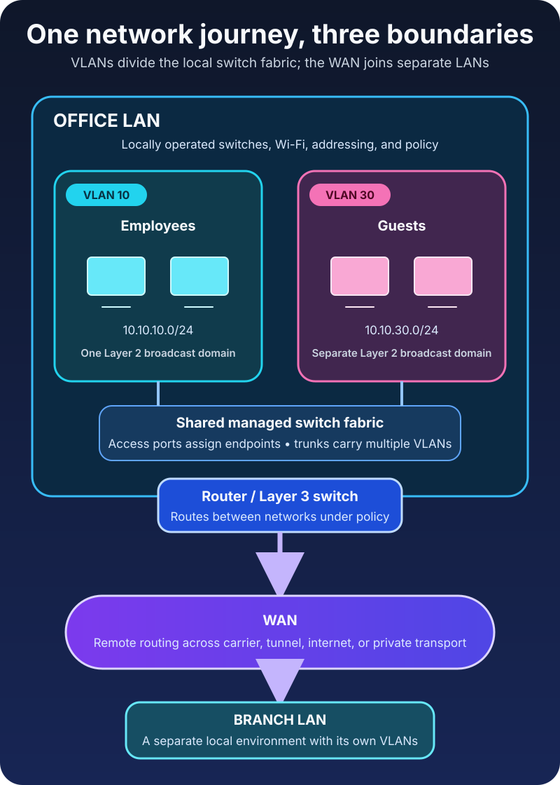

Two laptops sit on adjacent desks. Both cables lead to the same switch. One laptop can reach the payroll server; the other cannot.

Meanwhile, an employee hundreds of kilometers away opens that same server through a branch-office connection.

The nearby devices are physically closer, but the distant one has the permitted path. This is the point where the familiar labels *LAN*, *WAN*, and *VLAN* stop being vocabulary and become a useful way to reason about traffic.

**A LAN connects devices across a limited local area. A WAN connects networks or users across a broader area. A VLAN creates a logical Layer 2 network inside shared switching infrastructure.** LAN and WAN mainly describe scope and interconnection; VLAN describes segmentation.

They are not three competing kinds of cable. A real organization can use all three at the same time.

## Start with the boundary, not the acronym

The easiest mistake is to treat LAN, WAN, and VLAN as three sizes of the same thing. LAN and WAN do describe different operational scopes, but a VLAN answers a different question.

The [NIST glossary defines a LAN](https://csrc.nist.gov/glossary/term/local_area_network) as connected devices spread across a relatively limited area. Its [WAN definition](https://csrc.nist.gov/glossary/term/wan) describes a physical or logical network that usually covers a larger area and serves more independent users than a LAN.

A VLAN does not need a new building or a longer link. It changes which switch ports and frames belong to the same logical bridged network. The active [IEEE 802.1Q standard](https://standards.ieee.org/ieee/802.1Q/10323/) specifies the operation of bridges, bridged networks, and VLAN bridges.

That gives us three practical questions:

1. **What local environment do we operate?** That is the LAN question.
2. **How do we connect separate environments over distance or another operator's network?** That is the WAN question.
3. **Which devices should share one Layer 2 forwarding and broadcast domain?** That is the VLAN question.

## A LAN is the network close to home

A local area network is the network within a limited environment such as a home, office floor, school, laboratory, or campus. The same organization typically controls the local switches, wireless access points, cabling, addressing, and access policy.

Ethernet and Wi-Fi are common LAN technologies, but *LAN* does not mean *wired*. A phone on office Wi-Fi and a desktop connected by Ethernet can belong to the same LAN. Conversely, two computers connected to the same physical switch may belong to different logical networks because of VLAN configuration.

Within one Layer 2 LAN or VLAN, switches forward Ethernet frames using MAC addresses. If a destination is in the same IP subnet, the sender normally resolves the destination's local link-layer address and sends the frame without asking a router to carry the packet to another network.

The phrase “normally” matters. A LAN describes a useful administrative and geographic scope, not a promise that every device can talk directly to every other device. Host firewalls, wireless isolation, VLANs, and other policies can still restrict communication.

The IEEE 802 family provides much of the foundation for modern local networking. The [IEEE 802 architecture overview](https://www.ieee802.org/1/pages/802.html) is explicitly the foundation for LAN and metropolitan-area networking standards, while technologies such as Ethernet, wireless LANs, and bridging live in related IEEE 802 working groups.

## A WAN connects beyond one local environment

A wide area network carries communication across a broader geography or between distinct sites and network domains. A company might use a WAN to connect its headquarters, branches, data centers, and cloud networks.

The internet is the largest familiar wide-area interconnection, but *WAN* is not another name for *internet*. An organization can build WAN connectivity using a provider-managed private service, encrypted tunnels over internet access, dedicated circuits, or a mixture of transports. The stable concept is that traffic crosses beyond one local environment toward another network.

That crossing changes the operational problem. On a LAN, a team often owns both ends of a switch link. Across a WAN, performance and availability may depend on access circuits, carriers, tunnel endpoints, routing policy, and paths the organization does not directly control.

Distance is a clue, not the complete definition. A logical WAN can join cloud networks and offices even when the underlying provider path is invisible to the customer. A large campus, meanwhile, may contain several routed LANs without calling every internal link a WAN.

When a workstation sends traffic to a remote branch, it first uses its local LAN to reach a default gateway. Routers then forward the packet toward the remote network across the WAN. At the destination site, another router delivers it into the appropriate local network.

## A VLAN draws a logical line through switches

A virtual local area network separates one switched infrastructure into multiple logical Layer 2 networks. Devices can share the same switch hardware while belonging to different broadcast domains.

Imagine an office with employee laptops, voice phones, guest Wi-Fi, printers, and building-control equipment. One enormous flat network would allow broadcasts and accidental reachability to spread widely. VLANs let the network team create boundaries such as:

- VLAN 10 for employee devices
- VLAN 20 for voice
- VLAN 30 for guests
- VLAN 40 for building systems

The numbers are administrative identifiers, not security levels or IP ranges by themselves.

On an **access port**, ordinary endpoint traffic is associated with one VLAN and usually reaches the endpoint without an 802.1Q tag. On a **trunk link**, multiple VLANs can cross the same physical connection between VLAN-aware devices. The VLAN information lets the receiving switch keep the logical networks separate.

[Cisco's current inter-VLAN routing documentation](https://www.cisco.com/c/en/us/td/docs/routers/ios-xe/lan-wan/lan-wan/m_lsw-conf-rout-vlan.html) describes a VLAN as a switched network segmented logically rather than geographically. It also makes the crucial forwarding rule explicit: switches do not bridge frames between different VLANs. Communication between them requires Layer 3 routing.

That router or Layer 3 switch becomes a policy point. It can allow employee devices to reach a printer, prevent guests from reaching internal systems, and permit only a management service into the building-control VLAN.

## LAN vs WAN vs VLAN at a glance

| Concept | What it describes | Typical boundary | How traffic crosses the boundary | Common example |
| --- | --- | --- | --- | --- |
| LAN | A locally operated network across a limited area | Home, office, building, or campus environment | Switching inside a local Layer 2 domain; routing between local IP networks | Office Ethernet and Wi-Fi |
| WAN | Connectivity across broader geography or separate network domains | Site, provider, region, or remote-network edge | Routing over carrier, tunnel, internet, or private transport | Headquarters connected to a branch |
| VLAN | A logical Layer 2 segment on shared switching infrastructure | VLAN membership and bridged broadcast domain | Layer 2 switching within the VLAN; routing between VLANs | Guest and employee networks on the same switches |

The most important row is not “speed.” A LAN is not guaranteed to be fast, and a WAN is not guaranteed to be slow. Link capacity, congestion, latency, equipment, and path length determine observed performance. The acronyms describe network relationships, not benchmark results.

## Follow one packet through all three

Suppose a laptop in the Istanbul office belongs to employee VLAN 10 and has the address `10.10.10.25/24`.

When it contacts a printer at `10.10.10.50` in the same VLAN and subnet, it sends a local Ethernet frame. The switch forwards that frame within VLAN 10. No inter-network router is required for the data path.

When the laptop contacts a payroll server at `10.10.20.50` in server VLAN 20, the destination is outside the laptop's subnet. The laptop sends the packet to its default gateway. A router or Layer 3 switch routes between VLAN 10 and VLAN 20, subject to policy.

When the laptop contacts a branch server at `10.40.20.50`, the local gateway chooses a route toward the branch. The packet leaves the office across WAN connectivity, reaches the branch router, and enters the destination LAN and VLAN there.

One application request has now used a VLAN boundary, the local LAN, and a WAN path. The terms overlap because each describes a different part of the journey.

## A VLAN is not an IP subnet

VLANs and subnets are often paired one-to-one, which makes them easy to confuse.

A VLAN is a Layer 2 forwarding domain. An IP subnet is a Layer 3 addressing boundary. A clean design commonly assigns one IP subnet to one VLAN because the mapping makes gateway behavior, address assignment, and troubleshooting easier to understand.

But the technologies are not identical. Creating VLAN 30 does not automatically create `10.30.0.0/24`, a DHCP scope, a gateway, or a firewall rule. Those are separate configuration decisions. Likewise, reusing one IP subnet carelessly across separated VLANs does not magically join them; it usually produces unreachable peers and confusing address-resolution failures.

If you need a deeper view of those layers, [Network Communication Basics](/posts/network-communication-basics/) explains frames and MAC addressing, while [Internet Protocol (IP) Explained](/posts/internet-protocol-ip-basics/) covers subnets and routing.

## VLANs create isolation, not complete security

Separating devices into VLANs reduces unwanted Layer 2 reachability and contains broadcast traffic. That is valuable, but it is not a complete security architecture.

Once inter-VLAN routing is enabled, policy determines what can cross the boundary. An “IoT VLAN” that can initiate unrestricted connections to employee laptops provides far less protection than its name suggests. Trunk misconfiguration, overly broad firewall rules, exposed management interfaces, and compromised routing devices can also defeat the intended design.

Treat a VLAN as a place to enforce a boundary, not as proof that the boundary is safe. Define which flows are required, deny unnecessary paths, secure switch management, and verify the result from both sides.

## Troubleshoot the boundary that should carry the traffic

When two devices cannot communicate, avoid changing random settings. Trace the expected path.

First, decide whether the destination should be local or routed. Compare the source address, subnet prefix, destination, and default gateway. Then verify that the endpoint's switch port belongs to the intended VLAN.

If the VLAN spans multiple switches, check the trunk at both ends. [Cisco's 802.1Q trunking guidance](https://www.cisco.com/c/en/us/support/docs/lan-switching/inter-vlan-routing/14976-50.html) notes that a trunk carries multiple VLANs over one link and that mismatched native-VLAN configuration is a common error. Also confirm that the required VLAN is allowed across every trunk in the path.

If the devices are in different VLANs, inspect the Layer 3 gateway, routes, and access policy. If the destination is at another site, add WAN tunnel or circuit state, remote routes, and provider reachability to the investigation.

This order turns “the network is down” into a smaller set of questions:

1. Is the endpoint attached to the correct VLAN?
2. Can that VLAN cross the required switch links?
3. Is routing available between the source and destination networks?
4. Does policy permit the flow?
5. If the path is remote, is the WAN route and transport healthy in both directions?

## The takeaway

A LAN is the local environment. A WAN joins environments across a broader boundary. A VLAN divides shared switching infrastructure into logical Layer 2 networks.

Remember the three questions: *Where is the local network? What connects it to other networks? Which devices share a broadcast domain?* Those answers point to LAN, WAN, and VLAN respectively.

Once the boundaries are clear, network design and troubleshooting become less about memorizing acronyms and more about following the path a frame or packet is actually allowed to take.

## Related reading

- [Router vs Switch vs Modem: What Is the Difference?](/posts/router-vs-switch-vs-modem/)
- [The OSI Model Explained Layer by Layer](/posts/osi-model-explained/)
- [Understanding Internet Connectivity and Network Cabling](/posts/internet-connectivity-and-cabling/)
- [TCP vs UDP Explained With Examples](/posts/tcp-vs-udp-explained-with-examples/)

## Sources

- [NIST CSRC Glossary: Local Area Network (LAN)](https://csrc.nist.gov/glossary/term/local_area_network)
- [NIST CSRC Glossary: Wide Area Network (WAN)](https://csrc.nist.gov/glossary/term/wan)
- [IEEE 802.1: IEEE 802 Overview and Architecture](https://www.ieee802.org/1/pages/802.html)
- [IEEE Standards Association: IEEE 802.1Q-2022 — Bridges and Bridged Networks](https://standards.ieee.org/ieee/802.1Q/10323/)
- [Cisco: Configuring Routing Between VLANs](https://www.cisco.com/c/en/us/td/docs/routers/ios-xe/lan-wan/lan-wan/m_lsw-conf-rout-vlan.html)
- [Cisco: Configure Inter-VLAN Routing with an External Router](https://www.cisco.com/c/en/us/support/docs/lan-switching/inter-vlan-routing/14976-50.html)
