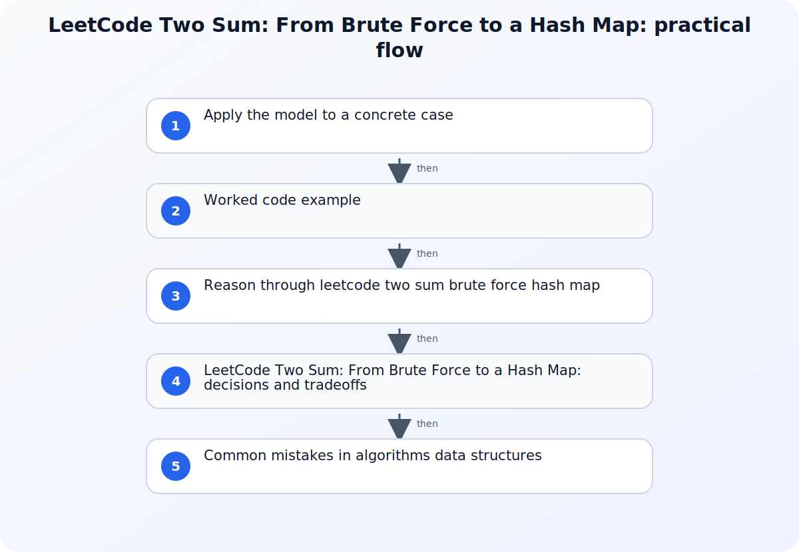

Two Sum asks for two distinct input positions whose values add to a target. The compact solution is often presented as a memorized hash-map trick, but the important reasoning is the complement equation: when the current value is x, the required earlier value is target minus x. From that observation, the implementation choice becomes a tradeoff between repeated search, sorting, and indexed lookup.



## A working model for LeetCode Two Sum: From Brute Force to a Hash Map

State the contract before writing code: whether exactly one answer exists, whether the original indices must be returned, whether the same element may be used twice, how duplicates behave, and what should happen when there is no answer. Walk through an input containing duplicate values and another containing negative values. Those cases expose ordering mistakes that a single happy-path example can hide.

## Apply the model to a concrete case

For values [2, 7, 11, 15] and target 9, start with an empty seen map. At index 0 the value is 2 and its complement is 7, which is not stored, so record 2 mapped to index 0. At index 1 the value is 7 and its complement is 2, which resolves to index 0; return [0, 1]. Now test [3, 3] with target 6. The first 3 is stored after its failed lookup, and the second 3 finds that earlier index. This ordering preserves the distinct-position rule. With [-4, 10, 3, 7] and target 6, negative keys require no special case: 10 finds the stored -4 through the same complement equation.

## Worked code example

### One-pass complement lookup in Python

```python
def two_sum(nums: list[int], target: int) -> tuple[int, int] | None:
    seen: dict[int, int] = {}

    for index, value in enumerate(nums):
        complement = target - value
        if complement in seen:
            return seen[complement], index
        seen[value] = index

    return None
```

Lookup happens before insertion, so one array position cannot match itself. The map stores the index of each previously seen value and naturally handles equal values at different positions.

## Source boundaries for algorithms data structures

### TwoSumFast.java

Use TwoSumFast.java for this boundary of the topic: Use the Princeton TwoSumFast material to contrast pair-search strategies and make the algorithmic assumptions visible.
### Python mapping types — dict

Use Python mapping types — dict for this boundary of the topic: Use Python mapping semantics to explain key lookup and the role of a dictionary as the seen-value index.
### Java HashMap

Use Java HashMap for this boundary of the topic: Use the Java HashMap reference for key-value behavior, replacement semantics, and implementation-level performance context.

## Reason through leetcode two sum brute force hash map

### 1. Establish the quadratic baseline

Compare every pair of distinct positions with the first index strictly less than the second. This examines each unordered pair once, uses constant auxiliary space, and makes the correctness condition easy to see. Its running time grows quadratically with input length because the inner comparisons accumulate as the outer index advances. Keep this version as a reference implementation for small randomized tests of a faster solution.
### 2. Derive one-pass complement lookup

Scan from left to right. Before inserting the current value, look up target minus the current value in a mapping from previously seen values to indices. Checking before insertion prevents one element from satisfying the pair with itself, while still allowing two equal values at different positions. When a complement exists, return its stored index and the current index. If the contract allows multiple answers, decide whether to stop, collect pairs, or preserve all indices for a repeated value.
### 3. Separate expected complexity from the contract

A hash table gives efficient expected lookup for ordinary dictionary or HashMap use, but the explanation should name the assumption instead of claiming an unconditional constant bound for every implementation and input. The one-pass approach uses linear additional storage in the worst case because unmatched values are retained. A sorted two-pointer method can reduce lookup structure but must preserve original indices and pay the sorting cost; it solves a slightly different engineering problem than an in-place array scan.

## LeetCode Two Sum: From Brute Force to a Hash Map: decisions and tradeoffs

| Situation or decision | Tradeoff or common failure mode | Validation question |
| --- | --- | --- |
| Input [3, 3] with target 6 returns no result | The implementation discarded or mishandled a duplicate value | Look up the complement before inserting the current index and keep positions distinct |
| A single 3 is paired with itself for target 6 | The current value was inserted before its complement check | Require the matching index to come from an earlier position |
| A sorted solution returns sorted positions | Value ordering was changed without preserving original indices | Sort value-index pairs or use the one-pass map when original positions are required |

## Common mistakes in algorithms data structures

The most common defect is inserting the current value before checking its complement, which can let a single element match itself. Another is storing only a Boolean membership flag even though the required output is a pair of indices. Sorting raw values can make a two-pointer scan attractive but destroys the original positions unless value-index pairs are preserved. Complexity explanations also become careless: the nested-loop baseline is quadratic, sorting changes the bound and the input representation, and a hash map uses additional memory while relying on its implementation's lookup behavior. State these assumptions and test the optimized result against the simple pair enumeration instead of trusting one example.

## Practical implementation checklist

1. Write the input and output contract, including the no-solution and multiple-solution cases.
2. Test duplicates, negative numbers, zero, and a complement that appears after the current value.
3. Ensure one array position cannot be used twice in the returned pair.
4. Explain average lookup assumptions separately from worst-case auxiliary space.
5. Compare the optimized output with a quadratic reference across generated small inputs.

## Related implementation context

[Solving LeetCode's Valid Parentheses Problem with a Stack in Java](/posts/how-to-solve-leetcode-valid-parentheses-using-stack-in-java/) and [Remove Duplicates from a Sorted Array - The Two-Pointer Technique](/posts/remove-duplicates-from-sorted-array/)

## Version and verification boundary

The algorithm is language-independent; dictionary and hash-map behavior should be checked against the concrete language runtime, and the cited Python and Java references were current at publication time.

## Summary

Two Sum follows directly from complement lookup: search only previously seen values, then insert the current position. Preserve the exact problem contract, test duplicates and negative values, and explain the time-space tradeoff without turning expected hash-table behavior into an absolute guarantee.

## Sources

- [TwoSumFast.java](https://algs4.cs.princeton.edu/14analysis/TwoSumFast.java.html)
- [Python mapping types — dict](https://docs.python.org/3/library/stdtypes.html)
- [Java HashMap](https://docs.oracle.com/en/java/javase/25/docs/api/java.base/java/util/HashMap.html)
