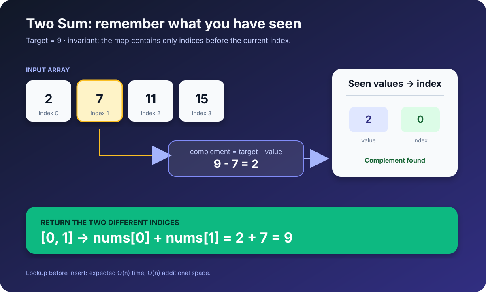

Two Sum is small enough to fit in a few lines, but it tests a valuable algorithmic habit: replace repeated searching with remembered information.

Given an integer array `nums` and a target, return the indices of two **different** elements whose values add to the target. The standard problem guarantees exactly one answer, and the same element cannot be used twice.



## Start with the honest solution

The most direct approach checks every pair:

```java
static int[] twoSumBruteForce(int[] nums, int target) {
    for (int i = 0; i < nums.length; i++) {
        for (int j = i + 1; j < nums.length; j++) {
            if (nums[i] + nums[j] == target) {
                return new int[] { i, j };
            }
        }
    }
    throw new IllegalArgumentException("No solution");
}
```

This is a good baseline because it is obviously correct:

- `j` starts at `i + 1`, so an element is never paired with itself.
- Every unordered pair is examined once.
- Original indices are preserved.

For `n` values, it checks up to `n(n - 1) / 2` pairs. Time is \(O(n^2)\); extra space is \(O(1)\).

The optimization question is now precise: **can we avoid scanning earlier values again for every new value?**

## Derive the complement lookup

For a value `x`, its required partner is:

```text
complement = target - x
```

While moving left to right, store each value already seen and its index. Before storing the current value, ask whether its complement has already appeared.

Trace `nums = [2, 7, 11, 15]`, `target = 9`:

| Index | Current value | Needed complement | Seen before step | Result |
| ---: | ---: | ---: | --- | --- |
| 0 | 2 | 7 | `{}` | Store `2 -> 0` |
| 1 | 7 | 2 | `{2: 0}` | Return `[0, 1]` |

That order—**look up, then insert**—solves the “different elements” rule naturally.

```java
import java.util.HashMap;
import java.util.Map;

static int[] twoSum(int[] nums, int target) {
    Map<Integer, Integer> indexByValue = new HashMap<>();

    for (int i = 0; i < nums.length; i++) {
        int complement = target - nums[i];
        Integer previousIndex = indexByValue.get(complement);

        if (previousIndex != null) {
            return new int[] { previousIndex, i };
        }

        indexByValue.put(nums[i], i);
    }

    throw new IllegalArgumentException("No solution");
}
```

Java's `HashMap.get()` returns `null` when the key is absent, which is safe here because indices stored in the map are never null.

## Why duplicates work

Consider `[3, 3]` with target `6`.

1. At index `0`, complement `3` is absent, so store `3 -> 0`.
2. At index `1`, complement `3` maps to index `0`.
3. Return `[0, 1]`.

If you inserted before checking, the second step is still correct for this example, but `[3]` with target `6` could incorrectly match index `0` with itself. Looking up first makes the invariant clear:

> At the start of iteration `i`, the map contains only indices smaller than `i`.

That invariant is the proof.

## Python version

Python dictionaries express the same algorithm:

```python
def two_sum(nums: list[int], target: int) -> list[int]:
    index_by_value: dict[int, int] = {}

    for index, value in enumerate(nums):
        complement = target - value
        if complement in index_by_value:
            return [index_by_value[complement], index]
        index_by_value[value] = index

    raise ValueError("no solution")
```

Do not write this:

```python
# Wrong when the matching index is 0, because 0 is falsy.
if previous := index_by_value.get(complement):
    return [previous, index]
```

Membership testing distinguishes “missing” from “present at index zero.”

## Complexity, stated carefully

| Approach | Time | Extra space | Preserves indices easily? |
| --- | --- | --- | --- |
| Nested loops | \(O(n^2)\) | \(O(1)\) | Yes |
| Sort + two pointers | \(O(n \log n)\) | Depends on representation | Not without carrying indices |
| One-pass hash map | Expected \(O(n)\) | \(O(n)\) | Yes |

Hash-table operations are commonly treated as expected constant time under normal hashing assumptions, giving expected \(O(n)\) total time. “Expected” is more accurate than claiming a universal worst-case constant lookup.

Sorting is attractive when memory is severely constrained, but sorting the input destroys the original position information unless each value travels with its original index. It also performs more work than needed under the standard Two Sum contract.

## Test the cases that expose mistakes

```java
import static org.junit.jupiter.api.Assertions.assertArrayEquals;
import org.junit.jupiter.api.Test;

class TwoSumTest {
    @Test
    void findsOrdinaryPair() {
        assertArrayEquals(
            new int[] {0, 1},
            twoSum(new int[] {2, 7, 11, 15}, 9)
        );
    }

    @Test
    void handlesDuplicateValuesAtDifferentIndices() {
        assertArrayEquals(
            new int[] {0, 1},
            twoSum(new int[] {3, 3}, 6)
        );
    }

    @Test
    void handlesNegativeValues() {
        assertArrayEquals(
            new int[] {2, 4},
            twoSum(new int[] {-8, 4, -1, 6, 5}, 4)
        );
    }
}
```

Also test:

- the solution includes index `0`;
- the complement is zero;
- values are negative;
- the input has the minimum valid length;
- no-solution behavior, if your version of the contract does not guarantee an answer.

## Overflow is a contract question

In Java, `target - nums[i]` can overflow `int`. The original LeetCode constraints make `int` arithmetic suitable for the problem, but production code should decide based on its own contract. If inputs can approach integer limits, compute with `long` and use `Map<Long, Integer>`:

```java
long complement = (long) target - nums[i];
```

Avoid adding silent complexity for impossible inputs, but do not inherit coding-challenge assumptions in a production API.

## A reusable problem-solving pattern

The deeper lesson is not “memorize a hash map solution.” It is this transformation:

1. Write the exhaustive search.
2. Identify the repeated work: searching earlier values.
3. Name the information needed now: the complement.
4. Store exactly enough history to answer that lookup.
5. State an invariant and test its edge cases.

The same idea appears in frequency counting, duplicate detection, prefix-sum problems, joins, and memoization. Two Sum is simply the smallest clean example.

## Sources

- [Two Sum problem — LeetCode](https://leetcode.com/problems/two-sum/)
- [Python mapping types — Python documentation](https://docs.python.org/3/library/stdtypes.html#mapping-types-dict)
- [HashMap — Java SE documentation](https://docs.oracle.com/en/java/javase/25/docs/api/java.base/java/util/HashMap.html)
