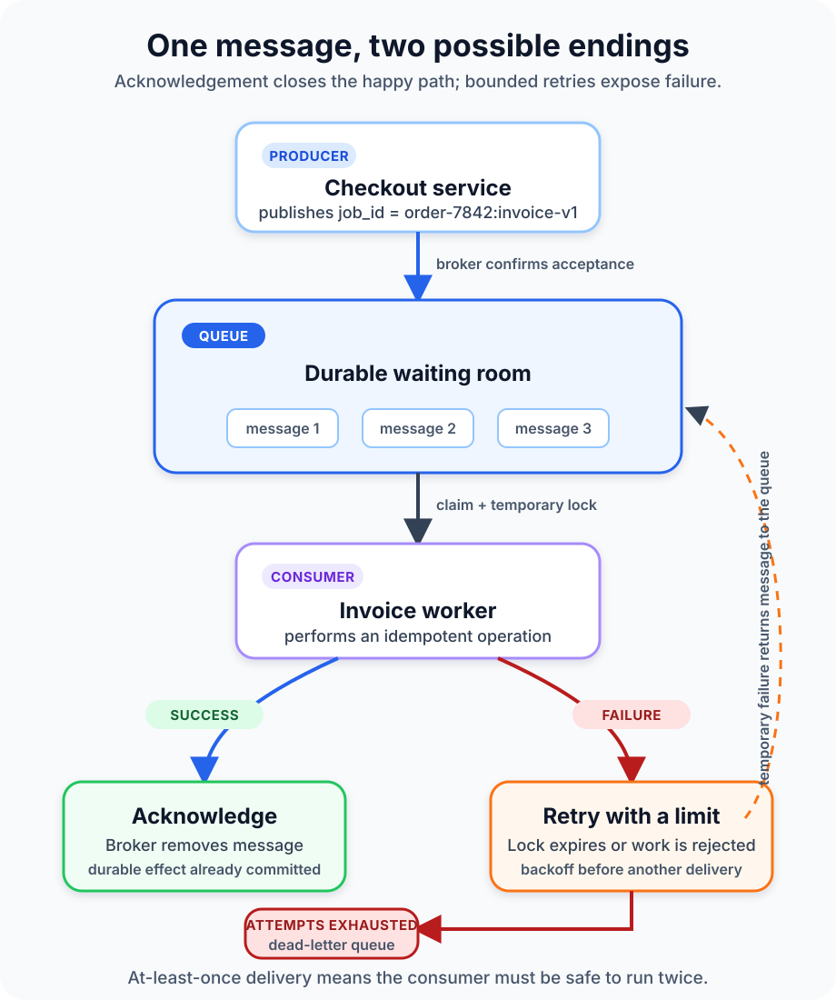

A customer clicks **Place order**. The payment succeeds, but generating the invoice takes 12 seconds and the email provider is having a bad afternoon. Should the browser wait for both jobs? Should checkout fail because a PDF or an email is late?

Probably not.

The checkout service can record the order, place an `invoice.requested` message in a queue, and return a useful response. An invoice worker handles the slow task later. If that worker is busy or briefly offline, the message waits instead of taking checkout down with it.

That is the central idea of a message queue: **a producer stores a message for a consumer to process, so the two sides do not have to be available or run at the same speed at the same moment**. This asynchronous boundary can make a system more responsive and resilient. It also creates new questions about duplicates, ordering, retries, and work that never succeeds.

The queue is not where those questions disappear. It is where the system must answer them deliberately.



## Asynchronous does not mean immediate

In a synchronous call, component A asks component B to do something and waits for an answer. The result is simple to reason about when B is fast and available. It becomes painful when the work is slow, traffic arrives in bursts, or B fails.

With a queue, A becomes the **producer**. It sends a small description of work to a **broker**, which stores that message in a **queue**. A **consumer** retrieves the message and performs the work independently.

The producer can move on after the broker accepts responsibility for the message. That is an important distinction: accepted does not mean completed. A `202 Accepted` response or an “order received” screen should not pretend that the invoice already exists. The application needs a way to expose later success or failure when users care about the outcome.

[Microsoft's asynchronous messaging guidance](https://learn.microsoft.com/en-us/azure/architecture/guide/technology-choices/messaging) calls this temporal decoupling. Producer and consumer do not need to run concurrently. The queue also acts as a buffer: a burst of 10,000 jobs can arrive quickly while a controlled number of workers drain them at a rate the database or third-party API can sustain.

That buffer absorbs pressure; it does not erase it. If producers add work faster than consumers finish it for long enough, the queue grows, jobs become stale, and storage or retention limits eventually matter.

## A message has a lifecycle, not just a destination

A reliable path begins before the message reaches a worker.

First, the producer sends a message with enough information to identify the operation. The broker confirms that it has accepted the message according to the product's durability rules. Without that confirmation, a network break can leave the producer unsure whether the message arrived. Retrying may be necessary, and that retry may create a duplicate.

Next, the broker makes the message available to a consumer. Many queues temporarily hide or lock a claimed message instead of deleting it immediately. The worker processes the job, commits the intended effect, and only then acknowledges success. The broker can now remove the message.

If the worker crashes before acknowledging, the lock or visibility timeout expires and the message becomes available again. Another worker can retry it. Azure Service Bus calls this behavior peek-lock; Amazon SQS uses a visibility timeout; RabbitMQ uses consumer acknowledgements. The APIs differ, but the ownership question is the same: **when is it safe for the broker to forget this message?**

RabbitMQ's [reliability guide](https://www.rabbitmq.com/docs/reliability) recommends acknowledging only after the consumer has done the work it must preserve, such as recording a result or forwarding the message. Acknowledging first creates a dangerous gap: the broker deletes the message, then the worker can fail before the business operation is durable.

## Delivery guarantees are tradeoffs, not magic words

Queue products describe delivery with terms that sound stronger than the complete application can always provide.

| Model | What it usually means | Application consequence |
| --- | --- | --- |
| At most once | A message is not retried after uncertain delivery | Work may be lost, but duplicate processing is reduced |
| At least once | Unacknowledged work can be delivered again | Work is less likely to be lost; consumers must tolerate duplicates |
| Exactly once | A defined broker or processing scope suppresses duplicates | External side effects still need careful transaction and idempotency design |

At-least-once delivery is common because it chooses possible duplication over silent loss. Imagine a worker charges a card and crashes before acknowledging the message. The queue cannot know that the charge succeeded, so it delivers the message again. Blindly charging again is unacceptable.

The practical defense is **idempotency**: processing the same logical request more than once produces the same durable outcome as processing it once. Give every job a stable identifier such as `order-7842:charge-v1`. Before creating the effect, the consumer atomically records or checks that identifier in the same data boundary as the result.

Conceptually, the critical section looks like this:

```text
begin transaction
  if job_id already completed:
    commit and acknowledge
  else:
    apply business change
    record job_id as completed
commit transaction
acknowledge message
```

This is deliberately pseudocode. The real implementation depends on the database, queue client, and external services involved. A local database transaction cannot automatically make a remote payment API part of that transaction. In those cases, use the provider's idempotency feature when available, persist state transitions, and design recovery for an uncertain response.

“Exactly once” should therefore come with a scope. Exactly once in one broker, one partition, or one managed operation is not automatically exactly once across every database write, email, and third-party call in a business workflow.

## Retries need an exit

Retries are useful for transient failures: a short database outage, a throttled dependency, or a worker restart. Immediate, unlimited retries are not resilience. They can amplify an outage and let one malformed message consume worker capacity forever.

A safer policy separates failure types:

- Retry temporary failures with exponential backoff and jitter.
- Reject invalid messages that cannot succeed without a code or data change.
- Cap delivery attempts.
- Move exhausted work to a dead-letter queue.
- Alert on dead-letter growth and provide an intentional review or redrive process.

A dead-letter queue is not a rubbish bin. It is a quarantine area with evidence: message identifier, schema version, failure reason, attempt count, and correlation information. AWS documents dead-letter queues as a way to isolate repeatedly unsuccessful messages for diagnosis and possible redrive. Its guidance also warns that moving messages out of a FIFO flow can disturb strict business order.

Do not replay a dead-letter queue in bulk before fixing the cause and checking whether the consumer is idempotent. Otherwise a recovery tool becomes a duplicate-effect generator.

## More workers change both speed and order

A queue can feed several **competing consumers**. Each worker claims different messages, which increases throughput and lets the pool survive one worker failing. The [Azure Competing Consumers pattern](https://learn.microsoft.com/en-us/azure/architecture/patterns/competing-consumers) describes this as a way to load-level variable work across consumer instances.

Parallelism changes ordering. Suppose messages A and B enter the queue in that order. Worker 1 can claim A, worker 2 can claim B, and B can finish first. A retry can delay A even longer. A queue that preserves retrieval order cannot promise completion order across independent workers.

If order matters only within one entity, partition by a stable key such as `account_id` or `order_id`. Messages for one key go to the same ordered group, while unrelated keys can still run in parallel. If every message requires one global order, the system gives up much of the scaling benefit. State that requirement explicitly instead of assuming “FIFO” solves it everywhere.

Backpressure matters too. Limit how much unacknowledged work each consumer can claim. A worker that prefetches hundreds of jobs may appear busy while other workers sit idle, and a crash can return a large batch to the queue at once.

## A queue is not the same as publish-subscribe

In a work queue, multiple consumers usually compete and one of them handles each message. In publish-subscribe, one publication can be copied to several independent subscriptions: billing, analytics, and notifications may all receive an `order.created` event.

The distinction is about intent, not product names. Many brokers support both patterns. Ask whether the message is a command for one pool of workers or an event that several capabilities may observe. Mixing those meanings produces accidental coupling and surprising delivery behavior.

## Operate the waiting, not only the workers

CPU usage tells little about whether queued work is healthy. The most revealing signal is often the **age of the oldest ready message**. Queue depth may rise during an expected burst, but an old message means users have been waiting and the consumers are not catching up.

Monitor at least:

- ready and in-flight message counts;
- age of the oldest message and end-to-end processing latency;
- publish, acknowledgement, retry, expiration, and dead-letter rates;
- consumer throughput, errors, saturation, and processing-time percentiles;
- broker storage, availability, and connection failures.

Correlate logs and traces with a stable message ID, but do not put secrets or unnecessary personal data in message bodies or diagnostic fields. Define retention, encryption, and access controls as carefully as you would for a database. A durable queue is another place where production data lives.

## When a queue helps—and when it does not

Use a queue when work can finish later, traffic is bursty, consumers need independent scaling, or temporary consumer failure should not block producers. Image processing, email delivery, invoice generation, webhook dispatch, and background imports are common fits.

Keep a synchronous path when the caller needs an immediate authoritative result, the operation is cheap and reliable, or the added broker would create more operational cost than resilience. A queue cannot simplify a workflow that has been split into messages without clear ownership, status, timeout, and compensation rules.

The decision rule is straightforward: **add a queue when waiting is a real part of the business process and you are prepared to operate that waiting explicitly**.

A good asynchronous design can answer these questions before launch: Who owns the message after publish? When is it acknowledged? Can it run twice? What order is required? How long may it wait? Where do exhausted retries go? How will an operator find and safely replay one failed job?

Message queues make time and failure visible architectural boundaries. Used well, they let a fast producer and a slow consumer coexist without making every delay an outage. Used carelessly, they merely move lost work and duplicate effects out of the request log and into a harder place to see.

For the wider architectural context, continue with [Monolithic Architecture vs Microservices](/posts/monolithic-architecture-vs-microservices/), [What Is a REST API?](/posts/what-is-a-rest-api/), and [What Is Load Balancing?](/posts/what-is-load-balancing/).

## Sources

- [Microsoft Azure Architecture Center: Asynchronous messaging options](https://learn.microsoft.com/en-us/azure/architecture/guide/technology-choices/messaging)
- [Microsoft Azure Architecture Center: Competing Consumers pattern](https://learn.microsoft.com/en-us/azure/architecture/patterns/competing-consumers)
- [RabbitMQ: Reliability guide](https://www.rabbitmq.com/docs/reliability)
- [RabbitMQ: Consumer acknowledgements and publisher confirms](https://www.rabbitmq.com/docs/confirms)
- [Amazon SQS: What is Amazon Simple Queue Service?](https://docs.aws.amazon.com/AWSSimpleQueueService/latest/SQSDeveloperGuide/welcome.html)
- [Amazon SQS: Using dead-letter queues](https://docs.aws.amazon.com/AWSSimpleQueueService/latest/SQSDeveloperGuide/sqs-dead-letter-queues.html)
