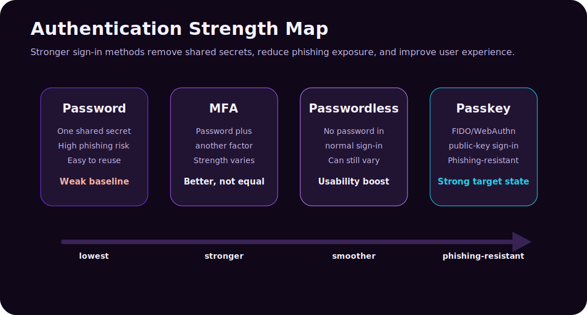
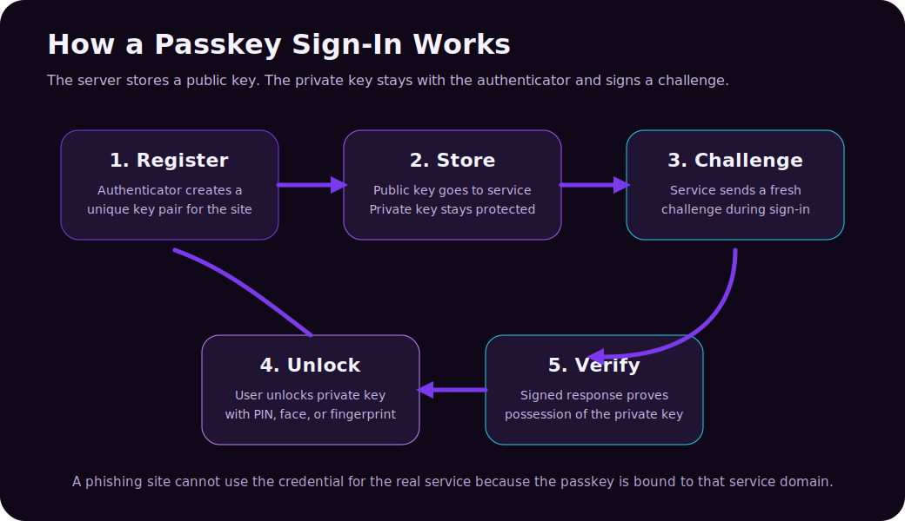
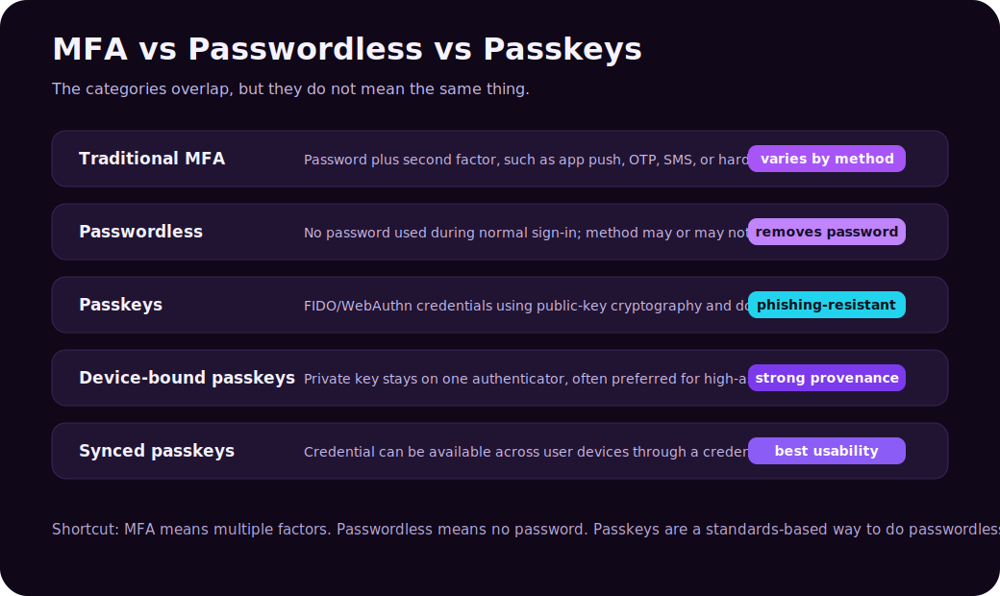

Modern authentication is full of similar-sounding terms: **MFA**, **2FA**, **passwordless**, **FIDO2**, **WebAuthn**, **security keys**, and **passkeys**. They are related, but they are not interchangeable.

That distinction matters. A company can "enable MFA" and still be vulnerable to phishing. A sign-in flow can be "passwordless" and still rely on an email account that becomes the real weak point. A passkey can be very strong, but the surrounding account recovery, device enrollment, and exception process can still create risk.

This post explains the difference in plain language, with real-world examples and practical decision guidance.



---

## The Short Version

| Term | Simple Definition | Main Benefit | Main Caveat |
|---|---|---|---|
| MFA | Uses two or more authentication factors | Better than password-only sign-in | Some MFA methods are still phishable |
| Passwordless | Removes the password from normal sign-in | Better user experience and fewer password attacks | Not every passwordless method is equally strong |
| Passkeys | FIDO/WebAuthn credentials based on public-key cryptography | Passwordless and phishing-resistant | Rollout, recovery, sync, and device policy still matter |

The shortest mental model:

```text
MFA = more than one factor
Passwordless = no password in the normal login flow
Passkeys = a modern, phishing-resistant way to do passwordless authentication
```

The categories overlap. A passkey can be passwordless. A passkey can satisfy MFA because it combines possession of an authenticator with a local user verification gesture such as a PIN, fingerprint, or face unlock. But not all MFA is passwordless, and not all passwordless authentication is a passkey.

---

## Authentication Factors: The Foundation

Authentication factors are usually grouped into three categories.

| Factor | Meaning | Examples |
|---|---|---|
| Something you know | A secret you remember | Password, PIN |
| Something you have | A physical or digital authenticator you possess | Phone, security key, authenticator app, device-bound credential |
| Something you are | A biometric trait | Fingerprint, face recognition |

MFA means the sign-in requires more than one factor. A password plus an authenticator app approval is MFA. A password plus an SMS code is MFA. A password plus a hardware security key is MFA.

But those methods are not equally strong.

| Method | MFA? | Passwordless? | Phishing-Resistant? |
|---|---:|---:|---:|
| Password only | No | No | No |
| Password + SMS code | Yes | No | No |
| Password + app push | Yes | No | Usually no |
| Password + TOTP code | Yes | No | Usually no |
| Password + FIDO2 security key | Yes | No | Yes, if correctly implemented |
| Windows Hello for Business | Yes, in many enterprise contexts | Yes | Yes, when deployed as phishing-resistant auth |
| Passkey | Yes, in many contexts | Yes | Yes, by design |
| Magic link email sign-in | Often treated as passwordless | Yes | Not necessarily |

The difference between "MFA" and "strong MFA" is the whole game.

---

## What MFA Actually Means

**Multi-factor authentication (MFA)** means a user must present two or more different authentication factors before access is granted.

Common MFA examples:

- Password plus SMS code.
- Password plus authenticator app push.
- Password plus one-time code from an authenticator app.
- Password plus hardware security key.
- Password plus certificate.

MFA is important because passwords fail constantly. They are reused, guessed, leaked, phished, sprayed, and stolen by malware. Adding another factor makes account compromise harder.

But MFA is a broad category, not a guarantee of phishing resistance.

### Weak MFA Example: SMS Codes

SMS-based MFA is better than password-only authentication, but it has serious weaknesses:

| Weakness | Why It Matters |
|---|---|
| SIM swap | Attackers may hijack a phone number |
| Phishing proxy | A fake login site can ask for the SMS code in real time |
| Mobile network risk | SMS depends on telecom infrastructure outside your identity system |
| Poor user context | A code does not prove the user is on the legitimate website |

SMS can be useful as a transitional control, especially for consumer accounts with no better option, but it should not be the target state for high-value business accounts.

### Better MFA Example: Authenticator App

Authenticator apps improve security by avoiding phone-number dependency. They can use push notifications, number matching, or time-based one-time passwords.

Still, some authenticator app flows are phishable. An attacker can create a fake login page, capture the password, trigger the real MFA prompt, and trick the user into approving it. This is why number matching, sign-in context, risk-based policies, and user training matter.

### Stronger MFA Example: FIDO Security Key

A FIDO2 hardware security key uses public-key cryptography and is bound to the legitimate service domain. That makes it much harder for a phishing site to replay the authentication.

The key lesson: **MFA is not one thing**. It is a family of methods with different strengths.

---

## What Passwordless Means

**Passwordless authentication** means the user does not type or use a password during the normal sign-in process.

Passwordless is attractive because passwords create two kinds of problems:

1. **Security problems:** phishing, reuse, leaks, brute force, password spraying.
2. **Operational problems:** resets, lockouts, help desk tickets, user frustration.

Passwordless methods can include:

| Method | How It Works |
|---|---|
| Passkeys | User unlocks a FIDO credential with device biometrics or PIN |
| FIDO2 security key | User touches/unlocks a physical key |
| Windows Hello for Business | User signs in with a device-bound credential unlocked by PIN/biometric |
| Microsoft Authenticator phone sign-in | User approves sign-in from the app instead of typing a password |
| Certificate-based authentication | User authenticates with a certificate |
| Magic link | User clicks a sign-in link sent to email |

The important nuance: **passwordless does not automatically mean phishing-resistant**.

For example, a magic link removes the password from the login screen, but the email inbox becomes the control point. If the email account is compromised, the attacker may still sign in. A phone-based approval flow may remove the password but can still be vulnerable to push fatigue or adversary-in-the-middle phishing if not hardened.

Passwordless is about removing passwords. Phishing resistance is about making the authentication unusable by fake websites and replay attacks.

---

## What Passkeys Are

**Passkeys** are FIDO/WebAuthn credentials that let users sign in without passwords using public-key cryptography. Instead of a shared secret stored by both the user and the service, a passkey uses a key pair:

- The **public key** is stored by the service.
- The **private key** stays protected by the user's authenticator, device, security key, or credential manager.

During sign-in, the service sends a challenge. The authenticator signs the challenge with the private key after the user unlocks it with a local gesture such as a fingerprint, face scan, device PIN, or security key touch. The service verifies the signed response with the public key.



Passkeys are designed to be phishing-resistant because the credential is bound to the legitimate service domain. A passkey created for `example.com` cannot be used by a fake site pretending to be `example-login.com`.

Key properties:

| Property | Why It Matters |
|---|---|
| No shared password | The service does not need to store a password for the user |
| Public-key cryptography | Stolen public keys are not useful for signing in |
| Domain binding | Phishing sites cannot use the credential for the real domain |
| Local user verification | The private key is unlocked with PIN, fingerprint, face, or similar gesture |
| Unique credential per service | One compromised service does not reveal credentials for another |

Passkeys are not just "saved passwords." A password manager stores and autofills a secret. A passkey replaces the shared secret with a cryptographic authentication flow.

---

## Synced Passkeys vs Device-Bound Passkeys

This distinction matters for both security and user experience.

| Type | What It Means | Best Fit |
|---|---|---|
| Synced passkey | The passkey is available across a user's devices through a credential manager | Consumer accounts, broad workforce adoption, usability-first deployments |
| Device-bound passkey | The passkey stays on one authenticator or security key | Admins, regulated environments, high-assurance systems |
| Hardware security key | A portable physical authenticator, often device-bound | Privileged users, break-glass accounts, high-risk roles |

Synced passkeys improve usability. If a user replaces their phone or laptop, the passkey can be available through their platform credential manager. That makes adoption much easier than forcing every user to carry a hardware key.

Device-bound passkeys can offer stronger device provenance. In enterprise environments, organizations may want to know which authenticator model is being used and whether it meets policy. This is where attestation and authenticator restrictions can matter.

Practical view:

| Requirement | Stronger Choice |
|---|---|
| Easy rollout to most employees | Synced passkeys |
| Highest assurance for privileged admins | Device-bound passkeys or hardware security keys |
| Strong phishing resistance with good usability | Passkeys generally |
| Strict device provenance and policy enforcement | Attested/device-bound authenticators |

Both synced and device-bound passkeys are a major improvement over passwords and phishable MFA. The right choice depends on risk.

---

## Where MFA, Passwordless, and Passkeys Overlap

The confusion comes from overlap.



| Statement | True? | Explanation |
|---|---:|---|
| MFA always uses a password | No | MFA can be passwordless |
| Passwordless always means passkeys | No | Passwordless can use other methods |
| Passkeys are passwordless | Yes | A passkey removes the password from sign-in |
| Passkeys can satisfy MFA | Yes | They combine possession of the authenticator with local user verification |
| All MFA is phishing-resistant | No | SMS, OTP, and simple push MFA can be phished |
| All passwordless is phishing-resistant | No | It depends on the method |
| Passkeys are phishing-resistant | Yes, by design | The credential is bound to the legitimate service domain |

The hierarchy is not perfect, but it is useful:

```text
Password-only: weakest baseline
Traditional MFA: better, but method quality varies
Passwordless: better user experience and less password risk
Passkeys/FIDO: passwordless plus phishing resistance
```

---

## Real-World Scenario 1: Personal Bank Account

A bank lets users sign in with password plus SMS code.

This is MFA, but it is not strong MFA. An attacker can:

- Phish the password.
- Ask for the SMS code on the fake page.
- Use a real-time phishing proxy.
- Attempt a SIM swap.

A stronger design would support passkeys. The user unlocks the credential with their phone or security key, and the credential works only for the real bank domain.

| Option | Security | Usability |
|---|---|---|
| Password only | Poor | Familiar but risky |
| Password + SMS | Better than password only | Familiar, but fragile |
| Password + authenticator app | Better | More secure than SMS |
| Passkey | Strong | Fast and phishing-resistant |

For most consumers, synced passkeys are compelling because they reduce both password risk and login friction.

---

## Real-World Scenario 2: Employee Signing In to Microsoft 365

An employee signs in to email, Teams, SharePoint, and OneDrive.

Basic setup:

- Password.
- Authenticator app push.

Better setup:

- Conditional Access.
- Number matching.
- Device compliance checks.
- Risk-based sign-in policies.

Stronger target state:

- Passwordless sign-in.
- Passkeys, Windows Hello for Business, FIDO2 security keys, or certificate-based authentication.
- Stronger requirements for admins and sensitive roles.

The lesson is that authentication should match risk. A normal user opening a low-risk app may not need the same controls as a global administrator accessing tenant settings.

---

## Real-World Scenario 3: Developer Access to GitHub or Cloud Console

Developers often access source code, deployment systems, cloud consoles, package registries, and production secrets. A stolen developer account can become a supply-chain incident.

Good controls:

| Control | Why It Helps |
|---|---|
| FIDO2 security key or passkey | Reduces phishing risk |
| Separate admin role | Keeps daily account less privileged |
| Conditional Access | Adds device, location, and risk checks |
| Short-lived tokens | Limits damage if credentials leak |
| Hardware key for production access | Adds strong assurance for critical actions |

For developers, passwordless convenience matters, but phishing resistance matters even more. A passkey or hardware security key is usually a better target than SMS or basic app push.

---

## Real-World Scenario 4: Privileged Administrator

Privileged admins should not be treated like normal users. They can reset passwords, change security policies, access sensitive logs, create apps, change infrastructure, and disable protections.

Recommended direction:

| Requirement | Recommended Method |
|---|---|
| Tenant/global admin | Phishing-resistant MFA |
| Break-glass emergency account | Carefully protected, monitored, documented exception |
| Production infrastructure admin | Device-bound passkey, hardware key, certificate, or equivalent strong authenticator |
| Privileged role activation | Require MFA, approval, justification, and limited duration |

For admins, the goal is not only "MFA enabled." The goal is **phishing-resistant authentication plus least privilege plus monitoring**.

---

## Why Phishing Resistance Is the Key Difference

Phishing-resistant authentication prevents the attacker from simply tricking the user into giving away something reusable.

| Attack | Password + OTP | Password + Push | Passkey |
|---|---:|---:|---:|
| Fake login page steals password | Vulnerable | Vulnerable | Resistant |
| Fake page asks for one-time code | Vulnerable | Not applicable, but push can be abused | Resistant |
| Real-time adversary-in-the-middle proxy | Vulnerable | Often vulnerable | Resistant by domain binding |
| Credential stuffing | Vulnerable if password reused | Password still vulnerable | No password to stuff |
| Database password leak | Dangerous | Dangerous | Public keys are not enough to sign in |

Passkeys are not magic. Attackers may target account recovery, device compromise, social engineering, OAuth consent, session tokens, or help desk processes. But passkeys remove a huge class of password and phishing attacks.

---

## Decision Guide: Which Should You Use?

| Situation | Good Choice |
|---|---|
| Small site with password-only login | Add MFA first |
| Consumer app wanting smoother login | Add passkeys alongside existing methods |
| Enterprise workforce | Move from passwords + push MFA toward passwordless methods |
| High-risk admins | Require phishing-resistant MFA such as FIDO2/passkeys/security keys/certificates |
| Regulated environment | Prefer device-bound or attested authenticators where required |
| BYOD-heavy workforce | Use passkeys plus conditional access/session restrictions |
| Legacy application | Protect access through identity proxy, SSO, or conditional access where possible |

If you can deploy passkeys, they are usually the better long-term direction. If you cannot, MFA is still worth doing, but choose the strongest method available and reduce reliance on SMS.

---

## Rollout Advice for Organizations

Authentication changes fail when they ignore users. A technically strong method that causes lockouts, confusion, and endless exceptions will not survive.

Practical rollout pattern:

1. Inventory current authentication methods.
2. Require MFA for all users if not already enforced.
3. Move admins and high-risk users to phishing-resistant methods first.
4. Pilot passkeys with a small group.
5. Define recovery and lost-device processes.
6. Decide whether synced passkeys, device-bound passkeys, or both are allowed.
7. Train users with screenshots and short instructions.
8. Monitor registration, failures, lockouts, and help desk tickets.
9. Phase down weaker methods such as SMS where possible.

Two things deserve special attention:

| Area | Why It Matters |
|---|---|
| Account recovery | A strong passkey is undermined if recovery falls back to weak email or help desk verification |
| Enrollment security | Attackers may try to register their own authenticator after compromising an account |

Authentication is a lifecycle, not just a sign-in screen.

---

## Common Mistakes

| Mistake | Better Thinking |
|---|---|
| Saying "we have MFA" as if all MFA is equal | Track which MFA methods are allowed |
| Keeping SMS as the default forever | Treat SMS as transitional or fallback, not the target state |
| Calling every passwordless method phishing-resistant | Verify the actual protocol and threat model |
| Ignoring account recovery | Recovery can become the weakest login path |
| Rolling out passkeys without user education | Users need to understand devices, sync, backup, and recovery |
| Forgetting admins | Privileged accounts need the strongest methods first |
| Allowing unlimited app consent | OAuth permissions can bypass normal password thinking |

The goal is not to win a terminology debate. The goal is to reduce real account takeover risk.

---

## Practical Summary

MFA, passwordless, and passkeys are related steps in the same evolution.

| If You Remember One Thing | Remember This |
|---|---|
| MFA | More than one factor, but strength depends on the method |
| Passwordless | Removes passwords from normal login, but may still vary in security |
| Passkeys | Standards-based, passwordless, phishing-resistant authentication using public-key cryptography |

Passwords are shared secrets. MFA adds friction and protection. Passwordless removes the password problem from the normal flow. Passkeys go further by making phishing much harder through domain-bound cryptographic authentication.

For most modern systems, the direction is clear: use MFA now, reduce weak methods, move users toward passwordless, and make passkeys or other phishing-resistant authenticators the target for high-value access.

---

## Sources

- [FIDO Alliance: User Authentication Specifications Overview](https://fidoalliance.org/specifications/)
- [FIDO Alliance: Multi-Device FIDO Credentials](https://fidoalliance.org/white-paper-multi-device-fido-credentials/)
- [FIDO Alliance: Replacing Password-Only Authentication with Passkeys in the Enterprise](https://fidoalliance.org/white-paper-replacing-password-only-authentication-with-passkeys-in-the-enterprise/)
- [Microsoft Learn: Authentication methods in Microsoft Entra ID - passkeys (FIDO2)](https://learn.microsoft.com/en-us/entra/identity/authentication/concept-authentication-passkeys-fido2)
- [Microsoft Learn: Microsoft Entra authentication overview](https://learn.microsoft.com/en-us/entra/identity/authentication/overview-authentication)
- [Microsoft Learn: Plan phishing-resistant passwordless authentication](https://learn.microsoft.com/en-us/entra/identity/authentication/how-to-plan-prerequisites-phishing-resistant-passwordless-authentication)
- [NIST SP 800-63B: Authentication and Authenticator Lifecycle Management](https://pages.nist.gov/800-63-4/sp800-63b.html)
- [CISA: More than a Password](https://www.cisa.gov/MFA)
