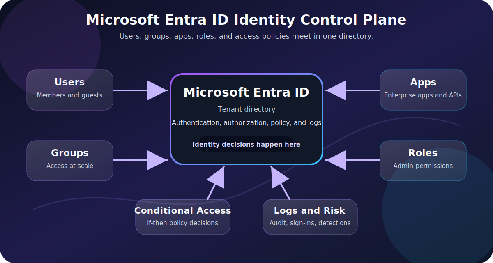
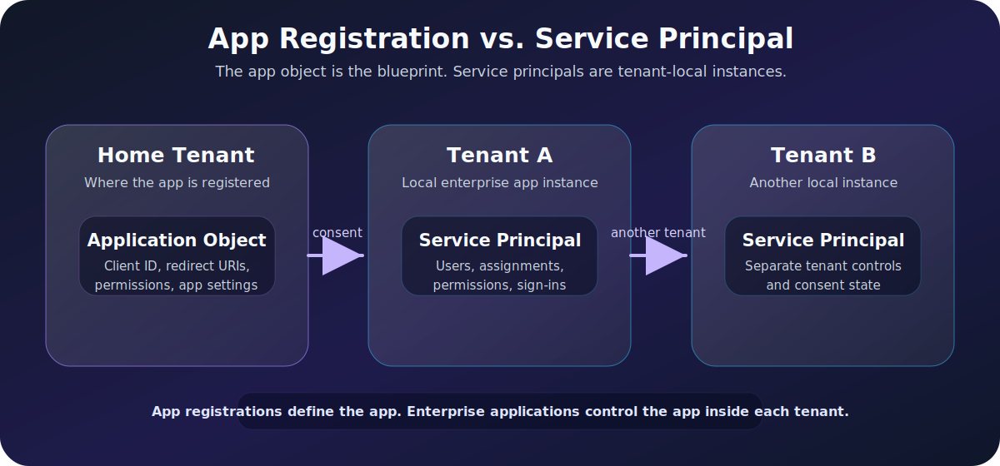
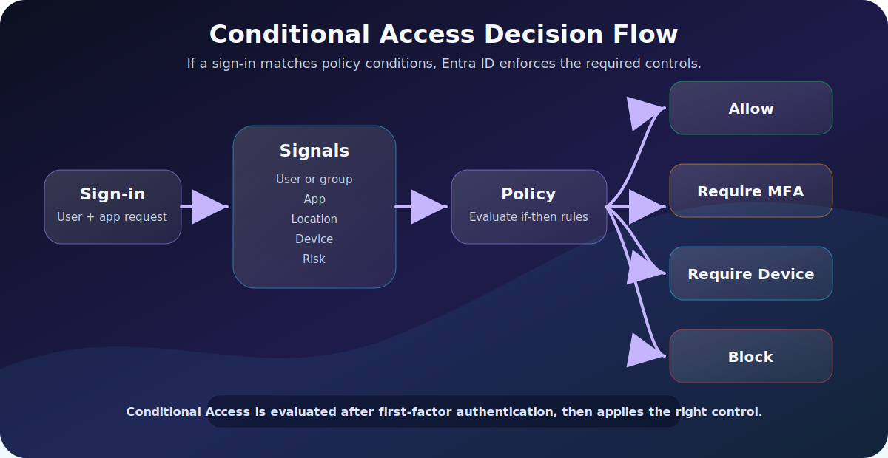

Microsoft Entra ID is one of those platforms that sounds simple until you actually administer it.

At first, it looks like a login system:

```text
User signs in -> Microsoft checks the password -> application opens
```

But that is only the surface.

In real organizations, Microsoft Entra ID is the identity control plane for users, groups, applications, administrator roles, access policies, devices, and cloud resources. It decides who someone is, what they can access, which apps they can sign in to, what conditions apply, and whether an access request should be allowed, blocked, or challenged.

This post explains Microsoft Entra ID through five core building blocks:

- **Users** - people and external identities that sign in.
- **Groups** - collections used for access, licensing, and policy targeting.
- **Apps** - application registrations, enterprise apps, and service principals.
- **Roles** - administrative permissions inside Entra ID.
- **Conditional Access** - policy decisions based on identity, device, app, risk, and location signals.

If you understand these five pieces, Entra ID becomes much less mysterious.



> [!NOTE]
> Current terminology note: Azure Active Directory is now **Microsoft Entra ID**. You may still see "Azure AD" in older documentation, scripts, screenshots, or admin habits, but the current product name is Microsoft Entra ID.

---

## What Microsoft Entra ID Actually Is

Microsoft Entra ID is Microsoft's cloud-based identity and access management service. It provides authentication, authorization, policy enforcement, and identity protection for Microsoft 365, Azure, Dynamics 365, SaaS applications, custom applications, and other resources.

The important word is **identity**.

Before a system can make an access decision, it needs to know:

```text
Who is asking?
What are they trying to access?
What permissions do they have?
What conditions are true right now?
Should access be allowed?
```

Microsoft Entra ID helps answer those questions.

In a Microsoft 365 environment, Entra ID is already there. Every Microsoft 365 tenant is backed by a Microsoft Entra tenant. That tenant contains the directory objects and policies that control access to services like Exchange Online, SharePoint, Teams, OneDrive, Azure, and many third-party apps.

---

## Tenant, Directory, and Domain: The Foundation

Before we talk about users and policies, we need the basic container.

A **tenant** is a dedicated instance of Microsoft Entra ID for an organization. Think of it as the organization's identity boundary.

Inside the tenant, you have a **directory** that stores identity objects:

- Users.
- Groups.
- Devices.
- Applications.
- Service principals.
- Roles.
- Policies.

Every new Microsoft Entra tenant has an initial domain name such as:

```text
contoso.onmicrosoft.com
```

Organizations can add custom domains such as:

```text
contoso.com
```

That allows users to sign in with names like:

```text
alex@contoso.com
```

Instead of:

```text
alex@contoso.onmicrosoft.com
```

The tenant is where the organization's identity rules live.

---

## The Mental Model

Microsoft Entra ID makes more sense when you think in layers:

```text
Tenant
  |
  +-- Users and groups
  |
  +-- Applications and service principals
  |
  +-- Roles and permissions
  |
  +-- Conditional Access policies
  |
  +-- Sign-in logs, audit logs, and risk signals
```

Users and apps are the identities.

Groups organize those identities.

Roles grant administrative power.

Conditional Access decides whether a sign-in should proceed under the current conditions.

Logs tell you what happened.

---

## Users: The People in the Directory

A **user** is an identity that can sign in or be assigned access.

In a workforce tenant, common user types include:

| User Type | What It Usually Means | Example |
|---|---|---|
| Internal member | A normal employee account in your tenant | `sara@contoso.com` |
| Internal guest | An account in your tenant with guest-level privileges | Legacy or special collaboration account |
| External member | A user authenticating externally but treated as a member | Multitenant organization scenario |
| External guest | A partner, vendor, or collaborator invited from outside | `alex@partner.com` |

For most administrators, the day-to-day distinction is:

```text
Member = belongs to the organization
Guest = invited from outside the organization
```

But in large environments, the details matter because user type can affect default permissions, collaboration behavior, licensing, and access policies.

### User Principal Name

The sign-in name is usually the **User Principal Name**, or UPN:

```text
first.last@company.com
```

The UPN often looks like an email address, but technically it is the user's sign-in identifier. In many organizations, the UPN and email address match. In some hybrid environments, they may differ because of legacy naming, mergers, or on-premises directory design.

### Common User Properties

User objects include more than a name and password.

| Property | Why It Matters |
|---|---|
| Display name | Human-readable name in portals and apps |
| User principal name | Primary sign-in identifier |
| Department | Useful for dynamic groups and reporting |
| Job title | Useful for lifecycle and access decisions |
| Manager | Useful for approvals and access reviews |
| Account enabled | Determines whether sign-in is allowed |
| User type | Member or guest behavior |
| Assigned licenses | Controls access to licensed services |

Good identity management depends on clean user data. If attributes like department, location, manager, and job title are inaccurate, dynamic groups and lifecycle workflows become unreliable.

---

## Groups: Manage Access at Scale

Groups are how you avoid assigning everything one user at a time.

Instead of doing this:

```text
Give Alice access to App A
Give Bob access to App A
Give Chen access to App A
Give Deniz access to App A
```

You do this:

```text
Create group: App A Users
Add users to group
Assign group to App A
```

That makes access easier to understand, audit, and remove.

Microsoft Entra groups are commonly used for:

- Application access.
- Microsoft 365 collaboration.
- License assignment.
- Conditional Access targeting.
- Device management targeting with Intune.
- Role assignments in specific scenarios.

### Security Groups vs. Microsoft 365 Groups

Two group types matter most:

| Group Type | Best For | Example |
|---|---|---|
| Security group | Permissions, app assignment, policy targeting | `VPN Users`, `Finance App Users` |
| Microsoft 365 group | Collaboration resources | Teams team, shared mailbox, SharePoint site |

If the goal is access control, a security group is usually the cleaner choice.

If the goal is collaboration, a Microsoft 365 group often makes more sense because it connects to services like Teams, Outlook, Planner, and SharePoint.

### Assigned Groups vs. Dynamic Groups

Group membership can be assigned manually or calculated dynamically.

| Membership Type | How Members Are Added | Good For |
|---|---|---|
| Assigned | Admin or owner adds members manually | Small groups, exceptions, sensitive access |
| Dynamic user | Rule based on user attributes | Department, location, role-based access |
| Dynamic device | Rule based on device attributes | Intune targeting, device platforms |

Example dynamic rule:

```text
user.department -eq "Finance"
```

That rule can automatically place Finance users into a group when their department attribute is correct.

Dynamic groups are powerful, but they depend heavily on accurate attributes. Bad directory data creates bad group membership.

### Role-Assignable Groups

Some groups can be configured so Microsoft Entra roles can be assigned to the group. This is useful for managing administrative access as a group rather than assigning privileged roles directly to individual users.

That feature should be handled carefully:

- Use strong ownership controls.
- Limit who can modify membership.
- Monitor changes.
- Consider Privileged Identity Management for eligible access.
- Avoid nesting or confusing group chains for privileged access.

Group membership is not just convenience. In cloud identity, group membership can be access.

---

## Apps: App Registrations, Enterprise Apps, and Service Principals

Applications are where Entra ID becomes more than user login.

When an app integrates with Microsoft Entra ID, the directory needs to understand that app:

- What is the app called?
- Who can sign in?
- Which tenant owns the registration?
- What redirect URLs are allowed?
- What permissions does the app request?
- Can it access Microsoft Graph?
- Does it use secrets, certificates, or managed identity?

This is where three terms often confuse people:

```text
App registration
Application object
Service principal
```



### App Registration

An **app registration** is the configuration that lets an application use Microsoft Entra ID for identity.

When you register an application, you define settings such as:

- Supported account types.
- Redirect URI.
- Client ID.
- Certificates or secrets.
- API permissions.
- Exposed scopes.
- Branding and publisher information.

The app registration lives in the application's home tenant.

### Application Object

The **application object** is the global definition of the app. It is like the blueprint.

It describes how the app should work with Entra ID:

- How tokens can be issued.
- Which permissions the app asks for.
- Which reply URLs are allowed.
- Which APIs the app exposes.

For a single-tenant app, this may feel straightforward because the app is used only in one tenant.

For a multitenant app, the distinction becomes important.

### Service Principal

A **service principal** is the local representation of an app in a tenant.

If the application object is the blueprint, the service principal is the tenant-specific instance.

For example:

```text
Software vendor registers app in Vendor Tenant
Customer A consents to the app
Customer A gets a service principal for that app
Customer B consents to the app
Customer B gets a separate service principal for that app
```

Each tenant can manage its local service principal:

- Who can use the app.
- Which permissions were consented.
- Whether user assignment is required.
- Sign-in logs for that enterprise app.
- Conditional Access policies targeting the app.

In the Microsoft Entra admin center, **App registrations** usually represent application objects. **Enterprise applications** usually represent service principals.

### Managed Identities

Managed identities are also represented as service principals, but they are designed for Azure-hosted workloads.

Instead of storing an app secret in code, an Azure resource can use a managed identity to request tokens securely.

Example:

```text
Azure Function -> managed identity -> access Key Vault
```

The developer does not need to manage a password or client secret. The platform handles credential rotation and token acquisition.

---

## Permissions and Consent

When an app wants to access data, it needs permissions.

For example, an app might request permission to:

- Read a user's profile.
- Read directory data.
- Send mail.
- Read calendar events.
- Access files.
- Call a custom API.

There are two broad permission patterns:

| Permission Type | Acts As | Example |
|---|---|---|
| Delegated permission | A signed-in user | App reads the user's profile |
| Application permission | The app itself | Background service reads all users |

Delegated permissions are tied to a user session. Application permissions are not tied to a user and can be very powerful.

That is why admin consent matters.

If an app requests broad permissions such as reading all users, all mailboxes, or all files, an administrator should review:

- Who owns the app?
- Why does it need the permission?
- Is the publisher verified?
- Is the permission delegated or application-level?
- Can a narrower permission be used?
- Is the app still needed?

OAuth consent is one of the places where identity risk can quietly enter an environment.

---

## Roles: Administrative Power in Entra ID

Groups control access to resources and apps. Roles control administrative permissions.

A **Microsoft Entra role** gives a user or group the ability to manage parts of the directory.

Examples:

| Role | Typical Permission Area |
|---|---|
| Global Administrator | Full administrative access across the tenant |
| User Administrator | Manage users and reset passwords |
| Groups Administrator | Manage groups and group settings |
| Application Administrator | Manage application registrations and enterprise apps |
| Cloud Application Administrator | Manage app registrations and enterprise app settings |
| Security Administrator | Manage security-related configuration |
| Security Reader | Read security information without changing it |
| Conditional Access Administrator | Manage Conditional Access policies |
| Privileged Role Administrator | Manage role assignments and privileged access |

The exact list of built-in roles changes over time as Microsoft adds services and separates permissions more carefully. The principle does not change:

```text
Assign the least privileged role that can do the job.
```

### Entra Roles vs. Azure RBAC

This is a common confusion.

| Area | Controls |
|---|---|
| Microsoft Entra roles | Directory administration |
| Azure RBAC roles | Azure resource access |

Example:

```text
User Administrator
```

This is a Microsoft Entra role. It lets someone manage users in the directory.

```text
Virtual Machine Contributor
```

This is an Azure RBAC role. It lets someone manage virtual machines in Azure.

A person can have one without the other.

### Privileged Identity Management

For privileged roles, organizations often use **Privileged Identity Management**, or PIM.

Instead of making a user permanently active as Global Administrator, PIM can make the role:

- Eligible.
- Time-limited.
- Approval-based.
- MFA-protected.
- Justification-required.
- Audited.

The idea is simple:

```text
Do not keep powerful access active all the time.
Activate it only when needed.
```

---

## Conditional Access: The Policy Engine

Conditional Access is where Entra ID turns sign-in context into an access decision.

The basic pattern is:

```text
If this user accesses this app under these conditions,
then require these controls.
```

Example:

```text
If a user signs in to Microsoft 365 from outside trusted locations,
then require multifactor authentication.
```

Microsoft describes Conditional Access as a Zero Trust policy engine because it uses identity-driven signals instead of trusting only the network perimeter.



### Important Timing Detail

Conditional Access is evaluated after first-factor authentication.

That means a user usually enters a username and password first. Then Conditional Access evaluates the sign-in context and decides whether to allow access, require more proof, enforce a device requirement, apply session controls, or block the request.

Conditional Access is not a replacement for strong passwords, phishing-resistant MFA, or basic account hygiene. It is a policy layer on top of identity authentication.

---

## What Conditional Access Looks At

Conditional Access policies use signals.

Common signals include:

| Signal | Example |
|---|---|
| User or group | Apply policy to Finance users |
| Application | Apply policy to SharePoint or Salesforce |
| Location | Treat unknown countries differently |
| Device platform | Different rules for Windows, macOS, iOS, Android |
| Device state | Require compliant or hybrid joined device |
| Client app | Block legacy authentication |
| Sign-in risk | Require MFA for risky sign-ins |
| User risk | Force password reset for compromised identity risk |

A sign-in is not judged by one fact. It is judged by context.

The same user accessing the same app may receive a different decision depending on location, device, risk, or session type.

---

## What Conditional Access Can Enforce

Conditional Access decisions usually fall into a few categories.

| Decision | What It Means |
|---|---|
| Block access | Deny the request |
| Grant access | Allow the request if required controls are satisfied |
| Require MFA | User must complete multifactor authentication |
| Require authentication strength | User must use a specific strength, such as phishing-resistant MFA |
| Require compliant device | Device must meet compliance rules, usually through Intune |
| Require hybrid joined device | Device must be joined to on-prem AD and registered in Entra |
| Require approved client app | User must use an approved mobile app |
| Require app protection policy | App must be protected by mobile app management |
| Session controls | Limit or monitor session behavior |

Conditional Access is powerful because these controls can be combined.

Example:

```text
Allow access to Exchange Online only if:
- User completes MFA
- Device is compliant
- Sign-in risk is not high
```

---

## Example Conditional Access Policies

Here are practical examples that many organizations start with.

| Policy | Target | Control |
|---|---|---|
| Require MFA for admins | Users with admin roles | Require MFA or phishing-resistant MFA |
| Block legacy authentication | All users, all cloud apps | Block access |
| Require MFA outside trusted locations | All users | Require MFA |
| Require compliant device for sensitive apps | Finance or HR apps | Require compliant device |
| Block high-risk sign-ins | All users | Block or require secure remediation |
| Require MFA for Azure management | Azure management app | Require MFA |
| Protect security info registration | Security info registration | Require trusted location or MFA |

Start with report-only mode where possible. Then review sign-in logs and impact before enforcing broadly.

---

## Conditional Access Policy Anatomy

A Conditional Access policy has three big parts:

```text
Assignments -> Conditions -> Access controls
```

### 1. Assignments

Assignments define who and what the policy applies to.

Examples:

- Include all users.
- Exclude break-glass accounts.
- Include specific groups.
- Include privileged roles.
- Include selected cloud apps.

### 2. Conditions

Conditions define when the policy should trigger.

Examples:

- Any location except trusted locations.
- Sign-in risk is medium or high.
- Device platform is Android.
- Client app is legacy authentication.

### 3. Access Controls

Access controls define what Entra ID should do.

Examples:

- Block access.
- Require MFA.
- Require compliant device.
- Require authentication strength.
- Apply session controls.

This structure makes policies readable:

```text
Who and what?
Under which conditions?
What should happen?
```

---

## Licensing Notes

Licensing changes over time, so always check Microsoft licensing documentation before buying or designing production controls.

As of June 20, 2026, the practical baseline is:

| Feature | Typical Licensing Note |
|---|---|
| Basic directory and identity features | Included with Microsoft Entra ID Free and Microsoft cloud tenants |
| Conditional Access | Requires Microsoft Entra ID P1, or eligible bundles such as Microsoft 365 Business Premium |
| Risk-based Conditional Access | Requires Microsoft Entra ID Protection, an Entra ID P2 feature |
| Dynamic groups | Requires Entra ID P1 or eligible licensing |
| Privileged Identity Management | Typically associated with Entra ID P2 |

Do not design policies only from memory. Licensing is one of the fastest ways for a technically correct plan to become operationally wrong.

---

## Common Mistakes

### Mistake 1: Assigning Access Directly to Users

Direct user assignments are easy at first and painful later.

Better pattern:

```text
User -> Group -> App / license / policy
```

That makes onboarding, offboarding, and audits easier.

### Mistake 2: Too Many Global Administrators

Global Administrator is not a normal admin role. It is the most powerful role in the tenant.

Use it sparingly. Prefer specific roles such as User Administrator, Groups Administrator, Application Administrator, or Conditional Access Administrator when those roles are enough.

### Mistake 3: Forgetting Emergency Access Accounts

Every serious tenant should have emergency access accounts, often called break-glass accounts.

They should be:

- Cloud-only.
- Highly protected.
- Excluded from policies that could lock everyone out.
- Monitored aggressively.
- Used only for emergencies.

Do not exclude normal administrators from Conditional Access just because it is convenient.

### Mistake 4: Enforcing Conditional Access Without Report-Only Testing

A badly scoped Conditional Access policy can block users, admins, service accounts, automation, or integrations.

Use:

- Report-only mode.
- What If testing.
- Pilot groups.
- Sign-in logs.
- Clear exclusions.

Then enforce gradually.

### Mistake 5: Ignoring Enterprise App Consent

Enterprise apps can accumulate over time.

Review:

- Which apps exist.
- Which permissions they have.
- Who consented.
- Whether the app is still used.
- Whether the publisher is trusted.

Unused apps with powerful permissions are identity debt.

---

## A Practical Example: Protecting a Finance App

Imagine an organization has a finance application used by accounting employees.

The clean Entra ID design might look like this:

```text
User attributes
  Department = Finance
       |
       v
Dynamic group
  Finance Users
       |
       v
Enterprise app assignment
  Finance App
       |
       v
Conditional Access policy
  Require MFA + compliant device
       |
       v
Access decision
  Allow only if controls are satisfied
```

This design separates concerns:

| Layer | Responsibility |
|---|---|
| User attributes | Describe who the user is |
| Group | Collect the right users |
| Enterprise app | Defines access to the app |
| Conditional Access | Enforces sign-in conditions |
| Logs | Show what happened |

That is much cleaner than assigning individual users directly and hoping everyone remembers why.

---

## Entra ID vs. Active Directory

Microsoft Entra ID is not simply "Active Directory in the cloud."

They overlap in identity concepts, but they are designed for different worlds.

| Area | Active Directory Domain Services | Microsoft Entra ID |
|---|---|---|
| Primary environment | On-premises Windows networks | Cloud identity and SaaS access |
| Common protocols | Kerberos, NTLM, LDAP | OAuth 2.0, OpenID Connect, SAML |
| Device model | Domain join | Entra join, hybrid join, registration |
| App model | Traditional domain-integrated apps | Cloud apps, SaaS, modern auth |
| Admin surface | Domain controllers, GPO, AD tools | Entra admin center, Microsoft Graph |

Hybrid organizations often use both.

Example:

```text
On-prem AD stores user accounts
Microsoft Entra Connect syncs users to Entra ID
Users sign in to Microsoft 365 with cloud identity
Conditional Access controls cloud access
```

Understanding the difference helps avoid bad assumptions. A domain controller and a Microsoft Entra tenant are not the same kind of system.

---

## Quick Reference

| Concept | Short Explanation |
|---|---|
| Tenant | Dedicated identity boundary for an organization |
| Directory | Store of users, groups, apps, roles, and policies |
| User | Person or external identity that signs in |
| Group | Collection used for access, policy, licensing, or collaboration |
| App registration | Identity configuration for an application |
| Application object | Global blueprint of an app in its home tenant |
| Service principal | Local instance of an app in a tenant |
| Enterprise app | Admin center view commonly used to manage service principals |
| Managed identity | Azure workload identity backed by a service principal |
| Microsoft Entra role | Directory administration permission |
| Azure RBAC role | Azure resource permission |
| Conditional Access | Policy engine for access decisions |
| PIM | Just-in-time privileged role activation |

---

## Further Reading

Official Microsoft Learn references:

- [What is Microsoft Entra?](https://learn.microsoft.com/en-us/entra/fundamentals/what-is-entra)
- [How to create, invite, and delete users](https://learn.microsoft.com/en-us/entra/fundamentals/how-to-create-delete-users)
- [Manage Microsoft Entra groups and group membership](https://learn.microsoft.com/en-us/entra/fundamentals/how-to-manage-groups)
- [Application and service principal objects in Microsoft Entra ID](https://learn.microsoft.com/en-us/entra/identity-platform/app-objects-and-service-principals)
- [Microsoft Entra built-in roles](https://learn.microsoft.com/en-us/entra/identity/role-based-access-control/permissions-reference)
- [What is Conditional Access?](https://learn.microsoft.com/en-us/entra/identity/conditional-access/overview)

---

## Final Thoughts

Microsoft Entra ID is easier to understand when you stop thinking of it as only a login page.

It is the system that ties identity objects, application access, administrative permissions, and policy decisions together.

The practical model is:

```text
Users identify people.
Groups organize access.
Apps define what can be accessed.
Roles define who can administer the directory.
Conditional Access decides whether a sign-in should be allowed right now.
```

That is the core of modern Microsoft identity.

Once you understand those relationships, the Entra admin center becomes less like a maze and more like a map.
