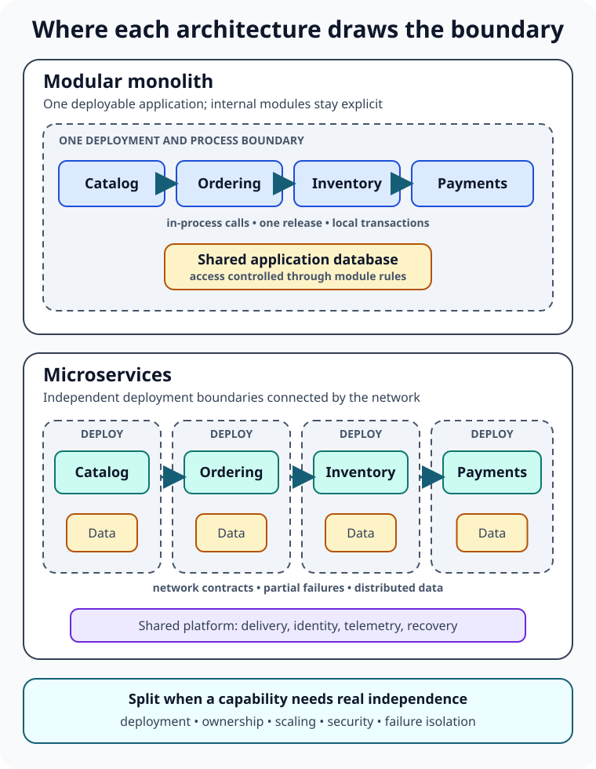

A team has one application, one database, and one deployment pipeline. Releases are still manageable, but checkout changes keep colliding with inventory work. Someone draws six boxes on a whiteboard and says the obvious solution is microservices.

The boxes look clean. The future looks scalable. The difficult part is hiding between the arrows.

Splitting an application into services replaces in-process calls with network calls, local transactions with distributed workflows, and one operational unit with many. That can be an excellent trade when independent teams, releases, or scaling genuinely matter. It can also turn a code-organization problem into a production-systems problem.

**A monolithic architecture packages an application's capabilities into one deployable unit. A microservices architecture divides those capabilities into independently deployable services that communicate over a network.** Neither is automatically primitive or advanced. The useful question is whether the extra boundaries buy more independence than they cost in coordination.

## The real boundary is deployment

People sometimes define a monolith as a giant, disorganized codebase. That confuses architecture with code quality.

A monolith may contain carefully separated catalog, ordering, inventory, and payment modules. Those modules can have explicit interfaces, automated tests, and rules that prevent accidental dependencies. It is still a monolith if they are built and released as one application.

That single deployment boundary has useful consequences. Calls between modules are fast and direct. One debugger can follow a request. A relational database transaction can update closely related records atomically. Local development may require only the application and its database. The team has fewer runtime components to secure, observe, patch, and recover.

The same boundary also creates coupling. A tiny change requires deploying the whole application. A memory-heavy reporting feature cannot be scaled without scaling everything beside it. One process failure can affect unrelated capabilities. As the codebase and team grow, builds, tests, ownership, and releases can become harder to coordinate.

A **modular monolith** keeps the operational simplicity of one deployment while enforcing internal business boundaries. It is not merely a temporary microservices project. For many products, it is the destination.

## Microservices move boundaries into the network

In a microservices design, catalog, ordering, inventory, and payments might each be a separate service. A team can build, deploy, and scale its service without releasing the others, provided the contracts between them remain compatible.

That independence is the main prize. It is also why “many small programs” is an incomplete definition. If every service must be released together, shares one database schema, or reaches into the others' tables, the system has preserved much of the monolith's coupling while adding network failure.

Microsoft's [microservices architecture guidance](https://learn.microsoft.com/en-us/azure/architecture/guide/architecture-styles/microservices) describes autonomous services around business capabilities and bounded contexts. Each service hides its implementation behind a defined API and owns its external state. Those properties—not the number of repositories, containers, or endpoints—create meaningful independence.

The network changes the engineering model. A call can time out after the remote service completed the work. Messages may arrive more than once or out of order. A request may cross several services before failing. Data owned by different services cannot usually be changed in one ordinary database transaction.

Microservices therefore need capabilities that a monolith may need only lightly: service identity, secure communication, retries with care, timeouts, distributed tracing, correlated logs, contract versioning, deployment automation, and recovery from partial failure. [NIST SP 800-204](https://csrc.nist.gov/pubs/sp/800/204/final) highlights authentication, access management, service discovery, secure protocols, monitoring, load balancing, throttling, and resilience mechanisms among the core concerns of microservices-based systems.

The complexity did not disappear. It changed address—from the codebase to the system around it.

## Compare the tradeoffs that affect daily work

Architecture decisions become clearer when the comparison is tied to consequences rather than slogans.

| Concern | Well-structured monolith | Well-designed microservices |
| --- | --- | --- |
| Deployment | One release unit and rollback path | Independent releases, with contract compatibility to manage |
| Communication | In-process calls are fast and easier to debug | Network calls can fail, time out, and add latency |
| Data | Local transactions and joins are straightforward | Service-owned data improves autonomy but complicates cross-service consistency |
| Scaling | Replicate the application as a unit | Scale a pressured service independently |
| Failures | One process can create a broad blast radius | Failures can be isolated, but dependencies can still cascade |
| Team workflow | Simple coordination for a small group | Strong ownership for multiple autonomous teams |
| Operations | Fewer deployables, dashboards, and credentials | More automation, observability, security, and platform work |

This table has an important condition: both sides assume competent design. A tangled monolith does not prove that all monoliths fail. A distributed monolith—separate services that remain tightly coupled—does not prove that microservices provide independence.

## When a monolith is the better choice

A monolith is usually the calmer starting point when the domain is still being discovered. Early product work changes concepts quickly: what looked like three services in a workshop may turn out to be one capability, while a forgotten workflow becomes the real boundary. Changing a module interface is cheaper than coordinating schema, API, and event changes across deployed services.

It also fits when one small team owns the product, traffic can be handled by scaling the application as a unit, and releases are not blocked by unrelated work. Simple operations are a feature. Every hour not spent maintaining service discovery, telemetry plumbing, and deployment policy can be spent learning what users need.

Google Cloud's [Well-Architected Framework](https://docs.cloud.google.com/architecture/framework) recommends starting simply, resisting over-engineering, and improving incrementally. That is not an argument against decoupling. It is an argument for earning each operational boundary.

Choose modularity inside the monolith deliberately. Business capabilities should expose interfaces rather than share internal objects freely. Database ownership can be expressed through separate schemas or disciplined access rules. Tests should protect boundaries. Those practices make the current design healthier and preserve the option to extract a service later.

## When microservices earn their cost

Microservices become compelling when the system needs independence in production, not merely cleaner folders.

One capability may need a release cadence that the rest of the application cannot support. A payments area may require stricter access controls and auditability. Search or media processing may have a scaling profile radically different from ordinary web requests. Several teams may need to deliver concurrently without negotiating one release train. A particular failure may need isolation so the rest of the product can keep serving useful work.

These are concrete pressures. “We might become very large” is not.

Team structure matters as much as traffic. Independent services require clear ownership: someone must be able to change a service, operate it, respond to incidents, and evolve its contract. Without that ownership, more services can create more queues between people rather than more autonomy.

Operational readiness matters too. Before multiplying deployables, a team should be comfortable with automated builds and rollbacks, metrics and alerts, centralized logs, request tracing, secret management, service authentication, and tested failure handling. If diagnosing one application is already difficult, distributing it usually makes the blind spots harder to find.

## Do not split by technical layer

A common first attempt creates a user-interface service, a business-logic service, and a data-access service. Almost every feature then crosses every service. Nothing can change or deploy independently, so the boundaries add latency without adding autonomy.

Services should instead follow cohesive business capabilities such as ordering or inventory. [AWS Prescriptive Guidance](https://docs.aws.amazon.com/prescriptive-guidance/latest/modernization-decomposing-monoliths/decompose-business-capability.html) recommends decomposition by business capability when the organization understands its business processes and can align cross-functional teams around them.

Size is a consequence, not a target. A service should be small enough to own and evolve, but large enough to contain the things that must change together. If two services constantly call each other, share tables, and require coordinated releases, the boundary is probably misplaced.

## Migration should remove one source of pain at a time

Rewriting a working monolith into dozens of services creates many risks simultaneously. A safer migration begins with evidence.

Find a capability with a real reason to separate: a deployment bottleneck, unusual scaling demand, stable business boundary, security requirement, or recurring failure that needs isolation. Make the boundary explicit inside the monolith first. Stop other modules from reading its tables directly. Define the contract and add measurements before moving the code.

Then extract one service and route relevant work to it while the rest of the application remains in place. Patterns such as the strangler fig support this gradual replacement. The old and new paths need careful observability, fallback decisions, and data-transition rules, but the team learns from one production boundary instead of betting the product on a complete rewrite.

Martin Fowler's [monolith-first discussion](https://martinfowler.com/bliki/MonolithFirst.html) captures the practical reason: service boundaries are hard to choose before a team understands the domain. Experience with the domain and with operating distributed systems changes the calculation.

Extraction is not automatically progress. After the first service, measure whether deployments became safer, ownership became clearer, or scaling became more efficient. If the promised independence did not appear, fix the boundary before creating ten more.

## Common mistakes hide on both sides

The classic monolith mistake is allowing convenience to erase every internal boundary. Any module can update any table, dependencies point in all directions, and a change in one feature surprises another. One deployment unit does not require one undifferentiated codebase.

The classic microservices mistake is copying that coupling across HTTP. Teams split too early, create services around database entities, share one schema, and add long synchronous call chains. The result has the coordination cost of a monolith and the failure modes of a distributed system.

Another mistake is treating containers or Kubernetes as proof of microservices. A monolith can run in a container and scale behind a [load balancer](/posts/what-is-load-balancing/). Microservices can run without Kubernetes. Packaging and orchestration choices do not decide whether business capabilities are independently deployable.

Finally, avoid using architecture as a status symbol. The right design is the least complicated one that meets the system's real quality requirements and lets the responsible teams change it safely.

## A practical decision rule

Start with the deployment boundary you can operate confidently. Keep business modules explicit. Watch for persistent pressure that requires independent deployment, ownership, scaling, security, or failure isolation. Split only where that pressure is strong enough to pay for network communication, distributed data, and additional operations.

In short: **prefer a modular monolith while one deployment is helping more than it hurts; choose microservices when specific capabilities genuinely need to live, change, and fail independently.**

For the broader decision-making frame, read [What Is Software Architecture?](/posts/software-architecture-beginners-guide/). To understand two common runtime building blocks, continue with [What Is a Reverse Proxy?](/posts/what-is-a-reverse-proxy/) and [Virtual Machines vs Containers](/posts/virtual-machines-vs-containers/).

## Sources

- [Microsoft Azure Architecture Center: Microservices architecture style](https://learn.microsoft.com/en-us/azure/architecture/guide/architecture-styles/microservices)
- [AWS Prescriptive Guidance: Decompose by business capability](https://docs.aws.amazon.com/prescriptive-guidance/latest/modernization-decomposing-monoliths/decompose-business-capability.html)
- [Google Cloud Well-Architected Framework](https://docs.cloud.google.com/architecture/framework)
- [NIST SP 800-204: Security Strategies for Microservices-based Application Systems](https://csrc.nist.gov/pubs/sp/800/204/final)
- [Martin Fowler: Monolith First](https://martinfowler.com/bliki/MonolithFirst.html)
