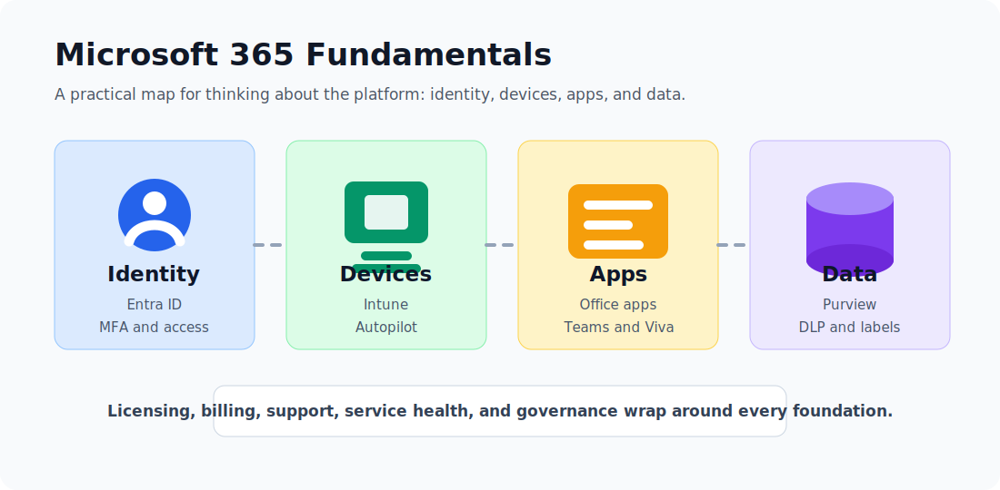
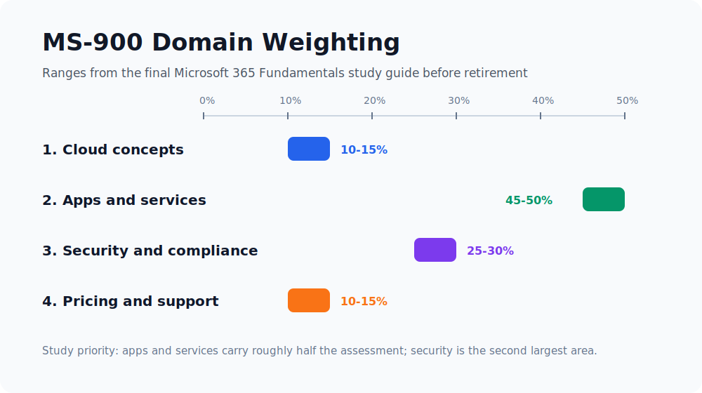
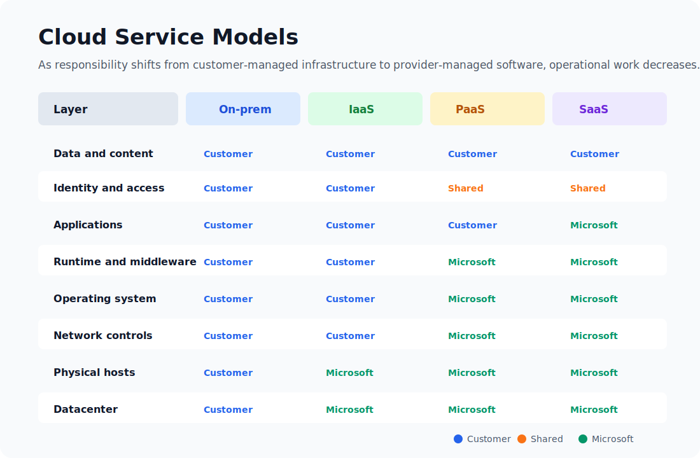
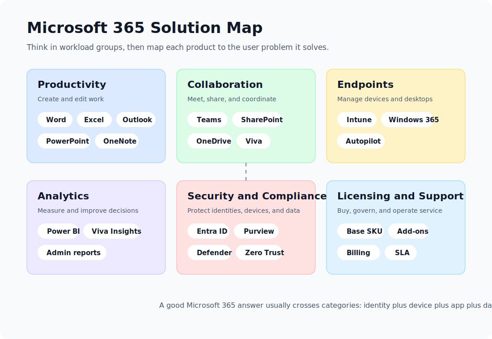

Microsoft 365 is easy to underestimate. To many users, it looks like Word, Excel, PowerPoint, Outlook, Teams, and OneDrive. To an administrator, it is also identity, endpoint management, compliance, threat protection, service health, billing, reporting, and a large set of policy engines that shape how modern work actually happens.

This guide walks through the four Microsoft 365 Fundamentals domains: cloud concepts, Microsoft 365 apps and services, security and compliance, and pricing/licensing/support. It is written for practical understanding rather than memorization. If you can explain why an organization would choose Microsoft 365, how the major services fit together, and where responsibility shifts between Microsoft and the customer, you are thinking about the platform correctly.

> **Current certification note:** As of May 31, 2026, Microsoft lists **MS-900: Microsoft 365 Fundamentals** and the related Microsoft 365 Certified: Fundamentals credential as retired. Microsoft says the certification retired on **March 31, 2026**. Treat this post as a Microsoft 365 fundamentals reference and an archive of the final MS-900-style objectives, not as a promise that the exam is still available.

*The platform is easier to reason about when you separate identity, devices, apps, and data before layering licensing, support, and governance on top.*

---

## Quick Domain Map

The biggest mistake learners make is giving every domain equal time. Microsoft 365 apps and services carried roughly half of the assessment, while security and compliance was the second largest area. Cloud concepts and licensing/support mattered, but they were smaller.

| Domain | Weight | What You Need To Be Able To Explain |
|---|---:|---|
| Cloud concepts | 10-15% | SaaS, PaaS, IaaS, cloud versus hybrid versus on-premises, Office 365 versus Microsoft 365 |
| Microsoft 365 apps and services | 45-50% | Productivity apps, collaboration tools, endpoint management, Windows 365, Autopilot, Power BI, Viva |
| Security, compliance, privacy, and trust | 25-30% | Zero Trust, shared responsibility, Entra ID, MFA, Conditional Access, Purview, DLP |
| Pricing, licensing, and support | 10-15% | Billing, base licenses, add-ons, support plans, service health, SLAs |

The rest of this guide follows that same structure.

---

## Domain 1.0 - Describe Cloud Concepts

### 1.1 SaaS, PaaS, and IaaS

Cloud services are usually grouped by how much responsibility the provider takes over.

**Infrastructure as a Service (IaaS)** gives you virtual infrastructure: virtual machines, storage, networks, load balancers, and related building blocks. You avoid buying physical servers, but you still manage the operating system, patches, runtime, applications, identity configuration, and data protection. Azure Virtual Machines are the classic example.

**Platform as a Service (PaaS)** gives developers a managed platform for building and running applications. The provider manages the operating system, platform runtime, patching, and much of the availability model. The customer focuses more on code, data, configuration, and application security. Azure App Service, Azure Functions, and Azure SQL Database are typical examples.

**Software as a Service (SaaS)** gives users a complete application over the internet. Microsoft 365, Dynamics 365, Exchange Online, Teams, and SharePoint Online are SaaS services. You do not manage the underlying servers, operating systems, or application hosting platform. You still manage users, permissions, devices, data classification, retention policies, and how the service is configured.

| Model | Customer Manages | Provider Manages | Microsoft 365 Example |
|---|---|---|---|
| On-premises | Hardware, network, OS, apps, identity, data, backup, physical security | Nothing unless outsourced | Exchange Server in your datacenter |
| IaaS | OS, patches, apps, identity, data, network configuration | Physical datacenter, hosts, storage, virtualization | A VM running a line-of-business app |
| PaaS | App code, data, identity, configuration | OS, runtime, scaling platform, host infrastructure | Azure App Service for a custom web app |
| SaaS | Users, access, data, policies, governance | Application, platform, runtime, OS, infrastructure | Microsoft Teams, Exchange Online, SharePoint Online |

The key exam-grade idea is not "SaaS is better than IaaS." It is that each model changes the operational tradeoff. IaaS gives more control but more maintenance. SaaS gives faster adoption and less infrastructure work, but the customer must understand governance, access, data protection, and configuration.

### 1.2 Benefits and Considerations: Cloud, Hybrid, and On-Premises

Cloud adoption is not only a technical decision. It changes cost models, risk ownership, operational habits, and the pace at which users receive new features.

| Benefit | What It Means In Practice | Microsoft 365 Example |
|---|---|---|
| Lower capital expense | You subscribe to services instead of buying and refreshing server hardware | Exchange Online instead of new mail servers |
| Elasticity and scale | Capacity can grow or shrink with demand | Add licenses for new users instead of provisioning hardware |
| Availability and resilience | The provider builds redundancy into service design | Teams and Exchange Online are operated across Microsoft-managed infrastructure |
| Faster deployment | Users can be onboarded quickly from a central admin model | Assign a license, apply a policy group, and the user can start working |
| Global access | Users can work from different networks and devices | OneDrive and Teams for remote or hybrid work |
| Continuous updates | Services receive ongoing feature and security updates | Microsoft 365 Apps update channels and Teams feature releases |

Those benefits come with real considerations:

| Consideration | Why It Matters |
|---|---|
| Internet dependency | SaaS productivity depends on reliable connectivity and identity availability |
| Identity security | If the account is compromised, the cloud service can be reached from anywhere unless access is controlled |
| Data governance | Cloud storage makes sharing easier, which means labels, DLP, retention, and permissions matter more |
| Licensing complexity | Different plans include different security, compliance, voice, analytics, and device management capabilities |
| Change management | Microsoft 365 changes continuously; admins must monitor the Message center and roadmap |
| Regulatory needs | Data residency, audit, eDiscovery, encryption, and retention requirements must be mapped before migration |

**Cloud** is best when an organization wants speed, scalability, modern collaboration, managed infrastructure, and remote access. **On-premises** is still used when legacy dependencies, latency, custom control, or regulatory constraints require it. **Hybrid** is the realistic middle: identities, devices, apps, and data may span both local infrastructure and Microsoft cloud services.

Hybrid examples include:

- Synchronizing on-premises Active Directory users to Microsoft Entra ID.
- Keeping a legacy file server while moving collaboration to SharePoint and Teams.
- Managing cloud and local Windows devices with Intune and Configuration Manager co-management.
- Using Exchange hybrid during a staged migration to Exchange Online.

### 1.3 Office 365 vs Microsoft 365

The names are confusing because Microsoft branding has changed over time and some plan names still include "Office 365."

The clean distinction is:

| Term | Core Meaning | Typical Scope |
|---|---|---|
| Office 365 | Cloud productivity and collaboration services | Office apps, Exchange Online, SharePoint Online, OneDrive, Teams, depending on plan |
| Microsoft 365 | A broader modern work bundle | Office 365 capabilities plus Windows, device management, identity, security, compliance, and sometimes analytics |

Think of **Office 365** as the productivity and collaboration foundation. Think of **Microsoft 365** as the wider platform that can also include Windows licensing, Microsoft Intune, Microsoft Entra ID Premium features, Microsoft Defender capabilities, Microsoft Purview features, and advanced analytics depending on the SKU.

For example, Office 365 E3 and Microsoft 365 E3 are not the same product. Microsoft 365 E3 includes a broader set of identity, device, and Windows capabilities. Microsoft 365 Business Premium is another important example: it is designed for small and medium organizations that need Office apps plus stronger security and device management.

---

## Domain 2.0 - Describe Microsoft 365 Apps and Services

Microsoft 365 makes more sense when you group services by the job they do.

### 2.1 Productivity Solutions

Productivity tools are the apps most users recognize immediately:

| App Or Service | Main Purpose | What To Remember |
|---|---|---|
| Word | Documents, reports, policies, contracts | Supports coauthoring, comments, version history, sensitivity labels |
| Excel | Spreadsheets, analysis, models, tables | Connects to data sources and supports modern collaboration |
| PowerPoint | Presentations and visual communication | Works with templates, comments, recording, sharing, and Copilot features where licensed |
| Outlook | Email, calendar, contacts, tasks | Backed by Exchange Online in business plans |
| OneNote | Digital notebooks | Useful for team notes, meeting notes, and personal organization |
| Microsoft 365 Apps | Desktop Office applications | Installed locally but licensed and updated through Microsoft 365 |
| Office for the web | Browser versions of Office apps | Useful for quick editing and collaboration without full desktop apps |

There are two important patterns behind the apps.

First, Microsoft 365 productivity is **identity-aware**. Access, sharing, collaboration, labels, and audit trails depend on Microsoft Entra ID identities. A Word document is not just a file; it can carry permissions, labels, retention rules, and activity logs.

Second, Microsoft 365 productivity is **cloud-connected**. Desktop apps still matter, but the best collaboration features depend on files living in OneDrive or SharePoint rather than being passed around as email attachments.

### 2.2 Collaboration Solutions: Teams, SharePoint, OneDrive, and Viva

Collaboration in Microsoft 365 is not a single product. It is a stack.

| Service | Best Mental Model | Common Use Cases |
|---|---|---|
| Teams | The collaboration hub | Chat, meetings, channels, apps, calls, teamwork |
| SharePoint | Team sites and content services | Intranets, document libraries, lists, pages, knowledge bases |
| OneDrive | Personal work files in the cloud | Individual file storage, sync, sharing, known folder backup |
| Exchange Online | Messaging and calendaring | Mailboxes, calendars, meeting scheduling, shared mailboxes |
| Viva | Employee experience layer | Communications, insights, learning, goals, engagement |

The relationship between Teams, SharePoint, and OneDrive is especially important.

When a user stores personal work files, those files live in OneDrive. When a team collaborates in a Teams channel, channel files are stored in a SharePoint site connected to that team. When a meeting chat includes shared files, those files are commonly stored in OneDrive or SharePoint depending on the context. Teams is often the user interface; SharePoint and OneDrive are often the content layer.

Microsoft Viva sits above the daily workflow. Viva modules help with employee communications, learning, knowledge, goals, and insights. Viva is not a replacement for Teams or SharePoint; it uses Microsoft 365 signals and surfaces employee experience features inside places users already work, especially Teams.

### 2.3 Endpoint Management, Desktop Virtualization, and Deployment

Modern work requires more than apps. Devices must be enrolled, configured, updated, secured, and sometimes replaced by cloud-hosted desktops.

| Capability | Product | What It Does |
|---|---|---|
| Endpoint management | Microsoft Intune | Manages apps, devices, compliance, configuration, and access across Windows, macOS, iOS, Android, and virtual endpoints |
| Automated provisioning | Windows Autopilot | Lets a new Windows device configure itself from the cloud during out-of-box setup |
| Cloud desktop | Windows 365 | Provides a personal Cloud PC streamed from the Microsoft cloud |
| Virtual desktop platform | Azure Virtual Desktop | Provides more flexible pooled or personal virtual desktop infrastructure on Azure |
| App deployment | Intune | Deploys Microsoft 365 Apps, line-of-business apps, scripts, configuration profiles, and security baselines |

**Intune** is the central cloud endpoint management tool. It can enforce compliance policies, deploy applications, configure settings, manage mobile devices, and integrate with Conditional Access. A device can be marked compliant only if it meets rules such as encryption, password, operating system version, or threat protection state.

**Windows Autopilot** changes the device deployment model. Instead of IT imaging every laptop manually, the device can be shipped to a user. During setup, the device joins Microsoft Entra ID, enrolls into Intune, receives policies and apps, and becomes ready for work.

**Windows 365** provides Cloud PCs. A Cloud PC is a personal Windows desktop hosted in the Microsoft cloud and assigned to a user. This is useful for contractors, remote workers, bring-your-own-device situations, temporary projects, or cases where data should stay in a managed cloud desktop rather than on a local device.

The comparison matters:

| Scenario | Better Fit |
|---|---|
| You need to manage laptops, phones, tablets, and apps | Intune |
| You need to ship new Windows laptops with minimal IT touch | Windows Autopilot |
| You need a persistent personal cloud desktop per user | Windows 365 |
| You need highly customized pooled desktops or RemoteApp-style delivery | Azure Virtual Desktop |

### 2.4 Business Intelligence and Analytics

Analytics in Microsoft 365 ranges from simple admin reports to full business intelligence.

**Power BI** is Microsoft's business analytics platform. It connects to data sources, models data, builds reports and dashboards, and shares insights across an organization. Power BI also fits into Microsoft Fabric, Microsoft's broader analytics platform.

**Viva Insights** focuses on work patterns and employee experience. It can help individuals understand personal productivity habits and help organizations analyze collaboration patterns, meeting load, after-hours work, and adoption patterns in privacy-aware ways.

**Microsoft 365 admin center reports** help administrators understand usage and service adoption. For example, admins can review active users, Teams activity, SharePoint file activity, mailbox usage, and app usage trends.

| Analytics Need | Tool |
|---|---|
| Build dashboards from business data | Power BI |
| Understand collaboration patterns and productivity signals | Viva Insights |
| Track service adoption and active usage | Microsoft 365 admin center reports |
| Monitor incidents and advisories | Service health dashboard |
| Track upcoming service changes | Message center |

---

## Domain 3.0 - Describe Security, Compliance, Privacy, and Trust

### 3.1 Security and Compliance Concepts: Zero Trust and Shared Responsibility

Microsoft's Zero Trust model is usually summarized as:

- **Verify explicitly:** Make access decisions using identity, location, device health, risk, application, and data sensitivity.
- **Use least privilege access:** Give users the minimum access they need, for the shortest reasonable time.
- **Assume breach:** Design as if attackers may already be inside the network, then limit blast radius and detect suspicious behavior.

<figure>
  
  <figcaption>Microsoft Learn Zero Trust architecture diagram.</figcaption>
</figure>

Zero Trust fits Microsoft 365 because the old perimeter is gone. Users work from home, offices, mobile networks, managed devices, unmanaged devices, browsers, apps, and cloud desktops. The security boundary becomes identity, device posture, app protection, network signals, and data controls.

Shared responsibility is the second big idea. Microsoft operates the Microsoft 365 cloud infrastructure and SaaS services, but the customer still owns important decisions:

| Area | Microsoft Responsibility | Customer Responsibility |
|---|---|---|
| Datacenters and physical hosts | Secure facilities, hardware, networking, service platform | None directly |
| Service availability | Operate the online service and publish health information | Monitor service health and plan business continuity |
| Identity platform | Provide Microsoft Entra ID capabilities | Configure accounts, MFA, roles, access policies, lifecycle |
| Data storage services | Provide secure storage and service controls | Classify data, assign permissions, configure retention and DLP |
| Devices | Provide management and security tooling | Enroll, secure, patch, and retire devices correctly |
| Users | Provide controls and logging | Train users, review access, respond to risky behavior |

The point is simple: Microsoft 365 being SaaS does not remove customer responsibility. It changes the kind of responsibility.

### 3.2 Identity and Access Management: Entra ID, MFA, and Conditional Access

Microsoft Entra ID is the identity provider behind Microsoft 365. It stores users, groups, service principals, roles, authentication methods, and policy signals. In older material, you will see the name Azure Active Directory; Microsoft Entra ID is the current name.

Common identity models include:

| Identity Model | Description | Use Case |
|---|---|---|
| Cloud identity | Users exist only in Microsoft Entra ID | Cloud-first organizations |
| Synchronized identity | Users originate in on-premises Active Directory and sync to Entra ID | Hybrid organizations |
| Federated identity | Authentication is redirected to another identity provider | Complex enterprise or legacy federation scenarios |

**Multifactor authentication (MFA)** requires a second proof during sign-in. A password alone is something the user knows. MFA adds something the user has or something the user is, such as Microsoft Authenticator, passkeys, Windows Hello for Business, FIDO2 security keys, certificate-based authentication, SMS, voice, or other configured methods.

**Conditional Access** is Microsoft's Zero Trust policy engine for access decisions. A basic policy reads like an if-then statement:

| If Signal Says... | Then Require... |
|---|---|
| User is outside a trusted location | MFA |
| Device is not compliant | Block access or require browser-only access |
| Sign-in risk is high | Password reset or stronger authentication |
| App is sensitive | Require compliant device and approved client app |
| User is a privileged admin | Strong MFA and tighter session controls |

Good Microsoft 365 security starts with identity because every other control depends on knowing who the user is, what device they are using, what data they want, and whether the request is risky.

### 3.3 Microsoft Purview: Information Protection and Data Loss Prevention

Microsoft Purview covers data security, data governance, and compliance capabilities. For Microsoft 365 fundamentals, focus on information protection and DLP.

<figure>
  
  <figcaption>Microsoft Learn Purview information protection diagram.</figcaption>
</figure>

**Information Protection** is about knowing and protecting sensitive data. Common capabilities include:

- Sensitive information types, such as credit card numbers or national identifiers.
- Sensitivity labels, such as Public, Internal, Confidential, or Highly Confidential.
- Encryption and access restrictions tied to labels.
- Visual markings like headers, footers, and watermarks.
- Automatic or recommended labeling.

**Data Loss Prevention (DLP)** is about preventing inappropriate sharing or use of sensitive information. A DLP policy can detect sensitive data and apply controls across locations such as Exchange, SharePoint, OneDrive, Teams, endpoints, and supported browsers.

For example:

| Situation | Purview Control |
|---|---|
| A user tries to email a spreadsheet with credit card numbers externally | DLP policy warns, blocks, or requires justification |
| A document is labeled Highly Confidential | Sensitivity label encrypts and restricts access |
| Legal team needs to preserve content | Retention, eDiscovery, and audit capabilities |
| Organization wants to see where sensitive data lives | Data classification and content explorer capabilities |

Purview is the answer when the question involves protecting sensitive data, preventing oversharing, retaining records, investigating content, applying labels, or meeting compliance obligations.

---

## Domain 4.0 - Describe Microsoft 365 Pricing, Licensing, and Support

### 4.1 Pricing and Billing Management

Microsoft 365 is licensed primarily as a subscription. In the Microsoft 365 admin center, admins can manage subscriptions, assign licenses, review invoices, update payment methods, and monitor billing details. Pricing varies by country or region, contract type, commitment term, nonprofit/education/government eligibility, and whether the subscription is purchased directly, through a cloud solution provider, or through enterprise agreements.

Important billing concepts:

| Concept | Meaning |
|---|---|
| Per-user subscription | A license is assigned to a user account |
| Monthly commitment | More flexibility, usually less discounting |
| Annual commitment | Often better pricing, less flexibility to reduce seats |
| Trial | Temporary evaluation subscription |
| Add-on | Extra capability attached to a base license |
| Billing account | The account structure used to manage invoices and payments |

Do not memorize prices from a random blog post. Microsoft changes packaging and pricing, and regional details matter. For real purchasing, check Microsoft's official pricing pages or the organization's licensing agreement.

### 4.2 Licensing Options: Base Licenses and Add-ons

A **base license** gives the user a bundle of core capabilities. An **add-on license** extends that base with a specific capability.

Common plan families include:

| Plan Family | Typical Audience | What To Notice |
|---|---|---|
| Microsoft 365 Business Basic | Small and medium businesses needing cloud services and web/mobile apps | No full desktop Office apps |
| Microsoft 365 Business Standard | Small and medium businesses needing desktop Office apps plus cloud services | Productivity and collaboration focus |
| Microsoft 365 Business Premium | Small and medium businesses needing apps, security, and device management | Includes stronger security and Intune capabilities |
| Microsoft 365 Apps for business/enterprise | Users who mainly need Office desktop apps | App-only style licensing |
| Office 365 E1/E3/E5 | Enterprise productivity and collaboration plans | Office 365 naming still exists in enterprise SKUs |
| Microsoft 365 E3/E5 | Enterprise bundles with broader Windows, security, compliance, and management capabilities | Wider than Office 365 plans |
| Frontline plans | Shift, kiosk, and frontline worker scenarios | Lower-cost plans with narrower usage rights |
| Education, government, nonprofit | Special sectors | Different eligibility, pricing, and feature availability |

Examples of add-ons:

| Add-on | Why An Organization Buys It |
|---|---|
| Microsoft 365 Copilot | AI assistance across Microsoft 365 apps and data |
| Teams Phone | Cloud calling and telephony features |
| Power BI Pro or Premium capacity | More analytics sharing and capacity |
| Microsoft Defender add-ons | Advanced threat protection |
| Microsoft Purview add-ons | Advanced compliance, information protection, governance, or risk features |
| Audio Conferencing | Dial-in meeting scenarios |
| Extra storage | More SharePoint or OneDrive capacity |

Licensing questions are usually scenario questions. Ask: How many users? Which apps? Desktop or web only? Do they need device management? Do they need advanced compliance? Do they need voice? Do they need Power BI sharing? Do they need security beyond the base plan?

### 4.3 Support Options and SLAs

Support has several layers.

| Support Area | Where It Lives | What It Is For |
|---|---|---|
| Microsoft 365 admin center support | Admin center | Creating service requests for tenant issues |
| Service health dashboard | Admin center | Current incidents, advisories, and tenant-impacting service status |
| Message center | Admin center | Upcoming changes, feature retirements, admin actions |
| Microsoft support plans | Microsoft support channels | Technical support depending on plan and contract |
| Partner support | Cloud solution provider or managed service provider | Licensing, admin, migration, and operational support |
| Unified/Premier-style support | Enterprise support contracts | Higher-touch enterprise support and escalation |

An SLA is a formal service commitment. Microsoft publishes Service Level Agreements for Online Services that describe uptime and connectivity commitments, covered services, and possible service credits. The practical thing to remember is that an SLA is not a backup plan. It is a contractual commitment and credit mechanism. Business continuity still requires customer planning, such as communication procedures, data retention strategy, endpoint readiness, and incident response.

For operations, the Service health dashboard matters more day to day. It tells admins about incidents, advisories, impact, workarounds, and post-incident reports when applicable.

---

## How To Think Through Scenario Questions

Microsoft 365 fundamentals questions often describe a business problem and ask which service best fits. Use this decision pattern:

1. If the problem is about **creating documents, spreadsheets, presentations, or mail**, think Microsoft 365 Apps, Outlook, and Exchange Online.
2. If the problem is about **chat, meetings, and teamwork**, think Teams.
3. If the problem is about **team document storage or intranet sites**, think SharePoint.
4. If the problem is about **personal work files and sync**, think OneDrive.
5. If the problem is about **device policies, compliance, and app deployment**, think Intune.
6. If the problem is about **shipping a new Windows laptop without manual imaging**, think Windows Autopilot.
7. If the problem is about **a personal desktop streamed from the cloud**, think Windows 365.
8. If the problem is about **identity, sign-in, MFA, or access policies**, think Microsoft Entra ID and Conditional Access.
9. If the problem is about **labels, sensitive data, retention, DLP, or eDiscovery**, think Microsoft Purview.
10. If the problem is about **dashboards and business data**, think Power BI.
11. If the problem is about **work patterns and employee experience analytics**, think Viva Insights.
12. If the problem is about **cost, invoices, service health, or license assignment**, think the Microsoft 365 admin center.

---

## Sources and Image Credits

- [Microsoft 365 Certified: Fundamentals certification page](https://learn.microsoft.com/en-us/credentials/certifications/microsoft-365-fundamentals/)
- [MS-900 study guide on Microsoft Learn](https://learn.microsoft.com/en-us/credentials/certifications/resources/study-guides/ms-900)
- [Shared responsibility in the cloud](https://learn.microsoft.com/en-in/azure/security/fundamentals/shared-responsibility)
- [Public, private, and hybrid clouds](https://azure.microsoft.com/en-us/overview/what-are-private-public-hybrid-clouds/)
- [Microsoft 365 and Office 365 platform service description](https://learn.microsoft.com/en-gb/office365/servicedescriptions/office-365-platform-service-description/office-365-platform-service-description)
- [What is Microsoft Intune?](https://learn.microsoft.com/en-us/intune/fundamentals/what-is-intune)
- [What is Windows 365?](https://learn.microsoft.com/windows-365/overview)
- [Microsoft Viva overview](https://learn.microsoft.com/en-us/viva/microsoft-viva-overview)
- [What is Power BI?](https://learn.microsoft.com/en-us/power-bi/fundamentals/power-bi-overview)
- [Microsoft Entra multifactor authentication](https://learn.microsoft.com/en-us/entra/identity/authentication/concept-mfa-howitworks)
- [Microsoft Entra Conditional Access](https://learn.microsoft.com/en-us/entra/identity/conditional-access/overview)
- [Microsoft Purview Information Protection](https://learn.microsoft.com/en-us/purview/information-protection)
- [Service Level Agreements for Microsoft Online Services](https://www.microsoft.com/licensing/docs/view/Service-Level-Agreements-SLA-for-Online-Services)
- [Microsoft 365 service health and continuity](https://learn.microsoft.com/en-us/office365/servicedescriptions/office-365-platform-service-description/service-health-and-continuity)
- [Zero Trust architecture illustration on Microsoft Learn](https://learn.microsoft.com/en-us/security/zero-trust/adopt/zero-trust-adoption-overview)
- [Purview information protection illustration on Microsoft Learn](https://learn.microsoft.com/en-us/purview/information-protection)
