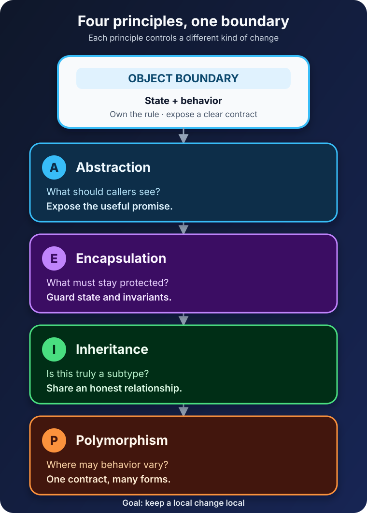

The bug looks harmless: a checkout feature needs to change a parcel's weight, so one line of code assigns a new value directly.

Nothing crashes. The application keeps running. But the new value is negative, the shipping price becomes nonsense, and now every caller must remember a rule that should have lived in one place.

Object-oriented programming is often introduced with animals, vehicles, and a slogan about "real-world objects." That can make OOP sound like an exercise in naming classes. Its more useful purpose is this: **put related state and behavior behind boundaries that keep the program valid as it changes**.

Four principles help create those boundaries: abstraction, encapsulation, inheritance, and polymorphism. They are not four boxes to tick. They solve different parts of the same design problem.



## What is object-oriented programming?

Object-oriented programming, or OOP, is a programming style that organizes a system around objects. An object combines **state**—the data it currently holds—with **behavior**—the operations it can perform.

A class usually defines the shape and behavior shared by a kind of object; an object is a particular instance created from that definition. A `Parcel` class might define weight and destination, while `customerParcel` is one actual parcel in memory.

The details vary by language. Java and C# enforce access controls and class relationships at compile time. Python supports classes, inheritance, and method overriding but treats non-public members largely as a convention. The [Python class documentation](https://docs.python.org/3/tutorial/classes.html) explicitly notes that truly private instance variables do not exist in the language.

That difference is important. OOP is a way to reason about responsibility and collaboration, not one universal syntax.

## The four OOP principles at a glance

Microsoft's [object-oriented programming guide](https://learn.microsoft.com/en-us/dotnet/csharp/fundamentals/tutorials/oop) defines the familiar four principles. In practical terms, each answers a different question:

| Principle | The question it answers | Parcel-delivery example |
| --- | --- | --- |
| Abstraction | What should callers be able to ask for? | Request a quote without knowing its formula |
| Encapsulation | Which details must the object protect? | Reject an impossible parcel weight |
| Inheritance | Which specialized type is genuinely a kind of another type? | Express delivery is a delivery option |
| Polymorphism | Can callers use several implementations through one contract? | Compare standard and express quotes uniformly |

The order is not a recipe, but it reveals a useful flow: choose the essential operation, protect the state behind it, share only honest relationships, and let implementations vary without rewriting their callers.

## 1. Abstraction keeps attention on the right problem

Suppose checkout needs a delivery quote. It should not need to know about fuel surcharges, remote-area rules, carrier rounding, or the database holding those rules. It needs a small promise:

The Java excerpts below are intentionally abbreviated so the design stays visible; a complete application would also define supporting types, imports, and error handling.

```java
interface DeliveryOption {
    Quote quote(Parcel parcel);
}
```

This interface is an abstraction. It describes **what** a delivery option can do while leaving each implementation to decide **how** it does it.

Abstraction is not simply hiding complicated code. It is choosing which details matter at one level of the system. A map abstracts streets into useful routes. A payment API abstracts network calls into operations such as authorize and refund. Both omit details deliberately so the caller can solve its own problem.

The [Dev.java introduction to OOP](https://dev.java/learn/oop/) describes an interface as a contract between a class and the outside world. A good abstraction is small enough to understand, stable enough to depend on, and honest about what it promises.

Too little abstraction spreads details everywhere. Too much abstraction produces vague layers with names such as `Manager`, `Helper`, or `Processor` that hide meaning instead of clarifying it.

## 2. Encapsulation protects valid state

Abstraction decides what the outside sees. Encapsulation controls what the outside may change.

Consider a parcel whose weight can be edited directly:

```java
parcel.weightKg = -4.0;
```

Every caller now carries the burden of keeping the parcel valid. A safer object owns that rule:

```java
final class Parcel {
    private final double weightKg;

    Parcel(double weightKg) {
        if (weightKg <= 0) {
            throw new IllegalArgumentException("Weight must be positive");
        }
        this.weightKg = weightKg;
    }

    double weightKg() {
        return weightKg;
    }
}
```

The field is private, construction validates it, and no operation can leave the parcel with an impossible weight. The object is not merely hiding data; it is preserving an **invariant**, a condition that must always remain true.

Encapsulation also creates freedom. Callers depend on `weightKg()`, not on how the value is stored. The implementation could later use grams internally without forcing changes throughout the checkout code.

Getters and setters do not automatically provide good encapsulation. A public setter that accepts any value may expose the same risk as a public field. Prefer operations that express intent—`addItem`, `reserve`, `cancel`, `changeAddress`—and let the object enforce the rules attached to that intent.

## 3. Inheritance models a real "is-a" relationship

Inheritance allows one class to derive state or behavior from another. A specialized class can reuse a common foundation and add or override what makes it different.

Java distinguishes implementing an interface from extending a class. Both can create a subtype that callers use through a broader type, but extending a class also inherits its accessible implementation. A small base class might hold behavior shared by related delivery services:

```java
abstract class TrackedDelivery {
    final String trackingLabel(String parcelId) {
        return "TRACK-" + parcelId;
    }

    abstract Quote quote(Parcel parcel);
}

final class ExpressDelivery extends TrackedDelivery {
    @Override
    Quote quote(Parcel parcel) {
        return expressRateFor(parcel);
    }
}
```

The mechanism is powerful, but the design question comes first. Is an express delivery genuinely a delivery option? Yes. Is a delivery option a pricing database? No, even if inheriting database code would save a few lines.

Inheritance creates tight coupling to a parent contract. Changes in a base class can affect every descendant, and deep hierarchies make behavior difficult to locate. This is why "reuse" alone is a weak reason to inherit.

Often, composition is clearer. A delivery option can *have a* `PricingPolicy` rather than *be a* pricing policy:

```java
final class ExpressDelivery implements DeliveryOption {
    private final PricingPolicy pricing;

    ExpressDelivery(PricingPolicy pricing) {
        this.pricing = pricing;
    }

    public Quote quote(Parcel parcel) {
        return pricing.expressQuote(parcel);
    }
}
```

This arrangement can swap a policy without reshaping a class hierarchy. Use inheritance when the subtype relationship remains true for callers, not merely because two classes contain similar code.

## 4. Polymorphism lets behavior vary behind one contract

Polymorphism means "many forms." In everyday OOP, it lets code work with a general type while the runtime object supplies the specific behavior.

```java
var options = List.<DeliveryOption>of(
    new StandardDelivery(),
    new ExpressDelivery()
);

for (DeliveryOption option : options) {
    System.out.println(option.quote(parcel));
}
```

The loop does not ask whether an option is standard or express. It sends the same `quote` request to both. Each object responds with its own implementation.

Microsoft's [polymorphism documentation](https://learn.microsoft.com/en-us/dotnet/csharp/fundamentals/object-oriented/polymorphism) describes the same runtime effect: an object can be treated as its base type, while an overridden implementation is chosen from the actual runtime type. Dev.java similarly summarizes polymorphism as [choosing the appropriate method at runtime](https://dev.java/learn/inheritance/).

The payoff appears when a third option arrives. If `PickupPointDelivery` implements `DeliveryOption`, the comparison loop does not change. New behavior extends the system through the existing contract.

Beware the opposite pattern: a chain of `if (type == ...)` checks scattered across the codebase. Sometimes a conditional is the simplest honest solution. But when each new type requires editing the same condition in many places, polymorphism can move that variation into the objects that own it.

## How the principles work together

The four ideas overlap, but they are not synonyms.

The `DeliveryOption` interface is an abstraction because it exposes the essential `quote` operation. A `Parcel` is encapsulated because it guards its weight. The delivery implementations inherit a common interface. The checkout loop uses them polymorphically.

Remove one principle and a different weakness appears. Without abstraction, checkout knows carrier formulas. Without encapsulation, any caller can create invalid state. Misused inheritance builds a brittle family tree. Without polymorphism, the caller must know every concrete option.

Good object design makes collaboration obvious: who owns the data, which operations are allowed, what contract callers see, and where behavior is permitted to vary.

## Common OOP mistakes

The first mistake is turning every noun into a class. A system does not improve because `EmailAddressFactoryManager` exists. Create an object when it has a useful responsibility, rule, lifecycle, or interchangeable behavior.

The second is building inheritance trees before variation is understood. A three-line duplication is often cheaper than the wrong parent class. Wait until the shared contract is clear.

The third is exposing data and calling it encapsulation. Objects that contain only getters and setters often leave all meaningful rules in external services. Ask which invariants the object itself should defend.

The fourth is forcing OOP onto every problem. A pure transformation may be clearest as a function. Immutable records can be better than stateful objects. Many modern systems mix object-oriented, functional, and procedural styles without contradiction.

## A practical design checklist

Before adding another class or hierarchy, ask:

- What responsibility belongs here, in one sentence?
- Which states are invalid, and where are they prevented?
- What is the smallest useful contract for callers?
- Is this relationship truly "is-a," or would composition be clearer?
- Can a new implementation be added without teaching every caller its concrete type?
- Does the design reduce the cost of change, or only add indirection?

If the answers are unclear, more class syntax will not rescue the model. Return to the business rule and the change you are trying to make safer.

## The takeaway

Object-oriented programming is not mainly about modeling the world as a collection of class diagrams. It is about deciding where knowledge and change belong.

**Abstraction** exposes the useful promise. **Encapsulation** protects the rules behind it. **Inheritance** expresses an honest subtype relationship. **Polymorphism** lets several implementations fulfill one contract.

Used together, the four principles do something practical: they keep a local change local. That is the real test of an object-oriented design—not how many patterns it names, but how calmly the code accepts its next requirement.

## Related reading

- [What Is Software Architecture? A Beginner's Guide](/posts/software-architecture-beginners-guide/)
- [Spring Boot Layered Architecture: Controller, Service, and Repository](/posts/spring-boot-layered-architecture/)
- [C# vs Java: A Practical Comparison](/posts/csharp-vs-java/)

## Sources

- [Microsoft Learn: Object-Oriented Programming in C#](https://learn.microsoft.com/en-us/dotnet/csharp/fundamentals/tutorials/oop)
- [Microsoft Learn: Polymorphism](https://learn.microsoft.com/en-us/dotnet/csharp/fundamentals/object-oriented/polymorphism)
- [Dev.java: Objects, Classes, Interfaces, Packages, and Inheritance](https://dev.java/learn/oop/)
- [Dev.java: Inheritance](https://dev.java/learn/inheritance/)
- [Python 3.14 Documentation: Classes](https://docs.python.org/3/tutorial/classes.html)
