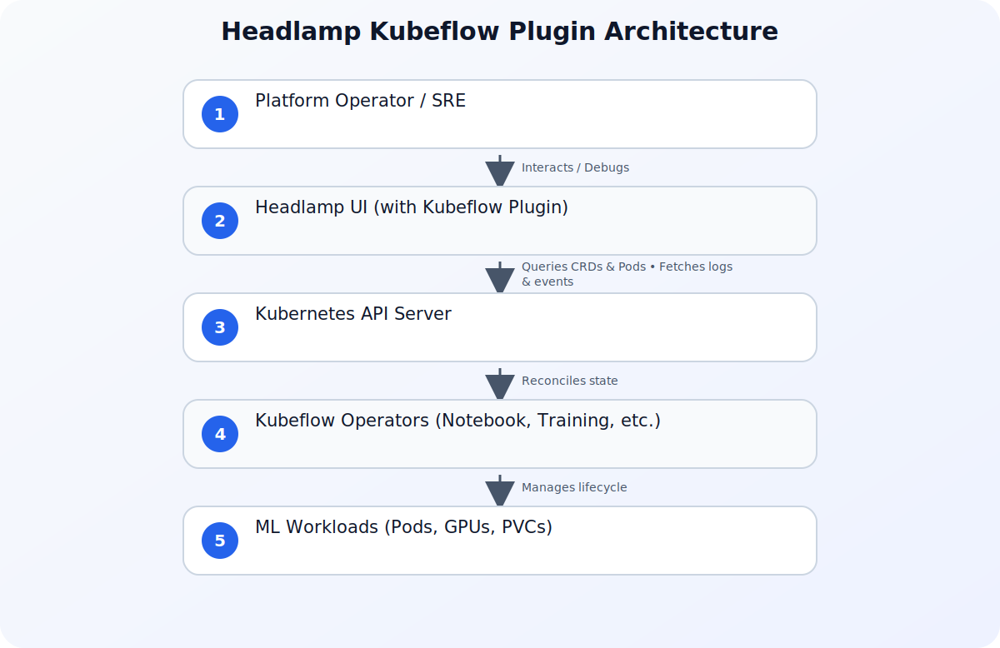

## Introduction

Kubernetes has quietly become the default platform for artificial intelligence (AI) and machine learning (ML). Whether you run notebook servers for data scientists, schedule distributed training jobs, tune hyperparameters, or orchestrate multi-step ML pipelines, those workloads increasingly land on a Kubernetes cluster. Kubeflow is one of the most popular ways to assemble that stack, and it does so the Kubernetes-native way: every capability is exposed as a Custom Resource Definition (CRD). 

That design is a gift to cluster operators because it means ML workloads can be observed and managed with the same primitives as everything else in the cluster. However, in practice, the specialized ML dashboards that ship with these platforms often hide the Kubernetes layer underneath. When a notebook is stuck or a training run fails, the operator is often left dropping back to `kubectl` to find out what actually happened at the Pod level. 

To bridge this gap, the Kubernetes community has introduced a Headlamp plugin for Kubeflow, bringing deep, developer-friendly visibility to AI/ML workloads directly within a modern Kubernetes dashboard.

## The Visibility Gap in AI/ML Operations

To understand why this plugin is a game-changer, we must first look at how machine learning operations (MLOps) are typically structured on Kubernetes. Data scientists live in high-level environments like Jupyter Notebooks, VS Code, or the Kubeflow Central Dashboard. They think in terms of models, datasets, epochs, and pipelines. They rarely want to interact with the underlying Kubernetes infrastructure, and indeed, they shouldn't have to.

However, when things go wrong, this abstraction layer becomes a wall. A data scientist might see that their notebook is stuck in a "Starting" state indefinitely. Or a distributed PyTorch training job might fail with a generic error code. The Kubeflow UI often lacks the granular infrastructure context to explain *why*.

Under the hood, that "Starting" notebook is a custom resource (`Notebook`) that translates into a StatefulSet, which in turn creates a Pod. That Pod might be pending because the cluster has run out of GPU-enabled nodes, or because a PersistentVolumeClaim (PVC) cannot be bound due to storage class misconfigurations. Similarly, a distributed training job (`PyTorchJob`) relies on multiple worker Pods coordinating over the network. If one worker Pod fails due to an Out-Of-Memory (OOM) error, the entire job halts.

Without an integrated UI, the cluster operator must perform a context switch:
1. Open a terminal and run `kubectl get notebooks -n <namespace>`.
2. Identify the underlying Pod name.
3. Run `kubectl describe pod <pod-name> -n <namespace>` to check events.
4. Run `kubectl logs <pod-name> -n <namespace>` to inspect runtime errors.

This manual debugging loop slows down development, increases Mean Time To Resolution (MTTR), and frustrates both data scientists and platform engineers.

## Headlamp: A Modern, Extensible Kubernetes UI

Headlamp is an open-source, extensible Kubernetes dashboard designed to be highly customizable. Unlike the traditional Kubernetes Dashboard, which relies strictly on in-cluster service accounts and can be complex to extend, Headlamp can run both as a desktop application (using your local `kubeconfig`) and as an in-cluster web application. 

One of Headlamp's defining features is its plugin architecture. Developers can build frontend plugins using React to add custom views, modify existing resource pages, and integrate custom resource definitions (CRDs) directly into the main navigation. This makes Headlamp the perfect host for specialized operational views, such as managing serverless workloads, inspecting batch schedulers, or, in this case, operating Kubeflow.

## Architectural Overview of the Kubeflow Plugin

The Headlamp plugin for Kubeflow acts as a visual bridge between high-level ML abstractions and low-level Kubernetes primitives. It auto-detects the presence of Kubeflow CRDs in your cluster and dynamically injects a "Kubeflow" section into the Headlamp sidebar.

When you navigate to this section, the plugin queries the Kubernetes API for Kubeflow-specific resources, such as:
- **Notebooks**: Custom resources representing Jupyter or VS Code instances.
- **PyTorchJobs / TFJobs**: Distributed training jobs managed by the Kubeflow Training Operator.
- **Pipelines / Runs**: Workflows managed by Kubeflow Pipelines.

Instead of displaying these as generic, unformatted custom resources (which is what standard dashboards do), the Headlamp plugin parses their status fields, associates them with their underlying Pods, Services, and PVCs, and presents them in an intuitive, operational dashboard.

This architecture ensures that operators can view the health of the entire ML platform in one place, as illustrated below:



## Step-by-Step Guide: Setting Up Headlamp with the Kubeflow Plugin

To get started, you need a Kubernetes cluster running Kubeflow (or at least the Kubeflow Training Operator and Notebook Controller) and Headlamp installed.

### Step 1: Install Headlamp

If you are running Headlamp on your desktop, you can download the application for your operating system. It will automatically use your active `kubeconfig` context.

Alternatively, you can deploy Headlamp in-cluster using Helm:

```bash
helm repo add headlamp https://kinvolk.github.io/headlamp
helm repo update
helm install headlamp headlamp/headlamp --namespace headlamp --create-namespace
```

### Step 2: Install the Kubeflow Plugin

Headlamp plugins can be installed by placing the compiled plugin files into the Headlamp plugins directory. For the desktop application, this is typically located at:
- **macOS**: `~/Library/Application Support/Headlamp/plugins`
- **Linux**: `~/.config/Headlamp/plugins`
- **Windows**: `%APPDATA%\Headlamp\plugins`

For in-cluster deployments, you can build a custom Headlamp container image containing the plugin or mount the plugin via a PersistentVolume or ConfigMap.

### Step 3: Configure RBAC Permissions

Because Headlamp respects Kubernetes Role-Based Access Control (RBAC), the service account or user credentials you use to log in must have permissions to view both standard resources and Kubeflow CRDs. Below is an example of a `ClusterRole` that grants the necessary read-only permissions for operating Kubeflow workloads:

```yaml
apiVersion: rbac.authorization.k8s.io/v1
kind: ClusterRole
metadata: 
  name: headlamp-kubeflow-viewer
rules:
  # Standard resources needed by Headlamp
  - apiGroups: [""]
    resources: ["pods", "pods/log", "services", "persistentvolumeclaims", "events", "namespaces"]
    verbs: ["get", "list", "watch"]
  - apiGroups: ["apps"]
    resources: ["statefulsets", "deployments"]
    verbs: ["get", "list", "watch"]
  # Kubeflow specific CRDs
  - apiGroups: ["kubeflow.org"]
    resources: ["notebooks", "pytorchjobs", "tfjobs", "experiments", "trials"]
    verbs: ["get", "list", "watch"]
```

Apply this role and bind it to your user or service account:

```bash
kubectl apply -f clusterrole.yaml
kubectl create clusterrolebinding headlamp-kubeflow-binding \
  --clusterrole=headlamp-kubeflow-viewer \
  --user=your-user@example.com
```

## Practical Example: Debugging a Failed Distributed Training Job

Let's walk through a practical scenario. Imagine you have deployed a distributed PyTorch training job using the Kubeflow Training Operator. Below is the manifest for a simple `PyTorchJob` that trains a model using two worker replicas:

```yaml
apiVersion: "kubeflow.org/v1"
kind: "PyTorchJob"
metadata:
  name: "mnist-distributed-training"
  namespace: "ml-workloads"
spec:
  pytorchReplicaSpecs:
    Master:
      replicas: 1
      restartPolicy: OnFailure
      template:
        spec:
          containers:
            - name: pytorch
              image: gcr.io/kubeflow-images-public/pytorch-mnist:v1.0
              resources:
                limits:
                  nvidia.com/gpu: 1
    Worker:
      replicas: 2
      restartPolicy: OnFailure
      template:
        spec:
          containers:
            - name: pytorch
              image: gcr.io/kubeflow-images-public/pytorch-mnist:v1.0
              resources:
                limits:
                  nvidia.com/gpu: 1
```

If this job fails or hangs, navigating to the "PyTorchJobs" section in Headlamp immediately reveals the status of the master and worker replicas. Instead of running multiple `kubectl` commands, you can click on `mnist-distributed-training` within Headlamp to see:

1. **Resource Topology**: A visual map showing the `PyTorchJob` custom resource, the underlying Pods created for the Master and Workers, and their current lifecycle states.
2. **Real-time Logs**: A consolidated log viewer where you can switch between the Master pod and Worker pods with a single click, allowing you to quickly spot synchronization errors or CUDA out-of-memory exceptions.
3. **Event Stream**: A list of Kubernetes events associated with these Pods. If a worker pod is pending because there are no available GPU nodes, the event `FailedScheduling: 0/12 nodes are available: 12 Insufficient nvidia.com/gpu` will be displayed directly on the job's detail page.

## Security, Governance, and the AI Supply Chain

Operating AI/ML workloads on Kubernetes is not just about scheduling and debugging; it is also about security and governance. As organizations scale their machine learning practices, they often face "shadow AI"—workloads deployed by data scientists or developers without formal registration or security vetting.

To mitigate these risks, platform engineers must implement robust security controls. Ensuring proper identity and access management is the first step; you can read more about why this is critical in our article on [Why Identity Security Matters More in the AI Era](/posts/why-identity-security-matters-more-ai-era/).

Furthermore, securing the software supply chain for machine learning models and runtimes is paramount. When running models in production, you must verify the integrity of the container images, base models, and datasets. For teams running on Google Kubernetes Engine (GKE), automated tools can help generate and audit these components. For a deep dive into automating this process, see our guide on [Securing the AI Supply Chain on GKE: Introducing k8s-aibom for Automated AI BOMs](/posts/securing-the-ai-supply-chain-on-gke-introducing-k8s-aibom-for-automated-ai-boms-pr/).

By combining Headlamp's operational visibility with automated AI Bill of Materials (AI-BOM) tools, organizations can maintain a secure, compliant, and highly observable machine learning platform.

## Comparison: Kubernetes Dashboard vs. Headlamp for AI/ML

Let's compare how the traditional Kubernetes Dashboard and Headlamp stack up when managing complex AI/ML workloads:

| Feature | Kubernetes Dashboard | Headlamp (with Kubeflow Plugin) |
| :--- | :--- | :--- |
| **Extensibility** | Limited; requires modifying core codebase or complex iframe integrations. | High; native React-based plugin system with dynamic UI injection. |
| **CRD Support** | Generic YAML/JSON viewer; no custom formatting or relationship mapping. | Rich, customized views for Kubeflow CRDs (Notebooks, PyTorchJobs, etc.). |
| **Deployment Options** | In-cluster only. | In-cluster or Desktop application (using local `kubeconfig`). |
| **Multi-Cluster Support** | Complex to configure; typically requires one dashboard instance per cluster. | Out-of-the-box; switch between multiple clusters seamlessly. |
| **Log Aggregation** | View logs for one Pod at a time; no easy context switching between replicas. | Consolidated log viewing with quick switching between master/worker replicas. |
| **Resource Topology** | Flat list of resources. | Visual mapping of CRDs to their underlying Pods, Services, and PVCs. |

## Conclusion

As Kubernetes solidifies its position as the operating system for AI and machine learning, the tools we use to operate these clusters must evolve. The Headlamp plugin for Kubeflow bridges the gap between high-level data science abstractions and low-level Kubernetes infrastructure. By providing platform engineers and operators with a unified, extensible, and secure dashboard, it reduces debugging times, simplifies resource management, and ensures that enterprise AI workloads run smoothly and securely.

## Sources

- [Operating AI/ML Workloads on Kubernetes: A Headlamp Plugin for Kubeflow](https://kubernetes.io/blog/2026/07/13/introducing-headlamp-plugin-for-kubeflow/)
- [Kubernetes Dashboard to Headlamp: A Step-by-Step Guide](https://kubernetes.io/blog/2026/07/13/kubernetes-dashboard-to-headlamp/)
- [Introducing k8s-aibom on GKE for automated AI bills of materials](https://cloud.google.com/blog/products/identity-security/introducing-k8s-aibom-on-gke-for-automated-ai-bills-of-materials/)
