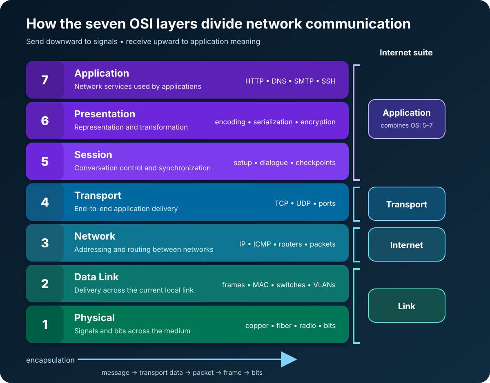

A video call freezes, but ordinary websites still load. Is the Wi-Fi signal weak? Is a router dropping traffic? Is the application stuck, or is one transport connection simply having a bad day?

Without a shared way to divide the problem, every guess sounds equally plausible.

That is where the OSI model earns its keep. It turns network communication into seven layers, from the signals that cross a cable or radio channel to the services an application uses. The model does not fix the network for you. It gives you a disciplined place to start asking questions.

**The Open Systems Interconnection (OSI) model is a seven-layer reference model for describing how networked systems communicate.** From bottom to top, its layers are Physical, Data Link, Network, Transport, Session, Presentation, and Application.

The important phrase is *reference model*. The [ISO/IEC 7498-1 standard](https://www.iso.org/standard/20269.html) says the model provides a common basis for coordinating standards; it is not an implementation specification. Real software and protocols do not have to arrive in seven perfectly separated packages.

Read the diagram from the application down when data is sent, then from the physical medium back up when it is received. Each layer uses the service below it and offers a service to the layer above it. That simple relationship is the model's central idea.

## Why seven layers instead of one giant network function?

Imagine that every application had to understand radio modulation, Ethernet framing, routing, retransmission, data formats, and user-facing protocols. Changing a network card could force changes throughout the application.

Layering contains that complexity. A web client can ask TCP for an ordered byte stream without knowing whether the next link is Ethernet, Wi-Fi, or something else. IP can move packets across several networks without understanding the meaning of the HTTP message inside them.

The [ITU-T X.200 recommendation](https://www.itu.int/rec/T-REC-X.200/en), published jointly with the ISO model, describes an ordered set of layers in which peer entities communicate by protocol and adjacent layers interact through services. In plain language: each layer has a job, speaks conceptually to the same layer at the other endpoint, and relies on its neighbor to carry the result.

This separation improves vocabulary as much as technology. “The network is down” is vague. “The physical link is up, the host learned the gateway's MAC address, but IP packets have no route beyond the gateway” is a much smaller problem.

## Layers 1 and 2 move data across the local link

### Layer 1: Physical

The Physical layer transmits raw bits over a medium. It concerns electrical, optical, or radio signaling; connectors and interfaces; timing; bit rates; and the establishment of a physical connection.

At this layer, the data is a bit or a stream of bits. Copper and fiber cabling, radio channels, transceivers, repeaters, and the physical portions of Ethernet and Wi-Fi live in this part of the conversation.

Layer 1 problems are concrete: a disconnected cable, damaged fiber, excessive interference, an incompatible transceiver, or a device with no link. If the interface cannot establish a physical signal, no amount of DNS or HTTP debugging will help.

### Layer 2: Data Link

The Data Link layer moves data across one local link. It groups bits into frames, identifies link-local endpoints, controls access to a shared medium, and detects some transmission errors. Depending on the particular service, it can also provide sequencing, flow control, or recovery.

Ethernet MAC addresses, Ethernet frames, Wi-Fi frames, switches, bridges, and VLANs are familiar Layer 2 concepts. IEEE 802 standards concentrate on the Physical and Data Link layers; the [IEEE 802 architecture overview](https://www.ieee802.org/1/pages/802.html) provides the reference model used across its LAN and metropolitan network standards.

Layer 2 is local in scope. A switch can forward an Ethernet frame toward the correct device inside a broadcast domain, but a MAC address does not tell the global Internet how to reach a distant network. That is the next layer's job.

## Layers 3 and 4 carry data between hosts and applications

### Layer 3: Network

The Network layer moves data across interconnected networks. Its major concerns are logical addressing, path selection, routing, and relaying through intermediate systems.

IP is the everyday example. An IP packet contains source and destination addresses that routers use to make forwarding decisions. A packet can cross many different Layer 2 links on its journey; its Ethernet frame is replaced at each routed hop, while the packet continues toward its destination.

That distinction explains a common troubleshooting mistake. A host needs a destination MAC address only for the next local hop—often its default gateway—not for a server on the other side of the Internet. The IP destination identifies the remote endpoint; the link-layer destination gets the packet through the current link.

### Layer 4: Transport

The Transport layer provides end-to-end communication services for applications. It can identify application endpoints, divide data into manageable units, multiplex several conversations, control flow, and detect or recover from errors, depending on the protocol.

TCP and UDP show how different those services can be. TCP offers an ordered, reliable byte stream with flow and congestion control. UDP sends independent datagrams without promising delivery or order. Ports allow the operating system to deliver traffic to the appropriate application endpoint.

The Internet stack's own standard description is useful here. [RFC 1122](https://www.rfc-editor.org/rfc/rfc1122.html) organizes host communication into link, Internet, transport, and application layers. It describes TCP and UDP at transport and IP at the Internet layer. This is why a successful `ping` does not prove that a web service is healthy: IP reachability and an application listening on TCP port 443 are different questions.

## Layers 5 through 7 organize the application conversation

The upper three OSI layers are easiest to misunderstand because the modern Internet suite usually does not implement them as three distinct modules. Their *functions* still exist, but an application, library, or protocol may combine them.

### Layer 5: Session

The Session layer establishes and manages an organized conversation between applications. The OSI model associates it with session setup and release, dialogue control, synchronization points, and recovery to an agreed state.

Think of Layer 5 as the rules for maintaining a conversation rather than delivering an individual packet. In practical Internet applications, session state might be handled by an application protocol, an authentication system, a remote procedure call framework, or the application itself. A login cookie is not automatically “an OSI Layer 5 protocol”; it is simply an example of session-related responsibility appearing higher in a real stack.

### Layer 6: Presentation

The Presentation layer makes information understandable to both endpoints. It concerns data representation, syntax negotiation, and transformations that preserve meaning across systems.

Character encodings, serialization formats, compression, and cryptographic transformations are often used to explain this layer. The precise lesson is not that JSON or TLS belongs exclusively in a numbered box. It is that communicating systems must agree on how bytes represent information, and those transformations sit between application meaning and transport.

### Layer 7: Application

The Application layer supplies network communication functions to application processes. Protocols such as HTTP, DNS, SMTP, and SSH are commonly placed here because they define services applications directly use: requesting a web resource, resolving a name, delivering mail, or opening a secure remote shell.

Layer 7 is not the user interface and not the entire browser. It is the top of the communication model. A browser's tabs, rendering engine, and bookmarks extend far beyond the OSI model; its HTTP exchanges are relevant because they communicate with another system.

## What encapsulation looks like in a real request

Suppose a browser sends an HTTP request over TCP/IP and Ethernet.

1. The application creates an HTTP message.
2. TCP carries the bytes in segments and identifies endpoints with ports.
3. IP carries each transport unit in a packet addressed between hosts.
4. Ethernet carries each packet in a frame across the current local link.
5. The physical interface transmits the frame as signals representing bits.

At the receiving host, the process reverses. Each layer examines and removes the information intended for it, then hands the remaining payload upward. This wrapping and unwrapping is called **encapsulation** and **decapsulation**.

The vocabulary is useful, but do not make it more rigid than the protocols. People often say *segment* for Layer 4, *packet* for Layer 3, *frame* for Layer 2, and *bits* for Layer 1. Those names are good mental labels, not a guarantee that every standard uses the same term in every context.

## OSI versus TCP/IP: two maps of similar territory

The OSI model has seven layers. The Internet protocol suite is commonly described with four: Application, Transport, Internet, and Link.

The mapping is approximate:

- OSI Application, Presentation, and Session functions usually fall within the Internet Application layer.
- OSI Transport maps closely to the Internet Transport layer.
- OSI Network maps closely to the Internet layer.
- OSI Data Link and Physical functions are grouped within the Internet Link layer.

OSI is a broad conceptual reference. TCP/IP describes the architecture and protocols that power the Internet. You do not have to choose one and reject the other: use TCP/IP to understand the deployed protocol suite and OSI when its finer vocabulary helps explain a boundary or isolate a fault.

Even the IETF warns against treating layers as physical walls. RFC 1122 calls strict layering an imperfect model because protocols interact in complex ways, while [RFC 3439](https://www.rfc-editor.org/rfc/rfc3439.html) discusses both the structuring advantages and efficiency costs of layering. A model should clarify reality, not overrule it.

## Use the OSI model as a troubleshooting ladder

The familiar advice to “start at Layer 1” works when a basic connection is completely unavailable. It is not a law. If monitoring already shows healthy links and routing but every API request returns HTTP 401, begin near the application. Start where the evidence points, then move across adjacent layers deliberately.

| Evidence or symptom | Layer to investigate first | Useful question |
| --- | --- | --- |
| No link state or unstable signal | 1 — Physical | Is the medium connected, compatible, and free from obvious faults? |
| Wrong VLAN or no local neighbor resolution | 2 — Data Link | Can frames reach the correct local broadcast domain? |
| Local network works but remote subnet does not | 3 — Network | Are the IP address, gateway, and routes correct? |
| Host responds but a service port times out | 4 — Transport | Is the service listening, and can TCP or UDP reach it? |
| Conversation repeatedly loses state | 5 — Session functions | Which component creates, retains, and expires session state? |
| TLS, encoding, or serialization fails | 6 — Presentation functions | Do both endpoints agree on representation and transformation? |
| DNS answer or HTTP response is wrong | 7 — Application | Is the application protocol returning the expected result? |

Do not confuse the first suspect with the final cause. An HTTP timeout appears at Layer 7 but may originate from packet loss at Layer 1. A name-resolution failure looks like DNS at Layer 7 but may be caused by a missing route at Layer 3. The model guides the investigation; measurements confirm it.

## Common mistakes that weaken the model

The first mistake is memorizing layer names without learning their boundaries. A mnemonic may help on an exam, but troubleshooting requires knowing the difference between a local frame, a routed packet, and an application message.

The second is assigning every technology to exactly one layer. Ethernet spans physical and data-link specifications. TLS performs presentation-like transformations but is positioned by actual protocol relationships, not by an OSI label. Firewalls, load balancers, and proxies may inspect or act at several layers.

The third is assuming that devices *are* layers. A traditional switch mostly forwards at Layer 2 and a router forwards at Layer 3, but modern devices often combine routing, filtering, tunneling, translation, and application inspection.

The fourth is starting over from Layer 1 for every incident. The efficient approach is evidence-driven: identify what already works, locate the narrowest failed boundary, and test one layer at a time.

## The takeaway

The OSI model is not a literal blueprint of the Internet. It is a map for reasoning about communication.

Layer 1 moves bits. Layer 2 moves frames across a local link. Layer 3 routes packets between networks. Layer 4 connects application endpoints. Layers 5, 6, and 7 organize the conversation, represent its data, and provide application communication services.

Learn those responsibilities, then follow the data. When a network fails, the seven layers turn “something is broken” into a sequence of questions that can actually be answered.

## Continue learning

- [Network Communication Basics](/posts/network-communication-basics/)
- [Internet Protocol (IP) Basics](/posts/internet-protocol-ip-basics/)
- [TCP vs UDP Explained With Examples](/posts/tcp-vs-udp-explained-with-examples/)
- [DNS Explained: How Your Browser Finds a Website](/posts/dns-explained-how-your-browser-finds-a-website/)

## Sources

- [ISO/IEC 7498-1:1994 — Open Systems Interconnection Basic Reference Model](https://www.iso.org/standard/20269.html)
- [ITU-T X.200 — Open Systems Interconnection Basic Reference Model](https://www.itu.int/rec/T-REC-X.200/en)
- [IEEE 802 — Overview and Architecture](https://www.ieee802.org/1/pages/802.html)
- [IETF RFC 1122 — Requirements for Internet Hosts: Communication Layers](https://www.rfc-editor.org/rfc/rfc1122.html)
- [IETF RFC 3439 — Some Internet Architectural Guidelines and Philosophy](https://www.rfc-editor.org/rfc/rfc3439.html)
