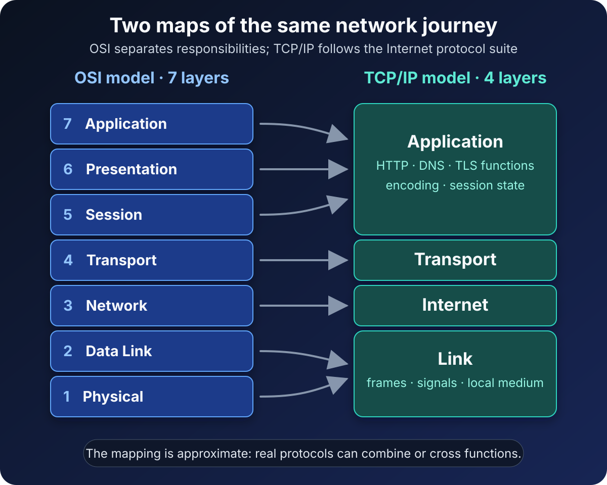

A support ticket says the network has a “Layer 3 problem.” A packet capture shows Ethernet, IP, TCP, TLS, and HTTP. Then someone opens a textbook with seven boxes while the operating system documentation shows only four.

Nothing is necessarily wrong. The team is looking at the same communication through two different maps.

**The OSI model is a seven-layer reference model for describing network functions. The TCP/IP model—more precisely, the Internet protocol suite architecture—groups communication into four layers built around protocols used on the Internet.** OSI gives you finer vocabulary. TCP/IP follows the structure of a deployed protocol suite.

That is the central difference. One model helps us separate ideas; the other helps us follow real Internet communication. They overlap, but they are not rival products and they do not map perfectly layer for layer.

The connectors in the diagram say *approximately* for a reason. Layer mapping is a learning aid, not a standards-defined conversion formula.

## OSI and TCP/IP answer different questions

The Open Systems Interconnection model asks: **Which communication responsibility are we discussing?** Its seven layers divide signaling, local delivery, routing, end-to-end transport, session control, data representation, and application services.

The [ISO/IEC 7498-1 standard](https://www.iso.org/standard/20269.html) describes OSI as a common basis for coordinating standards and placing them in perspective. Crucially, ISO says the model is not an implementation specification. It is a framework for reasoning, not a command that every program must contain seven separate modules.

TCP/IP asks a more concrete question: **Which part of the Internet protocol suite carries this data?** [RFC 1122](https://www.rfc-editor.org/rfc/rfc1122.html) describes four layers for an Internet host: Application, Transport, Internet, and Link. A host typically implements at least one protocol at each layer.

The name *TCP/IP* can be misleading. TCP and IP are two important protocols in the suite, not the whole stack. UDP, ICMP, DNS, HTTP, and many other protocols participate too. *Internet protocol suite* is the more accurate name, although *TCP/IP model* remains the familiar search term.

## The layer mapping at a glance

This is the common practical mapping:

| OSI layer | Closest TCP/IP layer | Typical responsibility or example |
| --- | --- | --- |
| 7 Application | Application | HTTP, DNS, SMTP, application services |
| 6 Presentation | Application | Encoding, serialization, compression, cryptographic representation |
| 5 Session | Application | Conversation state, checkpoints, session management |
| 4 Transport | Transport | TCP, UDP, ports, end-to-end delivery behavior |
| 3 Network | Internet | IP addressing, packet forwarding, routing |
| 2 Data Link | Link | Ethernet or Wi-Fi frames, MAC addressing, local delivery |
| 1 Physical | Link | Electrical, optical, or radio transmission of bits |

The middle of the table aligns fairly well. OSI Transport and Network are close to TCP/IP Transport and Internet. The larger differences appear at the top and bottom.

TCP/IP does not subdivide its Application layer into OSI Session, Presentation, and Application layers. Those responsibilities still exist, but application protocols, libraries, and programs handle them without respecting three mandatory boundaries.

Likewise, TCP/IP's Link layer covers communication with the directly connected network. Courses often split it into Data Link and Physical layers, producing a **five-layer Internet model**. That hybrid is useful for teaching, but it should not be mistaken for the four-layer architecture named in RFC 1122 or the seven-layer OSI model.

## Follow one web request through both models

Imagine a laptop requesting a page from a server using HTTP over TLS and TCP, carried by IP over Wi-Fi.

In the TCP/IP view, the path downward is compact:

1. The **Application layer** creates the HTTP message and applies the TLS-protected representation.
2. The **Transport layer** uses TCP to provide an ordered byte stream between ports.
3. The **Internet layer** places transport data inside IP packets and addresses them between hosts.
4. The **Link layer** carries each packet across the current local link as Wi-Fi frames and radio signals.

The OSI view describes the same journey with a finer lens. HTTP is discussed at Application, TLS has presentation-like work, conversation state has session-like work, TCP fits Transport, IP fits Network, Wi-Fi framing fits Data Link, and radio transmission fits Physical.

At each step, control information is wrapped around the payload. The receiver removes that information in reverse order. This is **encapsulation** and **decapsulation**. RFC 1122 illustrates the concrete Internet version: application data is carried with a transport header inside an IP datagram. For TCP, that transport unit is commonly called a segment.

The models help us describe the wrapping, but the packet on the wire does not contain labels saying “OSI Layer 4” or “TCP/IP Layer 2.” Those numbers and names belong to our explanation of the system.

## Why the mapping is not exact

It is tempting to turn the table into a law: one protocol, one box, forever. Real protocol design is messier.

TLS is the classic debate. Its encryption and representation functions sound like OSI Presentation, but its actual placement depends on the protocol stack and application. Calling TLS “Layer 6” can communicate a rough function; it does not fully describe how a TLS record is carried or where a library runs.

QUIC makes the limitation even clearer. [RFC 9000](https://www.rfc-editor.org/rfc/rfc9000.html) defines QUIC as a secure, general-purpose transport protocol, integrates a TLS handshake, and carries QUIC packets inside UDP datagrams. It provides transport behavior while using another transport-layer protocol for deployment. A rigid one-protocol-one-layer rule hides the interesting architecture rather than explaining it.

Even TCP has explicit relationships across boundaries. The current TCP specification, [RFC 9293](https://www.rfc-editor.org/rfc/rfc9293.html), says that TCP provides applications with a reliable, in-order byte stream, sends TCP segments in IP datagrams, and calls on lower-level IPv4 or IPv6 modules. Layers describe service relationships; they are not isolated rooms.

This is why “Which OSI layer is this technology?” is often the beginning of a useful conversation, not the end of one. Ask what function you mean, what the protocol is carried over, and which endpoint or intermediary acts on it.

## Which model should you use?

Use the **TCP/IP model when you need to trace real Internet traffic or understand a host's protocol stack**. It matches practical questions such as these:

- Did the interface deliver the frame on the local link?
- Does the host have a valid IP address and route?
- Did TCP establish a connection to the destination port?
- Did DNS or HTTP return the expected application result?

Use the **OSI model when finer separation improves communication or troubleshooting**. It is useful when a vague statement such as “the application cannot connect” must become a sequence of narrower tests. Physical signal, local framing, routing, transport reachability, data representation, and application behavior are different failure domains even when the real stack groups some of them together.

For architecture discussions, use whichever vocabulary makes the boundary clear. If a diagram says “Layer 7 proxy,” define whether that means HTTP-aware behavior. If a firewall rule is described as “Layer 4,” say that it evaluates addresses, protocols, and ports rather than application messages. The label should shorten an explanation, not replace it.

## A practical troubleshooting pass

Suppose a browser reports that a site cannot be reached. Do not recite all seven OSI layers mechanically. Start with the evidence and move through the narrowest useful boundaries.

First, check the link: is the interface up, and can it communicate on the local network? Next, check the Internet layer: does the host have a suitable address, gateway, and route to the destination? Then check transport: can a connection reach the intended port? Finally, check the application exchange: did name resolution, TLS negotiation, and HTTP behave as expected?

The OSI model lets you split the last step further when needed. A certificate or encoding failure has a different character from an HTTP authorization response, even though both are handled within the TCP/IP Application layer.

This approach also prevents a common bad conclusion: “Ping works, so the network is fine.” A successful ICMP exchange provides evidence about IP reachability. It does not prove that TCP port 443 is reachable, that TLS can negotiate, or that the web application is healthy.

## Common mistakes to avoid

The first mistake is saying that OSI is purely theoretical while TCP/IP is purely practical. OSI is a reference model, but its concepts remain practical for design and diagnosis. TCP/IP also has an architecture and abstractions; it is not merely a bag of packet formats.

The second is treating OSI layer numbers as universal protocol metadata. Engineers use the numbers as shared shorthand. Protocol specifications define actual headers, services, state, and behavior.

The third is forcing upper-layer technologies into a single permanent box. Encryption, session state, tunnels, proxies, and modern transports can combine functions or sit differently depending on the system being described.

The fourth is confusing the TCP/IP model with the five-layer teaching model. Both can be useful. Name the version you are using so the audience knows whether Link has been split into Data Link and Physical.

## The takeaway

OSI has seven layers because it separates communication responsibilities in detail. TCP/IP has four layers because it describes the Internet suite around Application, Transport, Internet, and Link.

The models are compatible enough to compare but different enough that the mapping stays approximate. Use TCP/IP to follow deployed protocols. Use OSI to sharpen the vocabulary, expose boundaries, and isolate failures. When a protocol crosses a neat line, trust the protocol specification over the diagram.

The best model is not the one you can recite fastest. It is the one that makes the next technical question easier to answer.

## Continue learning

- [The OSI Model Explained Layer by Layer](/posts/osi-model-explained/)
- [Internet Protocol (IP) Explained](/posts/internet-protocol-ip-basics/)
- [TCP vs UDP Explained With Examples](/posts/tcp-vs-udp-explained-with-examples/)
- [Network Communication Basics](/posts/network-communication-basics/)

## Sources

- [ISO/IEC 7498-1:1994 — Open Systems Interconnection Basic Reference Model](https://www.iso.org/standard/20269.html)
- [IETF RFC 1122 — Requirements for Internet Hosts: Communication Layers](https://www.rfc-editor.org/rfc/rfc1122.html)
- [IETF RFC 9293 — Transmission Control Protocol](https://www.rfc-editor.org/rfc/rfc9293.html)
- [IETF RFC 9000 — QUIC: A UDP-Based Multiplexed and Secure Transport](https://www.rfc-editor.org/rfc/rfc9000.html)
