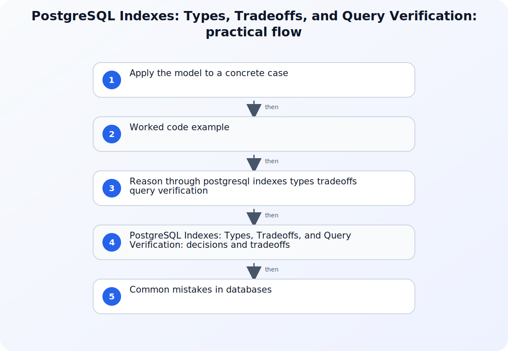

A PostgreSQL index is useful when its access method and column ordering support a real query predicate, ordering requirement, or constraint at an acceptable maintenance cost. Adding an index does not force the planner to use it, and an index that speeds one read can increase storage, write amplification, vacuum work, and planning choices. Selection therefore begins with the query and data distribution, then ends with measured plans and operational observation.



## A working model for PostgreSQL Indexes: Types, Tradeoffs, and Query Verification

Capture the exact query shape, representative parameter values, table size, row-count distribution, existing indexes, and the read and write rates of the workload. Record the current execution plan and runtime under a representative environment. Avoid evaluating only a tiny development table because a sequential scan can be rational at one scale while an index becomes useful at another, and cached execution can hide I/O behavior.

## Apply the model to a concrete case

Suppose an orders table is queried by tenant_id and created_at for the newest fifty rows. A B-tree beginning with tenant_id and then created_at can support the equality boundary and ordered range, with id as a deterministic tie-breaker if required. The baseline plan, representative tenant sizes, and write rate determine whether that index is worthwhile. A separate query searching a JSON or array containment operator may need a different access method rather than another B-tree over the same column. A BRIN index could be considered for a very large physically correlated timestamp range, but its summarized block ranges have different selectivity behavior. Each choice follows the operator and workload, not the column's name.

## Worked code example

### Create and verify a workload-specific B-tree

```sql
CREATE INDEX CONCURRENTLY idx_orders_tenant_created_id
    ON orders (tenant_id, created_at DESC, id DESC);

EXPLAIN (ANALYZE, BUFFERS)
SELECT id, created_at, status
FROM orders
WHERE tenant_id = 42
ORDER BY created_at DESC, id DESC
LIMIT 50;
```

The key order mirrors the equality predicate and deterministic ordering of this workload. Run `EXPLAIN ANALYZE` only where executing the statement is safe, and compare estimates, actual rows, buffers, and write impact with the recorded baseline.

## Source boundaries for databases

### PostgreSQL indexes

Use PostgreSQL indexes for this boundary of the topic: Use the PostgreSQL indexes overview for index capabilities, multicolumn, expression, partial, and index-only concepts.
### PostgreSQL index types

Use PostgreSQL index types for this boundary of the topic: Use the index-types reference to connect B-tree, Hash, GiST, SP-GiST, GIN, and BRIN to supported strategies.
### Examining index usage

Use Examining index usage for this boundary of the topic: Use the examining-index-usage chapter for planner decisions, statistics, EXPLAIN, and careful testing of scan alternatives.

## Reason through postgresql indexes types tradeoffs query verification

### 1. Map the query to an indexable access pattern

Identify equality predicates, range predicates, join keys, ordering, and columns required only for output. For a multicolumn B-tree, column order affects which leading conditions can efficiently narrow the search. Partial indexes can target a stable subset when the query predicate matches, while expression indexes can support a repeated computed expression. Do not add every selected column by default; each included value increases index size and maintenance work.
### 2. Choose an access method for the operator family

B-tree is the common choice for equality, ranges, and ordered access, but other index types serve different operators and data shapes. Hash focuses on equality, GiST and SP-GiST support extensible search strategies, GIN is suited to values containing multiple searchable components, and BRIN summarizes value ranges across physical block regions. The operator used by the query must be supported by the selected operator class; matching a type name alone is not enough.
### 3. Verify planner use and total workload cost

Run EXPLAIN to inspect estimated plan shape and use EXPLAIN ANALYZE only when executing the statement is safe in the target environment. Compare estimated and actual row counts, scan type, filters, buffers when collected, and end-to-end runtime across representative parameters. A sequential scan can be correct when many rows are needed. After deployment, watch index size, write latency, unused-index evidence over a meaningful interval, and whether statistics remain representative.

## PostgreSQL Indexes: Types, Tradeoffs, and Query Verification: decisions and tradeoffs

| Situation or decision | Tradeoff or common failure mode | Validation question |
| --- | --- | --- |
| The planner keeps a sequential scan | The query returns many rows, estimates low selectivity, or the index does not match the predicate | Compare row estimates, predicate operators, statistics, table scale, and the index's leading columns |
| One query improves but writes become slower | The new index adds maintenance and storage work on every affected change | Measure write latency, index growth, vacuum impact, and whether a narrower index satisfies the read |
| Performance changes sharply between parameter values | Data skew or plan selection makes one measurement unrepresentative | Test representative values and compare estimated versus actual rows for each plan |

## Common mistakes in databases

Creating one index per filtered column ignores how PostgreSQL combines conditions, orders multicolumn keys, and estimates selectivity. Copying a production query into an empty development database produces a plan that says little about real scale or skew. Forcing an index scan during diagnosis can reveal an alternative cost, but it does not prove the forced plan is appropriate across parameters. Index-only scans also depend on visibility and required columns, not merely the presence of an INCLUDE list. Finally, an index that appears unused during a short interval may support a rare critical job or a constraint. Observe a complete workload cycle and check dependencies before removal.

## Practical implementation checklist

1. Save the exact query, parameters, baseline plan, row counts, and runtime before creating an index.
2. Confirm the access method and operator class support the query's actual operators.
3. Order multicolumn keys according to the workload rather than the visual order of SELECT columns.
4. Compare estimated and actual rows and explain why the selected scan is rational for the tested data.
5. Review storage, write latency, vacuum behavior, and index usage after a representative observation period.

## Related implementation context

[Postgres with pgvector vs. Specialized Vector Databases: The Real Cost and Performance Tradeoffs](/posts/postgres-pgvector-vs-specialized-vector-databases/) and [JPA vs Hibernate vs JDBC: What Is the Difference?](/posts/jpa-vs-hibernate-vs-jdbc-what-is-the-difference/)

## Version and verification boundary

The article targets the PostgreSQL current documentation at publication time; access-method capabilities, planner behavior, and EXPLAIN output should be checked against the major version deployed by the reader.

## Summary

Choose PostgreSQL indexes from concrete predicates, operators, ordering, and data distribution, then verify planner estimates and actual behavior. A read improvement is complete only after storage and write costs are measured across the representative workload.

## Sources

- [PostgreSQL indexes](https://postgresql.org/docs/current/indexes.html)
- [PostgreSQL index types](https://postgresql.org/docs/current/indexes-types.html)
- [Examining index usage](https://postgresql.org/docs/current/indexes-examine.html)
