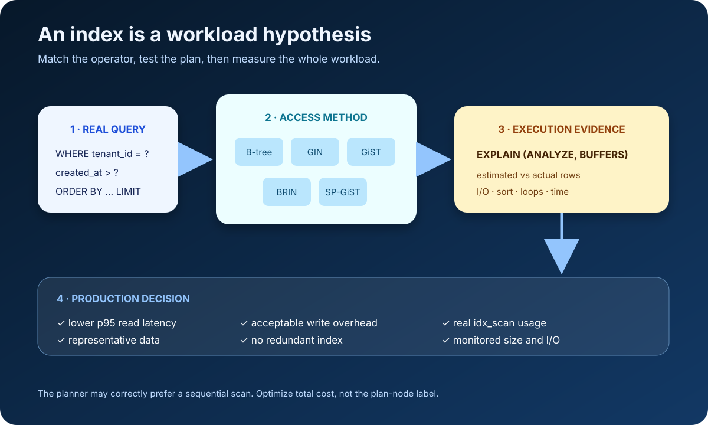

“Add an index” is incomplete advice. A useful PostgreSQL index must match:

- the operators in a real query;
- the order and selectivity of its predicates;
- any required ordering;
- the distribution and physical layout of production-like data; and
- the write, storage, and maintenance budget.

The planner is free to ignore an index when a sequential scan is cheaper. Your goal is not to force an index icon into `EXPLAIN`; it is to reduce total workload cost.



## Pick the access method from the operation

| Access method | Strong fit | Important limitation |
| --- | --- | --- |
| B-tree | Equality, ranges, ordered retrieval, many prefix searches | Default does not mean optimal for containment or arbitrary substring search |
| Hash | Simple equality | Narrower operator support than B-tree |
| GIN | Values with components: arrays, `jsonb`, full-text search | Updates can be more expensive; exact behavior depends on operator class |
| GiST | Extensible strategies, ranges, geometry, nearest-neighbor cases | Operator class defines what is indexable |
| SP-GiST | Partitioned search spaces such as tries, quadtrees, k-d trees | Specialized data distributions and operator classes |
| BRIN | Very large tables where values correlate with physical block order | Summarizes ranges; less precise than entry-per-row indexes |

The operator class connects an index to supported operators. Start from the query's `=`, `<`, `@>`, `&&`, `<->`, or text-search operation—not from the column's type alone.

## A workload-driven example

Suppose a multi-tenant application runs:

```sql
SELECT id, created_at, total_cents
FROM orders
WHERE tenant_id = 42
  AND status = 'paid'
  AND created_at >= now() - interval '30 days'
ORDER BY created_at DESC
LIMIT 50;
```

A sensible candidate is:

```sql
CREATE INDEX CONCURRENTLY idx_orders_tenant_status_created
ON orders (tenant_id, status, created_at DESC)
INCLUDE (total_cents);
```

Why this order?

1. Equality predicates on `tenant_id` and `status` narrow the searchable prefix.
2. `created_at` supports the range and requested ordering within that prefix.
3. `INCLUDE` makes `total_cents` available as a non-key payload, which may enable an index-only scan when visibility conditions permit.

Do not cargo-cult the order. If `status` has different workload behavior, if queries omit `tenant_id`, or if another ordering dominates, a different index may win.

## Verify with representative data

First refresh planner statistics:

```sql
ANALYZE orders;
```

Then inspect the real execution:

```sql
EXPLAIN (ANALYZE, BUFFERS, WAL, SETTINGS)
SELECT id, created_at, total_cents
FROM orders
WHERE tenant_id = 42
  AND status = 'paid'
  AND created_at >= now() - interval '30 days'
ORDER BY created_at DESC
LIMIT 50;
```

`ANALYZE` **executes** the statement. Use it carefully with writes and production workloads. For a read query, examine:

- estimated rows versus actual rows;
- scan type and index condition;
- rows removed by filters;
- shared buffer hits and reads;
- sort method and memory;
- planning and execution time;
- loops on nested plan nodes.

A large gap between estimated and actual rows suggests a statistics or correlation problem, not necessarily a missing index.

Small test tables are misleading. Reading one heap page sequentially can be cheaper than traversing an index. Test with representative row counts, value distributions, and cache state.

## Composite indexes and the left edge

For B-tree `(tenant_id, status, created_at)`, queries constraining the leading columns usually have the strongest opportunity to narrow the scan. A query on `created_at` alone may not benefit enough to use it.

Before creating both `(a, b)` and `(a)`, check whether the longer index already serves the important `a` workload. Redundant indexes consume disk and amplify every insert, update, and vacuum-related operation.

Column order should reflect actual predicate and ordering patterns—not a blanket “most selective first” slogan.

## Partial, expression, and covering indexes

### Partial index

If most queries target a stable subset:

```sql
CREATE INDEX CONCURRENTLY idx_orders_open_created
ON orders (tenant_id, created_at DESC)
WHERE status = 'open';
```

This can be smaller and cheaper than indexing all rows. The query predicate must imply the index predicate for the planner to use it.

### Expression index

For case-insensitive lookup:

```sql
CREATE INDEX CONCURRENTLY idx_users_lower_email
ON users (lower(email));

SELECT id FROM users WHERE lower(email) = lower($1);
```

The query expression must match. Also decide whether a uniqueness rule belongs in the database:

```sql
CREATE UNIQUE INDEX CONCURRENTLY uq_users_lower_email
ON users (lower(email));
```

### Covering index with `INCLUDE`

Included columns are not part of the search key, but can satisfy selected values from the index. Index-only scans still depend on PostgreSQL's visibility map; `INCLUDE` does not guarantee one. Wide payload columns can make the index expensive.

## JSON, arrays, text, and time-series data

```sql
-- jsonb containment
CREATE INDEX idx_events_payload_gin
ON events USING GIN (payload);

SELECT * FROM events
WHERE payload @> '{"type":"purchase"}';
```

GIN is designed for composite values and supports operator-class-specific strategies. For range or geometric queries, GiST or SP-GiST may be appropriate. For an append-heavy table ordered by time, a BRIN index can stay tiny while skipping block ranges:

```sql
CREATE INDEX idx_events_created_brin
ON events USING BRIN (created_at);
```

BRIN performs best when `created_at` correlates with physical row order. If timestamps are randomly distributed across blocks, the summaries cannot exclude much.

## Why PostgreSQL may choose a sequential scan

A sequential scan can be correct when:

- the query returns a large fraction of the table;
- the table is small;
- statistics predict low selectivity;
- the expression or operator does not match the index;
- a cast or collation changes the operation;
- random heap access costs more than reading the table;
- the required columns cause many heap visits.

Temporarily changing planner switches can be a diagnostic experiment, not a production fix. If disabling sequential scans reveals a slower index plan, the planner was protecting you.

## Production verification

Inspect cumulative usage:

```sql
SELECT
    schemaname,
    relname,
    indexrelname,
    idx_scan,
    last_idx_scan,
    pg_size_pretty(pg_relation_size(indexrelid)) AS index_size
FROM pg_stat_user_indexes
ORDER BY idx_scan ASC, pg_relation_size(indexrelid) DESC;
```

Before dropping a low-scan index, account for:

- uniqueness or constraint enforcement;
- statistics resets and server restarts;
- monthly or seasonal jobs;
- disaster-recovery and administrative queries;
- an index used rarely but essential to one latency-critical path.

Create large production indexes with operational planning. `CREATE INDEX CONCURRENTLY` reduces write blocking but takes more work, cannot run inside a transaction block, and can leave an invalid index after failure. Check the version-specific documentation and monitor progress.

## Index review checklist

- Capture the normalized query and representative parameters.
- Match predicates and ordering to an access method and operator class.
- Run `ANALYZE` and test on production-like data.
- Compare `EXPLAIN (ANALYZE, BUFFERS)` before and after.
- Measure insert/update/delete cost and index size.
- Check for overlapping indexes.
- Verify production use over a representative time window.
- Revisit the decision as data distribution and PostgreSQL versions change.

An index is a hypothesis about a workload. PostgreSQL gives you the tools to test that hypothesis; use them before and after deployment.

## Sources

- [Indexes — PostgreSQL 18 documentation](https://www.postgresql.org/docs/current/indexes.html)
- [Index types — PostgreSQL 18 documentation](https://www.postgresql.org/docs/current/indexes-types.html)
- [Multicolumn indexes — PostgreSQL 18 documentation](https://www.postgresql.org/docs/current/indexes-multicolumn.html)
- [Index-only scans and covering indexes — PostgreSQL 18 documentation](https://www.postgresql.org/docs/current/indexes-index-only-scans.html)
- [Examining index usage — PostgreSQL 18 documentation](https://www.postgresql.org/docs/current/indexes-examine.html)
- [Building indexes concurrently — PostgreSQL 18 documentation](https://www.postgresql.org/docs/current/sql-createindex.html#SQL-CREATEINDEX-CONCURRENTLY)
