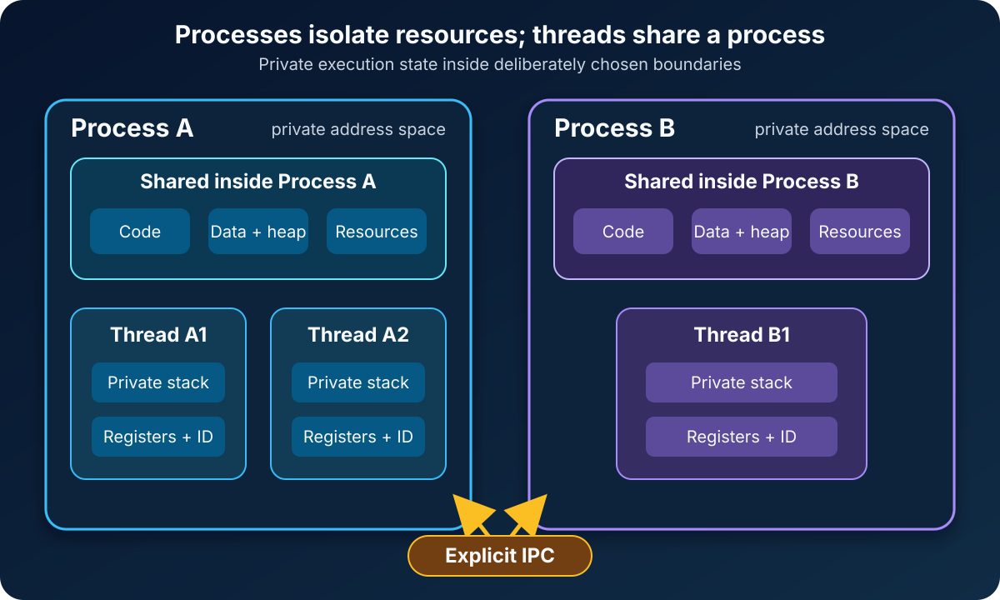

A web server becomes slow, so someone suggests adding more threads. Another person proposes splitting the work into separate processes. Both ideas sound like ways to “run more things at once,” yet they change the system in very different ways.

The difference is not simply that processes are heavy and threads are light. That shortcut hides the decision that matters most:

**A process gives running code its own resource boundary. A thread gives code another path of execution inside an existing boundary.**

Choose processes when isolation and independent ownership matter. Choose threads when tasks benefit from sharing memory and resources directly. In either case, the operating system schedules execution, and the application still has to coordinate work correctly.



That picture contains most of the answer. The rest is about understanding its consequences.

## A process is the container; a thread is the execution path

A program is a file containing instructions. A process is a running instance with the resources needed to execute those instructions.

On Windows, a process includes a virtual address space, executable code, handles to system objects, a security context, environment variables, and at least one thread. The [Microsoft process and thread documentation](https://learn.microsoft.com/en-us/windows/win32/procthread/about-processes-and-threads) then defines a thread as the entity within that process that can be scheduled for execution.

That distinction explains why a process with no thread would not do useful application work. The process owns the environment; its threads move through the code.

Every thread needs enough private state to pause and resume independently. This normally includes a thread ID, a stack, register state, and scheduling information. At the same time, threads in one process can see the process's code, heap, and other shared resources. The Linux [`pthreads(7)` manual](https://man7.org/linux/man-pages/man7/pthreads.7.html) makes the split concrete: POSIX threads share global memory, including data and heap segments, while each thread has its own stack.

The [POSIX.1-2024 definitions](https://pubs.opengroup.org/onlinepubs/9799919799/basedefs/V1_chap03.html) describe an address space as the memory locations a process or its threads can reference. They also define a thread ID as unique among the threads in a process during that thread's lifetime. These definitions are precise, but the practical mental model is simple:

- A process answers, “Which resources and memory belong together?”
- A thread answers, “Which sequence of instructions can the scheduler run?”

## What processes and threads share

Suppose an image-processing service receives four uploads.

With four worker threads in one process, all workers can read the same in-memory job queue and configuration. Passing a job may be as small as storing a reference in a synchronized queue. But a bad write through one reference can corrupt data another worker is using.

With four worker processes, each worker normally has its own virtual address space. One cannot casually dereference an object in another worker's heap. Jobs must cross an explicit boundary through a pipe, socket, message queue, shared-memory region, or another interprocess communication mechanism. That adds design and transfer costs, but it also makes ownership visible.

| Question | Separate processes | Threads in one process |
| --- | --- | --- |
| Address space | Normally private to each process | Shared within the process |
| Stack and register state | Private to each execution flow | Private to each thread |
| Data exchange | Requires explicit IPC or deliberately shared memory | Direct access to shared objects is possible |
| Failure containment | Usually stronger | A fatal process-wide failure affects all threads |
| Coordination risk | Protocol and IPC errors | Races, deadlocks, and unsafe shared mutation |
| Typical creation and switching cost | Usually higher | Usually lower, but measure the real workload |

“Normally private” matters. Process isolation is not a claim that processes can never share memory. POSIX [`mmap()`](https://pubs.opengroup.org/onlinepubs/9799919799/functions/mmap.html), for example, can map a shared memory object into multiple process address spaces. The difference is that this sharing must be established deliberately. Threads begin inside the same address space.

## The real tradeoff is isolation versus coordination

Threads make cooperation easy and safety difficult.

Imagine two threads updating the same counter:

```text
counter = counter + 1
```

That looks like one action in source code. At the machine level it may involve reading the old value, calculating a new value, and writing it back. If two threads interleave those steps, both can read `41`, both can calculate `42`, and one update disappears.

The usual remedies—mutexes, atomic operations, immutable data, message passing, or carefully partitioned ownership—do more than prevent a bug. They define who may change shared state and when other threads may observe the change.

Processes move the same design problem to an explicit boundary. A worker may receive a message, transform it, and return a result. The application must define serialization, timeouts, cancellation, backpressure, and what happens if a participant exits halfway through. There may be less accidental shared state, but there is more communication machinery.

Neither model removes coordination. It changes where coordination lives.

## Threads are scheduled, but concurrency is not guaranteed parallelism

Creating four threads does not promise that four instructions execute at the same instant.

On a single CPU core, the operating system can switch among runnable threads, letting each make progress over time. That is concurrency. On multiple cores, several threads may actually execute simultaneously. That is parallelism.

The same idea applies across processes because their threads are also schedulable entities. Microsoft notes that Windows can simultaneously execute as many threads as available processors permit, while preemptive multitasking creates the appearance of simultaneous execution when runnable work exceeds that capacity.

This is why “use more threads” is not a performance plan. More runnable work can improve throughput when tasks wait for I/O or when CPU work can be divided across cores. It can also add contention, cache pressure, memory for stacks, scheduling overhead, and harder debugging.

The useful question is not “How many threads can I create?” It is “What resource limits throughput, and how much independent work can usefully proceed?”

## Failure behaves differently at each boundary

Suppose one worker encounters malformed input.

If that worker is a separate process and exits, a supervisor can often restart it while other processes continue. The operating system's memory protection also makes an ordinary write in that worker less likely to overwrite another process's private memory.

If the worker is a thread, an unhandled process-terminating fault can end the entire process, including its other threads. Even without a crash, one thread can corrupt shared state, hold a lock forever, or exhaust a process-wide resource.

Processes therefore provide a useful fault-containment boundary, but not an invincibility shield. Processes may share files, databases, memory, credentials, or external dependencies. One process can still damage shared durable state or overwhelm a service used by its neighbors. Containers also do not change the basic distinction: a container commonly contains one or more processes, and each process may contain multiple threads.

Isolation is strongest when the architecture limits shared dependencies as well as shared memory.

## When threads are the better fit

Threads are a natural choice when work belongs to one application instance and frequently uses the same in-memory state.

A desktop application might keep the interface responsive while a worker thread performs computation. A server runtime may use a managed thread pool to process many independent requests. A numerical program may divide a large calculation into partitions that read the same immutable dataset.

Threads work especially well when:

- shared access is intentional and can be kept disciplined;
- tasks need low-friction communication;
- the language runtime and libraries have a well-understood threading model;
- one process-wide lifecycle and security context are appropriate; and
- measurement shows useful concurrency or parallelism.

Prefer bounded pools or runtime-managed executors over creating a new operating-system thread for every tiny task. A queue makes overload visible; unbounded thread creation merely converts overload into memory and scheduling pressure.

## When separate processes are the better fit

Processes are attractive when boundaries matter more than the cheapest possible handoff.

A browser can isolate sites or components so one failure has a smaller blast radius. A build system can run untrusted or failure-prone tools in supervised workers. A service can use multiple processes to use CPU cores while avoiding shared mutable language-runtime state. Separately deployed services go further by adding network and operational boundaries.

Processes fit when:

- work should fail, restart, or be terminated independently;
- memory or security isolation is valuable;
- components have different dependencies or runtimes;
- communication can use a clear, versioned contract; or
- operational ownership is genuinely separate.

The price is real. IPC can require copying or serialization, requests can time out, partial failures become visible, and deployment or observability may become more complicated. A process boundary should buy something worth paying for.

## Common mistakes that blur the model

The first mistake is treating `async` as a synonym for “new thread.” An asynchronous function can suspend without occupying a thread while it waits, then resume later on an execution context chosen by the runtime. Read [JavaScript Event Loop: Tasks, Microtasks, and Rendering](/posts/javascript-event-loop-tasks-microtasks-rendering/) for a single-threaded event-loop example, or [Swift Concurrency: async/await, Tasks, and Actors Explained](/posts/swift-concurrency-async-await-tasks-actors/) for a runtime-managed model.

The second is assuming threads are always faster. Creation and context switching are only part of the cost. Lock contention, cache behavior, memory allocation, IPC payload size, and workload shape can dominate. Benchmark the complete operation under realistic load.

The third is assuming process boundaries automatically make a design safe. Shared databases, files, and APIs still need authorization, consistency rules, quotas, and failure handling.

The fourth is choosing a mechanism before choosing an ownership model. If nobody can explain who owns a piece of mutable state, neither a mutex nor a message broker will rescue the design.

## A practical decision checklist

Before choosing, ask:

1. What data must be shared, and can it be immutable or partitioned?
2. Should one unit be able to crash or restart without ending the others?
3. Is communication frequent and fine-grained, or coarse and message-shaped?
4. Does the runtime actually execute this work on multiple operating-system threads?
5. Is the workload waiting on I/O, consuming CPU, or blocked on contention?
6. What limits the number of workers under load?
7. How will cancellation, shutdown, timeouts, and partial failure work?
8. What evidence will show that the chosen model improved the system?

These questions connect the low-level concept to [software architecture](/posts/software-architecture-beginners-guide/). A thread is not merely a performance tool, and a process is not merely a heavier thread. Each creates a different boundary for memory, failure, security, and ownership.

The concise takeaway is this: **threads share by default and therefore demand synchronization; processes isolate by default and therefore demand communication.** Start with the boundary your correctness and failure model needs. Then measure whether its performance is good enough.

## Sources

- [The Open Group: POSIX.1-2024 Definitions](https://pubs.opengroup.org/onlinepubs/9799919799/basedefs/V1_chap03.html)
- [Microsoft Learn: About Processes and Threads](https://learn.microsoft.com/en-us/windows/win32/procthread/about-processes-and-threads)
- [Linux man-pages: pthreads(7)](https://man7.org/linux/man-pages/man7/pthreads.7.html)
- [The Open Group: POSIX.1-2024 mmap()](https://pubs.opengroup.org/onlinepubs/9799919799/functions/mmap.html)
