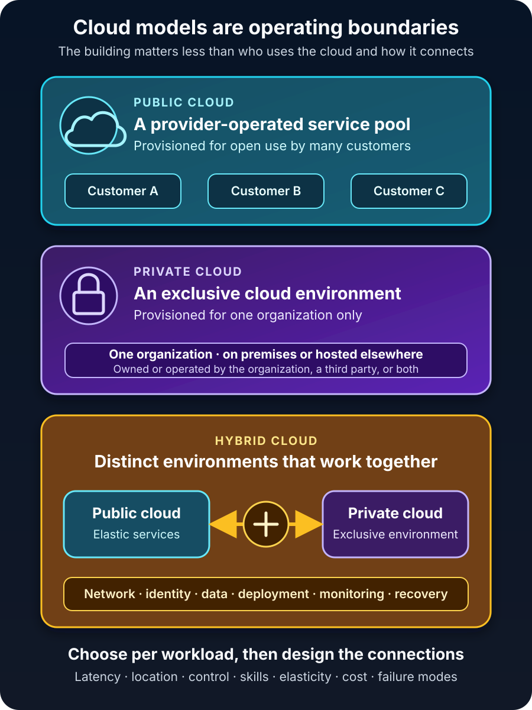

A company is preparing to move an order system out of an aging server room. One proposal says public cloud because it is fast to provision. Another says private cloud because the data is sensitive. A third says hybrid cloud so the company can have the best of both.

All three suggestions sound reasonable. None is a decision yet.

The useful distinction is not that public cloud is “outside,” private cloud is “inside,” and hybrid cloud is somewhere between them. It is this: **public, private, and hybrid cloud describe who a cloud environment is provisioned for and how separate environments work together.**

A public cloud offers pooled services for open use. A private cloud is reserved for one organization. A hybrid cloud connects distinct environments so applications or data can operate across them. Each model changes who owns capacity, which controls are available, what the team must operate, and where failures can appear.

That makes the choice a workload decision, not a contest between three labels.

## Start with the boundaries, not the buildings

The [NIST definition of cloud computing](https://csrc.nist.gov/pubs/sp/800/145/final) identifies four deployment models: public, private, community, and hybrid. Public cloud infrastructure is provisioned for open use. Private cloud infrastructure is provisioned exclusively for one organization and may exist on or off its premises. Hybrid cloud combines distinct cloud infrastructures that remain separate but are connected in a way that enables data or application portability.

Those definitions correct two common assumptions.

First, **private cloud does not have to sit in your own building**. A third party can own or operate it, and it can be hosted off premises. Exclusivity is the defining boundary.

Second, **hybrid cloud is more than owning servers while also having a cloud account**. The environments need a working relationship: network paths, identity, data movement, deployment processes, or coordinated operations.

The picture below makes those boundaries visible.

## Public vs private vs hybrid cloud at a glance

| Model | Defining boundary | Main advantage | Main operational burden | Strong fit when |
| --- | --- | --- | --- | --- |
| Public cloud | Services are offered for open use on provider-operated infrastructure | Fast access to elastic, managed capabilities without buying the physical base | Provider-specific configuration, cost control, governance, and shared responsibility | Demand changes, rapid provisioning matters, or managed services remove low-value platform work |
| Private cloud | Cloud infrastructure is dedicated to one organization | Exclusive capacity and deeper control over the environment | The organization pays for reserved capacity and retains more engineering and lifecycle work | A workload has justified isolation, hardware, locality, or control requirements |
| Hybrid cloud | Distinct private, public, or community environments are integrated | Each workload or component can run where its constraints are best met | Networking, identity, observability, data consistency, and recovery cross boundaries | Some systems must stay local while others benefit from public cloud services |

These are deployment models, not service models. Public and private clouds can expose infrastructure or platforms. The service model describes *what you consume*; the deployment model describes *for whom the environment is provisioned and how it relates to others*.

## Public cloud trades physical ownership for a service boundary

In a public cloud, a provider operates the datacenters and resource pools, while customers provision services through consoles, APIs, and automation. Customers share the provider platform, but access controls and logical isolation separate their resources.

For the order system, public cloud could mean deploying the web application to a managed runtime, using a managed database, and scaling application instances when demand rises. The team avoids purchasing hosts for an uncertain peak and can reach services that would take time to build internally.

The benefit is not simply “someone else’s computer.” It is access to an operating model built around on-demand provisioning, elasticity, resource pooling, network access, and measured usage. [Google Cloud's overview of deployment models](https://cloud.google.com/discover/types-of-cloud-computing) describes public cloud resources as provider-owned services delivered over a network.

But the provider does not own the outcome. Your team still decides who can access data, how applications are configured, whether backups meet recovery objectives, which regions are acceptable, and how spending is controlled. Public cloud replaces physical infrastructure work with service configuration, governance, and vendor management. It does not remove operations.

Public cloud is a strong default when variable demand or managed capabilities matter and no constraint requires dedicated infrastructure. It is a poor fit when a service cannot satisfy a real requirement for latency, disconnected operation, data location, specialized hardware, or control.

The word *real* matters. “The data is sensitive” is not yet a deployment requirement. Data classification, required controls, permitted locations, recovery targets, and applicable rules are requirements. They can be tested against an actual service.

## Private cloud buys exclusivity—and assigns someone the work

A private cloud serves one organization. That organization may own it, hire a third party to operate it, or use dedicated infrastructure hosted elsewhere.

Exclusivity can support custom hardware, predictable local performance, disconnected operation, or controls a public service does not expose. It can also make sense when an organization already has facilities and the staff to run them.

Yet a private cloud is not automatically a conventional virtualized datacenter with a new name. Under the NIST model, cloud computing still includes characteristics such as on-demand self-service, pooled resources, elasticity, and measured service. If every resource request waits for a manual ticket and capacity cannot be allocated or released through automation, the environment may be well-managed virtualization without providing a cloud operating model.

For the order system, a private cloud might keep a factory database close to production equipment that cannot tolerate a wide-area network dependency. The company gains direct control over the hardware, network, maintenance windows, and physical location.

It also inherits the capacity problem. Someone must purchase equipment, maintain headroom, patch the platform, replace hardware, secure the facility, test backups, and plan refreshes. Exclusive does not mean safer by default; your organization retains more responsibility for making it safe.

## Hybrid cloud is an integration architecture

Suppose the order system's customer-facing API can run in public cloud, but the factory database and control software must remain local. The API still needs inventory data. Identity must work in both places. Operators need one incident view. A failure in the link between them must not corrupt orders.

Now the company has a hybrid architecture.

[AWS's hybrid connectivity guidance](https://docs.aws.amazon.com/whitepapers/latest/hybrid-connectivity/hybrid-connectivity.html) calls the shared network between on-premises and cloud resources a hybrid network and recommends evaluating security, performance, reliability, scalability, and communication patterns when choosing connectivity. [Azure's hybrid architecture guidance](https://learn.microsoft.com/en-us/azure/architecture/guide/technology-choices/hybrid-considerations) similarly asks teams to consider hardware, hosting, deployment, application constraints, operations, and compliance.

The connection can be a VPN, dedicated private link, or another supported network design. That wire is only the beginning. A useful hybrid design answers at least four questions:

- **Identity:** How do people and workloads authenticate, and where is access revoked?
- **Data:** Which system owns each record, how does data move, and what happens during a partition?
- **Operations:** Can teams deploy, monitor, patch, and audit both environments consistently?
- **Recovery:** Which functions continue if the private site, public region, or connecting network fails?

Hybrid cloud can support phased migration, local processing, data-location constraints, edge workloads, or a deliberate split between stable and elastic systems. It can also multiply tools, skills, and failure modes. Choose it because the split solves a documented constraint—not because “best of both worlds” sounds safe.

Hybrid cloud is also not identical to multicloud. Multicloud means using services from more than one cloud provider. Hybrid describes distinct environments working together, commonly private or on-premises infrastructure plus public cloud. A system can be multicloud without a private environment, and a hybrid system can use only one public provider. [Google Cloud's hybrid-cloud guidance](https://cloud.google.com/learn/what-is-hybrid-cloud) makes the same distinction and emphasizes the integration, orchestration, and coordination required across environments.

## Security follows responsibility, not the deployment label

“Private is secure; public is risky” is too simple to guide an architecture.

A public provider can invest heavily in physical security, hardware lifecycle, and managed security capabilities. A customer can still expose data through a bad permission or an unprotected credential. A private environment gives an organization more control, but it may also leave that organization responsible for aging hardware, delayed patches, incomplete monitoring, and facility security.

[Microsoft's shared-responsibility guidance](https://learn.microsoft.com/en-us/azure/security/fundamentals/shared-responsibility) states that customers retain responsibility for their data, identities, accounts, access management, and the components they control. The provider takes responsibility for the underlying physical cloud infrastructure; the exact dividing line changes with IaaS, PaaS, and SaaS.

In hybrid cloud, both responsibility models coexist. The team must secure the local stack, configure public services correctly, and protect the boundary between them. A single identity system and consistent policy can reduce gaps, but consistency must be designed. [AWS's hybrid architecture tenets](https://docs.aws.amazon.com/whitepapers/latest/hybrid-cloud-with-aws/hybrid-architecture-tenets.html) highlights unified provisioning, monitoring, management, and security as recurring goals.

Security therefore starts with assets, threats, controls, and accountable owners. Deployment model comes after those facts.

## Cost is a shape, not a single number

Public cloud turns much infrastructure spending into metered services and commitments. That can align cost with demand, but unused resources, data transfer, and uncontrolled growth can make bills unpredictable.

Private cloud concentrates cost in equipment, facilities, capacity headroom, and staff. An idle server still consumes capital, space, power, and attention. Private infrastructure may suit steady workloads at sufficient scale; it is not automatically cheaper because it avoids a public-cloud invoice.

Hybrid cloud pays for both environments plus the bridge: connectivity, duplicated tooling, integration, data movement, cross-platform expertise, and recovery testing. It earns that premium only when placing different workload parts in different environments creates greater value.

Compare total cost over a realistic period. Include people, licensing, support, migration, downtime risk, backup, security, network transfer, unused capacity, and eventual exit—not merely a virtual machine's hourly rate.

## How to choose without guessing

Return to the order system and ask questions that can produce evidence:

1. **What must stay close to users, equipment, or data?** State the latency, connectivity, and location constraints precisely.
2. **Which controls are mandatory?** Map regulations and internal policy to technical controls instead of assuming one model is compliant.
3. **How variable is demand?** Measure ordinary, peak, and growth scenarios, and decide how much idle capacity the organization can justify.
4. **Which layers can the team operate well?** Control is valuable only when skills, staffing, patching, observability, and incident response support it.
5. **What can fail independently?** Model loss of a site, cloud region, identity provider, and hybrid link. Define recovery objectives before buying redundancy.
6. **How will data leave?** Test exports, interfaces, backup restoration, and portability for the parts that matter.

The answer may differ by component. The web front end could belong in public cloud, the factory control loop in a private environment, and asynchronous events could cross the boundary. That is more precise than declaring the entire company “hybrid.”

## Common mistakes

The first mistake is choosing a model from a slogan: public for savings, private for security, or hybrid for flexibility. Each claim is conditional.

The second is calling any on-premises server a private cloud. Location alone does not create self-service, elasticity, pooling, or measured consumption.

The third is treating hybrid as a temporary cable. If applications depend on both sides, identity, observability, data ownership, failure handling, and recovery become permanent architecture concerns.

The fourth is designing for portability without testing it. Containers and common APIs can help, but data gravity, managed-service behavior, identity, networking, and operating procedures can still bind a workload to an environment.

The fifth is making one deployment decision for every workload. A customer portal, a factory controller, an analytics job, and an archive have different constraints. Evaluate them separately, then design how they interact.

## The takeaway

Public cloud gives organizations on-demand access to provider-operated, shared infrastructure and services. Private cloud reserves a cloud environment for one organization, whether it runs on premises or elsewhere. Hybrid cloud integrates distinct environments so workloads and data can operate across them.

None is universally fastest, cheapest, or safest. Public cloud shifts more physical responsibility to a provider. Private cloud preserves exclusivity and control while retaining more operational work. Hybrid cloud gives placement flexibility and charges for it in integration complexity.

Choose the simplest deployment model that satisfies the workload's measured constraints. If a requirement cannot be named, tested, and assigned to an owner, it is not yet a reason to build another cloud.

## Continue learning

- [What Is Cloud Computing? A Beginner's Guide](/posts/what-is-cloud-computing/)
- [IaaS vs PaaS vs SaaS: Cloud Service Models Explained](/posts/iaas-vs-paas-vs-saas/)
- [What Is Load Balancing and How Does It Work?](/posts/what-is-load-balancing/)
- [Zero Trust Explained with Real-World Examples](/posts/zero-trust-explained-real-world-examples/)

## Sources

- [NIST SP 800-145: The NIST Definition of Cloud Computing](https://csrc.nist.gov/pubs/sp/800/145/final)
- [Google Cloud: Types of Cloud Computing](https://cloud.google.com/discover/types-of-cloud-computing)
- [Google Cloud: What Is a Hybrid Cloud?](https://cloud.google.com/learn/what-is-hybrid-cloud)
- [AWS: Hybrid Connectivity](https://docs.aws.amazon.com/whitepapers/latest/hybrid-connectivity/hybrid-connectivity.html)
- [AWS: Hybrid Architecture Tenets](https://docs.aws.amazon.com/whitepapers/latest/hybrid-cloud-with-aws/hybrid-architecture-tenets.html)
- [Microsoft Azure: Hybrid Architecture Considerations](https://learn.microsoft.com/en-us/azure/architecture/guide/technology-choices/hybrid-considerations)
- [Microsoft Azure: Shared Responsibility in the Cloud](https://learn.microsoft.com/en-us/azure/security/fundamentals/shared-responsibility)
