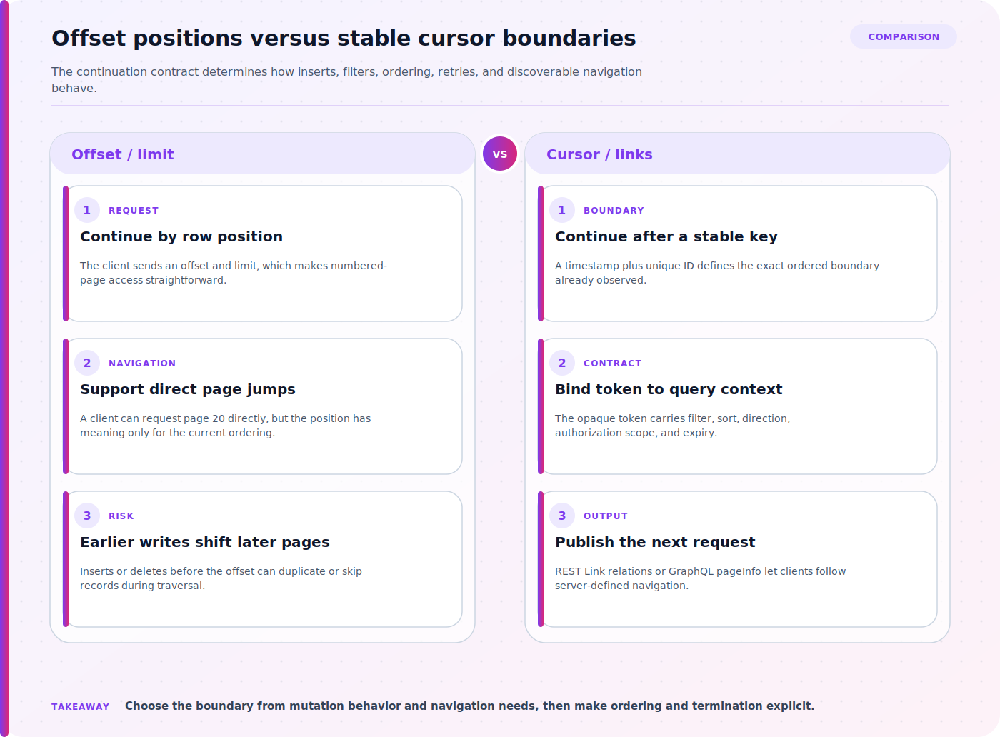

Pagination is an API consistency contract, not merely a way to limit response size. A client needs to know how to request the next segment, which ordering is stable, whether inserts or deletes can create gaps or duplicates, and when traversal is complete. Offset, cursor, and link-based interfaces expose different parts of that contract, and the appropriate choice depends on dataset change rate, navigation needs, and what the backend can order reliably.

## A working model for REST and GraphQL Pagination: Offset, Cursor, and Link Strategies

Define the workload: the collection's stable sort fields, uniqueness tie-breaker, maximum page size, authorization boundary, and expected mutation rate while a client traverses results. Decide whether users need random page jumps or only forward and backward traversal. Specify how filters and sort parameters bind to a continuation token, what an expired or malformed token returns, and whether total counts are exact, approximate, or omitted.

## Apply the model to a concrete case

Consider an audit-event API ordered by occurred_at descending and id descending. An offset request for page three can drift if newer events arrive before the client requests it. A cursor can encode the last event's timestamp and unique id, plus a protected representation of the filter and direction, so the next query continues strictly after that boundary. The REST response can expose the next request through a Link relation, while a GraphQL connection can publish an end cursor and hasNextPage. Neither interface automatically creates snapshot consistency: if an existing event's sort value changes or authorization removes an item, the contract must say what clients can observe. The opaque token also needs validation and expiry behavior.

## Source boundaries for software engineering

### Using pagination in the REST API

Use Using pagination in the REST API for this boundary of the topic: Use GitHub REST pagination behavior to explain page sizing, traversal, and response links in a concrete production API.
### Using pagination in the GraphQL API

Use Using pagination in the GraphQL API for this boundary of the topic: Use GitHub GraphQL pagination for cursor concepts, first or last limits, and pageInfo traversal state.
### REST API best practices

Use REST API best practices for this boundary of the topic: Use the REST best-practices reference for Link-header following, serial requests, conditional requests, and safe client behavior.

## Reason through rest graphql pagination offset cursor link strategies

The diagram places the three decisions in implementation order: first decide whether positional drift is acceptable, then define a stable continuation boundary, and finally expose navigation that clients can follow safely. The sections below unpack each boundary and show where an apparently simple pagination API becomes inconsistent.



### 1. Use offset only with explicit drift expectations

Offset and limit are easy to understand and can support page-number navigation, but positions shift when earlier rows are inserted or removed. Under a changing dataset, a client can receive a duplicate or skip an item between requests. Make the ordering deterministic with a unique tie-breaker, cap requested size, and state whether consistency across the full traversal is provided. Offset can remain reasonable for small or relatively stable collections where random access is a real requirement.
### 2. Bind cursors to a stable ordering boundary

A cursor should represent the continuation boundary for a specific ordering and filter set rather than expose an editable database offset. Keyset-style traversal can continue after the last seen sort key and unique identifier, reducing positional drift as earlier records change. Treat the token as opaque to clients, validate its scope and direction, and define expiry. If sort values themselves can change, explain the resulting consistency behavior instead of promising a snapshot that the service does not create.
### 3. Make navigation discoverable and retry-safe

REST responses can publish next, previous, first, or last navigation through links so clients do not construct URLs from undocumented assumptions. GraphQL connections commonly return edge cursors and page information beside nodes. Preserve filters and ordering in every continuation, and ensure authorization is re-evaluated on each request. For retryable clients, return a deterministic order and make the terminal condition unambiguous so a transient failure does not restart the collection silently.

## Worked code example

### Return an opaque continuation contract

```json
{
  "items": [
    {
      "id": "evt_1042",
      "occurred_at": "2026-07-20T08:30:00Z"
    }
  ],
  "page": {
    "next_cursor": "opaque-signed-token",
    "has_more": true
  }
}
```

Clients receive a continuation token without depending on its storage representation. The server binds that token to the original ordering, filters, direction, authorization scope, and expiry policy.

## REST and GraphQL Pagination: Offset, Cursor, and Link Strategies: decisions and tradeoffs

| Situation or decision | Tradeoff or common failure mode | Validation question |
| --- | --- | --- |
| Items repeat or disappear between offset pages | Rows before the current offset changed between requests | Measure collection churn and evaluate cursor traversal over a unique deterministic ordering |
| Two records share a sort value and page order changes | The ordering lacks a unique tie-breaker | Append an immutable unique key to the order and encode the complete boundary in the cursor |
| A continuation token works with different filters | Token scope is not bound to the original query contract | Validate filter, sort, direction, authorization scope, and expiry when decoding the token |

## Common mistakes in software engineering

Encoding a raw database offset in something called a cursor preserves the drift problem while making the contract harder to inspect. Ordering only by a non-unique timestamp allows records with equal values to move across page boundaries. Letting clients edit decoded token fields can change filters or tenant scope unless the server validates integrity and authorization again. Returning an exact total count on every request may add substantial work that the user experience does not need. Clients also fail when they build the next URL manually and discard server-provided links, caps, or cursors. Test continuation as a protocol across mutation and retry, not as one successful database query.

## Practical implementation checklist

1. Define a deterministic order with a unique tie-breaker before selecting pagination mechanics.
2. Document mutation behavior, token expiry, invalid-token errors, and the traversal completion signal.
3. Cap page size and preserve filters, ordering, and authorization on every continuation request.
4. Test inserts, deletes, equal sort values, retry after failure, and permission changes between pages.
5. Avoid promising exact total counts or snapshot consistency unless the backend contract actually provides them.

## Related implementation context

[Understanding HTTP Status Codes: What They Mean and How to Use Them](/posts/http-status-codes/) and [Copilot Code Review Customization and Configurability Improvements: Practical Guide and Real-World Examples](/posts/copilot-code-review-customization-and-configurability-improvements/)

## Version and verification boundary

The comparison uses current GitHub REST and GraphQL pagination documentation as concrete contracts; other APIs may expose different link relations, cursor formats, limits, and consistency guarantees.

## Summary

A pagination design is stable when ordering, continuation, mutation behavior, authorization, and termination are explicit. Use offset for workloads that accept positional drift, cursors for boundary-based traversal, and discoverable links or page information so clients follow the server's contract.

## Sources

- [Using pagination in the REST API](https://docs.github.com/en/rest/using-the-rest-api/using-pagination-in-the-rest-api)
- [Using pagination in the GraphQL API](https://docs.github.com/en/graphql/guides/using-pagination-in-the-graphql-api)
- [REST API best practices](https://docs.github.com/en/rest/using-the-rest-api/best-practices-for-using-the-rest-api)
