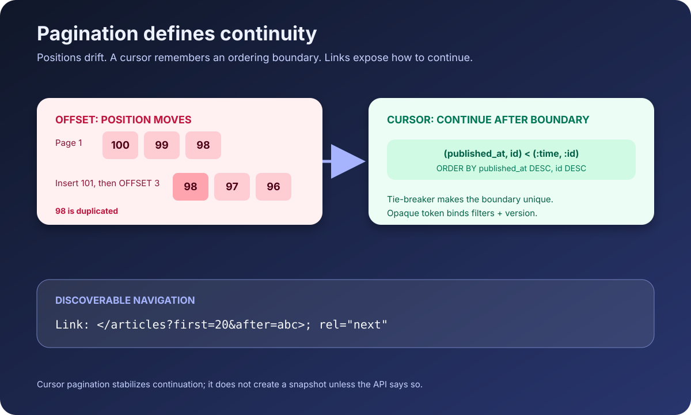

Pagination is a consistency contract disguised as a performance feature. Splitting 100,000 records into pages is easy; defining what “the next page” means while records are inserted, deleted, or reordered is the real design work.

Choose a strategy from the user experience and data model:

- **Offset** for simple, bounded, mostly stable lists and direct page numbers.
- **Cursor/keyset** for large or rapidly changing ordered feeds.
- **Links** to make navigation discoverable and decouple clients from URL construction.
- **GraphQL connections** when the schema should expose edges, cursors, and page metadata consistently.



## Offset pagination: simple but position-dependent

```http
GET /articles?limit=20&offset=40
```

```sql
SELECT id, published_at, title
FROM articles
ORDER BY published_at DESC, id DESC
LIMIT 20 OFFSET 40;
```

Offset is readable and supports “jump to page 7.” It has two costs:

1. The database may still need to walk or discard earlier rows for deep offsets.
2. Positions drift when rows change between requests.

Imagine descending IDs:

```text
Page 1: 100 99 98
```

A new record `101` is inserted before the client requests `OFFSET 3`:

```text
Current order: 101 100 99 98 ...
Page 2:              98 97 96
```

The client sees `98` twice. Deletions can make a record disappear between pages. Offset is not wrong; it simply defines pages by current positions rather than stable boundaries.

## Cursor pagination: continue after a boundary

A cursor represents the last ordering position already delivered:

```http
GET /articles?first=20&after=eyJwdWJsaXNoZWRfYXQiOiIuLi4iLCJpZCI6OTg...
```

For ordering `(published_at DESC, id DESC)`, the next query uses both fields:

```sql
SELECT id, published_at, title
FROM articles
WHERE (published_at, id) < ($1, $2)
ORDER BY published_at DESC, id DESC
LIMIT 21;
```

Fetch `limit + 1` rows. Return only `limit`; the extra row tells you whether `has_next_page` is true without a full count.

The `id` tie-breaker is essential. Timestamps are not guaranteed unique, so a cursor containing only `published_at` can skip or duplicate records with equal timestamps.

## Treat cursors as opaque API tokens

Clients should store and return a cursor, not parse or modify it. A cursor payload might contain:

```json
{
  "version": 1,
  "published_at": "2026-07-21T08:30:00Z",
  "id": 9821,
  "filter_hash": "sha256:..."
}
```

Encode and authenticate the payload—commonly with URL-safe base64 plus an HMAC or authenticated encryption. Base64 alone prevents neither tampering nor information disclosure.

Binding the cursor to filters and sort order avoids mistakes such as reusing a “published articles” cursor with a new query for drafts. Version the payload so the server can reject or migrate old formats deliberately.

```python
def page_articles(*, first: int, after: str | None, status: str):
    limit = min(max(first, 1), 100)
    boundary = decode_and_verify(after, expected_filter={"status": status})

    rows = repository.fetch_after(
        status=status,
        published_at=boundary.published_at if boundary else None,
        article_id=boundary.id if boundary else None,
        limit=limit + 1,
    )

    has_next = len(rows) > limit
    page = rows[:limit]
    end_cursor = encode_cursor(page[-1], status=status) if page else None

    return {
        "items": page,
        "page_info": {
            "has_next_page": has_next,
            "end_cursor": end_cursor,
        },
    }
```

Validate maximum page size server-side. A cursor must not become a way to bypass authorization or inject query fragments.

## What cursors do—and do not—stabilize

A keyset cursor prevents newly inserted records *before* the boundary from shifting later pages. It does not create a database snapshot across multiple HTTP requests.

If an already-seen record's sort key changes so it moves beyond the boundary, it may appear again. If an unseen record moves before the boundary, it may be missed. For a fully frozen export, use a snapshot identifier, an immutable dataset version, or a server-side export job.

Document which contract you offer:

- **Live traversal:** reflects changes, with boundary-based continuity.
- **Snapshot traversal:** all pages come from one logical version.
- **Best effort:** duplicates or omissions are acceptable and clients should deduplicate.

## REST navigation should be discoverable

RFC 8288 defines typed links between resources. A REST response can expose navigation in the `Link` header:

```http
Link: </articles?first=20&after=abc>; rel="next",
      </articles?first=20&before=xyz>; rel="prev"
```

Or use links in the representation:

```json
{
  "items": [],
  "links": {
    "next": "/articles?first=20&after=abc",
    "prev": null
  },
  "page_info": {
    "has_next_page": true
  }
}
```

Clients should follow the supplied link rather than reconstructing server URLs. That lets the server change cursor syntax or add parameters without breaking traversal.

Do not rely on parsing GitHub-style `Link` URLs to invent page numbers when the documentation says to use the link relations. The next URL is authoritative.

## GraphQL connection design

The Relay Cursor Connections specification defines a familiar shape:

```graphql
type ArticleConnection {
  edges: [ArticleEdge!]!
  pageInfo: PageInfo!
}

type ArticleEdge {
  node: Article!
  cursor: String!
}

type PageInfo {
  hasNextPage: Boolean!
  hasPreviousPage: Boolean!
  startCursor: String
  endCursor: String
}
```

A query requests a bounded slice:

```graphql
query LatestArticles($first: Int!, $after: String) {
  articles(first: $first, after: $after) {
    edges {
      cursor
      node { id title publishedAt }
    }
    pageInfo {
      hasNextPage
      endCursor
    }
  }
}
```

Use `edges` when relationship metadata matters—for example, a member's role in an organization. Exposing `nodes` as a convenience can reduce nesting, but page cursors still need a defined home.

Backward pagination (`last`/`before`) is not just forward SQL with names reversed. Implement and test ordering reversal carefully so the response remains in the documented order.

## Counts, retries, and errors

### Total counts

An exact `totalCount` may require an expensive count and can change before the next page. Return it only when the product needs it and the cost is acceptable. Alternatives include estimates, a separately cached count, or no count.

### Retries

A page request should be safe to retry. The same cursor and filters should describe the same boundary, even if a live dataset produces a slightly different page after mutation. Avoid one-time cursors unless stateful traversal is an explicit contract.

### Invalid cursors

Return a clear client error for malformed, tampered, expired, filter-mismatched, or unsupported-version cursors. Do not silently restart at page one; that creates duplicates that look like valid data.

## Test the contract under mutation

Automated tests should:

- insert a new first record between page requests;
- delete a previously delivered record;
- create several records with the same primary sort value;
- change a record's sort field;
- retry the same cursor;
- switch filters while reusing a cursor;
- tamper with a cursor;
- request zero, negative, and excessive page sizes;
- traverse forward and backward to the boundary.

Choose offset when its simplicity matches the experience. Choose keyset cursors when stable continuation and deep-page performance matter. In both cases, make ordering unique, navigation explicit, and mutation semantics part of the public API.

## Sources

- [Web Linking — RFC 8288](https://www.rfc-editor.org/rfc/rfc8288.html)
- [GraphQL Cursor Connections Specification — Relay](https://relay.dev/graphql/connections.htm)
- [Pagination — GraphQL documentation](https://graphql.org/learn/pagination/)
- [Using pagination in the REST API — GitHub Docs](https://docs.github.com/en/rest/using-the-rest-api/using-pagination-in-the-rest-api)
- [Using pagination in the GraphQL API — GitHub Docs](https://docs.github.com/en/graphql/guides/using-pagination-in-the-graphql-api)
