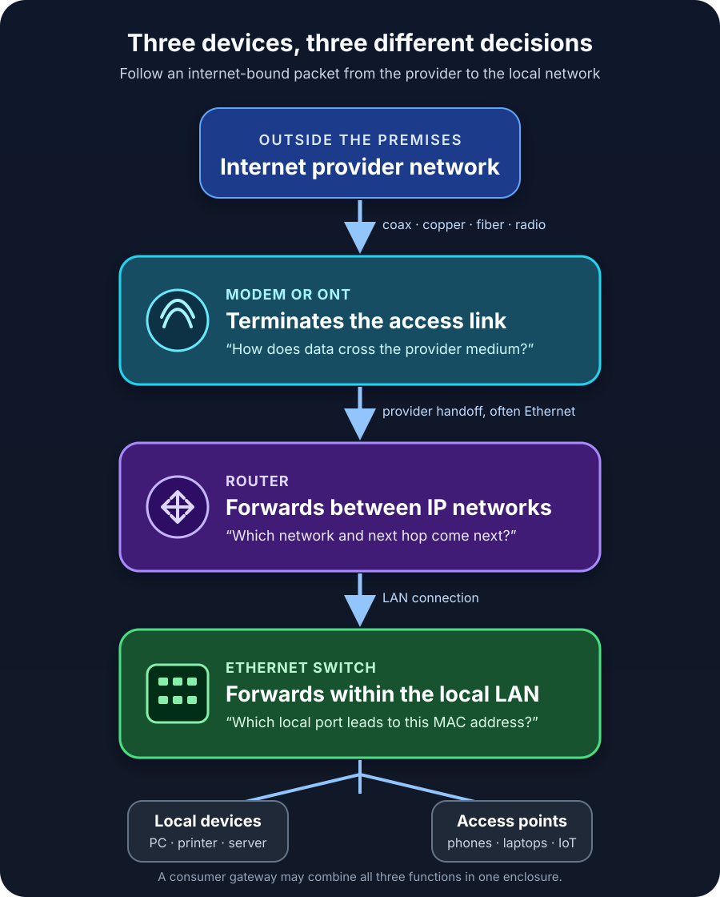

The internet stops working, so you walk toward the shelf with the blinking boxes.

One has a coaxial cable. Another has antennas. A third is mostly Ethernet ports. Or perhaps there is only one box, supplied by the internet provider, doing everything behind a single row of lights.

Which device is the problem? More importantly, what does each device actually do?

The short answer is simple: **a modem or optical terminal connects your premises to the provider's access network, a router moves IP packets between networks, and a switch connects devices within a local Ethernet network.**

Those are three different jobs. The confusion exists because consumer hardware often combines two or all three inside one enclosure.

## Three devices, three decisions

Imagine downloading a file on a desktop computer connected by Ethernet.

The switch first carries the desktop's Ethernet frame toward the correct local port: the one leading to the router. The router examines the destination IP address and decides that the packet belongs outside the local network. It forwards the packet through its internet-facing connection. The modem, optical network terminal, or other access device then carries that traffic across the particular medium used by the provider.

Each device answers a different question:

- **Modem or ONT:** How does data cross this provider access link?
- **Router:** Which network should this IP packet enter next?
- **Switch:** Which local Ethernet port should receive this frame?

That distinction is more useful than memorizing which box has antennas. Ports, radios, and provider branding vary. The forwarding job is the stable part.

## A modem terminates the provider connection

The word *modem* comes from *modulator-demodulator*. Historically, it described equipment that converted digital information into signals suitable for another medium and recovered digital information at the other end.

In modern broadband, the exact access device depends on the service:

- Cable internet normally uses a cable modem on a DOCSIS network.
- DSL service uses a DSL modem over a telephone line.
- Fiber service usually uses an optical network terminal, or ONT, rather than a device technically called a modem.
- Fixed wireless and cellular services use their own radio equipment, sometimes integrated into a gateway.

CableLabs defines a cable modem as subscriber equipment that conveys data over a cable television system. The matching cable modem termination system lives at the operator's headend or distribution hub. The modem therefore is not simply “the box that gives you Wi-Fi.” Its defining role is facing the provider's access technology.

A standalone modem commonly presents an Ethernet handoff to a router. It may authenticate or register with the provider, establish the physical and link-layer connection, and expose status such as signal levels. By itself, however, a basic modem does not have to create a useful multi-device home network.

Fiber makes the terminology clearer. Broadband Forum material describes a common two-box arrangement in which the ONT terminates the passive optical network while a separate residential gateway performs IP routing. The same functions can also be integrated into one box.

This is why buying an arbitrary “faster modem” is not always meaningful. The device must match the provider's access type, supported standards, and provisioning policy. A DOCSIS cable modem cannot replace a fiber ONT merely because both may expose Ethernet on the home side.

## A router connects networks

A router works at the IP layer. It receives a packet, reads its destination IP address, consults routing information, and selects a next hop and outgoing interface.

[RFC 1812](https://www.rfc-editor.org/rfc/rfc1812.html), the classic requirements document for IPv4 routers, draws the central distinction neatly: hosts can originate and receive IP datagrams, while routers implement forwarding. It also describes routers as interfaces between two or more packet networks that choose a next-hop destination from routing information.

Your home router usually sits between at least two networks:

1. the local network, such as `192.168.1.0/24`; and
2. the provider-facing network on its WAN interface.

Routing is only one part of what a consumer router commonly does. The same box may also provide:

- DHCP, which assigns local IP configuration;
- network address translation for IPv4 internet access;
- stateful firewalling;
- DNS forwarding or caching;
- Wi-Fi access-point functions;
- a small built-in Ethernet switch;
- VPN, parental-control, or traffic-management features.

Those additions are convenient, but they should not blur the core concept. NAT is not what makes a device a router. Wi-Fi is not what makes it a router either. A router is a router because it forwards packets between IP networks.

That also means routers exist far beyond homes. An enterprise router may connect offices, cloud networks, service-provider circuits, or large internal subnets without providing Wi-Fi or NAT at all.

## A switch builds the local Ethernet network

A switch connects Ethernet devices inside a local network. It receives frames and learns which source MAC addresses appear behind which ports. When it knows the destination MAC address, it forwards the frame toward the relevant port instead of sending it everywhere.

IEEE standards call this behavior *bridging*. IEEE 802.1Q defines bridges that interconnect LANs and support bridged networks and VLANs. In everyday product language, a multiport Ethernet bridge is what we call a network switch.

Suppose a desktop sends a document to a wired printer on the same VLAN and IP subnet. After address resolution, the desktop sends an Ethernet frame toward the printer's MAC address. The switch carries that frame to the printer's port. The router does not need to forward the packet because the traffic never leaves the local network.

Now suppose the desktop contacts a website. The destination is outside the local subnet, so the desktop sends the local frame to the router's MAC address. The switch still performs the local delivery, but the router takes responsibility for the next network.

A basic Layer 2 switch does not create internet access, assign a public connection, or route between IP subnets. Managed switches may add VLANs, monitoring, access controls, and redundancy features. A Layer 3 switch can also route, which shows again that these words describe functions more reliably than physical boxes.

## Router vs switch vs modem at a glance

| Device | Primary job | Main addressing or signal concern | Typical connections | Can it work without the internet? |
| --- | --- | --- | --- | --- |
| Modem or ONT | Terminates the provider access link | DOCSIS, DSL, optical, radio, or another access technology | Provider line to router or gateway | It may establish the access link, but its purpose is provider connectivity |
| Router | Forwards packets between IP networks | Destination IP address and routing table | LAN to WAN, or one subnet to another | Yes; it can route among private networks |
| Switch | Forwards Ethernet frames within a LAN or VLAN | Destination MAC address and learned forwarding table | PCs, printers, servers, access points, and router LAN ports | Yes; local devices can communicate without internet access |

The table is intentionally about primary jobs. Real products may add many other functions.

## Why one home gateway looks like all three

Broadband providers often supply a *gateway*: one enclosure containing an access interface, router, firewall, Ethernet switch, and Wi-Fi access point.

Broadband Forum's residential gateway requirements explicitly cover devices that can include a WAN interface, routing, bridging, firewalling, LAN interfaces, and home-networking functions. That combination is normal, not an abuse of terminology.

It does create confusing support conversations. “Restart the router” may mean restarting the only provider box, including its modem or ONT function. “Put the modem in bridge mode” usually means disabling the integrated routing function so a separate router receives the provider-facing connection. The hardware has not stopped containing multiple logical components; the configuration has changed which component owns the boundary.

Using separate devices has practical advantages. You can replace the Wi-Fi router without replacing the cable modem, add a larger switch without disturbing routing, or place wireless access points where radio coverage is best. An integrated gateway is simpler to install and gives the provider one device to support. Neither arrangement is automatically better.

One caution matters: connecting your own router behind an ISP gateway that is still routing can create *double NAT*. Ordinary browsing may work, but inbound connections, some games, VPNs, and troubleshooting become more complicated. If you want one router to own the network edge, use an appropriate bridge, passthrough, or access-point configuration supported by the equipment and provider.

## Which device do you actually need?

Start with the missing job, not the product label.

If your provider connection is cable or DSL and you do not have compatible access equipment, you need an approved modem or gateway. On fiber, the provider often supplies and manages the ONT.

If you have an Ethernet handoff but need to create a private network, enforce a boundary, or connect that network to the internet, you need a router. If wireless coverage is the only problem, you may need an access point or mesh system rather than another router operating as a second router.

If the network already works but you need more wired ports, add a switch. Connect one switch port to a LAN port on the router, then connect local devices to the remaining ports. For VLANs, link aggregation, traffic visibility, or port controls, choose a managed switch and plan the configuration deliberately.

The most common purchasing mistake is replacing the wrong layer. A new switch will not fix poor coax signal. A new modem will not add Ethernet ports across an office. A more powerful router will not improve Wi-Fi in a concrete stairwell unless the radio placement or access-point design changes too.

## Troubleshoot in the same order traffic travels

When the connection fails, identify the boundary where useful communication stops.

First, check the provider-facing device. Does the cable modem show a registered online state? Does the ONT report optical or provider-link trouble? If the access link is down, changing a switch port will not repair it.

Next, test the router boundary. Does its WAN interface have the expected configuration? Can a local device reach the default gateway? If local devices can communicate with each other but nothing reaches another network, routing, WAN state, firewall policy, or provider service deserves attention.

Then inspect the local link. Does the switch port show a link? Is the device in the correct VLAN? Can two devices on the same local network reach each other? A damaged cable, disabled port, or VLAN mismatch can isolate one device while the internet works everywhere else.

Finally, separate connectivity from name resolution. If an IP destination works but a hostname does not, the modem, router, and switch may all be carrying traffic correctly; DNS is the narrower problem. The [DNS troubleshooting guide](/posts/dns-explained-how-your-browser-finds-a-website/) explains that next layer.

This method replaces “the internet is broken” with a better question: *which device completed its job, and which one did not?*

## The takeaway

A modem or ONT faces the provider's access network. A router joins IP networks and chooses the packet's next hop. A switch joins local Ethernet devices and forwards frames toward the correct port.

One box may perform all three roles, and advanced equipment can cross the usual boundaries. The mental model still holds because it follows the traffic rather than the label on the case.

Once you can name the three decisions—access link, next network, local port—the row of blinking boxes becomes much less mysterious.

## Related reading

- [Network Communication Basics: Ethernet, MAC Addressing, and How Local Networks Work](/posts/network-communication-basics/)
- [Internet Protocol (IP) Explained: Addressing, Subnets, DHCP, and NAT](/posts/internet-protocol-ip-basics/)
- [Understanding Internet Connectivity and Network Cabling](/posts/internet-connectivity-and-cabling/)

## Sources

- [RFC Editor: RFC 1812 — Requirements for IP Version 4 Routers](https://www.rfc-editor.org/rfc/rfc1812.html)
- [IEEE 802.1: IEEE 802.1Q — Bridges and Bridged Networks](https://www.ieee802.org/1/pages/802.1Q-2014.html)
- [CableLabs: DOCSIS 3.1 Cable Modem Operations Support System Interface Specification](https://account.cablelabs.com/server/alfresco/608e454e-fdf7-417a-9851-eac9e501f884)
- [Broadband Forum: TR-124 — Functional Requirements for Broadband Residential Gateway Devices](https://rg-device-requirements.broadband-forum.org/)
- [Broadband Forum: MU-478 — Managing an Access Network Agnostic Broadband Experience](https://www.broadband-forum.org/pdfs/mu-478-1-0-0.pdf)
- [Cisco: What Is a Switch vs. a Router?](https://www.cisco.com/site/us/en/learn/topics/small-business/network-switch-vs-router.html)
