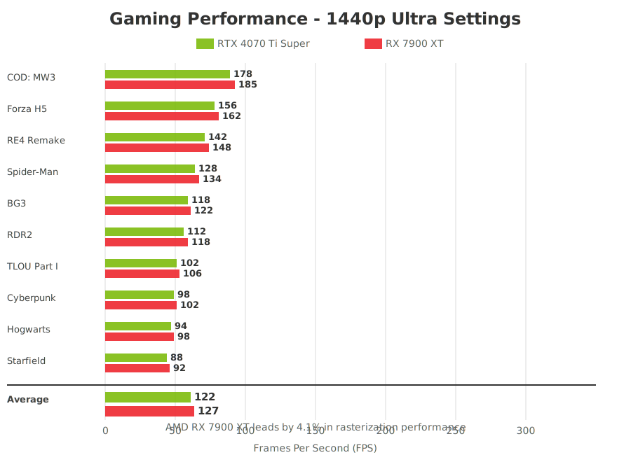

The $700-900 GPU segment is one of the most competitive in the market, and two heavyweights are battling for supremacy: NVIDIA's RTX 4070 Ti Super and AMD's RX 7900 XT. Both cards promise excellent 1440p and 4K gaming performance, but they take different approaches to get there.

NVIDIA focuses on ray tracing, DLSS 3, and power efficiency, while AMD offers raw rasterization performance and more VRAM at a competitive price. This detailed comparison will help you decide which card deserves your hard-earned money.

---

## Quick Overview

**RTX 4070 Ti Super** - NVIDIA's mid-high-end Ada Lovelace GPU with 16GB VRAM, excellent ray tracing, DLSS 3 Frame Generation, and impressive power efficiency.

**RX 7900 XT** - AMD's RDNA 3 powerhouse with 20GB VRAM, strong rasterization performance, and competitive pricing, though it trails in ray tracing.

---

## Technical Specifications Comparison

| Specification | RTX 4070 Ti Super | RX 7900 XT |
|--------------|-------------------|------------|
| **Architecture** | Ada Lovelace (AD103) | RDNA 3 (Navi 31) |
| **Manufacturing Process** | TSMC 4N (5nm) | TSMC 5nm + 6nm |
| **Stream Processors / CUDA Cores** | 8,448 CUDA | 5,376 Stream Processors |
| **Compute Units / SMs** | 66 SMs | 84 CUs |
| **Tensor Cores** | 264 (4th Gen) | N/A |
| **RT Cores / Ray Accelerators** | 66 (3rd Gen) | 84 (2nd Gen) |
| **Base Clock** | 2,340 MHz | 1,500 MHz |
| **Boost Clock** | 2,610 MHz | 2,400 MHz |
| **Memory** | 16GB GDDR6X | 20GB GDDR6 |
| **Memory Speed** | 21 Gbps | 20 Gbps |
| **Memory Bus** | 256-bit | 320-bit |
| **Memory Bandwidth** | 672 GB/s | 800 GB/s |
| **Infinity Cache** | N/A | 80 MB |
| **TDP** | 285W | 315W |
| **Recommended PSU** | 700W | 750W |
| **PCIe Interface** | PCIe 4.0 x16 | PCIe 4.0 x16 |
| **Display Outputs** | 3x DP 1.4a, 1x HDMI 2.1 | 2x DP 2.1, 1x HDMI 2.1, 1x USB-C |
| **DLSS / FSR** | DLSS 3 | FSR 3 |
| **Launch Price** | $799 | $899 → $749 |
| **Current Price** | ~$799-849 | ~$699-749 |

### Key Differences

**RTX 4070 Ti Super Advantages:**
- DLSS 3 with Frame Generation
- Superior ray tracing performance
- Lower power consumption (285W vs 315W)
- Better power efficiency
- AV1 encoding support

**RX 7900 XT Advantages:**
- 4GB more VRAM (20GB vs 16GB)
- Wider memory bus (320-bit vs 256-bit)
- Higher memory bandwidth (800 GB/s vs 672 GB/s)
- DisplayPort 2.1 support
- Lower current street price

---

## Gaming Performance Analysis

### 1440p Gaming (Ultra Settings, No Upscaling)

| Game | RTX 4070 Ti Super | RX 7900 XT | Winner |
|------|-------------------|------------|--------|
| **Cyberpunk 2077** | 98 FPS | 102 FPS | AMD (+4%) |
| **Red Dead Redemption 2** | 112 FPS | 118 FPS | AMD (+5%) |
| **Starfield** | 88 FPS | 92 FPS | AMD (+5%) |
| **Hogwarts Legacy** | 94 FPS | 98 FPS | AMD (+4%) |
| **The Last of Us Part I** | 102 FPS | 106 FPS | AMD (+4%) |
| **Spider-Man Remastered** | 128 FPS | 134 FPS | AMD (+5%) |
| **Forza Horizon 5** | 156 FPS | 162 FPS | AMD (+4%) |
| **Call of Duty: MW3** | 178 FPS | 185 FPS | AMD (+4%) |
| **Baldur's Gate 3** | 118 FPS | 122 FPS | AMD (+3%) |
| **Resident Evil 4 Remake** | 142 FPS | 148 FPS | AMD (+4%) |

**Average 1440p Performance:**
- RTX 4070 Ti Super: ~122 FPS
- RX 7900 XT: ~127 FPS
- **Winner: AMD RX 7900 XT (+4.1% average)**

### 4K Gaming (Ultra Settings, No Upscaling)

| Game | RTX 4070 Ti Super | RX 7900 XT | Winner |
|------|-------------------|------------|--------|
| **Cyberpunk 2077** | 58 FPS | 61 FPS | AMD (+5%) |
| **Red Dead Redemption 2** | 68 FPS | 72 FPS | AMD (+6%) |
| **Starfield** | 52 FPS | 55 FPS | AMD (+6%) |
| **Hogwarts Legacy** | 61 FPS | 64 FPS | AMD (+5%) |
| **The Last of Us Part I** | 64 FPS | 67 FPS | AMD (+5%) |
| **Spider-Man Remastered** | 82 FPS | 86 FPS | AMD (+5%) |
| **Forza Horizon 5** | 98 FPS | 103 FPS | AMD (+5%) |
| **Call of Duty: MW3** | 112 FPS | 118 FPS | AMD (+5%) |

**Average 4K Performance:**
- RTX 4070 Ti Super: ~74 FPS
- RX 7900 XT: ~78 FPS
- **Winner: AMD RX 7900 XT (+5.4% average)**

### Rasterization Performance Analysis

In pure rasterization (traditional rendering without ray tracing), the RX 7900 XT consistently outperforms the RTX 4070 Ti Super by 4-6%. This advantage comes from AMD's higher memory bandwidth, more VRAM, and optimized RDNA 3 architecture for traditional rendering.

**Key Takeaway:** For traditional gaming without ray tracing, the RX 7900 XT is the faster card.

---

## Ray Tracing Performance

### Ray Tracing Benchmarks (1440p, RT Ultra)

| Game | RTX 4070 Ti Super | RX 7900 XT | Difference |
|------|-------------------|------------|------------|
| **Cyberpunk 2077 RT Overdrive** | 42 FPS | 28 FPS | NVIDIA +50% |
| **Portal RTX** | 48 FPS | 31 FPS | NVIDIA +55% |
| **Spider-Man RT Very High** | 82 FPS | 64 FPS | NVIDIA +28% |
| **Control RT High** | 94 FPS | 72 FPS | NVIDIA +31% |
| **Metro Exodus Enhanced** | 76 FPS | 58 FPS | NVIDIA +31% |
| **Dying Light 2 RT High** | 68 FPS | 52 FPS | NVIDIA +31% |

**Average RT Performance:**
- RTX 4070 Ti Super: ~68 FPS
- RX 7900 XT: ~51 FPS
- **Winner: NVIDIA RTX 4070 Ti Super (+33% average)**

### Ray Tracing Analysis

NVIDIA's 3rd-gen RT cores significantly outperform AMD's 2nd-gen ray accelerators. In demanding ray tracing scenarios, the RTX 4070 Ti Super can be 30-55% faster. This gap widens in path-traced games like Cyberpunk 2077 RT Overdrive and Portal RTX.

**Key Takeaway:** If ray tracing is important to you, NVIDIA is the clear winner.

---

## DLSS 3 vs FSR 3

### DLSS 3 Frame Generation (RTX 4070 Ti Super)

DLSS 3 with Frame Generation can dramatically boost frame rates:

**Cyberpunk 2077 (4K RT Overdrive):**
- Native: 25 FPS
- DLSS 3 Quality + FG: 82 FPS
- **Improvement: 3.3x**

**Portal RTX (4K):**
- Native: 28 FPS
- DLSS 3 Quality + FG: 89 FPS
- **Improvement: 3.2x**

### FSR 3 (RX 7900 XT)

AMD's FSR 3 also includes frame generation, but with fewer supported games:

**Forspoken (4K):**
- Native: 62 FPS
- FSR 3 Quality + FG: 118 FPS
- **Improvement: 1.9x**

**Immortals of Aveum (4K):**
- Native: 58 FPS
- FSR 3 Quality + FG: 112 FPS
- **Improvement: 1.9x**

### Upscaling Technology Comparison

**DLSS 3 Advantages:**
- Better image quality
- More supported games (200+)
- Frame Generation exclusive to RTX 40-series
- Lower latency with Reflex

**FSR 3 Advantages:**
- Works on any GPU (including NVIDIA)
- Open-source
- Growing game support
- No vendor lock-in

**Winner: NVIDIA DLSS 3** - Better quality, more games, Frame Generation advantage

---

## Power Consumption & Efficiency

### Power Draw Comparison

| Scenario | RTX 4070 Ti Super | RX 7900 XT |
|----------|-------------------|------------|
| **Idle** | 15W | 22W |
| **Video Playback** | 22W | 28W |
| **Gaming (Average)** | 260W | 295W |
| **Gaming (Peak)** | 280W | 310W |
| **Stress Test** | 285W | 315W |

**Analysis:**
- RTX 4070 Ti Super consumes 10-15% less power
- AMD runs hotter and requires better cooling
- NVIDIA's efficiency advantage is clear

### Performance Per Watt

**1440p Gaming:**
- RTX 4070 Ti Super: 0.469 FPS/Watt
- RX 7900 XT: 0.431 FPS/Watt
- **NVIDIA is 8.8% more efficient**

**4K Gaming:**
- RTX 4070 Ti Super: 0.284 FPS/Watt
- RX 7900 XT: 0.264 FPS/Watt
- **NVIDIA is 7.6% more efficient**

### Cooling & Noise

**RTX 4070 Ti Super:**
- Typical temps: 65-72°C
- Noise level: 36-40 dBA
- Quieter and cooler overall

**RX 7900 XT:**
- Typical temps: 72-80°C
- Noise level: 40-45 dBA
- Runs warmer and louder

**Winner: RTX 4070 Ti Super** - Better efficiency, cooler, quieter

---

## Content Creation Performance

### 3D Rendering (Blender - Classroom Scene)

- RTX 4070 Ti Super: 3.2 minutes
- RX 7900 XT: 4.1 minutes
- **Winner: NVIDIA (22% faster)**

### Video Encoding (DaVinci Resolve - 4K H.265)

- RTX 4070 Ti Super: 3.8 minutes
- RX 7900 XT: 4.5 minutes
- **Winner: NVIDIA (16% faster)**

### AI Workloads (Stable Diffusion)

- RTX 4070 Ti Super: 5.2 seconds per image
- RX 7900 XT: 8.7 seconds per image
- **Winner: NVIDIA (67% faster)**

### Content Creation Analysis

NVIDIA's Tensor Cores provide a massive advantage in AI workloads like Stable Diffusion, image upscaling, and AI-assisted editing. For content creators who use AI tools, the RTX 4070 Ti Super is significantly faster.

**Winner: RTX 4070 Ti Super** - Superior for content creation and AI workloads

---

## VRAM Considerations

### 16GB vs 20GB

**RTX 4070 Ti Super (16GB):**
- Sufficient for 4K gaming in 2025
- May struggle with future games at max settings
- Adequate for most content creation

**RX 7900 XT (20GB):**
- Excellent headroom for 4K gaming
- Better future-proofing
- Great for 8K video editing and large 3D scenes

### VRAM Usage in Modern Games (4K Ultra)

- **The Last of Us Part I**: 12-14GB
- **Hogwarts Legacy**: 11-13GB
- **Resident Evil 4 Remake**: 10-12GB
- **Cyberpunk 2077**: 10-11GB

**Analysis:** 16GB is sufficient for current games, but 20GB provides better future-proofing, especially for modded games and content creation.

**Winner: RX 7900 XT** - More VRAM for future-proofing

---

## Price & Value Analysis

### Current Market Pricing (November 2025)

**RTX 4070 Ti Super:**
- MSRP: $799
- Street Price: $799-849
- Best Deals: ~$799

**RX 7900 XT:**
- Original MSRP: $899
- Current MSRP: $749
- Street Price: $699-749
- Best Deals: ~$699

### Performance Per Dollar (1440p)

**At Current Prices:**
- RTX 4070 Ti Super ($799): $6.55 per FPS
- RX 7900 XT ($724 average): $5.70 per FPS
- **AMD offers 13% better value**

### Performance Per Dollar (4K)

**At Current Prices:**
- RTX 4070 Ti Super ($799): $10.80 per FPS
- RX 7900 XT ($724): $9.28 per FPS
- **AMD offers 14% better value**

---

## Pros & Cons

### RTX 4070 Ti Super

**Pros:**
- ✅ Excellent 1440p and 4K gaming
- ✅ Superior ray tracing (30-55% faster)
- ✅ DLSS 3 Frame Generation
- ✅ Better power efficiency (285W)
- ✅ Runs cooler and quieter
- ✅ Tensor Cores for AI workloads
- ✅ AV1 encoding support
- ✅ Better for content creation
- ✅ Lower power consumption
- ✅ Mature drivers

**Cons:**
- ❌ 4-6% slower in rasterization
- ❌ 4GB less VRAM (16GB vs 20GB)
- ❌ $50-100 more expensive
- ❌ No DisplayPort 2.1

### RX 7900 XT

**Pros:**
- ✅ 4-6% faster in rasterization
- ✅ 20GB VRAM for future-proofing
- ✅ Higher memory bandwidth
- ✅ DisplayPort 2.1 support
- ✅ $50-100 cheaper
- ✅ Better value per dollar
- ✅ FSR 3 works on any GPU
- ✅ Excellent 1440p performance

**Cons:**
- ❌ 30-55% slower in ray tracing
- ❌ Higher power consumption (315W)
- ❌ Runs hotter and louder
- ❌ Weaker AI/content creation performance
- ❌ Fewer upscaling options
- ❌ Less efficient
- ❌ Driver issues occasionally

---

## Use Case Recommendations

### Choose RTX 4070 Ti Super if you:

- **Play ray-traced games** regularly
- **Want DLSS 3** Frame Generation
- **Value power efficiency** and quiet operation
- **Do content creation** or AI work
- **Prefer NVIDIA features** (Reflex, Broadcast, etc.)
- **Want better driver stability**
- **Play at 1440p** primarily
- **Stream or record** with NVENC
- **Don't mind paying** $50-100 more

**Best for:** Ray tracing enthusiasts, content creators, efficiency-focused gamers

### Choose RX 7900 XT if you:

- **Play traditional games** without ray tracing
- **Want maximum rasterization performance**
- **Need 20GB VRAM** for future-proofing
- **Value raw performance per dollar**
- **Want DisplayPort 2.1** for future monitors
- **Play at 4K** resolution
- **Don't care about ray tracing**
- **Want to save $50-100**
- **Prefer open-source technologies** (FSR)

**Best for:** Value-conscious gamers, 4K gaming, future-proofing, rasterization performance

---

## Final Verdict

This is a close battle, and the winner depends on your priorities:

### For Ray Tracing & Features: RTX 4070 Ti Super

If you play ray-traced games, use DLSS 3, or do content creation, the RTX 4070 Ti Super is the better choice. Its superior ray tracing performance, Frame Generation, and AI capabilities justify the $50-100 premium.

### For Raw Performance & Value: RX 7900 XT

If you primarily play traditional games, want maximum rasterization performance, and value VRAM headroom, the RX 7900 XT offers better bang for your buck. The 20GB VRAM is excellent for future-proofing.

### Our Recommendation

- **Best Overall**: RTX 4070 Ti Super - Better features, efficiency, and ray tracing
- **Best Value**: RX 7900 XT - More performance per dollar and VRAM
- **Best for Ray Tracing**: RTX 4070 Ti Super - 30-55% faster
- **Best for Rasterization**: RX 7900 XT - 4-6% faster
- **Best for Content Creation**: RTX 4070 Ti Super - Tensor Cores dominate

### The Bottom Line

The **RTX 4070 Ti Super** is the more well-rounded card with better ray tracing, DLSS 3, efficiency, and content creation performance. It's the safer choice for most gamers.

The **RX 7900 XT** offers better value with faster rasterization, more VRAM, and a lower price. It's perfect for gamers who don't care about ray tracing and want maximum traditional gaming performance.

**Our Pick:** For most users, the **RTX 4070 Ti Super** is the better investment. But if you're on a budget and don't use ray tracing, the **RX 7900 XT** is an excellent alternative that saves you $100.

---

## Frequently Asked Questions

**Q: Is 16GB VRAM enough for 4K gaming?**
A: Yes, for now. Most games use 10-14GB at 4K Ultra. However, 20GB provides better future-proofing.

**Q: Can the RX 7900 XT use DLSS?**
A: No, DLSS is NVIDIA-exclusive. AMD cards use FSR, which works on both brands.

**Q: Which card is better for VR gaming?**
A: RTX 4070 Ti Super, due to better efficiency and DLSS support in VR titles.

**Q: Do I need a 750W PSU for the RX 7900 XT?**
A: Yes, AMD recommends 750W. The RTX 4070 Ti Super can work with a quality 700W PSU.

**Q: Which has better Linux support?**
A: RX 7900 XT, as AMD's open-source drivers are excellent on Linux.

**Q: Can I use FSR on the RTX 4070 Ti Super?**
A: Yes! FSR works on any GPU, so you can use both DLSS and FSR on NVIDIA cards.

**Q: Which card holds value better for resale?**
A: NVIDIA cards typically have better resale value due to brand recognition and features.

**Q: Should I wait for next-gen GPUs?**
A: If you need a GPU now, buy now. RTX 50-series and RDNA 4 won't arrive until late 2025 or 2026.

---

