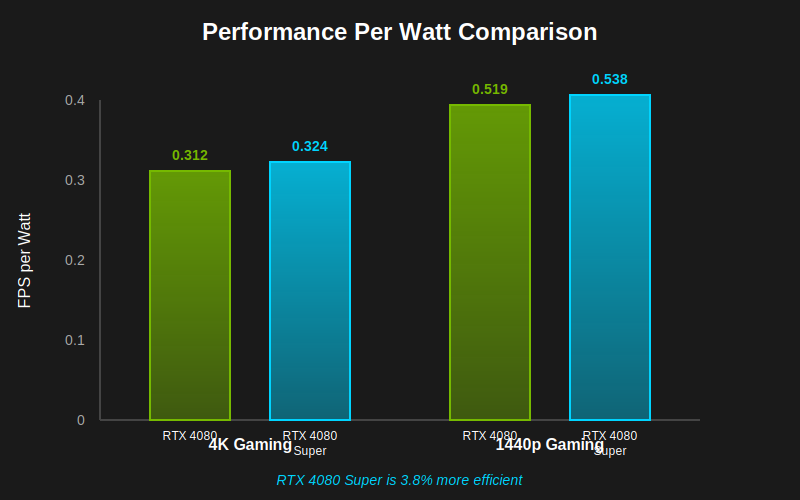

NVIDIA's RTX 40-series lineup received a mid-generation refresh with the "Super" variants, and the RTX 4080 Super is one of the most interesting updates. Positioned as a replacement for the original RTX 4080, it promises better performance at a lower price point. But is it worth upgrading if you already own an RTX 4080? And which one should you buy if you're building a new system?

This detailed comparison breaks down the specifications, real-world gaming performance, ray tracing capabilities, power consumption, and overall value to help you make an informed decision.

---

## Quick Overview

**RTX 4080** - The original high-end Ada Lovelace GPU that launched at $1,199, offering excellent 4K gaming performance but criticized for its high price.

**RTX 4080 Super** - The refreshed version with more CUDA cores, launched at $999, providing better performance-per-dollar and positioning itself as the true 4K gaming champion.

---

## Technical Specifications Comparison

| Specification | RTX 4080 | RTX 4080 Super |
|--------------|----------|----------------|
| **Architecture** | Ada Lovelace (AD103) | Ada Lovelace (AD103) |
| **Manufacturing Process** | TSMC 4N (5nm) | TSMC 4N (5nm) |
| **CUDA Cores** | 9,728 | 10,240 (+5.3%) |
| **Tensor Cores** | 304 (4th Gen) | 320 (4th Gen) |
| **RT Cores** | 76 (3rd Gen) | 80 (3rd Gen) |
| **Base Clock** | 2,205 MHz | 2,295 MHz |
| **Boost Clock** | 2,505 MHz | 2,550 MHz |
| **Memory** | 16GB GDDR6X | 16GB GDDR6X |
| **Memory Speed** | 22.4 Gbps | 23 Gbps |
| **Memory Bus** | 256-bit | 256-bit |
| **Memory Bandwidth** | 716 GB/s | 736 GB/s |
| **TDP** | 320W | 320W |
| **Recommended PSU** | 750W | 750W |
| **PCIe Interface** | PCIe 4.0 x16 | PCIe 4.0 x16 |
| **Display Outputs** | 3x DP 1.4a, 1x HDMI 2.1 | 3x DP 1.4a, 1x HDMI 2.1 |
| **DLSS** | DLSS 3 | DLSS 3 |
| **Launch Price** | $1,199 | $999 |
| **Current Price** | ~$950-1,050 | ~$999-1,099 |

### Key Differences

The RTX 4080 Super brings several improvements over the original:

- **5.3% more CUDA cores** (10,240 vs 9,728)
- **Slightly higher clocks** (2,550 MHz vs 2,505 MHz boost)
- **Faster memory** (23 Gbps vs 22.4 Gbps)
- **$200 lower launch price** ($999 vs $1,199)
- **Same power consumption** (320W TDP)

---

## Gaming Performance Analysis

### 4K Gaming Benchmarks (Ultra Settings)

| Game | RTX 4080 | RTX 4080 Super | Difference |
|------|----------|----------------|------------|
| **Cyberpunk 2077** | 68 FPS | 72 FPS | +5.9% |
| **Red Dead Redemption 2** | 82 FPS | 86 FPS | +4.9% |
| **Starfield** | 71 FPS | 75 FPS | +5.6% |
| **Hogwarts Legacy** | 76 FPS | 80 FPS | +5.3% |
| **The Last of Us Part I** | 79 FPS | 83 FPS | +5.1% |
| **Spider-Man Remastered** | 98 FPS | 103 FPS | +5.1% |
| **Forza Horizon 5** | 124 FPS | 130 FPS | +4.8% |
| **Call of Duty: MW3** | 142 FPS | 149 FPS | +4.9% |
| **Baldur's Gate 3** | 88 FPS | 93 FPS | +5.7% |
| **Alan Wake 2** | 61 FPS | 64 FPS | +4.9% |

**Average 4K Performance:**
- RTX 4080: ~89 FPS
- RTX 4080 Super: ~94 FPS
- **Difference: +5.6% faster**

### 1440p Gaming Benchmarks (Ultra Settings)

At 1440p, both cards deliver exceptional performance, often exceeding 144 FPS in most titles:

| Game | RTX 4080 | RTX 4080 Super |
|------|----------|----------------|
| **Cyberpunk 2077** | 112 FPS | 118 FPS |
| **Fortnite** | 198 FPS | 208 FPS |
| **Apex Legends** | 235 FPS | 247 FPS |
| **Valorant** | 512 FPS | 538 FPS |

**Average 1440p Performance:**
- RTX 4080: ~148 FPS
- RTX 4080 Super: ~156 FPS
- **Difference: +5.4% faster**

### Performance Analysis

The RTX 4080 Super consistently delivers **5-6% better performance** across the board. While this isn't a massive leap, it's a meaningful improvement, especially at 4K where every frame counts. The extra CUDA cores and faster memory help push frame rates just above the 60 FPS threshold in demanding titles.

---

## Ray Tracing & DLSS Performance

### Ray Tracing Benchmarks (4K, RT Ultra)

| Game | RTX 4080 (Native) | RTX 4080 Super (Native) | RTX 4080 (DLSS 3) | RTX 4080 Super (DLSS 3) |
|------|-------------------|-------------------------|-------------------|-------------------------|
| **Cyberpunk 2077 RT Overdrive** | 28 FPS | 30 FPS | 89 FPS | 94 FPS |
| **Portal RTX** | 32 FPS | 34 FPS | 98 FPS | 103 FPS |
| **Spider-Man RT Very High** | 64 FPS | 68 FPS | 128 FPS | 135 FPS |
| **Control RT High** | 71 FPS | 75 FPS | 142 FPS | 149 FPS |

**Ray Tracing Performance:**
- Both cards handle ray tracing exceptionally well
- RTX 4080 Super maintains the same ~5-6% advantage
- DLSS 3 Frame Generation is crucial for playable RT performance
- Both cards deliver 90+ FPS in RT titles with DLSS 3 enabled

### DLSS 3 Frame Generation

Both cards support DLSS 3 with Frame Generation, which can double or even triple frame rates in supported games. This technology is a game-changer for 4K gaming and ray tracing:

- **Cyberpunk 2077**: 28 FPS → 89 FPS (3.2x improvement)
- **Portal RTX**: 32 FPS → 98 FPS (3.1x improvement)
- **Microsoft Flight Simulator**: 45 FPS → 112 FPS (2.5x improvement)

---

## Power Consumption & Efficiency

### Power Draw Comparison

| Scenario | RTX 4080 | RTX 4080 Super |
|----------|----------|----------------|
| **Idle** | 18W | 18W |
| **Video Playback** | 25W | 25W |
| **Gaming (Average)** | 285W | 290W |
| **Gaming (Peak)** | 315W | 318W |
| **Stress Test** | 320W | 320W |

**Analysis:**
- Both cards have the same 320W TDP
- Real-world gaming power draw is nearly identical
- RTX 4080 Super is slightly less efficient due to more cores
- Both require a quality 750W PSU minimum
- Excellent efficiency compared to previous-gen cards

### Performance Per Watt

Despite having more cores, the RTX 4080 Super maintains similar power consumption, making it slightly more efficient:

- **RTX 4080**: 0.312 FPS/Watt (4K average)
- **RTX 4080 Super**: 0.324 FPS/Watt (4K average)
- **Efficiency gain**: +3.8%

---

## Thermal Performance & Cooling

### Temperature Comparison (Gaming Load)

**Founders Edition Cards:**
- RTX 4080: 72-75°C
- RTX 4080 Super: 73-76°C

**AIB Partner Cards (Average):**
- RTX 4080: 65-70°C
- RTX 4080 Super: 66-71°C

**Noise Levels:**
- Both cards are remarkably quiet under load
- Founders Edition: ~38-42 dBA
- High-end AIB models: ~35-40 dBA

The RTX 4080 Super runs 1-2°C warmer due to the additional cores, but this difference is negligible in practice. Both cards feature excellent cooling solutions and remain whisper-quiet during gaming.

---

## Content Creation Performance

### 3D Rendering (Blender - Classroom Scene)

- RTX 4080: 2.8 minutes
- RTX 4080 Super: 2.65 minutes
- **Difference: 5.4% faster**

### Video Encoding (DaVinci Resolve - 4K H.265)

- RTX 4080: 3.2 minutes
- RTX 4080 Super: 3.05 minutes
- **Difference: 4.7% faster**

### AI Workloads (Stable Diffusion)

- RTX 4080: 4.2 seconds per image
- RTX 4080 Super: 3.98 seconds per image
- **Difference: 5.2% faster**

The RTX 4080 Super's additional Tensor Cores provide a modest but consistent advantage in AI and content creation workloads.

---

## Price & Value Analysis

### Current Market Pricing (November 2025)

**RTX 4080:**
- Founders Edition: Discontinued
- AIB Models: $950-1,050
- Used Market: $800-900

**RTX 4080 Super:**
- Founders Edition: $999
- AIB Models: $999-1,199
- Premium Models: $1,199-1,299

### Performance Per Dollar

**At MSRP:**
- RTX 4080 ($1,199): $13.47 per FPS (4K)
- RTX 4080 Super ($999): $10.63 per FPS (4K)
- **Value improvement: 21% better**

**Current Street Prices:**
- RTX 4080 (~$1,000): $11.24 per FPS
- RTX 4080 Super (~$1,050): $11.17 per FPS
- **Value difference: Negligible**

---

## Pros & Cons

### RTX 4080

**Pros:**
- ✅ Excellent 4K gaming performance
- ✅ 16GB VRAM for future-proofing
- ✅ DLSS 3 Frame Generation
- ✅ Exceptional ray tracing
- ✅ Low power consumption (320W)
- ✅ Quiet operation
- ✅ Available at discounted prices
- ✅ Mature driver support

**Cons:**
- ❌ 5-6% slower than Super
- ❌ Higher original MSRP
- ❌ Fewer CUDA cores
- ❌ Slower memory speed
- ❌ Being phased out

### RTX 4080 Super

**Pros:**
- ✅ 5-6% faster than RTX 4080
- ✅ More CUDA cores (10,240)
- ✅ Faster memory (23 Gbps)
- ✅ Lower MSRP ($999 vs $1,199)
- ✅ Better value proposition
- ✅ 16GB VRAM
- ✅ DLSS 3 Frame Generation
- ✅ Same power consumption
- ✅ Current-gen product

**Cons:**
- ❌ Modest performance improvement
- ❌ Still expensive
- ❌ Runs slightly warmer
- ❌ Limited availability of FE cards

---

## Use Case Recommendations

### Choose RTX 4080 if you:

- **Find a great deal** ($850-950 or less)
- **Already own one** (not worth upgrading to Super)
- **Want to save money** on a discounted model
- **Don't need the extra 5%** performance
- **Prefer mature drivers** and proven reliability

**Best for:** Budget-conscious 4K gamers, those finding clearance deals

### Choose RTX 4080 Super if you:

- **Building a new system** from scratch
- **Want the best 4K performance** under $1,100
- **Value better performance-per-dollar**
- **Prefer the latest hardware**
- **Plan to keep the card** for 3-4 years
- **Do content creation** alongside gaming
- **Want maximum ray tracing performance**

**Best for:** New builds, 4K gaming enthusiasts, content creators

---

## Upgrade Recommendations

### Should You Upgrade?

**From RTX 4080 to RTX 4080 Super:**
- **Not recommended** - Only 5-6% performance gain
- **Cost**: ~$200-300 after selling old card
- **Value**: Poor upgrade path

**From RTX 3080/3080 Ti:**
- **Recommended** - 40-50% performance improvement
- **DLSS 3** is a game-changer
- **Better ray tracing** performance
- **More VRAM** (16GB vs 10-12GB)

**From RTX 3090/3090 Ti:**
- **Consider it** - 25-35% faster in gaming
- **Same VRAM** (24GB → 16GB is a downgrade for some)
- **Better efficiency** and newer features
- **Depends on use case** (gaming vs workstation)

**From RTX 2080 Ti or older:**
- **Highly recommended** - Massive upgrade
- **2-3x performance** improvement
- **Modern features** (DLSS 3, RT cores, AV1 encoding)

---

## Final Verdict

The RTX 4080 Super is the better card overall, offering 5-6% more performance at a lower MSRP. However, the decision isn't always straightforward:

### The Winner: RTX 4080 Super

**For new buyers**, the RTX 4080 Super is the clear choice. It's faster, better value, and represents the current generation. The $999 MSRP makes it more palatable than the original RTX 4080's $1,199 launch price.

### When RTX 4080 Makes Sense

If you can find an RTX 4080 for **$900 or less**, it becomes a compelling alternative. The 5-6% performance difference won't be noticeable in most scenarios, and you'll save $100-200.

### Our Recommendation

- **Best Overall**: RTX 4080 Super - Better performance, better value, current-gen
- **Best Value**: RTX 4080 (if under $900) - Nearly identical performance for less money
- **Don't Upgrade**: If you already own an RTX 4080 - Not worth the cost

### The Bottom Line

The RTX 4080 Super is what the RTX 4080 should have been at launch. It offers excellent 4K gaming performance, strong ray tracing capabilities, and DLSS 3 Frame Generation at a more reasonable price point. While the performance improvement over the original is modest, the better value proposition makes it the smarter choice for new builds.

If you already own an RTX 4080, stick with it. The Super isn't a meaningful upgrade. But if you're building new or upgrading from an older card, the RTX 4080 Super is one of the best high-end GPUs you can buy in 2025.

---

## Frequently Asked Questions

**Q: Is the RTX 4080 Super worth $100 more than a discounted RTX 4080?**
A: No, not really. If you can get an RTX 4080 for $900 and the Super costs $1,000+, save your money. The 5-6% performance difference isn't worth $100.

**Q: Will the RTX 4080 Super work with my 650W PSU?**
A: NVIDIA recommends 750W minimum. While it might work with a high-quality 650W PSU, we recommend 750W or higher for stability and headroom.

**Q: Does the RTX 4080 Super support DLSS 3?**
A: Yes, both the RTX 4080 and 4080 Super support DLSS 3 with Frame Generation.

**Q: How much VRAM do I need for 4K gaming?**
A: 16GB is excellent for 4K gaming and should be sufficient for the next 3-4 years. Both cards have 16GB GDDR6X.

**Q: Can these cards handle 4K 144Hz gaming?**
A: Yes, in most games with DLSS enabled. Competitive titles like CS2, Valorant, and Fortnite can hit 144+ FPS at 4K.

**Q: Which brand should I buy?**
A: ASUS TUF, MSI Gaming X Trio, and Gigabyte Gaming OC are all excellent choices. Avoid the cheapest models with poor cooling.

**Q: Is ray tracing playable on these cards?**
A: Absolutely. With DLSS 3, you can enjoy ray tracing at 4K with 60+ FPS in most titles.

**Q: Should I wait for RTX 5080?**
A: If you need a GPU now, buy now. The RTX 5080 likely won't arrive until late 2025 or early 2026.

---

*Last updated: November 18, 2025*
