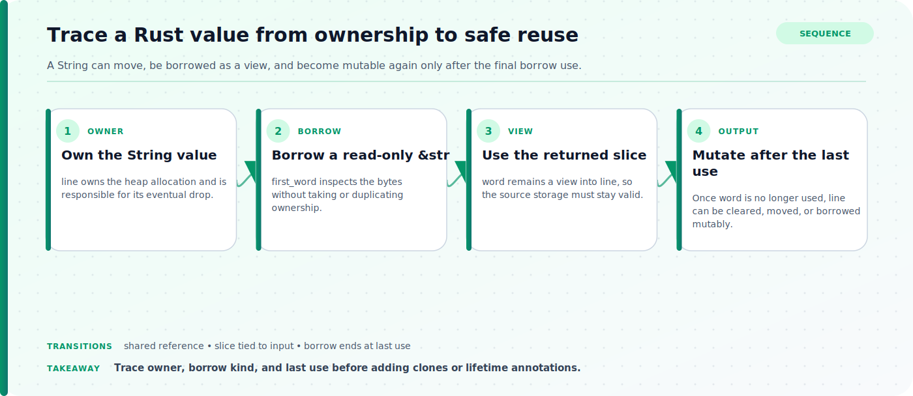

Rust uses ownership rules to manage resources without requiring a garbage collector for ordinary memory safety. Each value has an owner, assignment or function calls can move ownership, and references let code borrow a value without taking ownership. The compiler checks these relationships, which means many errors are best understood as questions about who owns a value, how long a borrow lasts, and whether mutation could overlap another access.

## A working model for Rust Ownership and Borrowing: A Practical Mental Model

For each short example, label the owner, every move, each immutable or mutable borrow, and the final use of each variable. Predict which line should compile before running the compiler. Use a String or Vec for resource-owning behavior and a simple Copy scalar as a contrast. Keep lifetime syntax out of the first pass; the goal is to understand the data flow that lifetime annotations later describe.

## Apply the model to a concrete case

Consider a function that receives a line as String, finds the first word, and then needs the original line again. Taking String by value transfers ownership to the function unless it returns the value, which is unnecessary when only inspection is required. Taking &str lets the function accept a borrowed view and return a slice tied to the input. While that returned slice is used, the original String cannot be cleared through a mutable borrow because the slice would point into changed storage. Once the slice's last use is complete, mutation can proceed. The compiler error is therefore a useful statement about the relationship between the view and its owner, not an arbitrary restriction on strings.

## Source boundaries for programming languages

### What Is Ownership?

Use What Is Ownership? for this boundary of the topic: Use the ownership chapter for scope, moves, cloning, Copy behavior, function arguments, returns, and drop.
### References and Borrowing

Use References and Borrowing for this boundary of the topic: Use the references and borrowing chapter for shared references, mutable references, and dangling-reference prevention.
### The Slice Type

Use The Slice Type for this boundary of the topic: Use the slice chapter for string slices, range boundaries, and general slice types.

## Reason through rust ownership borrowing practical mental model

The flow below connects the three questions to ask when the compiler rejects an access: whether ownership moved, which kind of borrow is still active, and whether a slice remains tied to its source. Use that sequence while tracing the concrete `String` example rather than treating each error as an isolated rule.



### 1. Track ownership and moves through scope

A value is dropped when its owner leaves scope unless ownership has moved elsewhere. For heap-owning values, a plain assignment normally transfers ownership rather than duplicating the allocation, so using the old binding afterward is rejected. Passing a value to a function follows the same ownership rules. Return ownership, borrow the value, or clone deliberately based on the required semantics; cloning is a data-copy decision, not a universal repair for a move error.
### 2. Choose immutable or mutable borrowing

An immutable reference permits access without transferring ownership, and multiple immutable references can coexist when their uses are compatible. A mutable reference permits mutation but must not overlap another active borrow that would make the access ambiguous. Modern borrow checking can end a borrow at its last use rather than only at the lexical block boundary. Read the error around the actual use sites and reduce the lifetime of a reference by restructuring work, not by scattering clones.
### 3. Use slices as borrowed views into contiguous data

A slice references a range of a collection without owning that collection. String slices and array slices keep the view connected to the borrowed source, which prevents code from clearing or replacing the source while the view is still used. Prefer a slice parameter when a function needs to inspect part or all of a sequence but does not require ownership. This broadens the caller contract and makes the non-owning relationship explicit.

## Worked code example

### Return a borrowed slice instead of taking ownership

```rust
fn first_word(text: &str) -> &str {
    match text.as_bytes().iter().position(|byte| *byte == b' ') {
        Some(index) => &text[..index],
        None => text,
    }
}

fn main() {
    let line = String::from("ownership made visible");
    let word = first_word(&line);
    println!("{word}");
}
```

The caller retains ownership of the String, and the returned slice cannot outlive the borrowed input. The relationship is visible in the function signature without cloning the text.

## Rust Ownership and Borrowing: A Practical Mental Model: decisions and tradeoffs

| Situation or decision | Tradeoff or common failure mode | Validation question |
| --- | --- | --- |
| A binding cannot be used after assignment or a function call | Ownership of a non-Copy value moved to another binding or parameter | Decide whether the callee should borrow, return ownership, or intentionally receive a clone |
| A second mutable or immutable access is rejected | An earlier mutable borrow is still used later | Locate the last use of each reference and shorten or reorder the overlapping work |
| A collection cannot be mutated while a slice is used | The slice remains a live borrowed view into that collection | Finish using the slice before mutation or return owned data when independence is required |

## Common mistakes in programming languages

Cloning every value after a move error hides ownership decisions and can introduce allocations that the design never intended. Adding lifetime annotations before tracing actual borrows often makes signatures harder without changing the invalid data flow. Another mistake is assuming a reference's scope lasts to the closing brace even when its last use is earlier, or the reverse: assuming a borrow ended while a later println still uses it. Returning a reference to a local owned value is invalid because that owner is dropped at function exit. Prefer owned return values when data must outlive the source, and prefer slices or references when the caller retains ownership for the full use.

## Practical implementation checklist

1. Label the owner before deciding whether a function parameter should take, share, or mutate a value.
2. Distinguish a move from a deep clone and explain the cost of the chosen operation.
3. Find the last use of every reference when diagnosing an overlapping-borrow error.
4. Prefer slice inputs for read-only sequence operations that do not need ownership.
5. Verify predictions with a minimal compiler example before changing a larger design.

## Related implementation context

[C# vs Java: A Practical Comparison for 2025](/posts/csharp-vs-java/) and [Why I Still Prefer Java Over Python](/posts/why-i-like-java-more-than-python/)

## Version and verification boundary

The explanation follows the current stable edition of The Rust Programming Language checked at publication time; compiler diagnostics and edition-specific ergonomics can evolve while the core ownership rules remain the reference boundary.

## Summary

Rust ownership errors become predictable when moves, last uses, and borrowed views are drawn explicitly. Borrow for temporary access, move when ownership should transfer, clone only when a real duplicate is needed, and let slices express non-owning views into sequences.

## Sources

- [What Is Ownership?](https://doc.rust-lang.org/book/ch04-01-what-is-ownership.html)
- [References and Borrowing](https://doc.rust-lang.org/book/ch04-02-references-and-borrowing.html)
- [The Slice Type](https://doc.rust-lang.org/book/ch04-03-slices.html)
