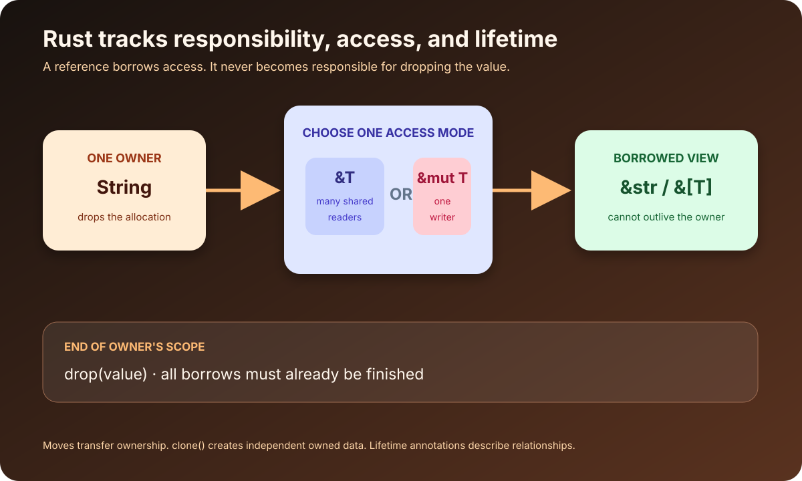

Rust ownership is not a collection of arbitrary compiler restrictions. It is a static accounting system for three questions:

1. Who is responsible for a value?
2. Who may access it right now?
3. How long is that access valid?

If you trace those three facts instead of fighting individual error messages, moves, references, slices, and lifetimes become variations of one model.



## The three ownership rules

The Rust Book summarizes the model:

- Every value has an owner.
- There can be only one owner at a time.
- When the owner leaves scope, the value is dropped.

```rust
fn main() {
    let message = String::from("hello"); // message owns the String
    println!("{message}");
} // String::drop runs here
```

`String` owns heap-allocated data. The stack variable contains metadata such as a pointer, length, and capacity; the `String` value is responsible for releasing its allocation.

## Assignment can move a value

```rust
let first = String::from("hello");
let second = first;

// println!("{first}"); // error: value borrowed after move
println!("{second}");
```

Copying the small stack metadata while allowing both variables to free the same allocation would be unsafe. Rust instead treats the assignment as a **move**: `second` becomes the owner and `first` is no longer usable.

This differs for types implementing `Copy`:

```rust
let first = 7;
let second = first;
println!("{first} {second}");
```

Integers are copied because duplicating their bits produces two independent valid values. You can request a deep duplication of a `String` explicitly:

```rust
let first = String::from("hello");
let second = first.clone();
```

Use `clone()` when you truly need another owned value, not as a reflex to silence the borrow checker.

## Functions make ownership visible

```rust
fn length_owned(text: String) -> usize {
    text.len()
} // text is dropped

fn main() {
    let name = String::from("Ada");
    let size = length_owned(name);
    // name is no longer available
}
```

If the function only needs to inspect the string, taking ownership is unnecessarily strong. Borrow it:

```rust
fn length(text: &str) -> usize {
    text.len()
}

fn main() {
    let name = String::from("Ada");
    let size = length(&name);
    println!("{name}: {size}");
}
```

`&str` also accepts string literals and slices of a `String`, making the API more flexible than `&String`.

## Borrowing: access without ownership

A reference temporarily grants access while the original owner remains responsible for the value.

Rust's central borrowing rule is:

> At a given time, you may have either many shared references or one mutable reference to a value.

Shared borrows can coexist:

```rust
let text = String::from("read me");
let left = &text;
let right = &text;
println!("{left} / {right}");
```

A mutable borrow needs exclusive access:

```rust
let mut text = String::from("hello");
let edit = &mut text;
edit.push_str(", Rust");
println!("{edit}");
```

Exclusivity prevents a reader from observing a collection while another reference reallocates or mutates it.

```rust
let mut values = vec![10, 20, 30];
let first = &values[0];
// values.push(40); // could reallocate, invalidating first
println!("{first}");
```

The compiler rejects the mutation while `first` is still used. The rule prevents a real dangling-reference bug.

## Borrows end at their last use

Modern Rust uses non-lexical lifetime analysis, so a borrow can end before the closing brace:

```rust
let mut text = String::from("hello");

let shared = &text;
println!("{shared}"); // last use of shared

let exclusive = &mut text; // valid
exclusive.push('!');
```

When a compiler error says a mutable and immutable borrow overlap, mark the last use of each reference. The issue is often narrower than the entire visual scope.

## Slices are borrowed views

A slice describes part of a collection without owning it:

```rust
fn first_word(text: &str) -> &str {
    for (index, byte) in text.bytes().enumerate() {
        if byte == b' ' {
            return &text[..index];
        }
    }
    text
}

fn main() {
    let sentence = String::from("ownership made visible");
    let word = first_word(&sentence);
    println!("{word}");
}
```

The returned `&str` is tied to the input borrow. Rust will not allow `sentence` to be dropped or mutably changed while `word` is later used.

This function searches for the ASCII space byte, so each returned boundary is valid UTF-8: ASCII space is one byte and cannot appear inside another UTF-8 code point. A production tokenizer still needs a deliberate definition of whitespace and words.

## Lifetimes describe relationships

Most lifetimes are inferred. An annotation does not extend how long data lives; it tells the compiler how reference lifetimes relate.

```rust
fn longer<'a>(left: &'a str, right: &'a str) -> &'a str {
    if left.len() >= right.len() { left } else { right }
}
```

The return value cannot outlive the shorter usable input lifetime because it may refer to either argument.

This is invalid:

```rust
fn dangling() -> &str {
    let temporary = String::from("gone");
    &temporary
} // temporary is dropped here
```

There is no truthful lifetime annotation that can fix it. Return an owned `String`, or borrow data owned outside the function.

## A useful API decision table

| Parameter/return type | Meaning |
| --- | --- |
| `T` | Transfer or create ownership |
| `&T` | Read a borrowed value |
| `&mut T` | Mutate with exclusive borrowed access |
| `String` | Owned growable UTF-8 string |
| `&str` | Borrowed string view |
| `Vec<T>` | Owned growable sequence |
| `&[T]` | Borrowed sequence view |

Prefer the weakest capability that satisfies the function. A parser that only reads input should usually accept `&str`, not `String`; a builder returning independent data should usually return an owned value.

## Read borrow-checker errors systematically

When code fails:

1. Identify the value and its current owner.
2. Mark every move.
3. Mark shared and mutable borrows.
4. Find the last use of each borrow.
5. Ask whether the function really needs ownership or mutation.
6. Change the data flow before reaching for `clone()`.

Common design fixes include:

- borrow instead of taking ownership;
- return ownership when a caller still needs the value;
- shorten a reference's useful scope;
- split a struct into independently borrowable fields;
- compute a result before taking a mutable borrow;
- return owned data when it must outlive the input.

## A compact worked refactor

This version consumes its input:

```rust
fn normalize(mut name: String) -> String {
    name.make_ascii_lowercase();
    name
}
```

That is excellent when transfer is intended. If the caller must retain the original, choose a different contract:

```rust
fn normalized(name: &str) -> String {
    name.to_ascii_lowercase()
}
```

The second function borrows the input and returns new owned output. Neither is universally better; ownership makes the cost and responsibility explicit at the call site.

Ownership is Rust's vocabulary for resource lifetime. Borrowing is temporary access. Lifetimes are the compiler's proof that references cannot outlive their data. Once you track those relationships, many “borrow checker problems” reveal themselves as ordinary data-flow decisions.

## Sources

- [What Is Ownership? — The Rust Programming Language](https://doc.rust-lang.org/book/ch04-01-what-is-ownership.html)
- [References and Borrowing — The Rust Programming Language](https://doc.rust-lang.org/book/ch04-02-references-and-borrowing.html)
- [The Slice Type — The Rust Programming Language](https://doc.rust-lang.org/book/ch04-03-slices.html)
- [Validating References with Lifetimes — The Rust Programming Language](https://doc.rust-lang.org/book/ch10-03-lifetime-syntax.html)
