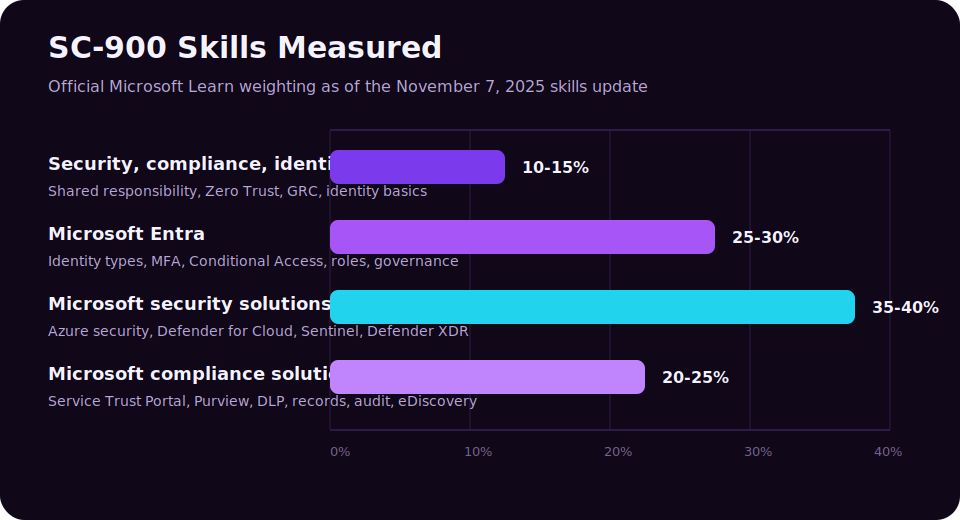
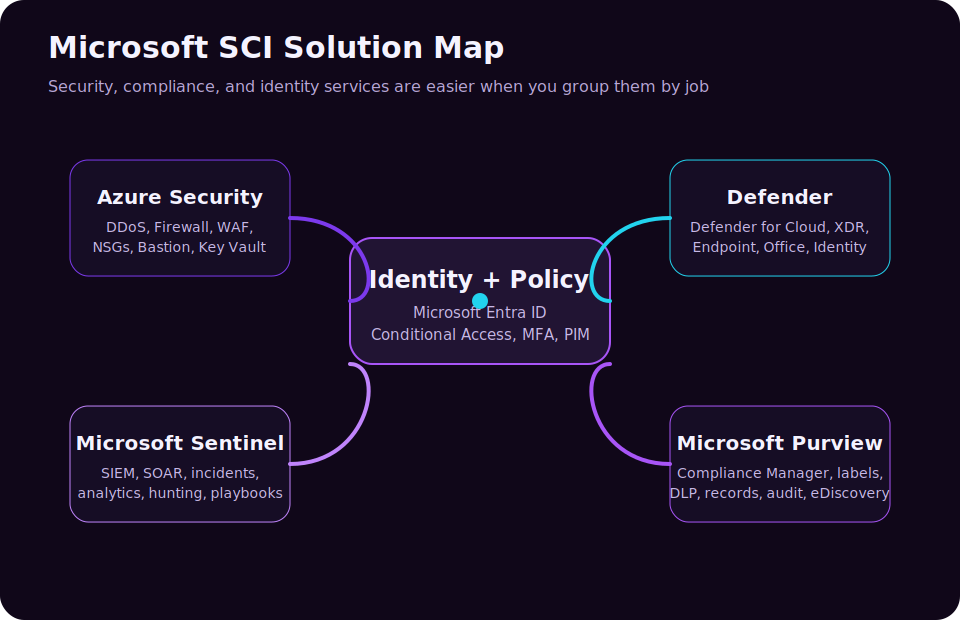
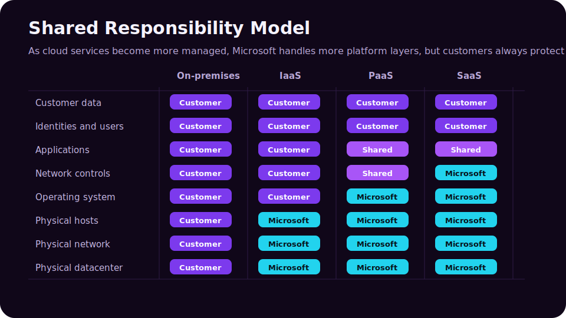
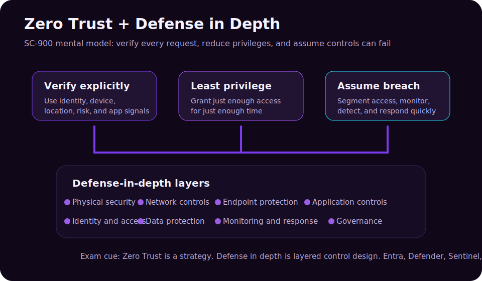

The **SC-900: Microsoft Security, Compliance, and Identity Fundamentals** exam is the best Microsoft fundamentals certification for learners who want to understand how modern organizations protect identities, secure cloud workloads, detect threats, and govern sensitive data.

This guide is written as a practical cheatsheet, not a dictionary. The goal is to help you explain *why* a service exists, *where* it fits in the Microsoft security ecosystem, and *which problem* it solves in a scenario question.

> **Current objective note:** Microsoft Learn lists the current SC-900 skills measured as of **November 7, 2025**. Your outline listed Domain 4 as **15-20%**, but the current Microsoft Learn study guide lists **Microsoft compliance solutions as 20-25%**. This post follows the current Microsoft Learn weighting as of **June 3, 2026**.

| Domain | Current Weight | What To Prioritize |
|---|---:|---|
| Security, compliance, and identity concepts | 10-15% | Shared responsibility, defense in depth, Zero Trust, encryption, hashing, GRC, identity basics |
| Microsoft Entra | 25-30% | Identity types, Entra ID, MFA, passwordless, SSPR, Conditional Access, roles, RBAC, PIM, access reviews |
| Microsoft security solutions | 35-40% | Azure infrastructure security, Defender for Cloud, CSPM, Microsoft Sentinel, Microsoft Defender XDR |
| Microsoft compliance solutions | 20-25% | Service Trust Portal, privacy, Purview portal, Compliance Manager, information protection, DLP, records, eDiscovery, audit |

> **Reading path:** Use the domain map as a study plan, read the explanations in order, and return to the reference tables when you revise.

---

## How To Use This Guide

SC-900 questions are usually vocabulary-and-scenario questions. You do not need to deploy an enterprise SOC from memory, but you do need to recognize the right tool from a short business problem.

Read each domain with these three questions in mind:

1. **What is the concept?** Example: authentication proves who someone is.
2. **Which Microsoft service implements it?** Example: Microsoft Entra ID handles cloud identity and access.
3. **What scenario points to it?** Example: "Require MFA only when a user signs in from an unmanaged device" points to Conditional Access.

---

## Domain 1.0 - Describe the Concepts of Security, Compliance, and Identity (10-15%)

This first domain is small by percentage, but it is the foundation for the rest of the exam. If you understand these ideas, the Microsoft product names become easier to remember.

### 1.1 Shared Responsibility Model

The **shared responsibility model** explains which security responsibilities belong to Microsoft and which remain with the customer.

In a traditional on-premises datacenter, the organization owns almost everything: physical security, network hardware, servers, operating systems, applications, accounts, data, backups, and compliance controls. In cloud services, Microsoft takes on more of the underlying platform responsibility, but the customer still owns important decisions around data, identities, permissions, configuration, and governance.

| Layer | On-Premises | IaaS | PaaS | SaaS |
|---|---|---|---|---|
| Physical datacenter | Customer | Microsoft | Microsoft | Microsoft |
| Physical network | Customer | Microsoft | Microsoft | Microsoft |
| Physical hosts | Customer | Microsoft | Microsoft | Microsoft |
| Operating system | Customer | Customer | Microsoft | Microsoft |
| Network controls | Customer | Customer | Shared | Microsoft |
| Applications | Customer | Customer | Shared | Shared |
| Identities and users | Customer | Customer | Customer | Customer |
| Customer data | Customer | Customer | Customer | Customer |

The exam-grade point is simple: **moving to the cloud does not outsource accountability for identities and data**. Even in SaaS, you still configure users, roles, permissions, labels, retention, sharing, and access policies.

### 1.2 Defense in Depth

**Defense in depth** is layered security. The idea is that no single control is perfect, so you combine multiple controls across identity, network, endpoints, applications, data, monitoring, and governance.

Think of a user accessing a sensitive file:

| Layer | Example Control | Why It Matters |
|---|---|---|
| Identity | MFA, passwordless, Conditional Access | Blocks stolen-password-only attacks |
| Device | Endpoint compliance, device health | Prevents risky unmanaged devices from accessing sensitive data |
| Network | Firewall, NSGs, WAF, segmentation | Limits exposure and lateral movement |
| Application | App permissions, OAuth consent governance | Reduces over-permissioned apps |
| Data | Sensitivity labels, encryption, DLP | Protects the information itself |
| Monitoring | Sentinel, Defender XDR incidents | Detects suspicious activity |
| Governance | Access reviews, PIM, retention | Removes stale access and proves compliance |

Defense in depth is not the same thing as Zero Trust, but they support each other. Zero Trust gives you the access philosophy; defense in depth gives you the layered implementation.

### 1.3 Zero Trust Model

**Zero Trust** is a security strategy based on three core principles:

| Principle | Meaning | Microsoft Example |
|---|---|---|
| Verify explicitly | Authenticate and authorize every request using available signals | Entra ID sign-in risk, device compliance, location, app sensitivity |
| Use least privilege access | Give the minimum access required for the minimum time required | PIM, RBAC, Conditional Access, access reviews |
| Assume breach | Design as though an attacker may already be present | Segmentation, monitoring, incident response, DLP, threat hunting |

The common mistake is thinking Zero Trust means "trust nobody." A better explanation is: **trust must be continuously earned by the request context**. A user, device, application, location, and risk level all matter.

### 1.4 Encryption and Hashing

**Encryption** protects data confidentiality by converting readable data into unreadable ciphertext. It is reversible if you have the correct key.

Examples:

- Encrypting data at rest in storage.
- Encrypting data in transit with TLS.
- Protecting documents with sensitivity labels and encryption.

**Hashing** creates a fixed-length value from input data. A good cryptographic hash is one-way: you should not be able to recover the original value from the hash.

Examples:

- Storing password hashes instead of plaintext passwords.
- Verifying file integrity.
- Comparing values without exposing the original secret.

| Concept | Reversible? | Uses Keys? | Common Use |
|---|---|---|---|
| Encryption | Yes | Yes | Confidentiality of data at rest and in transit |
| Hashing | No | Usually no, unless combined with keyed methods | Integrity checks and password storage |

Exam cue: if the question says **protect data so authorized users can read it later**, think encryption. If it says **verify that data has not changed** or **store a password safely**, think hashing.

### 1.5 Governance, Risk, and Compliance (GRC)

**Governance, Risk, and Compliance (GRC)** describes how organizations make security and compliance repeatable instead of relying on heroic one-off effort.

| GRC Area | What It Answers | Example |
|---|---|---|
| Governance | Who is responsible and what rules apply? | Security policies, data handling rules, access review ownership |
| Risk | What could go wrong and how likely/impactful is it? | Risk assessments, threat modeling, identity risk, compliance risk |
| Compliance | Are we meeting internal, legal, and regulatory obligations? | Audit evidence, retention policies, Compliance Manager assessments |

GRC is not just paperwork. In Microsoft cloud environments, governance becomes technical: policies, labels, retention rules, role assignments, audit logs, and reports.

### 1.6 Identity as the Primary Security Perimeter

Traditional networks relied heavily on the corporate firewall. That model is weaker when users access SaaS apps from home networks, mobile devices, partner locations, and unmanaged browsers.

Modern security treats **identity as the primary security perimeter**. The identity tells the system who is requesting access, what role they have, what risk is present, and which controls should apply.

Identity becomes the control plane for:

- Authentication.
- Authorization.
- MFA and passwordless sign-in.
- Conditional Access.
- Privileged access.
- Audit and accountability.
- Access reviews and lifecycle management.

### 1.7 Authentication and Authorization

**Authentication** answers: "Who are you?"

Examples:

- Username and password.
- Microsoft Authenticator approval.
- FIDO2 security key.
- Windows Hello for Business.
- Certificate-based authentication.

**Authorization** answers: "What are you allowed to do?"

Examples:

- A user can read a SharePoint site but cannot edit it.
- A help desk administrator can reset passwords but cannot manage billing.
- A security reader can view security alerts but cannot change policies.

| Concept | Question It Answers | Example |
|---|---|---|
| Authentication | Who is signing in? | MFA prompt during sign-in |
| Authorization | What can they access? | RBAC role assignment |
| Accounting/Auditing | What did they do? | Audit logs and sign-in logs |

### 1.8 Identity Providers and Federation

An **identity provider (IdP)** creates, stores, and validates identities. Microsoft Entra ID is an identity provider.

**Federation** allows one identity provider to trust another. Instead of creating separate usernames and passwords everywhere, users authenticate with a trusted IdP and access connected applications through standards-based protocols.

Common identity concepts:

| Concept | Meaning |
|---|---|
| Directory service | Stores identity objects such as users, groups, devices, and apps |
| Active Directory Domain Services | Traditional on-premises Windows directory service |
| Microsoft Entra ID | Cloud identity and access management service |
| Hybrid identity | A model where on-premises identities and cloud identities work together |
| Federation | Trust relationship between identity providers |
| Single sign-on (SSO) | Sign in once and access multiple connected apps |

---

## Domain 2.0 - Describe the Capabilities of Microsoft Entra (25-30%)

Microsoft Entra is the identity and network access family that includes Microsoft Entra ID, identity governance, identity protection, workload identity, external identity, and related access products. For SC-900, focus on Microsoft Entra ID and the identity controls around it.

### 2.1 Types of Identities

Identity is not only human users. Microsoft environments include several identity types.

| Identity Type | What It Represents | Example |
|---|---|---|
| User identity | A human user account | Employee, admin, contractor, student |
| Workload identity | A non-human identity used by apps or services | App registration, service principal, automation job |
| External identity | A guest, partner, customer, or consumer identity | B2B guest user, customer sign-in account |
| Managed identity | An Azure-managed identity for a resource | Azure Function accessing Key Vault without storing a password |
| Device identity | A registered or joined device | Entra joined Windows laptop |

The exam often tests whether you understand that **applications and services need identities too**. Workload and managed identities reduce the need for hardcoded secrets.

### 2.2 Microsoft Entra ID Capabilities

**Microsoft Entra ID** is Microsoft's cloud-based identity and access management service. It provides authentication, authorization, single sign-on, app registration, user and group management, device identity, sign-in logs, and access policy enforcement.

Core capabilities:

| Capability | What It Does |
|---|---|
| User and group management | Create users, assign groups, organize access |
| Single sign-on | Let users sign in once to access connected cloud apps |
| App registration | Allow applications to use Microsoft identity |
| Device identity | Register, join, and evaluate device state |
| Conditional Access | Make access decisions based on signals and policies |
| Roles and RBAC | Delegate administrative and resource permissions |
| Sign-in and audit logs | Track authentication and administrative activity |
| Identity Protection | Detect risky users and risky sign-ins |

Microsoft Entra ID used to be called Azure Active Directory. You will still see "Azure AD" in older documentation, screenshots, training courses, and third-party notes. In current Microsoft branding, the name is **Microsoft Entra ID**.

### 2.3 Authentication Methods: MFA, Passwordless, and SSPR

Passwords are weak because they can be guessed, reused, phished, sprayed, leaked, and brute-forced. SC-900 expects you to recognize stronger authentication options.

| Method | What It Is | Best Use |
|---|---|---|
| MFA | Requires two or more factors | Raising assurance during risky sign-ins |
| Microsoft Authenticator | App-based approvals, number matching, passkeys | Stronger user authentication |
| Windows Hello for Business | Biometric/PIN sign-in tied to device | Enterprise passwordless sign-in |
| FIDO2/passkey | Phishing-resistant authentication | High-security accounts and passwordless sign-in |
| Temporary Access Pass | Time-limited credential for onboarding or recovery | Bootstrapping passwordless methods |
| SSPR | Self-service password reset | Reduces help desk password reset tickets |

Authentication factors:

| Factor | Meaning | Example |
|---|---|---|
| Something you know | A secret memorized by the user | Password, PIN |
| Something you have | A device or token | Phone, security key |
| Something you are | Biometric characteristic | Face, fingerprint |

SC-900 does not require deep cryptographic details of each method. It wants you to understand the security difference: **MFA is stronger than password-only sign-in, and phishing-resistant/passwordless methods are stronger still**.

### 2.4 Conditional Access

**Conditional Access** is Microsoft Entra's policy engine for access decisions. It combines signals, decisions, and controls.

| Policy Part | Examples |
|---|---|
| Assignments | Users, groups, roles, apps, actions |
| Conditions | Location, device platform, sign-in risk, user risk, client app |
| Access controls | Require MFA, require compliant device, block access, require approved app |
| Session controls | Limit session duration, use app-enforced restrictions |

Scenario cues:

| Scenario | Likely Answer |
|---|---|
| "Require MFA only when users sign in from outside trusted locations" | Conditional Access |
| "Block legacy authentication protocols" | Conditional Access |
| "Require a compliant device before accessing Exchange Online" | Conditional Access + Intune compliance |
| "Require phishing-resistant MFA for admins" | Conditional Access authentication strength |

Conditional Access is a Zero Trust tool because it does not treat every sign-in the same. It evaluates the context.

### 2.5 Microsoft Entra Roles and RBAC

**Role-Based Access Control (RBAC)** assigns permissions based on roles. Instead of granting every permission directly to every user, you assign a role that contains a defined set of allowed actions.

Be careful: Microsoft has different role scopes.

| Role Type | Scope | Example |
|---|---|---|
| Microsoft Entra roles | Identity/admin tasks in the tenant | Global Administrator, User Administrator, Security Reader |
| Azure RBAC roles | Azure resources | Owner, Contributor, Reader, Key Vault Secrets User |
| Microsoft Purview roles | Compliance and data governance tasks | Compliance Administrator, eDiscovery Manager |
| Defender roles | Security operations tasks | Security Operator, Security Reader |

Exam cue: if the question is about **managing users, groups, enterprise apps, or tenant-wide identity settings**, think Microsoft Entra roles. If it is about **managing Azure resources**, think Azure RBAC.

### 2.6 Identity Protection and Governance: PIM and Access Reviews

Identity security does not end after a user signs in. Organizations must govern who has access, why they have it, and when it should be removed.

| Capability | What It Solves |
|---|---|
| Microsoft Entra ID Protection | Detects risky users and risky sign-ins |
| Risk-based Conditional Access | Applies controls based on user or sign-in risk |
| Microsoft Entra ID Governance | Automates identity lifecycle, access requests, assignments, and reviews |
| Privileged Identity Management (PIM) | Provides just-in-time privileged role activation |
| Access reviews | Recertifies access to groups, apps, access packages, and roles |
| Entitlement management | Packages resources and workflows for access requests |

**PIM** is especially important. It helps reduce standing administrator access. Instead of being permanently privileged, an admin activates a role when needed, often with MFA, justification, approval, limited duration, and audit logging.

**Access reviews** answer a different question: "Should this person still have access?" They help remove stale access for employees who changed jobs, contractors whose projects ended, or guests who no longer need collaboration access.

---

## Domain 3.0 - Describe the Capabilities of Microsoft Security Solutions (35-40%)

This is the largest domain. Keep the product map clear:

- **Azure security controls** protect cloud infrastructure and workloads.
- **Defender for Cloud** improves cloud security posture and workload protection.
- **Microsoft Sentinel** is SIEM/SOAR for security operations.
- **Microsoft Defender XDR** correlates threats across endpoints, email, identity, apps, and cloud apps.

### 3.1 Basic Security Capabilities in Azure

Azure has many security services. SC-900 focuses on recognition and use cases.

| Service | What It Does | Scenario Cue |
|---|---|---|
| Azure DDoS Protection | Protects against distributed denial-of-service attacks | "Protect public-facing apps from volumetric attacks" |
| Azure Firewall | Managed, cloud-native network firewall | "Centrally filter traffic between networks" |
| Web Application Firewall (WAF) | Protects web apps from common web attacks | "Protect against SQL injection/cross-site scripting" |
| Network Security Groups (NSGs) | Filter network traffic to/from Azure resources | "Allow/deny traffic by port, protocol, and source" |
| Azure Bastion | Browser-based secure RDP/SSH to VMs without public IPs | "Administer VMs without exposing RDP to the internet" |
| Azure Key Vault | Protects keys, secrets, and certificates | "Store app secrets securely" |
| Azure Virtual Network | Provides private network isolation and segmentation | "Separate subnets and control traffic paths" |

How to remember the network controls:

| If the question says... | Think... |
|---|---|
| "Layer 3/4 filtering for subnets or NICs" | NSG |
| "Central firewall with rules and threat intelligence" | Azure Firewall |
| "Protect HTTP/S web application traffic" | WAF |
| "Avoid public IPs for VM admin access" | Azure Bastion |
| "Absorb large DDoS traffic spikes" | DDoS Protection |

### 3.2 Microsoft Defender for Cloud and CSPM

**Microsoft Defender for Cloud** helps improve the security posture of cloud resources and protect workloads. It is important for Azure, but it also has multicloud capabilities.

Two major ideas matter:

| Concept | Meaning |
|---|---|
| CSPM | Cloud Security Posture Management: continuous assessment of cloud configuration and risk |
| CWP/CWPP | Cloud Workload Protection: workload-specific threat protection for servers, containers, storage, databases, and more |

Defender for Cloud can:

- Assess resources against security standards.
- Provide recommendations to reduce misconfigurations.
- Show secure score and posture trends.
- Detect threats against workloads.
- Help prioritize risks such as attack paths.
- Apply workload protection plans such as Defender for Servers, Storage, Containers, and Databases.

Scenario cues:

| Scenario | Likely Answer |
|---|---|
| "Find misconfigured cloud resources and get hardening recommendations" | Defender for Cloud CSPM |
| "Improve cloud secure score" | Defender for Cloud |
| "Protect servers and containers from threats" | Defender for Cloud workload protection |
| "View cloud security recommendations across Azure, AWS, and GCP" | Defender for Cloud CSPM |

### 3.3 Microsoft Sentinel: SIEM and SOAR

**Microsoft Sentinel** is Microsoft's cloud-native SIEM and SOAR platform.

| Term | Meaning |
|---|---|
| SIEM | Security Information and Event Management: collects, correlates, analyzes, and alerts on security data |
| SOAR | Security Orchestration, Automation, and Response: automates response workflows |

Sentinel helps security operations teams:

- Connect data sources.
- Collect logs from Microsoft and non-Microsoft systems.
- Detect threats using analytics rules.
- Investigate incidents.
- Hunt for threats using KQL.
- Automate responses using playbooks.
- Visualize security data with workbooks.

| Sentinel Feature | What It Does |
|---|---|
| Data connectors | Bring in logs from Microsoft 365, Entra, Defender, Azure, firewalls, AWS, GCP, and other tools |
| Analytics rules | Generate incidents from suspicious patterns |
| Incidents | Group related alerts for investigation |
| Hunting | Search for threats proactively |
| Workbooks | Build dashboards and visual reports |
| Playbooks | Automate response steps with Logic Apps |

Exam cue: if the scenario talks about **collecting logs from many systems, correlating events, threat hunting, incident management, or automated SOC response**, think Sentinel.

### 3.4 Microsoft Defender XDR

**Microsoft Defender XDR** correlates signals across multiple Microsoft Defender products to detect, investigate, and respond to threats across the attack chain.

| Defender Product | Protects | Example Threat |
|---|---|---|
| Defender for Endpoint | Devices and endpoints | Malware, suspicious process behavior, endpoint vulnerability |
| Defender for Office 365 | Email and collaboration | Phishing, malicious attachments, unsafe links |
| Defender for Identity | On-premises Active Directory signals | Lateral movement, suspicious Kerberos activity |
| Defender for Cloud Apps | SaaS apps and cloud app usage | Shadow IT, impossible travel, risky OAuth apps |
| Defender Vulnerability Management | Exposure and weakness management | Unpatched software and known vulnerabilities |
| Defender Threat Intelligence | Threat intelligence context | Known attacker infrastructure and indicators |

Why XDR matters: attacks rarely stay in one place. A phishing email may lead to credential theft, suspicious sign-in, endpoint malware, data exfiltration, and cloud app misuse. Defender XDR connects those signals into a broader incident.

| Scenario | Likely Answer |
|---|---|
| "Investigate a phishing email that led to endpoint activity" | Defender XDR |
| "Protect against malicious email attachments and links" | Defender for Office 365 |
| "Detect suspicious endpoint behavior" | Defender for Endpoint |
| "Detect identity attacks against Active Directory" | Defender for Identity |
| "Discover and control cloud apps used by employees" | Defender for Cloud Apps |

---

## Domain 4.0 - Describe the Capabilities of Microsoft Compliance Solutions (20-25%)

Compliance solutions help organizations understand obligations, govern information, protect sensitive data, and produce evidence when needed. For SC-900, most compliance services center around **Microsoft Purview**.

### 4.1 Service Trust Portal and Microsoft's Privacy Principles

The **Microsoft Service Trust Portal** provides access to Microsoft compliance reports, audit reports, security documentation, and trust resources. It helps customers evaluate Microsoft cloud services against regulatory and internal requirements.

Typical resources include:

- Independent audit reports.
- Compliance guides.
- Data protection and security documentation.
- Information about Microsoft cloud controls.

Microsoft privacy principles show up as trust concepts. You should understand ideas such as transparency, control, security, legal protection, and responsible data handling.

| Concept | Practical Meaning |
|---|---|
| Transparency | Customers should understand how Microsoft handles data |
| Control | Customers retain choices around data and configuration |
| Security | Microsoft designs services with security controls and operational protection |
| Compliance | Microsoft provides documentation and controls to support customer obligations |
| Privacy | Customer data should be handled according to privacy commitments |

### 4.2 Microsoft Purview Compliance Portal and Compliance Manager

**Microsoft Purview** brings together data governance, information protection, risk, compliance, and data lifecycle capabilities.

**Compliance Manager** helps organizations assess and manage compliance posture. It provides assessments, improvement actions, control mappings, and a compliance score.

| Feature | What It Does |
|---|---|
| Microsoft Purview portal | Central place for compliance and data governance solutions |
| Compliance Manager | Tracks compliance assessments and improvement actions |
| Compliance score | Helps measure progress against selected controls |
| Improvement actions | Recommended steps to improve compliance posture |
| Assessments | Templates for standards, regulations, and internal requirements |

Exam cue: if the scenario says **track compliance posture, assign improvement actions, or measure compliance progress**, think Compliance Manager.

### 4.3 Information Protection and Data Loss Prevention (DLP)

**Information protection** is about identifying, classifying, labeling, and protecting sensitive data.

**Data Loss Prevention (DLP)** helps identify, monitor, and automatically protect sensitive information across locations such as Exchange, SharePoint, OneDrive, Teams, endpoints, and supported cloud apps.

| Capability | What It Does |
|---|---|
| Sensitive information types | Detect patterns such as credit cards, IDs, or health data |
| Trainable classifiers | Identify content based on examples and machine learning |
| Sensitivity labels | Classify and protect items, sometimes with encryption |
| Label policies | Publish labels to users and locations |
| DLP policies | Detect and control risky sharing or use of sensitive data |
| Content explorer | Inspect discovered sensitive content with proper permissions |
| Activity explorer | View activities related to sensitive data |

Example DLP scenarios:

| Scenario | Likely Control |
|---|---|
| "Warn users before sending credit card numbers externally" | DLP policy |
| "Block sharing files labeled Confidential outside the organization" | DLP + sensitivity labels |
| "Encrypt documents labeled Highly Confidential" | Sensitivity label encryption |
| "Find where personal data exists across Microsoft 365" | Content explorer / data classification |

The exam often phrases DLP as preventing inappropriate sharing. Remember: DLP is not just an alerting feature. It can warn, block, audit, notify, restrict, or require justification depending on policy design.

### 4.4 Records Management and Data Lifecycle

Data governance also means deciding how long information should be kept and what happens when it is no longer needed.

| Feature | Purpose |
|---|---|
| Retention policies | Keep or delete content across locations for a defined period |
| Retention labels | Apply retention settings to specific items |
| Records management | Declare and manage business, legal, or regulatory records |
| File plan | Organize retention requirements and record categories |
| Disposition review | Review records before permanent deletion |
| Data lifecycle management | Manage content from creation through retention and deletion |

Records management is especially important when content must be preserved as a formal record. A record may need stricter controls against editing or deletion.

Scenario cues:

| Scenario | Likely Answer |
|---|---|
| "Keep documents for seven years, then delete them" | Retention policy/label |
| "Mark certain files as official records" | Records management |
| "Review items before deletion at end of retention period" | Disposition review |
| "Manage data from creation to deletion" | Data lifecycle management |

### 4.5 Insider Risk, eDiscovery, and Audit

Microsoft Purview also includes tools for investigating risky behavior, legal discovery, and audit evidence.

| Solution | What It Does |
|---|---|
| Insider Risk Management | Detects and helps manage risky user activity that may lead to data leakage or security incidents |
| eDiscovery | Identifies, preserves, collects, reviews, and exports electronically stored information |
| Audit | Records user and administrator activity for investigation and compliance |
| Communication Compliance | Helps detect policy violations in communications |

**Insider risk** is not the same as external threat detection. It focuses on risky behavior by people inside or connected to the organization, such as unusual downloads, sensitive data movement, or activity around resignation events.

**eDiscovery** is used for legal, regulatory, or business investigations. It can preserve content through holds and organize review workflows.

**Audit** is evidence. If a question asks how to know who changed a setting, accessed a file, or performed an administrative action, audit logs are likely involved.

---

## Quick Service Selection Matrix

Use this table when you are stuck between similar products.

| Need | Best Microsoft Solution |
|---|---|
| Cloud identity and SSO | Microsoft Entra ID |
| Require MFA based on risk/location/device/app | Conditional Access |
| Temporary admin elevation | Microsoft Entra PIM |
| Review whether users still need access | Access reviews |
| Detect risky users and risky sign-ins | Microsoft Entra ID Protection |
| Secure Azure resources and improve cloud posture | Microsoft Defender for Cloud |
| Detect misconfigurations across cloud environments | Defender for Cloud CSPM |
| Centralize logs and automate SOC response | Microsoft Sentinel |
| Correlate threats across email, endpoint, identity, and apps | Microsoft Defender XDR |
| Protect email from phishing and malicious links | Defender for Office 365 |
| Protect endpoints from threats | Defender for Endpoint |
| Discover and control SaaS/cloud app usage | Defender for Cloud Apps |
| Classify and protect sensitive files/emails | Microsoft Purview sensitivity labels |
| Prevent inappropriate sharing of sensitive data | Microsoft Purview DLP |
| Track compliance progress and improvement actions | Compliance Manager |
| Preserve and collect content for legal investigation | Microsoft Purview eDiscovery |
| Keep or delete content according to policy | Retention policies and records management |
| Access Microsoft audit/compliance reports | Service Trust Portal |

---

## Common Exam Traps

| Trap | Better Thinking |
|---|---|
| "Zero Trust is a product" | Zero Trust is a strategy; Microsoft services implement it |
| "Cloud means Microsoft handles all security" | Customers always retain responsibility for data, identities, access, and configuration |
| "MFA and Conditional Access are the same" | MFA is an authentication control; Conditional Access decides when controls apply |
| "RBAC is only Azure resources" | RBAC is a general model; Entra roles and Azure RBAC have different scopes |
| "Sentinel and Defender XDR do the same job" | Sentinel is SIEM/SOAR across many data sources; Defender XDR correlates Defender product signals |
| "DLP encrypts everything" | DLP detects and controls sensitive data usage; labels can classify/encrypt |
| "Retention and backup are the same" | Retention is governance/compliance; backup is recovery |
| "Audit prevents incidents" | Audit records activity; prevention requires policy, access control, and protection features |

---

## Sources

- [Study guide for Exam SC-900: Microsoft Security, Compliance, and Identity Fundamentals](https://learn.microsoft.com/en-us/credentials/certifications/resources/study-guides/sc-900)
- [Shared responsibility in the cloud](https://learn.microsoft.com/en-in/azure/security/fundamentals/shared-responsibility)
- [What is Zero Trust?](https://learn.microsoft.com/en-us/security/zero-trust/index-with-videos)
- [Zero Trust security guidance](https://learn.microsoft.com/en-us/security/zero-trust/)
- [Introduction to Azure security](https://learn.microsoft.com/en-us/Azure/security/fundamentals/technical-capabilities)
- [What is Microsoft Entra?](https://learn.microsoft.com/en-us/entra/fundamentals/what-is-entra)
- [How it works: Microsoft Entra multifactor authentication](https://learn.microsoft.com/en-us/entra/identity/authentication/concept-mfa-howitworks)
- [Microsoft Sentinel overview](https://learn.microsoft.com/en-us/azure/sentinel/sentinel-overview)
- [What is Microsoft Sentinel SIEM?](https://learn.microsoft.com/en-us/azure/sentinel/overview)
- [What is Cloud Security Posture Management in Microsoft Defender for Cloud?](https://learn.microsoft.com/en-us/azure/defender-for-cloud/concept-cloud-security-posture-management)
- [Microsoft Defender XDR documentation](https://learn.microsoft.com/en-us/defender-xdr)
- [Microsoft Purview data compliance solutions](https://learn.microsoft.com/en-us/purview/purview-compliance)
- [Learn about data loss prevention](https://learn.microsoft.com/en-us/purview/dlp-learn-about-dlp)
- [Learn about records management](https://learn.microsoft.com/en-us/purview/records-management)
- [Learn about eDiscovery in Microsoft Purview](https://learn.microsoft.com/en-us/purview/edisc)
