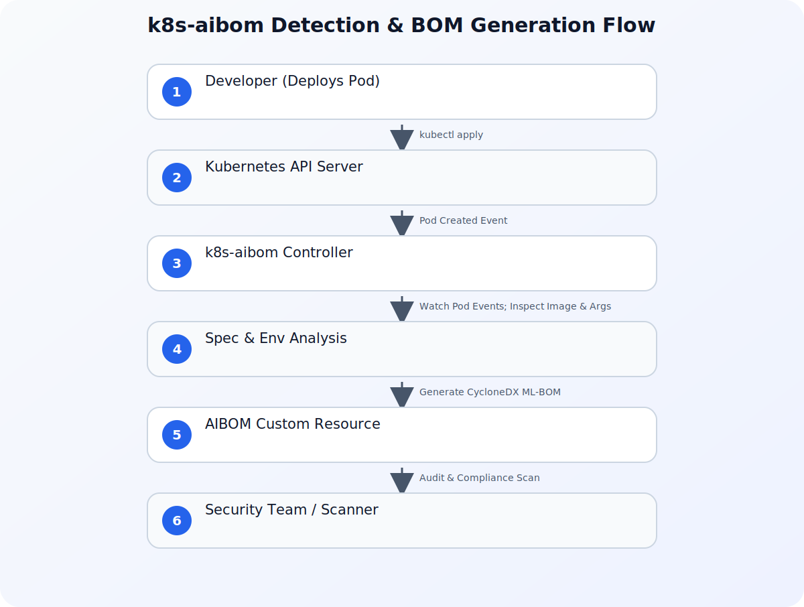

The rapid democratization of Artificial Intelligence (AI) and Machine Learning (ML) has fundamentally shifted how development teams build applications. Today, a developer can spin up a state-of-the-art large language model (LLM) locally or on a Kubernetes cluster in minutes using open-source runtimes like vLLM, Triton Inference Server, Ollama, or Hugging Face Text Generation Inference (TGI). 

However, this speed introduces a massive governance challenge: **Shadow AI**. Workloads deployed by developers without formal registration often evade traditional security scanners. Security teams are left in the dark, unable to answer fundamental questions: *What models are running in our production clusters? Where did those model weights originate? Are they subject to licensing, bias, or security vulnerabilities?*

To bridge this gap without slowing down development velocity, Google has open-sourced **k8s-aibom**, a lightweight, unprivileged Kubernetes controller designed to continuously monitor the cluster API, automatically detect running AI runtimes, and generate standard CycloneDX Machine Learning Bill of Materials (ML-BOMs). This guide explores the architecture of `k8s-aibom`, how it secures the AI supply chain on Google Kubernetes Engine (GKE), and how to implement it in your environment.

---

## The Dilemma of AI Supply Chain Security

Traditional Software Bills of Materials (SBOMs) are excellent at cataloging application dependencies—tracking things like npm packages, Python wheels, and Go binaries. However, AI workloads introduce an entirely new set of artifacts that traditional SBOMs are not designed to track:

*   **Model Weights:** Large binary files containing the parameters of the neural network (e.g., Safetensors or GGUF files).
*   **Dataset Lineage:** The data used to pre-train or fine-tune the model, which may contain licensed or sensitive information.
*   **Inference Runtimes:** Highly specialized execution environments (like vLLM or Triton) that interface directly with physical GPUs.
*   **Hyperparameters and Configurations:** System-level prompts, temperature settings, and context window configurations that dictate model behavior.

### The Friction of Traditional Security Agents

Historically, security teams attempted to gain visibility into running workloads by deploying intrusive agents. These agents typically require:

1.  **Privileged DaemonSets:** Running with root access or host-level namespaces to inspect process trees.
2.  **Kernel-Level Access (eBPF):** Hooking into the host operating system kernel, which can introduce stability and performance overhead on GPU-enabled nodes.
3.  **Manual Pod-Spec Mutations:** Requiring developers to inject sidecars or modify their deployment manifests, creating friction and slowing down deployment pipelines.

In high-performance GKE environments where GPU resources are expensive and highly optimized, platform engineers are understandably reluctant to deploy heavy, privileged security daemons that could compromise workload stability. This has created a deadlock between security compliance and developer velocity.

`k8s-aibom` breaks this deadlock by shifting the discovery mechanism to an unprivileged, API-driven model.

---

## What is k8s-aibom?

`k8s-aibom` is an open-source, lightweight Kubernetes controller that runs inside your GKE cluster. Instead of intercepting system calls or requiring root privileges on the host nodes, it leverages the native Kubernetes API to observe cluster state.

By watching pod creation, container images, environment variables, and command-line arguments, `k8s-aibom` automatically identifies known AI runtimes. Once an AI runtime is detected, the controller parses the workload configuration to determine which model is being served and generates a standardized **CycloneDX ML-BOM** (also referred to as an AI-BOM).

### Key Capabilities of k8s-aibom

*   **Zero-Friction Discovery:** Automatically detects runtimes like vLLM, Triton, and Ollama without requiring developers to change a single line of YAML.
*   **Unprivileged Execution:** Runs as a standard, non-root Kubernetes deployment. It does not require host-level namespaces, privileged security contexts, or kernel modules.
*   **Standardized Output:** Generates audit-grade ML-BOMs using the industry-standard CycloneDX format, making it easy to integrate with existing vulnerability management and compliance tools.
*   **Continuous Monitoring:** Unlike static build-time SBOMs, `k8s-aibom` operates at runtime, capturing dynamic changes such as models downloaded on-the-fly from Hugging Face or Model Garden.

---

## Architecture and Workflow

To understand how `k8s-aibom` operates without high privileges, let's look at its architecture. The controller runs as a single-replica deployment in a dedicated namespace. It uses a custom service account with read-only permissions to watch Pods, Deployments, and Custom Resources across the cluster.

Refer to the diagram below for the architectural flow of detection and BOM generation:



### The Step-by-Step Detection Pipeline

1.  **Watch Cluster Events:** The `k8s-aibom` controller watches the Kubernetes API for Pod creation or update events.
2.  **Analyze Container Specs:** When a new Pod is scheduled, the controller inspects the container spec, looking for specific signatures:
    *   **Container Image Names:** Matching patterns like `vllm/vllm-openai` or `nvcr.io/nvidia/tritonserver`.
    *   **Command-Line Arguments:** Inspecting flags such as `--model` or `--model-registry`.
    *   **Environment Variables:** Reading variables like `MODEL_ID` or `HF_MODEL_ID`.
3.  **Query Model Registries (Optional/Safe):** If the model is referenced via a public registry (like Hugging Face or Google Cloud Model Garden), the controller can safely resolve metadata about the model card.
4.  **Generate CycloneDX ML-BOM:** The controller compiles this information into a CycloneDX ML-BOM JSON payload.
5.  **Publish the BOM:** The generated BOM is stored as a Kubernetes Custom Resource (CRD) or pushed to an external storage sink (like a Google Cloud Storage bucket or an OCI registry) for security analysis.

---

## Comparing Security Approaches

To highlight why this approach is highly beneficial for platform engineering and security teams, let's compare `k8s-aibom` with traditional security scanning methods:

| Feature | Build-Time SBOM Scanner | Privileged Host Agent (DaemonSet) | k8s-aibom Controller |
| :--- | :--- | :--- | :--- |
| **Privilege Level** | None (Runs in CI/CD) | High (Root/Host Namespace) | **Low (Unprivileged Read-Only)** |
| **Runtime Awareness** | None (Static only) | High (Real-time system calls) | **High (Kubernetes API Monitoring)** |
| **Friction for Developers** | Medium (Requires CI integration) | Low (Transparent) | **Zero (Transparent & Automatic)** |
| **Performance Overhead** | None | Medium to High (CPU/Memory on Nodes) | **Negligible (API-driven)** |
| **AI-Specific Metadata** | Poor (Tracks packages, not models) | Poor (Sees binary executions, not model cards) | **Excellent (Generates CycloneDX ML-BOMs)** |
| **Handles Dynamic Downloads** | No (Fails if model is pulled at runtime) | Yes (Sees network/disk activity) | **Yes (Parses runtime flags & env vars)** |

---

## Implementing k8s-aibom on GKE: A Practical Guide

Let's walk through a practical implementation of installing `k8s-aibom` on a GKE cluster and using it to automatically detect a shadow vLLM deployment.

### Prerequisites

Before starting, ensure you have the following:

*   A running Google Kubernetes Engine (GKE) cluster (Standard or Autopilot).
*   `kubectl` configured to communicate with your cluster.
*   Appropriate IAM permissions to create ClusterRoles and Deployments.

### Step 1: Install the k8s-aibom Controller

First, we will deploy the `k8s-aibom` custom resource definitions (CRDs) and the controller itself. 

Save the following manifest as `k8s-aibom-deployment.yaml`:

```yaml
apiVersion: v1
kind: Namespace
metadata:
  name: k8s-aibom-system
---
apiVersion: apiextensions.k8s.io/v1
kind: CustomResourceDefinition
metadata:
  name: aiboms.security.gke.io
spec:
  group: security.gke.io
  versions:
    - name: v1alpha1
      served: true
      storage: true
      schema:
        openAPIV3Schema:
          type: object
          properties:
            spec:
              type: object
              properties:
                workloadRef:
                  type: object
                  properties:
                    namespace: {type: string}
                    name: {type: string}
                    kind: {type: string}
                bomData:
                  type: string
---
apiVersion: v1
kind: ServiceAccount
metadata:
  name: k8s-aibom-controller-sa
  namespace: k8s-aibom-system
---
apiVersion: rbac.authorization.k8s.io/v1
kind: ClusterRole
metadata:
  name: k8s-aibom-controller-role
rules:
  - apiGroups: [""]
    resources: ["pods", "namespaces"]
    verbs: ["get", "list", "watch"]
  - apiGroups: ["apps"]
    resources: ["deployments", "statefulsets"]
    verbs: ["get", "list", "watch"]
  - apiGroups: ["security.gke.io"]
    resources: ["aiboms"]
    verbs: ["*"]
---
apiVersion: rbac.authorization.k8s.io/v1
kind: ClusterRoleBinding
metadata:
  name: k8s-aibom-controller-binding
subjects:
  - kind: ServiceAccount
    name: k8s-aibom-controller-sa
    namespace: k8s-aibom-system
roleRef:
  kind: ClusterRole
  name: k8s-aibom-controller-role
  apiGroup: rbac.authorization.k8s.io
---
apiVersion: apps/v1
kind: Deployment
metadata:
  name: k8s-aibom-controller
  namespace: k8s-aibom-system
spec:
  replicas: 1
  selector:
    matchLabels:
      app: k8s-aibom-controller
  template:
    metadata:
      labels:
        app: k8s-aibom-controller
    spec:
      serviceAccountName: k8s-aibom-controller-sa
      containers:
        - name: controller
          image: us-docker.pkg.dev/gke-release/k8s-aibom/controller:v0.1.0
          resources:
            limits:
              cpu: 500m
              memory: 512Mi
            requests:
              cpu: 100m
              memory: 128Mi
          securityContext:
            allowPrivilegeEscalation: false
            readOnlyRootFilesystem: true
            runAsNonRoot: true
            capabilities:
              drop: ["ALL"]
```

Apply the manifest to your cluster:

```bash
kubectl apply -f k8s-aibom-deployment.yaml
```

Verify that the controller is running successfully:

```bash
kubectl get pods -n k8s-aibom-system
```

### Step 2: Deploy a "Shadow" AI Workload

To test the detection capabilities, let's deploy a standard vLLM container serving a popular open-source model (`Qwen/Qwen2.5-7B-Instruct`) without registering it with any centralized catalog. This simulates a developer spinning up an ad-hoc inference server.

Save the following manifest as `shadow-vllm-deployment.yaml`:

```yaml
apiVersion: v1
kind: Namespace
metadata:
  name: ai-workloads
---
apiVersion: apps/v1
kind: Deployment
metadata:
  name: vllm-inference
  namespace: ai-workloads
spec:
  replicas: 1
  selector:
    matchLabels:
      app: vllm-inference
  template:
    metadata:
      labels:
        app: vllm-inference
    spec:
      containers:
        - name: vllm-server
          image: vllm/vllm-openai:v0.4.3
          args:
            - "--model"
            - "Qwen/Qwen2.5-7B-Instruct"
            - "--port"
            - "8000"
          ports:
            - containerPort: 8000
          resources:
            limits:
              nvidia.com/gpu: "1"
            requests:
              nvidia.com/gpu: "1"
```

Apply this deployment:

```bash
kubectl apply -f shadow-vllm-deployment.yaml
```

### Step 3: Inspect the Automatically Generated AI-BOM

Once the vLLM pod starts initializing, the `k8s-aibom` controller detects the container image (`vllm/vllm-openai`) and parses the command-line arguments to extract the model parameter (`Qwen/Qwen2.5-7B-Instruct`).

It then generates an `AIBOM` custom resource. You can list the discovered AI-BOMs using `kubectl`:

```bash
kubectl get aiboms -n ai-workloads
```

To view the structured CycloneDX ML-BOM generated for this workload, run:

```bash
kubectl get aibom vllm-inference -n ai-workloads -o jsonpath='{.spec.bomData}' | jq
```

### Understanding the CycloneDX ML-BOM Output

The output is a valid CycloneDX document containing specialized machine learning fields. Below is an abbreviated example of the JSON payload generated by `k8s-aibom`:

```json
{
  "bomFormat": "CycloneDX",
  "specVersion": "1.5",
  "serialNumber": "urn:uuid:f81d4fae-7dec-11d0-a765-00a0c91e6bf6",
  "version": 1,
  "metadata": {
    "timestamp": "2026-07-13T16:45:00Z",
    "tool": {
      "components": [
        {
          "type": "application",
          "name": "k8s-aibom",
          "version": "v0.1.0"
        }
      ]
    }
  },
  "components": [
    {
      "type": "container",
      "name": "vllm/vllm-openai",
      "version": "v0.4.3"
    },
    {
      "type": "machine-learning-model",
      "name": "Qwen2.5-7B-Instruct",
      "supplier": {
        "name": "Qwen"
      },
      "modelCard": {
        "modelParameters": {
          "approach": "supervised",
          "task": "text-generation"
        },
        "quantitativeAnalysis": {
          "performanceMetrics": []
        }
      },
      "properties": [
        {
          "name": "gke:ai-runtime",
          "value": "vLLM"
        },
        {
          "name": "gke:model-source",
          "value": "HuggingFace"
        }
      ]
    }
  ]
}
```

This output provides the security team with immediate, actionable data: they know the exact runtime version (`vllm-openai:v0.4.3`) and the exact model being served (`Qwen2.5-7B-Instruct`), all without requiring the developer to manually register the asset.

---

## Operationalizing AI-BOMs in Enterprise Environments

Generating AI-BOMs is only the first step. To secure your AI supply chain, you must operationalize this data. Here are three architectural patterns to integrate `k8s-aibom` into your broader enterprise security posture:

### 1. Continuous Vulnerability Scanning

Once `k8s-aibom` exports the CycloneDX payload to a central repository (such as Google Artifact Registry or an S3/GCS bucket), you can configure downstream vulnerability scanners to parse the BOMs. 

If a specific model (e.g., an older version of an LLM) is found to have a critical vulnerability (such as a remote code execution exploit via unsafe deserialization in pickle files), your security scanner can flag the running workload immediately based on its active AI-BOM.

### 2. Policy Enforcement with Gatekeeper or Kyverno

You can implement Kubernetes admission controllers to enforce policies based on the generated AI-BOMs. For example, you can write a Kyverno policy that blocks any deployment using an unapproved foundation model or an outdated inference runtime.

### 3. Correlating Workload Identities

Securing the supply chain is tightly coupled with ensuring that only authorized workloads can access sensitive backend data or model storage buckets. When deploying AI runtimes, it is critical to pair runtime discovery with robust identity verification. For a deeper look at why identity boundaries are shifting in the age of AI, read our article on [Why Identity Security Matters More in the AI Era](/posts/why-identity-security-matters-more-ai-era/).

---

## Conclusion

As organizations transition AI projects from experimental pilots to production GKE environments, securing the AI supply chain is no longer optional. `k8s-aibom` provides an elegant, zero-friction solution to the "Shadow AI" problem. By running as an unprivileged controller that observes the cluster API, it bridges the gap between developer velocity and security compliance—giving security teams audit-grade visibility without introducing performance or operational overhead.

By adopting `k8s-aibom` and integrating CycloneDX ML-BOMs into your security pipelines, you can confidently secure your AI workloads, track model lineage, and ensure compliance across all your GKE clusters.

---

## Sources

- [Securing the AI supply chain on GKE: Introducing k8s-aibom for automated AI BOMs](https://cloud.google.com/blog/products/identity-security/introducing-k8s-aibom-on-gke-for-automated-ai-bills-of-materials/)
- [What’s new with Google Cloud](https://cloud.google.com/blog/topics/inside-google-cloud/whats-new-google-cloud/)
- [Building the AI-defined vehicle with Android, Google Cloud, and Nexus SDV](https://cloud.google.com/blog/products/databases/nexus-sdv-uses-bigtable-android-automotive-for-agentic-vehicles/)
