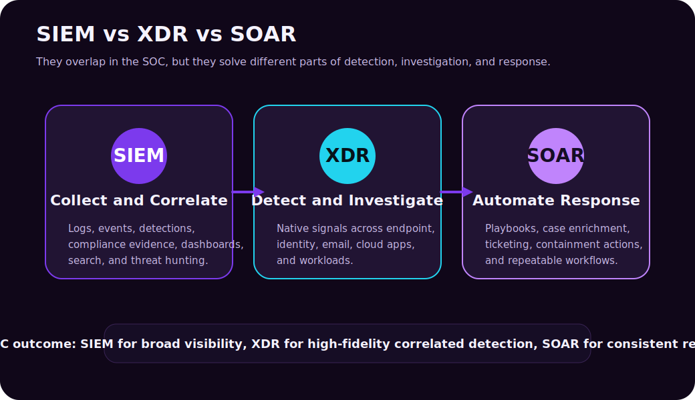
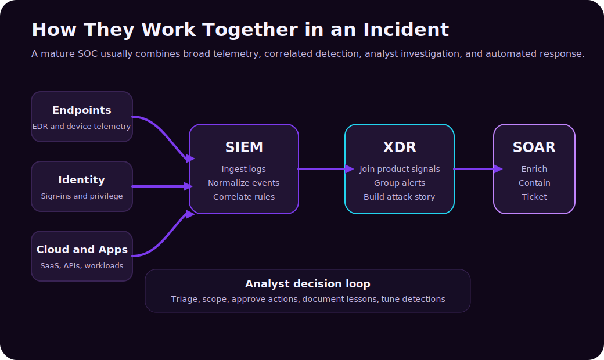
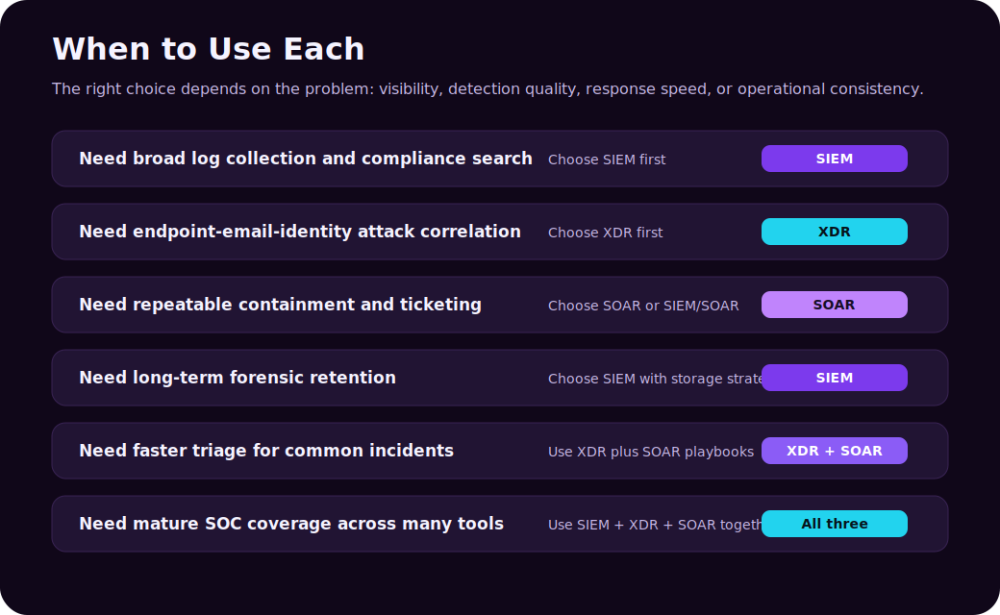

Security teams have more telemetry than ever: endpoint alerts, identity logs, firewall events, email detections, cloud audit trails, SaaS activity, vulnerability data, DNS logs, EDR timelines, and threat intelligence feeds. The hard part is not only collecting that data. The hard part is turning it into decisions fast enough to stop an incident.

That is where **SIEM**, **XDR**, and **SOAR** come in.

They are often discussed together because they all live in the security operations center (SOC), but they are not the same thing:

- **SIEM** is mainly about collecting, normalizing, searching, correlating, and retaining security data.
- **XDR** is mainly about correlating detections across security products and helping analysts understand the attack story.
- **SOAR** is mainly about automating and orchestrating response workflows.

The simplest way to remember it:

```text
SIEM = visibility and correlation
XDR  = integrated detection and investigation
SOAR = automated and repeatable response
```



---

## The Short Version

| Capability | What It Does Best | Typical Question It Answers |
|---|---|---|
| SIEM | Collects and correlates logs from many sources | "What happened across the environment?" |
| XDR | Connects related alerts across security controls | "Is this endpoint alert part of a larger attack?" |
| SOAR | Automates response steps and workflows | "What should happen next, and can we do it consistently?" |

These tools are not enemies. In many mature SOCs, they work together:

1. SIEM ingests broad telemetry.
2. XDR correlates high-fidelity security signals across domains.
3. SOAR enriches, routes, documents, and executes response actions.

The trick is understanding which problem you are trying to solve first.

---

## What Is SIEM?

**SIEM** stands for **Security Information and Event Management**. NIST describes a SIEM tool as an application that gathers security data from information system components and presents it as actionable information through a single interface.

In practical SOC language, a SIEM is where you centralize security-relevant logs and events so analysts can search, correlate, alert, investigate, report, and retain evidence.

Common SIEM data sources:

| Source | Example Events |
|---|---|
| Identity provider | Sign-ins, MFA events, risky users, privilege changes |
| Endpoint security | Malware detections, process activity, device alerts |
| Firewalls and proxies | Connections, blocked traffic, URL filtering |
| Cloud platforms | Resource changes, admin activity, API calls |
| SaaS platforms | File sharing, login activity, app consent, audit logs |
| Email security | Phishing detections, malicious attachments, URL clicks |
| Servers | Windows events, Linux auth logs, application logs |
| DNS and network sensors | Suspicious domains, beaconing, lateral movement signals |

SIEM strengths:

- Broad visibility across many systems.
- Centralized search and investigation.
- Custom detection rules.
- Long-term retention for compliance and forensics.
- Dashboards and reporting.
- Threat hunting across historical data.
- Integration with ticketing, case management, and SOAR.

SIEM weaknesses:

- Can become expensive if ingestion is not managed.
- Needs tuning to reduce noisy alerts.
- Requires good log source planning.
- Detection quality depends heavily on data quality and rule design.
- Analysts can drown in events without prioritization.

### SIEM Example

An attacker signs in using a stolen account, creates a new inbox forwarding rule, accesses SharePoint files, and then triggers an impossible-travel alert.

A SIEM can correlate:

- Entra ID sign-in logs.
- Exchange audit logs.
- SharePoint file access events.
- Risky sign-in detections.
- Geo-location anomalies.

The analyst can search across all those data sources and build a timeline.

---

## What Is XDR?

**XDR** stands for **Extended Detection and Response**. XDR platforms combine signals across multiple security domains, usually including endpoint, identity, email, cloud apps, and workloads. Microsoft describes Defender XDR as coordinating detection, prevention, investigation, and response across endpoints, identities, email, and applications.

The key difference from SIEM is that XDR is usually more opinionated and product-integrated. It does not try to ingest every possible log equally. It focuses on security telemetry from supported controls and uses that telemetry to create higher-fidelity incidents.

Common XDR signal areas:

| Domain | Example Signals |
|---|---|
| Endpoint | Malware, suspicious process trees, exploit behavior |
| Identity | Risky sign-ins, lateral movement, credential theft |
| Email | Phishing, malicious links, suspicious attachments |
| Cloud apps | OAuth abuse, abnormal downloads, shadow IT |
| Workloads | Server, container, database, and cloud workload threats |

XDR strengths:

- Strong correlation across supported products.
- Better attack-story reconstruction.
- High-fidelity incidents instead of isolated alerts.
- Built-in response actions for protected domains.
- Useful analyst timelines and entity views.
- Often faster to operationalize than building every correlation manually in SIEM.

XDR weaknesses:

- Coverage depends on supported security products.
- May be weaker for niche logs, legacy systems, or unusual data sources.
- Can create vendor ecosystem dependency.
- Does not replace broad log retention and compliance use cases.

### XDR Example

A user receives a phishing email. They click a link, enter credentials, and later their endpoint runs a suspicious script. Around the same time, the account signs in from an unusual location and starts downloading files from a cloud app.

XDR can connect:

- The original phishing email.
- The clicked URL.
- The endpoint process tree.
- The suspicious sign-in.
- The cloud app download activity.

Instead of five separate alerts, the analyst sees one incident with a related attack chain.

---

## What Is SOAR?

**SOAR** stands for **Security Orchestration, Automation, and Response**.

SOAR is about making response workflows repeatable. It connects tools, enriches alerts, opens tickets, runs playbooks, asks for approvals, isolates devices, disables users, blocks indicators, sends notifications, and documents what happened.

Common SOAR actions:

| Action Type | Example |
|---|---|
| Enrichment | Look up IP reputation, domain age, user risk, asset owner |
| Ticketing | Create or update ServiceNow, Jira, or incident cases |
| Containment | Isolate endpoint, disable account, revoke sessions |
| Notification | Notify SOC, identity team, endpoint team, or business owner |
| Evidence collection | Pull email headers, endpoint timeline, sign-in logs |
| Approval workflow | Ask analyst before blocking a domain or disabling a VIP account |
| Documentation | Add notes, decisions, artifacts, and timestamps to a case |

SOAR strengths:

- Reduces repetitive analyst work.
- Makes response more consistent.
- Speeds up triage and containment.
- Connects security tooling with IT operations.
- Helps enforce process and documentation.

SOAR weaknesses:

- Bad automation can make incidents worse.
- Requires mature processes and ownership.
- Playbooks need maintenance as tools and APIs change.
- Automating noisy alerts creates noisy automation.

### SOAR Example

A SIEM or XDR platform creates a high-confidence phishing incident. A SOAR playbook can:

1. Extract sender, URL, attachment hash, and recipient list.
2. Check reputation services.
3. Search for the same message in other mailboxes.
4. Open a ticket.
5. Ask the analyst to approve removal.
6. Remove the message from affected mailboxes.
7. Notify users who clicked the link.
8. Add all actions to the incident record.

The value is not only speed. It is consistency.

---

## How SIEM, XDR, and SOAR Work Together

In real operations, these categories blur. Microsoft Sentinel, for example, is described as a cloud-native SIEM and SOAR. Defender XDR integrates with Sentinel. Other vendors combine XDR with automation or include SIEM-like search. The labels matter less than the job each component performs.



| SOC Need | SIEM Role | XDR Role | SOAR Role |
|---|---|---|---|
| Broad visibility | Ingest logs from many sources | Provide native product telemetry | Enrich events with external data |
| Detection | Correlation rules and analytics | Built-in high-fidelity detections | Trigger playbooks from alerts |
| Investigation | Search, dashboards, entity timelines | Attack story and related alerts | Pull evidence into a case |
| Response | Alerting and integration | Domain-specific containment actions | Automate repeatable response steps |
| Compliance | Retention, reporting, audit evidence | Supports security evidence for protected domains | Documents workflow and approvals |
| Continuous improvement | Tune rules and data sources | Improve coverage and product configuration | Tune playbooks and remove friction |

Think of SIEM as the central observability layer, XDR as the integrated detection layer, and SOAR as the workflow engine.

---

## Decision Matrix: When To Use Each



| Situation | Best Starting Point | Why |
|---|---|---|
| You need centralized logs for many systems | SIEM | Broad ingestion, search, reporting, and retention |
| You have many disconnected endpoint, email, and identity alerts | XDR | Correlates related alerts into incidents |
| Analysts repeat the same response steps every day | SOAR | Automates enrichment, ticketing, containment, and documentation |
| Compliance requires long-term audit trails | SIEM | Retention and reporting are core SIEM strengths |
| Phishing triage consumes too much time | XDR + SOAR | XDR correlates email/user/device signals; SOAR automates response |
| You have a small team and mostly Microsoft security tools | Defender XDR + Sentinel | XDR gives native correlation; Sentinel adds SIEM/SOAR coverage |
| You use many vendors and custom systems | SIEM first | You need flexible ingestion and correlation across sources |
| You have mature detection but slow response | SOAR | Response consistency becomes the bottleneck |

There is no universal answer. The right choice depends on current pain:

- If you cannot see enough, prioritize **SIEM**.
- If you see too many disconnected alerts, prioritize **XDR**.
- If you know what to do but do it manually every time, prioritize **SOAR**.

---

## Practical Scenario 1: Phishing Campaign

A user reports a suspicious email. Several other employees received the same message. One clicked the link.

### SIEM View

The SIEM can search across:

- Email gateway logs.
- Entra ID sign-in logs.
- Proxy or DNS logs.
- Endpoint events.
- Cloud app activity.

It answers: "Where else did this show up?"

### XDR View

XDR can connect:

- The phishing email.
- The URL click.
- Endpoint behavior after the click.
- Suspicious sign-in behavior.
- Related alerts involving the same user.

It answers: "Is this one user's mailbox issue, or a broader attack chain?"

### SOAR View

SOAR can:

- Pull message details.
- Search for duplicate emails.
- Remove malicious messages.
- Open an incident ticket.
- Notify affected users.
- Block the URL or sender after approval.

It answers: "How do we respond quickly and consistently?"

---

## Practical Scenario 2: Ransomware on an Endpoint

An endpoint starts encrypting files rapidly and connecting to unusual network destinations.

| Tool | Useful Role |
|---|---|
| SIEM | Correlates endpoint alerts with file server logs, identity events, VPN logs, and network telemetry |
| XDR | Shows process tree, related endpoint alerts, user identity context, and possible lateral movement |
| SOAR | Isolates device, disables account, revokes sessions, opens ticket, alerts incident response team |

In a ransomware scenario, speed matters. XDR helps analysts understand the attack path. SOAR helps execute containment quickly. SIEM helps scope the blast radius across systems.

---

## Practical Scenario 3: Insider Data Exfiltration

An employee downloads unusual amounts of data from a cloud file platform before leaving the company.

SIEM is useful because the evidence may span:

- HR status changes.
- File access logs.
- Cloud app activity.
- Endpoint USB events.
- Email forwarding rules.
- VPN activity.

XDR may help if the activity touches protected endpoints, identities, and cloud apps. SOAR can notify legal, HR, security, and management teams through controlled workflows, but the response may require human approval because the business context is sensitive.

This is a good example of why automation should not be blind. Disabling an account may be correct for malware. It may be risky in an HR/legal case without approval.

---

## Practical Scenario 4: Cloud Misconfiguration and Suspicious API Use

A cloud storage account is made public, and shortly after, there are unusual API calls from a workload identity.

SIEM can combine:

- Cloud audit logs.
- Resource configuration changes.
- Identity and access events.
- API activity.
- Network logs.

XDR can help if the cloud workload, identity, and endpoint signals are covered by the platform. SOAR can trigger a playbook that notifies the cloud owner, creates a ticket, snapshots configuration, and optionally reverts the risky setting after approval.

The lesson: cloud incidents are not only "security alerts." They are often configuration, identity, and workflow problems.

---

## SIEM vs XDR: The Most Common Confusion

SIEM and XDR both help with detection and investigation, so they are easy to confuse.

| Difference | SIEM | XDR |
|---|---|---|
| Primary data model | Flexible log ingestion from many sources | Deep telemetry from supported security products |
| Best at | Broad visibility, search, retention, custom detection | Correlated incidents and attack story across security domains |
| Typical users | SOC analysts, threat hunters, compliance teams | SOC analysts, incident responders, endpoint/identity/email security teams |
| Biggest risk | Too much data and too many noisy rules | Coverage gaps outside supported ecosystem |
| Replacement? | Does not fully replace XDR | Does not fully replace SIEM |

If your question is "Can I replace SIEM with XDR?" the honest answer is: sometimes partially, rarely completely.

XDR can reduce SIEM dependency for common threat detection and investigation across supported domains. But SIEM remains important for broad log collection, custom use cases, compliance retention, legacy systems, network telemetry, and organization-specific analytics.

---

## SIEM vs SOAR: Visibility vs Workflow

SIEM and SOAR are also commonly paired.

| Difference | SIEM | SOAR |
|---|---|---|
| Core job | Find and investigate signals | Execute repeatable response steps |
| Input | Logs, events, alerts, threat intel | Alerts, incidents, analyst decisions |
| Output | Alerts, dashboards, timelines, reports | Tickets, notifications, containment actions, case updates |
| Failure mode | Noisy or incomplete detection | Automating the wrong thing too quickly |

SOAR is not useful if the organization does not know what the response process should be. Before automation, define the playbook manually:

1. What triggers this workflow?
2. What evidence must be collected?
3. Which actions are safe to automate?
4. Which actions require approval?
5. Who owns the incident?
6. How is the result documented?

Then automate the stable parts.

---

## XDR vs SOAR: Detection Story vs Response Engine

XDR and SOAR can both perform response actions, but their focus differs.

| Difference | XDR | SOAR |
|---|---|---|
| Core value | Correlates attack signals across protected domains | Coordinates response across tools and teams |
| Response actions | Often native to the protected product set | Often cross-tool and workflow-driven |
| Example | Isolate endpoint from XDR incident view | Create ticket, ask approval, isolate endpoint, notify owner, update case |

XDR may tell you what is happening. SOAR helps you run the response process consistently.

---

## What Small Teams Should Do

Small teams often cannot operate a huge SIEM program on day one. That does not mean they should ignore security operations.

Good first steps:

| Step | Why It Helps |
|---|---|
| Turn on strong endpoint, email, and identity protections | Gets high-value native detections quickly |
| Centralize critical logs first | Start with identity, email, endpoint, firewall, cloud admin activity |
| Use built-in XDR incidents | Reduces alert fragmentation |
| Create a few simple SOAR workflows | Automate phishing triage, user disablement, endpoint isolation request |
| Avoid ingesting everything blindly | Cost and noise will bury the team |
| Tune weekly | Detection engineering is a maintenance habit |

For a small Microsoft-heavy environment, Microsoft Defender XDR plus Microsoft Sentinel can be a realistic path: XDR for native detection across Defender products, Sentinel for broader SIEM/SOAR, custom logs, and cross-environment visibility.

---

## What Mature SOCs Should Do

Mature SOCs should avoid treating SIEM, XDR, and SOAR as separate islands.

Important design questions:

| Question | Why It Matters |
|---|---|
| Which logs deserve hot searchable retention? | Not all data has equal investigation value |
| Which alerts should become incidents? | Alert fatigue destroys analyst trust |
| Which playbooks can run automatically? | Some actions need human approval |
| Which tool owns case management? | Avoid duplicate incident queues |
| Which entities are normalized? | Users, devices, IPs, apps, and workloads must connect across sources |
| Which metrics prove value? | Mean time to detect, triage, contain, and remediate |

The mature goal is a feedback loop:

1. Incident happens.
2. SIEM/XDR detect and correlate.
3. SOAR enriches and coordinates response.
4. Analysts close the incident.
5. Detection rules and playbooks improve.
6. Future incidents become faster and cleaner.

---

## Common Mistakes

| Mistake | Why It Hurts |
|---|---|
| Buying a SIEM and ingesting everything | Cost and noise rise faster than detection value |
| Treating XDR as universal visibility | XDR may not cover every log source or legacy system |
| Automating response before process is mature | Bad playbooks can disable the wrong account or block business traffic |
| Ignoring identity logs | Many modern attacks start with account compromise |
| Keeping SIEM and XDR incidents separate forever | Analysts waste time reconciling duplicate queues |
| Measuring success by alert count | Fewer, better incidents are usually healthier than more alerts |
| Never tuning detections | The environment changes, so detection logic must change too |

Security operations tooling is not "set and forget." It is a living system.

---

## Practical Summary

SIEM, XDR, and SOAR are easiest to understand by their center of gravity:

| Tool Category | Center of Gravity |
|---|---|
| SIEM | Broad security visibility and searchable evidence |
| XDR | Correlated threat detection and investigation across protected domains |
| SOAR | Repeatable response orchestration and automation |

Use **SIEM** when you need broad telemetry, retention, custom search, threat hunting, and compliance reporting.

Use **XDR** when you need high-fidelity incidents that connect endpoint, identity, email, cloud app, and workload signals into an attack story.

Use **SOAR** when response steps are repetitive, time-sensitive, and mature enough to automate safely.

Use all three when the organization is ready for integrated security operations: visibility, detection, investigation, response, documentation, and continuous improvement.

---

## Sources

- [NIST glossary: Security Information and Event Management tool](https://csrc.nist.gov/glossary/term/security_information_and_event_management_tool)
- [CISA: New Guidance for SIEM and SOAR Implementation](https://www.cisa.gov/news-events/alerts/2025/05/27/new-guidance-siem-and-soar-implementation)
- [Microsoft Learn: What is Microsoft Sentinel SIEM?](https://learn.microsoft.com/en-us/azure/sentinel/overview)
- [Microsoft Learn: Microsoft Sentinel documentation](https://learn.microsoft.com/en-us/azure/sentinel/)
- [Microsoft Learn: What is Microsoft Defender XDR?](https://learn.microsoft.com/en-us/defender-xdr/microsoft-365-defender)
- [Microsoft Learn: Microsoft Defender XDR documentation](https://learn.microsoft.com/en-us/defender-xdr/)
- [Microsoft Security: Microsoft Sentinel](https://www.microsoft.com/en-us/security/business/siem-and-xdr/microsoft-sentinel)
